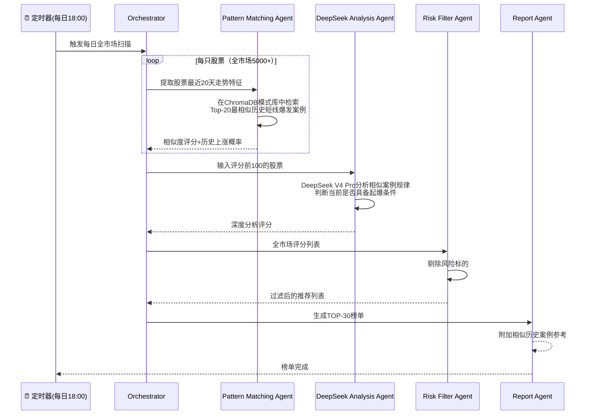
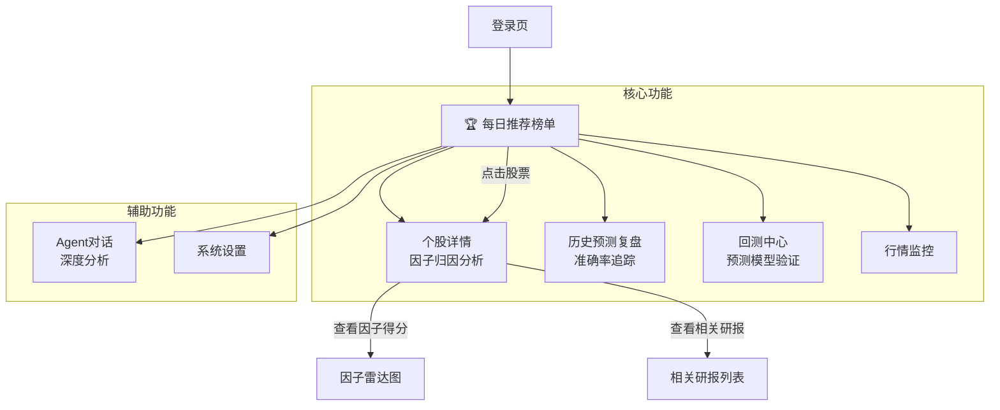

# AI Agent 量化交易系统 - 总体规划框架

> 本文档为项目**总规划框架**，所有后续子计划和实施细节均以此框架为准绳进行拆分和细化。
> 技术栈：DeepSeek V4 Pro + ChromaDB 向量库 + Vue 全家桶前端 + Tushare 数据源

---

## 一、项目愿景与目标

**核心使命**：基于 **历史短线爆发模式匹配** 技术，每日收盘后全市场扫描，找出当前走势与"历史3倍以上短线爆发股起爆前"最相似的股票，预测次日上涨概率，输出 **TOP-30 推荐榜单**。

> 核心方法不是"用AI预测"，而是**用历史数据做"模式匹配"**：回测找出过去15年里所有≤90天涨3倍以上的短线爆发行情 → 提取它们起爆前的走势特征 → 每天扫全市场找图形最像的 → 历史上这种图形后续涨了，就是推荐理由。

### 核心目标

1. **🎯 历史模式采样**：遍历2010-2024全A股数据，找出所有≤90个交易日内涨幅≥3倍的短线爆发行情段
2. **🔍 最佳入场点分析**：对每段爆发行情，分析哪个位置入场性价比最高（上涨概率×盈亏比）
3. **📐 起爆前特征提取**：提取最佳入场点前20天的完整走势特征（价格曲线+技术面+资金面+基本面+情绪面）
4. **⚡ 全市场模式匹配**：每天对5000+股票提取当前20天特征，到ChromaDB中匹配最相似的历史起爆前模式
5. **📊 可解释推荐**：推荐榜单附上相似历史案例参考（"这只股票当前图形与2020年XX股票起爆前相似度89%"）

---

## 二、系统总体架构 — 每日预测流水线

```mermaid
flowchart TB
    subgraph 阶段A：历史模式采样【一次性离线运行】
        A1[遍历2010-2024全A股数据]
        A2[筛选短线爆发案例<br/>≤90天涨幅≥3倍]
        A3[提取完整上涨过程<br/>分析最佳入场点]
        A4[提取入场前20天<br/>走势特征+全部关联数据]
        A5[(ChromaDB<br/>短线爆发模式库)]
    end

    subgraph 阶段B：每日数据采集
        TS[Tushare Pro API]
        DC[数据采集器<br/>每日18:00自动运行]
        DB[(MySQL<br/>40+张业务表)]
    end

    subgraph 阶段C：全市场模式匹配【每日运行】
        FE2[提取每只股票<br/>最近20天走势特征]
        MATCH[ChromaDB相似度检索<br/>匹配历史短线爆发模式]
        SCORE[计算相似度评分<br/>越像历史起爆前→评分越高]
    end

    subgraph 阶段D：榜单与展示
        RANK[全市场排序]
        TOPN[TOP-30 推荐榜单<br/>含相似历史案例参考]
        API[FastAPI]
        FE[Vue 3 前端<br/>每日推荐榜单]
    end

    A5 --> MATCH
    TS --> DC --> DB
    DB --> FE2 --> MATCH --> SCORE --> RANK --> TOPN --> API --> FE
```

---

## 三、模块划分与技术方案

### 模块 1：数据采集与存储 — 为预测提供原材料

| 子模块           | 技术方案                       | 说明（服务于预测目标）                            |
| ---------------- | ------------------------------ | ------------------------------------------------- |
| Tushare 接口封装 | `tushare` Python SDK + `httpx` | 每日收盘后自动拉取全市场行情、资金流、财务等数据  |
| 数据缓存         | `Redis`                        | 缓存热点行情，加速因子计算                        |
| 关系数据库       | `MySQL 8.0` + `SQLAlchemy`     | 存储40+张数据表，为因子计算提供全量历史数据       |
| 定时任务         | `APScheduler` / 系统Cron       | 每日18:00自动触发数据采集 → 因子计算 → 预测流水线 |
| 数据校验         | `Pydantic`                     | 确保预测输入数据质量，避免脏数据影响预测结果      |

**核心数据表**（完整建表方案见：[`01b-MySQL建表方案.md`](plans/01b-MySQL建表方案.md)）：

| 表名              | 服务于预测的用途                    |
| ----------------- | ----------------------------------- |
| `stock_basic`     | 确定全市场待预测股票池              |
| `daily`           | 计算技术因子（均线、MACD、RSI等）   |
| `daily_basic`     | 计算估值因子（PE、PB、换手率等）    |
| `moneyflow`       | 计算资金因子（主力净流入率）        |
| `stk_limit`       | 检测涨停/跌停状态，排除不可交易标的 |
| `fina_indicator`  | 计算财务质量因子（ROE、毛利率等）   |
| `forecast`        | 业绩预告事件因子（预增信号）        |
| `stk_holdertrade` | 股东增减持事件因子                  |
| `concept_detail`  | 概念板块热度因子                    |
| `limit_list_d`    | 龙虎榜资金因子                      |

---

### 模块 2：ChromaDB 模式库与知识库 — 双重向量存储

> ChromaDB 同时存储两类向量：
>
> 1. **短线爆发模式向量** — 历史牛股"起爆前"的数值特征向量（核心）
> 2. **文本知识向量** — 研报/新闻/公告的文本向量（辅助）

| 子模块                 | 技术方案                            | 服务于预测目标                                                        |
| ---------------------- | ----------------------------------- | --------------------------------------------------------------------- |
| **模式向量库**（核心） | ChromaDB + 自定义特征编码           | 存储每段3倍以上短线爆发行情的"起爆前20天"多维特征向量，用于相似度匹配 |
| **文本知识库**（辅助） | ChromaDB + `BAAI/bge-large-zh-v1.5` | 存储研报、公告的文本向量，提供上涨逻辑解释                            |
| 模式采样引擎           | Python + MySQL                      | 回测扫描2010-2024数据，筛选≤90天涨幅≥3倍的行情，提取完整上涨过程      |
| 入场点分析器           | Python + Pandas                     | 对每段爆发行情分析各阶段入场性价比，找出最佳入场点                    |
| 检索策略               | 余弦相似度 + Top-K排序              | 当前股票特征 → 模式库检索 Top-20 最相似历史案例                       |

**双重向量检索工作流**：

```mermaid
flowchart LR
    subgraph 模式库【核心用于评分】
        P1[当前股票<br/>最近20天特征] --> P2[ChromaDB<br/>模式向量检索]
        P2 --> P3[Top-20相似<br/>历史短线爆发案例]
        P3 --> P4[计算相似度评分<br/>+ 历史上涨概率]
    end

    subgraph 知识库【辅助用于解释】
        T1[当前股票信息] --> T2[ChromaDB<br/>文本向量检索]
        T2 --> T3[相关研报/公告]
        T3 --> T4[LLM生成<br/>上涨逻辑解释]
    end

    P4 --> FINAL[最终评分<br/>= 图形30%+技术25%+资金20%+基本面15%+环境10%]
    T4 --> FINAL
```

---

### 模块 3：AI Agent — 模式匹配与评分系统

| Agent 名称                  | 职责（全部服务于"找短线爆发起爆点"）                                                     | 使用工具             |
| --------------------------- | ---------------------------------------------------------------------------------------- | -------------------- |
| **Orchestrator Agent**      | 编排每日全市场扫描流水线                                                                 | LangGraph、定时任务  |
| **Pattern Matching Agent**  | **核心Agent** — 提取每只股票当前20天特征 → ChromaDB检索 → 计算与历史短线爆发模式的相似度 | ChromaDB、相似度算法 |
| **DeepSeek Analysis Agent** | 对Top-20相似历史案例进行归因分析，判断当前股票是否具备同样的起爆条件                     | DeepSeek V4 Pro      |
| **Risk Filter Agent**       | 风险过滤（ST、高质押、异常交易、涨停板无法买入等）                                       | 风控规则引擎         |
| **Report Agent**            | 生成推荐榜单+归因解释                                                                    | 模板引擎、Chart工具  |

**每日扫描Pipeline**：



---

### 模块 4：历史短线爆发模式挖掘引擎（回测的核心目的）

> **回测的最终目的**：遍历2010-2024全A股历史数据 → 找出所有"≤90个交易日内涨幅≥3倍"的短线爆发行情 → 分析最佳入场点 → 提取入场前的共同特征 → 构建模式库供每日扫描匹配。

| 子模块               | 技术方案               | 说明                                                                                    |
| -------------------- | ---------------------- | --------------------------------------------------------------------------------------- |
| **短线爆发行情发现** | MySQL窗口函数 + Python | 扫描daily表，找出所有从低点到高点≤90天且涨幅≥3倍（300%/400%/500%...）的行情段           |
| **最佳入场点分析器** | Python + Pandas        | 将每段行情分段，模拟每个位置入场，统计后续上涨概率和盈亏比，找出最佳入场点              |
| **起爆前特征提取器** | Python 特征工程        | 提取最佳入场点前20天的价格曲线+全部关联数据（技术/资金/基本面/情绪），生成50+维特征向量 |
| **模式库构建**       | ChromaDB向量化存储     | 将提取的起爆前特征向量存入ChromaDB，每条包含：特征向量+股票代码+时间+后续涨幅+元信息    |
| **模式有效性验证**   | 交叉验证               | 用2010-2020数据构建模式库，用2021-2024数据验证：模式匹配的准确率、命中率                |

---

### 模块 5：后端服务层（API）

| 组件        | 技术方案                              |
| ----------- | ------------------------------------- |
| Web 框架    | `FastAPI`                             |
| 异步支持    | `Uvicorn` + `httpx`                   |
| ORM         | `SQLAlchemy 2.0` + `Alembic` 迁移     |
| 认证        | `JWT` + `OAuth2`                      |
| 实时通信    | `WebSocket`                           |
| 任务调度    | `asyncio.create_task` + `APScheduler` |
| 预测API     | 提供今日评分+推荐榜单的查询接口       |
| 历史复盘API | 回测预测准确率、查看历史表现          |

---

### 模块 6：前端可视化（Vue 全家桶）

| 子模块    | 技术方案                                   |
| --------- | ------------------------------------------ |
| 框架      | `Vue 3` + `Composition API` + `TypeScript` |
| 构建工具  | `Vite`                                     |
| 状态管理  | `Pinia`                                    |
| 路由      | `Vue Router 4`                             |
| UI 库     | `Element Plus`                             |
| 图表      | `ECharts` + `vue-echarts`                  |
| HTTP      | `Axios`                                    |
| 数据表格  | `Ag-Grid` / `Element Plus Table`           |
| WebSocket | 原生 WebSocket 封装                        |

**前端页面结构**（以每日推荐榜单为绝对核心）：



---

### 模块 7：部署与运维（DevOps）

| 组件     | 技术方案                    |
| -------- | --------------------------- |
| 容器化   | `Docker` + `Docker Compose` |
| 反向代理 | `Nginx`                     |
| 进程管理 | `Supervisor`                |
| 日志     | `ELK` / `Loki` + `Grafana`  |
| 监控     | `Prometheus` + `Grafana`    |
| CI/CD    | `GitHub Actions`            |

---

## 四、项目目录结构（顶层）

```
ai-quant-agent/
├── backend/                    # 后端服务
│   ├── app/
│   │   ├── api/               # FastAPI 路由
│   │   ├── agents/            # AI Agent 实现
│   │   ├── rag/               # RAG 引擎
│   │   ├── data/              # 数据采集模块
│   │   ├── backtest/          # 回测引擎
│   │   ├── models/            # SQLAlchemy 模型
│   │   └── core/              # 配置、工具函数
│   ├── tests/
│   ├── migrations/            # 数据库迁移（Alembic）
│   └── requirements.txt
├── frontend/                   # Vue 3 前端
│   ├── src/
│   │   ├── views/             # 页面组件
│   │   ├── components/        # 通用组件
│   │   ├── stores/            # Pinia 状态
│   │   ├── router/            # 路由配置
│   │   ├── api/               # API 封装
│   │   └── utils/             # 工具函数
│   └── package.json
├── data/                       # 数据存储
│   ├── chroma_db/             # ChromaDB 持久化
│   └── raw/                   # 原始数据备份
├── docs/                       # 文档
├── docker/                     # Docker 配置
├── scripts/                    # 运维脚本
└── plans/                      # 规划文件
    ├── 00-总规划框架.md              # 本文档（总纲）
    ├── 01-数据模块-Tushare接口全览.md  # Tushare API 接口全览
    ├── 01b-MySQL建表方案.md            # MySQL 建表方案
    ├── 02-RAG引擎.md                  # RAG 引擎设计
    ├── 03-Agent系统.md                # AI Agent 系统
    ├── 04-回测引擎.md                  # 回测引擎
    ├── 05-后端API.md                  # 后端 API 服务
    ├── 06-前端开发.md                  # 前端可视化
    └── 07-部署运维.md                  # 部署与运维
```

---

## 五、项目实施阶段（全部围绕核心预测目标）

### 第一阶段：数据底座与行情采集（P0）

- [ ] 项目脚手架搭建（FastAPI + Vue 3）
- [ ] MySQL 数据库建表（参照 [`01b-MySQL建表方案.md`](plans/01b-MySQL建表方案.md)）
- [ ] Tushare 全量历史数据采集（2010-2024 daily/daily_basic/moneyflow等）
- [ ] 定时任务调度器 + Redis 缓存

### 第二阶段：历史模式挖掘 — 构建短线爆发模式库（P0 最核心）

- [ ] **短线爆发行情发现模块**：扫描全量历史数据，找出所有≤90天涨幅≥3倍的行情段
- [ ] **最佳入场点分析器**：对每段爆发行情分段分析，找出性价比最高的入场位置
- [ ] **起爆前特征提取器**：提取最佳入场点前20天的多维度特征向量（50+维）
- [ ] **ChromaDB 模式库构建**：将所有起爆前特征向量存入 ChromaDB
- [ ] **模式有效性交叉验证**：用2021-2024数据验证模式匹配准确率

### 第三阶段：每日全市场扫描引擎（P1）

- [ ] **Pattern Matching Agent 开发**：提取每只股票当前20天特征 → ChromaDB检索 → 计算相似度
- [ ] **DeepSeek Analysis Agent 开发**：对匹配到的Top-20历史案例进行归因分析
- [ ] **Risk Filter Agent 开发**：风险过滤规则引擎
- [ ] 全市场5000+股票并行扫描 Pipeline

### 第四阶段：前端与榜单展示（P2）

- [ ] **每日推荐榜单页面**（核心页面，展示TOP-30+相似历史案例参考）
- [ ] 个股详情页（展示当前图形与历史相似案例的对比）
- [ ] 历史预测复盘页面
- [ ] Agent 对话交互界面

### 第五阶段：集成与部署（P2）

- [ ] 前后端联调 + API对接
- [ ] Docker Compose 编排
- [ ] CI/CD 流水线
- [ ] 监控与日志系统

---

## 六、关键技术决策说明

### 为什么用"历史模式匹配"而不是机器学习预测模型？

| 方法                          | 问题                                                   |
| ----------------------------- | ------------------------------------------------------ |
| 传统ML/DL模型（XGBoost/LSTM） | 需要大量标注数据、黑盒不可解释、市场风格一变就失效     |
| **历史模式匹配（本方案）**    | **无需训练、完全可解释、自适应市场风格、天然适合短线** |

**本方案的核心优势**：

1. **无需训练**：不训练模型，直接查历史相似案例，无过拟合风险
2. **完全可解释**："今天推荐XX，因为历史上XX股票在同样图形下涨了X%"——用户看得懂
3. **自适应市场**：不管牛市熊市震荡市，历史数据中都有对应样本
4. **天然适合短线**：只匹配≤90天涨3倍以上的短线爆发模式，聚焦目标

### 为什么选择 DeepSeek V4 Pro？

1. **最新旗舰模型**：DeepSeek V4 Pro 是 DeepSeek 最新旗舰推理模型，性能对标 GPT-4o
2. **原生 Function Calling**：天然适配 Agent 工具调用场景
3. **中文金融优化**：对中文金融术语理解更精准，适合A股量化分析
4. **性价比优势**：相比 GPT-4o 成本更低，支持百万级上下文窗口

### 为什么选择 ChromaDB？

1. **轻量易部署**：无需独立服务，Python 原生集成
2. **支持数值向量存储**：不仅存文本，还能存50+维数值特征向量，适合模式匹配
3. **余弦相似度检索**：原生支持，毫秒级返回Top-K最相似案例
4. **适合项目早期快速迭代**：生产规模扩大后可迁移至 Milvus

### 为什么选择 LangChain + LangGraph？

1. **Agent 生态最成熟**：工具调用、记忆、RAG 集成完善
2. **LangGraph 有向图编排**：支持复杂的多 Agent 协作 DAG
3. **社区活跃**：持续更新，问题解决快

---

## 七、风险与应对（围绕模式匹配方案）

| 风险                             | 影响                           | 应对措施                                       |
| -------------------------------- | ------------------------------ | ---------------------------------------------- |
| 历史相似案例不足                 | 部分股票匹配不到足够相似模式   | 放宽相似度阈值 + 结合辅助规则评分              |
| 3倍以上短线爆发案例太少          | 模式库样本量不够，统计意义不足 | 降低门槛到2倍作为补充 + 使用相似案例的加权平均 |
| DeepSeek V4 Pro API不稳定        | 归因分析中断                   | 降级为纯向量检索评分（无需LLM也能运行）        |
| 全市场5000+并发检索慢            | 榜单生成超时                   | ChromaDB批量检索 + 异步并行 + 结果缓存         |
| 市场环境剧变（如注册制改革）     | 历史模式可能失效               | 模式库按时间加权，近期案例权重更高             |
| 模式过拟合（历史相似但实盘不涨） | 推荐准确率下降                 | 滚动回测验证 + 按月更新模式有效性统计          |

---

## 八、后续规划文件清单

本总框架文档对应以下细分规划文件，将在后续逐一创建：

| 编号 | 文件名                                                                   | 内容                                             |
| ---- | ------------------------------------------------------------------------ | ------------------------------------------------ |
| 01   | [`01-数据模块-Tushare接口全览.md`](plans/01-数据模块-Tushare接口全览.md) | Tushare 2100积分内40个API接口全览（已完成）      |
| 01b  | [`01b-MySQL建表方案.md`](plans/01b-MySQL建表方案.md)                     | 41张MySQL表完整DDL、分区、索引、ER关系（已完成） |
| 02   | [`02-RAG引擎.md`](plans/02-RAG引擎.md)                                   | RAG Pipeline、ChromaDB Schema、检索策略          |
| 03   | [`03-Agent系统.md`](plans/03-Agent系统.md)                               | 多Agent架构、LangGraph编排、工具定义             |
| 04   | [`04-回测引擎.md`](plans/04-回测引擎.md)                                 | 事件驱动回测、指标计算、绩效分析                 |
| 05   | [`05-后端API.md`](plans/05-后端API.md)                                   | FastAPI 路由设计、WebSocket、认证                |
| 06   | [`06-前端开发.md`](plans/06-前端开发.md)                                 | Vue 3 组件树、页面设计、状态管理                 |
| 07   | [`07-部署运维.md`](plans/07-部署运维.md)                                 | Docker 编排、CI/CD、监控告警                     |

---

> **本文件为项目总纲，版本 v1.0**
> 后续所有决策和变更均需以此框架为准绳，任何偏离需在此文件中记录并更新。
