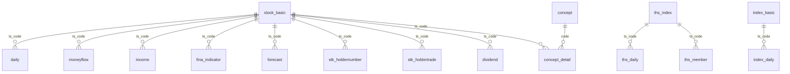

# MySQL 数据库建表方案 - Tushare 量化数据存储设计

> **对应文档**：[`01-数据模块-Tushare接口全览.md`](plans/01-数据模块-Tushare接口全览.md)
> **数据库**：MySQL 8.0+ | **引擎**：InnoDB | **字符集**：utf8mb4
> **数据周期**：2010-01-01 ~ 至今 | **数据量预估**：全量约 1.5 亿行

---

## 一、数据库整体配置

### 1.1 MySQL 参数配置建议

```ini
# my.cnf 核心配置
[mysqld]
# 字符集
character-set-server = utf8mb4
collation-server = utf8mb4_unicode_ci

# InnoDB 核心
innodb_buffer_pool_size = 8G          # 物理内存的 50-70%
innodb_log_file_size = 2G
innodb_flush_log_at_trx_commit = 2    # 量化数据可接受秒级丢失
innodb_flush_method = O_DIRECT

# 查询优化
sort_buffer_size = 16M
read_buffer_size = 8M
read_rnd_buffer_size = 16M
join_buffer_size = 8M
tmp_table_size = 256M
max_heap_table_size = 256M

# 分区表支持
innodb_file_per_table = 1

# 连接
max_connections = 200
wait_timeout = 28800
interactive_timeout = 28800
```

### 1.2 建表规范

```
命名规则：
  库名：quant_db
  表名：小写+下划线（如 daily_basic）
  字段名：小写+下划线（如 ts_code）
  索引名：idx_表名_字段名（如 idx_daily_ts_code）

数据类型映射：
  ts_code/代码类   → VARCHAR(20)
  日期类            → DATE
  价格/金额类       → DECIMAL(21,4)
  比例/百分比类     → DECIMAL(10,4)
  成交量/数量类     → BIGINT(20)
  字符串状态类      → VARCHAR(50)
  长文本            → TEXT
  标志位            → TINYINT(1)
```

---

## 二、ER 关系总览

```mermaid
erDiagram
    stock_basic ||--o{ daily : "1对多"
    stock_basic ||--o{ daily_basic : "1对多"
    stock_basic ||--o{ adj_factor : "1对多"
    stock_basic ||--o{ stk_limit : "1对多"
    stock_basic ||--o{ moneyflow : "1对多"
    stock_basic ||--o{ block_trade : "1对多"
    stock_basic ||--o{ suspend_d : "1对多"
    stock_basic ||--o{ income : "1对多"
    stock_basic ||--o{ balancesheet : "1对多"
    stock_basic ||--o{ cashflow : "1对多"
    stock_basic ||--o{ fina_indicator : "1对多"
    stock_basic ||--o{ fina_mainbz : "1对多"
    stock_basic ||--o{ forecast : "1对多"
    stock_basic ||--o{ express : "1对多"
    stock_basic ||--o{ stk_holdernumber : "1对多"
    stock_basic ||--o{ top10_holders : "1对多"
    stock_basic ||--o{ top10_floatholders : "1对多"
    stock_basic ||--o{ stk_holdertrade : "1对多"
    stock_basic ||--o{ repurchase : "1对多"
    stock_basic ||--o{ stk_rewards : "1对多"
    stock_basic ||--o{ dividend : "1对多"
    stock_basic ||--o{ namechange : "1对多"
    stock_basic ||--o{ stock_company : "1对1"
    stock_basic ||--o{ new_share : "1对1"
    stock_basic ||--o{ concept_detail : "1对多"

    concept ||--o{ concept_detail : "1对多"
    ths_index ||--o{ ths_daily : "1对多"
    ths_index ||--o{ ths_member : "1对多"
    ths_member ||--o{ stock_basic : "多对1"

    index_basic ||--o{ index_daily : "1对多"
```



### 2.1 核心关联关系说明

```
【核心关联键】
  所有业务表都通过 ts_code 关联到 stock_basic 表
  stock_basic.ts_code = 业务表.ts_code

【日频表主键格局】
  (ts_code, trade_date) 联合主键 → daily / daily_basic / adj_factor / stk_limit / moneyflow

【事件表主键格局】
  (ts_code, ann_date) 联合主键 → forecast / express / stk_holdernumber
  (ts_code, end_date) 联合主键 → income / balancesheet / cashflow / fina_indicator

【交易日历】
  trade_cal 是所有日频数据的日期参考表
```

---

## 三、完整建表 SQL（40张表）

### 3.1 基础信息表（5张）

#### `stock_basic` — 股票基本信息表（主表）

```sql
CREATE TABLE stock_basic (
    id          INT UNSIGNED AUTO_INCREMENT COMMENT '自增主键',
    ts_code     VARCHAR(20) NOT NULL COMMENT '股票代码，如 600036.SH',
    symbol      VARCHAR(10) NOT NULL COMMENT '数字代码，如 600036',
    name        VARCHAR(50) NOT NULL COMMENT '股票名称',
    area        VARCHAR(20) DEFAULT NULL COMMENT '地区',
    industry    VARCHAR(50) DEFAULT NULL COMMENT '所属行业',
    market      VARCHAR(20) DEFAULT NULL COMMENT '市场：主板/创业板/科创板/北交所',
    list_date   DATE DEFAULT NULL COMMENT '上市日期',
    delist_date DATE DEFAULT NULL COMMENT '退市日期，正常为NULL',
    is_hs       VARCHAR(10) DEFAULT NULL COMMENT '沪深港通标的：N否 H沪股通 S深股通',
    created_at  DATETIME DEFAULT CURRENT_TIMESTAMP COMMENT '创建时间',
    updated_at  DATETIME DEFAULT CURRENT_TIMESTAMP ON UPDATE CURRENT_TIMESTAMP COMMENT '更新时间',
    PRIMARY KEY (id),
    UNIQUE KEY uk_ts_code (ts_code),
    KEY idx_symbol (symbol),
    KEY idx_industry (industry),
    KEY idx_market (market),
    KEY idx_list_date (list_date)
) ENGINE=InnoDB DEFAULT CHARSET=utf8mb4 COLLATE=utf8mb4_unicode_ci
  COMMENT='股票基本信息-主表，所有业务表通过ts_code关联此表';
```

#### `trade_cal` — 交易日历表

```sql
CREATE TABLE trade_cal (
    id              INT UNSIGNED AUTO_INCREMENT COMMENT '自增主键',
    exchange        VARCHAR(10) NOT NULL COMMENT '交易所：SSE上交所 SZSE深交所',
    cal_date        DATE NOT NULL COMMENT '日历日期',
    is_open         TINYINT(1) NOT NULL DEFAULT 0 COMMENT '是否交易日：0休市 1交易',
    pretrade_date   DATE DEFAULT NULL COMMENT '前一个交易日',
    created_at      DATETIME DEFAULT CURRENT_TIMESTAMP COMMENT '创建时间',
    PRIMARY KEY (id),
    UNIQUE KEY uk_exchange_date (exchange, cal_date),
    KEY idx_cal_date (cal_date),
    KEY idx_is_open (is_open)
) ENGINE=InnoDB DEFAULT CHARSET=utf8mb4 COLLATE=utf8mb4_unicode_ci
  COMMENT='交易日历，所有日频数据的日期基准表';
```

#### `stock_company` — 上市公司基本信息表

```sql
CREATE TABLE stock_company (
    id              INT UNSIGNED AUTO_INCREMENT COMMENT '自增主键',
    ts_code         VARCHAR(20) NOT NULL COMMENT '股票代码',
    chairman        VARCHAR(50) DEFAULT NULL COMMENT '董事长',
    manager         VARCHAR(50) DEFAULT NULL COMMENT '总经理',
    secretary       VARCHAR(50) DEFAULT NULL COMMENT '董秘',
    reg_capital     DECIMAL(21,4) DEFAULT NULL COMMENT '注册资本（万元）',
    setup_date      DATE DEFAULT NULL COMMENT '成立日期',
    province        VARCHAR(20) DEFAULT NULL COMMENT '省份',
    city            VARCHAR(30) DEFAULT NULL COMMENT '城市',
    introduction    TEXT DEFAULT NULL COMMENT '公司介绍',
    website         VARCHAR(100) DEFAULT NULL COMMENT '公司网址',
    employees       INT UNSIGNED DEFAULT NULL COMMENT '员工人数',
    main_business   TEXT DEFAULT NULL COMMENT '主营范围',
    created_at      DATETIME DEFAULT CURRENT_TIMESTAMP COMMENT '创建时间',
    updated_at      DATETIME DEFAULT CURRENT_TIMESTAMP ON UPDATE CURRENT_TIMESTAMP COMMENT '更新时间',
    PRIMARY KEY (id),
    UNIQUE KEY uk_ts_code (ts_code),
    CONSTRAINT fk_company_ts_code FOREIGN KEY (ts_code) REFERENCES stock_basic(ts_code)
        ON DELETE CASCADE ON UPDATE CASCADE
) ENGINE=InnoDB DEFAULT CHARSET=utf8mb4 COLLATE=utf8mb4_unicode_ci
  COMMENT='上市公司基本信息，与stock_basic一对一关系';
```

#### `namechange` — 股票曾用名表

```sql
CREATE TABLE namechange (
    id              INT UNSIGNED AUTO_INCREMENT COMMENT '自增主键',
    ts_code         VARCHAR(20) NOT NULL COMMENT '股票代码',
    name            VARCHAR(50) NOT NULL COMMENT '当时的名称',
    start_date      DATE DEFAULT NULL COMMENT '开始使用日期',
    end_date        DATE DEFAULT NULL COMMENT '结束使用日期',
    ann_date        DATE DEFAULT NULL COMMENT '公告日期',
    change_reason   VARCHAR(50) DEFAULT NULL COMMENT '变更原因：ST/摘帽/更名等',
    created_at      DATETIME DEFAULT CURRENT_TIMESTAMP COMMENT '创建时间',
    PRIMARY KEY (id),
    KEY idx_ts_code (ts_code),
    KEY idx_start_date (start_date),
    KEY idx_change_reason (change_reason),
    CONSTRAINT fk_namechange_ts_code FOREIGN KEY (ts_code) REFERENCES stock_basic(ts_code)
        ON DELETE CASCADE ON UPDATE CASCADE
) ENGINE=InnoDB DEFAULT CHARSET=utf8mb4 COLLATE=utf8mb4_unicode_ci
  COMMENT='股票曾用名历史记录';
```

#### `new_share` — 新股上市信息表

```sql
CREATE TABLE new_share (
    id              INT UNSIGNED AUTO_INCREMENT COMMENT '自增主键',
    ts_code         VARCHAR(20) NOT NULL COMMENT '股票代码',
    sub_code        VARCHAR(20) DEFAULT NULL COMMENT '申购代码',
    name            VARCHAR(50) DEFAULT NULL COMMENT '股票名称',
    ipo_date        DATE DEFAULT NULL COMMENT '上网发行日期',
    issue_date      DATE DEFAULT NULL COMMENT '上市日期',
    amount          DECIMAL(21,4) DEFAULT NULL COMMENT '发行总量（万股）',
    market_amount   DECIMAL(21,4) DEFAULT NULL COMMENT '上网发行量（万股）',
    price           DECIMAL(12,4) DEFAULT NULL COMMENT '发行价格（元）',
    pe              DECIMAL(10,4) DEFAULT NULL COMMENT '发行市盈率',
    limit_amount    DECIMAL(12,4) DEFAULT NULL COMMENT '申购上限（万股）',
    fund            DECIMAL(21,4) DEFAULT NULL COMMENT '募集资金（亿元）',
    created_at      DATETIME DEFAULT CURRENT_TIMESTAMP COMMENT '创建时间',
    PRIMARY KEY (id),
    UNIQUE KEY uk_ts_code (ts_code),
    KEY idx_issue_date (issue_date),
    CONSTRAINT fk_newshare_ts_code FOREIGN KEY (ts_code) REFERENCES stock_basic(ts_code)
        ON DELETE CASCADE ON UPDATE CASCADE
) ENGINE=InnoDB DEFAULT CHARSET=utf8mb4 COLLATE=utf8mb4_unicode_ci
  COMMENT='新股上市信息';
```

---

### 3.2 行情数据表（7张）

#### `daily` — 日线行情表（按年分区）

```sql
CREATE TABLE daily (
    ts_code     VARCHAR(20) NOT NULL COMMENT '股票代码',
    trade_date  DATE NOT NULL COMMENT '交易日',
    open        DECIMAL(12,4) DEFAULT NULL COMMENT '开盘价',
    high        DECIMAL(12,4) DEFAULT NULL COMMENT '最高价',
    low         DECIMAL(12,4) DEFAULT NULL COMMENT '最低价',
    close       DECIMAL(12,4) DEFAULT NULL COMMENT '收盘价',
    pre_close   DECIMAL(12,4) DEFAULT NULL COMMENT '前收盘价',
    change      DECIMAL(12,4) DEFAULT NULL COMMENT '涨跌额',
    pct_chg     DECIMAL(10,4) DEFAULT NULL COMMENT '涨跌幅（%）',
    vol         BIGINT(20) UNSIGNED DEFAULT NULL COMMENT '成交量（手）',
    amount      DECIMAL(24,4) DEFAULT NULL COMMENT '成交额（千元）',
    created_at  DATETIME DEFAULT CURRENT_TIMESTAMP COMMENT '创建时间',
    PRIMARY KEY (ts_code, trade_date),
    KEY idx_trade_date (trade_date),
    KEY idx_ts_code (ts_code),
    KEY idx_pct_chg (pct_chg)
) ENGINE=InnoDB DEFAULT CHARSET=utf8mb4 COLLATE=utf8mb4_unicode_ci
  COMMENT='日线行情-核心表，按(ts_code,trade_date)联合主键'
  PARTITION BY RANGE (YEAR(trade_date)) (
    PARTITION p2010 VALUES LESS THAN (2011),
    PARTITION p2011 VALUES LESS THAN (2012),
    PARTITION p2012 VALUES LESS THAN (2013),
    PARTITION p2013 VALUES LESS THAN (2014),
    PARTITION p2014 VALUES LESS THAN (2015),
    PARTITION p2015 VALUES LESS THAN (2016),
    PARTITION p2016 VALUES LESS THAN (2017),
    PARTITION p2017 VALUES LESS THAN (2018),
    PARTITION p2018 VALUES LESS THAN (2019),
    PARTITION p2019 VALUES LESS THAN (2020),
    PARTITION p2020 VALUES LESS THAN (2021),
    PARTITION p2021 VALUES LESS THAN (2022),
    PARTITION p2022 VALUES LESS THAN (2023),
    PARTITION p2023 VALUES LESS THAN (2024),
    PARTITION p2024 VALUES LESS THAN (2025),
    PARTITION p2025 VALUES LESS THAN (2026),
    PARTITION p2026 VALUES LESS THAN (2027),
    PARTITION p_future VALUES LESS THAN MAXVALUE
  );
```

#### `weekly` — 周线行情表

```sql
CREATE TABLE weekly (
    ts_code     VARCHAR(20) NOT NULL COMMENT '股票代码',
    trade_date  DATE NOT NULL COMMENT '周结束日期（每周最后交易日）',
    open        DECIMAL(12,4) DEFAULT NULL COMMENT '周开盘价',
    high        DECIMAL(12,4) DEFAULT NULL COMMENT '周最高价',
    low         DECIMAL(12,4) DEFAULT NULL COMMENT '周最低价',
    close       DECIMAL(12,4) DEFAULT NULL COMMENT '周收盘价',
    vol         BIGINT(20) UNSIGNED DEFAULT NULL COMMENT '周成交量（手）',
    amount      DECIMAL(24,4) DEFAULT NULL COMMENT '周成交额（千元）',
    created_at  DATETIME DEFAULT CURRENT_TIMESTAMP COMMENT '创建时间',
    PRIMARY KEY (ts_code, trade_date),
    KEY idx_trade_date (trade_date),
    KEY idx_ts_code (ts_code)
) ENGINE=InnoDB DEFAULT CHARSET=utf8mb4 COLLATE=utf8mb4_unicode_ci
  COMMENT='周线行情，按周汇总';
```

#### `monthly` — 月线行情表

```sql
CREATE TABLE monthly (
    ts_code     VARCHAR(20) NOT NULL COMMENT '股票代码',
    trade_date  DATE NOT NULL COMMENT '月结束日期（月末最后交易日）',
    open        DECIMAL(12,4) DEFAULT NULL COMMENT '月开盘价',
    high        DECIMAL(12,4) DEFAULT NULL COMMENT '月最高价',
    low         DECIMAL(12,4) DEFAULT NULL COMMENT '月最低价',
    close       DECIMAL(12,4) DEFAULT NULL COMMENT '月收盘价',
    vol         BIGINT(20) UNSIGNED DEFAULT NULL COMMENT '月成交量（手）',
    amount      DECIMAL(24,4) DEFAULT NULL COMMENT '月成交额（千元）',
    created_at  DATETIME DEFAULT CURRENT_TIMESTAMP COMMENT '创建时间',
    PRIMARY KEY (ts_code, trade_date),
    KEY idx_trade_date (trade_date),
    KEY idx_ts_code (ts_code)
) ENGINE=InnoDB DEFAULT CHARSET=utf8mb4 COLLATE=utf8mb4_unicode_ci
  COMMENT='月线行情，按月汇总';
```

#### `adj_factor` — 复权因子表

```sql
CREATE TABLE adj_factor (
    ts_code     VARCHAR(20) NOT NULL COMMENT '股票代码',
    trade_date  DATE NOT NULL COMMENT '交易日',
    adj_factor  DECIMAL(21,6) NOT NULL COMMENT '复权因子',
    created_at  DATETIME DEFAULT CURRENT_TIMESTAMP COMMENT '创建时间',
    PRIMARY KEY (ts_code, trade_date),
    KEY idx_trade_date (trade_date),
    KEY idx_ts_code (ts_code)
) ENGINE=InnoDB DEFAULT CHARSET=utf8mb4 COLLATE=utf8mb4_unicode_ci
  COMMENT='复权因子，用于手动计算前/后复权价格';
```

#### `stk_limit` — 每日涨跌停价格表

```sql
CREATE TABLE stk_limit (
    ts_code     VARCHAR(20) NOT NULL COMMENT '股票代码',
    trade_date  DATE NOT NULL COMMENT '交易日',
    up_limit    DECIMAL(12,4) DEFAULT NULL COMMENT '涨停价',
    down_limit  DECIMAL(12,4) DEFAULT NULL COMMENT '跌停价',
    created_at  DATETIME DEFAULT CURRENT_TIMESTAMP COMMENT '创建时间',
    PRIMARY KEY (ts_code, trade_date),
    KEY idx_trade_date (trade_date),
    KEY idx_up_limit (up_limit),
    KEY idx_down_limit (down_limit)
) ENGINE=InnoDB DEFAULT CHARSET=utf8mb4 COLLATE=utf8mb4_unicode_ci
  COMMENT='每日涨跌停价格';
```

#### `suspend_d` — 停复牌信息表

```sql
CREATE TABLE suspend_d (
    id            INT UNSIGNED AUTO_INCREMENT COMMENT '自增主键',
    ts_code       VARCHAR(20) NOT NULL COMMENT '股票代码',
    trade_date    DATE NOT NULL COMMENT '交易日',
    suspend_flg   VARCHAR(10) NOT NULL COMMENT '停复牌标志：停牌/复牌',
    suspend_type  VARCHAR(30) DEFAULT NULL COMMENT '停牌类型：临时停牌/长期停牌',
    ann_date      DATE DEFAULT NULL COMMENT '公告日期',
    created_at    DATETIME DEFAULT CURRENT_TIMESTAMP COMMENT '创建时间',
    PRIMARY KEY (id),
    UNIQUE KEY uk_ts_code_date (ts_code, trade_date),
    KEY idx_trade_date (trade_date),
    KEY idx_suspend_flg (suspend_flg),
    CONSTRAINT fk_suspend_ts_code FOREIGN KEY (ts_code) REFERENCES stock_basic(ts_code)
        ON DELETE CASCADE ON UPDATE CASCADE
) ENGINE=InnoDB DEFAULT CHARSET=utf8mb4 COLLATE=utf8mb4_unicode_ci
  COMMENT='停复牌信息-回测必须过滤停牌股票';
```

---

### 3.3 每日指标与资金表（3张）

#### `daily_basic` — 每日指标表（按年分区）

```sql
CREATE TABLE daily_basic (
    ts_code         VARCHAR(20) NOT NULL COMMENT '股票代码',
    trade_date      DATE NOT NULL COMMENT '交易日',
    turnover_rate   DECIMAL(10,4) DEFAULT NULL COMMENT '换手率（%）',
    turnover_rate_f DECIMAL(10,4) DEFAULT NULL COMMENT '自由流通换手率（%）',
    volume_ratio    DECIMAL(10,4) DEFAULT NULL COMMENT '量比',
    pe              DECIMAL(12,4) DEFAULT NULL COMMENT '市盈率（动态）',
    pe_ttm          DECIMAL(12,4) DEFAULT NULL COMMENT '滚动市盈率',
    pb              DECIMAL(12,4) DEFAULT NULL COMMENT '市净率',
    ps              DECIMAL(12,4) DEFAULT NULL COMMENT '市销率',
    ps_ttm          DECIMAL(12,4) DEFAULT NULL COMMENT '滚动市销率',
    dv_ratio        DECIMAL(10,4) DEFAULT NULL COMMENT '股息率（%）',
    dv_ttm          DECIMAL(10,4) DEFAULT NULL COMMENT '滚动股息率（%）',
    total_share     BIGINT(20) UNSIGNED DEFAULT NULL COMMENT '总股本（股）',
    float_share     BIGINT(20) UNSIGNED DEFAULT NULL COMMENT '流通股本（股）',
    free_share      BIGINT(20) UNSIGNED DEFAULT NULL COMMENT '自由流通股本（股）',
    total_mv        DECIMAL(24,4) DEFAULT NULL COMMENT '总市值（元）',
    circ_mv         DECIMAL(24,4) DEFAULT NULL COMMENT '流通市值（元）',
    created_at      DATETIME DEFAULT CURRENT_TIMESTAMP COMMENT '创建时间',
    PRIMARY KEY (ts_code, trade_date),
    KEY idx_trade_date (trade_date),
    KEY idx_pe_ttm (pe_ttm),
    KEY idx_pb (pb),
    KEY idx_turnover_rate (turnover_rate),
    KEY idx_total_mv (total_mv)
) ENGINE=InnoDB DEFAULT CHARSET=utf8mb4 COLLATE=utf8mb4_unicode_ci
  COMMENT='每日指标-选股核心因子表'
  PARTITION BY RANGE (YEAR(trade_date)) (
    PARTITION p2010 VALUES LESS THAN (2011),
    PARTITION p2011 VALUES LESS THAN (2012),
    PARTITION p2012 VALUES LESS THAN (2013),
    PARTITION p2013 VALUES LESS THAN (2014),
    PARTITION p2014 VALUES LESS THAN (2015),
    PARTITION p2015 VALUES LESS THAN (2016),
    PARTITION p2016 VALUES LESS THAN (2017),
    PARTITION p2017 VALUES LESS THAN (2018),
    PARTITION p2018 VALUES LESS THAN (2019),
    PARTITION p2019 VALUES LESS THAN (2020),
    PARTITION p2020 VALUES LESS THAN (2021),
    PARTITION p2021 VALUES LESS THAN (2022),
    PARTITION p2022 VALUES LESS THAN (2023),
    PARTITION p2023 VALUES LESS THAN (2024),
    PARTITION p2024 VALUES LESS THAN (2025),
    PARTITION p2025 VALUES LESS THAN (2026),
    PARTITION p_future VALUES LESS THAN MAXVALUE
  );
```

#### `moneyflow` — 个股资金流向表（按年分区）

```sql
CREATE TABLE moneyflow (
    ts_code         VARCHAR(20) NOT NULL COMMENT '股票代码',
    trade_date      DATE NOT NULL COMMENT '交易日',
    buy_amount      DECIMAL(24,4) DEFAULT NULL COMMENT '主力买入金额（元）',
    buy_vol         BIGINT(20) UNSIGNED DEFAULT NULL COMMENT '主力买入量（股）',
    sell_amount     DECIMAL(24,4) DEFAULT NULL COMMENT '主力卖出金额（元）',
    sell_vol        BIGINT(20) UNSIGNED DEFAULT NULL COMMENT '主力卖出量（股）',
    net_amount      DECIMAL(24,4) DEFAULT NULL COMMENT '主力净流入（元）',
    net_vol         BIGINT(20) DEFAULT NULL COMMENT '主力净流入量（股）',
    amount_lt       DECIMAL(24,4) DEFAULT NULL COMMENT '大单买入金额（>100万）（元）',
    vol_lt          BIGINT(20) UNSIGNED DEFAULT NULL COMMENT '大单买入量（股）',
    net_amount_lt   DECIMAL(24,4) DEFAULT NULL COMMENT '大单净流入（元）',
    amount_mt       DECIMAL(24,4) DEFAULT NULL COMMENT '中单买入金额（20-100万）（元）',
    vol_mt          BIGINT(20) UNSIGNED DEFAULT NULL COMMENT '中单买入量（股）',
    net_amount_mt   DECIMAL(24,4) DEFAULT NULL COMMENT '中单净流入（元）',
    amount_st       DECIMAL(24,4) DEFAULT NULL COMMENT '小单买入金额（<20万）（元）',
    vol_st          BIGINT(20) UNSIGNED DEFAULT NULL COMMENT '小单买入量（股）',
    net_amount_st   DECIMAL(24,4) DEFAULT NULL COMMENT '小单净流入（元）',
    created_at      DATETIME DEFAULT CURRENT_TIMESTAMP COMMENT '创建时间',
    PRIMARY KEY (ts_code, trade_date),
    KEY idx_trade_date (trade_date),
    KEY idx_net_amount (net_amount),
    KEY idx_ts_code (ts_code)
) ENGINE=InnoDB DEFAULT CHARSET=utf8mb4 COLLATE=utf8mb4_unicode_ci
  COMMENT='个股资金流向-按年分区'
  PARTITION BY RANGE (YEAR(trade_date)) (
    PARTITION p2010 VALUES LESS THAN (2011),
    PARTITION p2011 VALUES LESS THAN (2012),
    PARTITION p2012 VALUES LESS THAN (2013),
    PARTITION p2013 VALUES LESS THAN (2014),
    PARTITION p2014 VALUES LESS THAN (2015),
    PARTITION p2015 VALUES LESS THAN (2016),
    PARTITION p2016 VALUES LESS THAN (2017),
    PARTITION p2017 VALUES LESS THAN (2018),
    PARTITION p2018 VALUES LESS THAN (2019),
    PARTITION p2019 VALUES LESS THAN (2020),
    PARTITION p2020 VALUES LESS THAN (2021),
    PARTITION p2021 VALUES LESS THAN (2022),
    PARTITION p2022 VALUES LESS THAN (2023),
    PARTITION p2023 VALUES LESS THAN (2024),
    PARTITION p2024 VALUES LESS THAN (2025),
    PARTITION p_future VALUES LESS THAN MAXVALUE
  );
```

#### `block_trade` — 大宗交易表

```sql
CREATE TABLE block_trade (
    id          BIGINT UNSIGNED AUTO_INCREMENT COMMENT '自增主键',
    ts_code     VARCHAR(20) NOT NULL COMMENT '股票代码',
    trade_date  DATE NOT NULL COMMENT '交易日期',
    price       DECIMAL(12,4) DEFAULT NULL COMMENT '成交价格（元）',
    vol         DECIMAL(21,4) DEFAULT NULL COMMENT '成交量（万股）',
    amount      DECIMAL(24,4) DEFAULT NULL COMMENT '成交金额（万元）',
    buyer       VARCHAR(100) DEFAULT NULL COMMENT '买方营业部/机构名称',
    seller      VARCHAR(100) DEFAULT NULL COMMENT '卖方营业部/机构名称',
    created_at  DATETIME DEFAULT CURRENT_TIMESTAMP COMMENT '创建时间',
    PRIMARY KEY (id),
    UNIQUE KEY uk_ts_code_date_price (ts_code, trade_date, price),
    KEY idx_trade_date (trade_date),
    KEY idx_ts_code (ts_code),
    KEY idx_buyer (buyer),
    KEY idx_seller (seller)
) ENGINE=InnoDB DEFAULT CHARSET=utf8mb4 COLLATE=utf8mb4_unicode_ci
  COMMENT='大宗交易记录';
```

---

### 3.4 财务数据表（7张）

#### `income` — 利润表

```sql
CREATE TABLE income (
    id              BIGINT UNSIGNED AUTO_INCREMENT COMMENT '自增主键',
    ts_code         VARCHAR(20) NOT NULL COMMENT '股票代码',
    ann_date        DATE DEFAULT NULL COMMENT '公告日期',
    f_ann_date      DATE DEFAULT NULL COMMENT '实际公告日期',
    end_date        DATE NOT NULL COMMENT '报告期',
    report_type     TINYINT(4) DEFAULT NULL COMMENT '报告类型：1-季报 2-半年报 3-年报',
    comp_type       TINYINT(4) DEFAULT NULL COMMENT '公司类型：1-一般企业 2-合并报表',
    revenue         DECIMAL(24,4) DEFAULT NULL COMMENT '营业收入',
    operate_profit  DECIMAL(24,4) DEFAULT NULL COMMENT '营业利润',
    total_profit    DECIMAL(24,4) DEFAULT NULL COMMENT '利润总额',
    n_income        DECIMAL(24,4) DEFAULT NULL COMMENT '净利润',
    n_income_attr_p DECIMAL(24,4) DEFAULT NULL COMMENT '归母净利润',
    basic_eps       DECIMAL(12,4) DEFAULT NULL COMMENT '基本每股收益',
    diluted_eps     DECIMAL(12,4) DEFAULT NULL COMMENT '稀释每股收益',
    update_flag     TINYINT(1) DEFAULT NULL COMMENT '更新标志：1-未更新 2-已更新',
    created_at      DATETIME DEFAULT CURRENT_TIMESTAMP COMMENT '创建时间',
    PRIMARY KEY (id),
    UNIQUE KEY uk_ts_code_end_date (ts_code, end_date, report_type, comp_type),
    KEY idx_ts_code (ts_code),
    KEY idx_end_date (end_date),
    KEY idx_ann_date (ann_date),
    KEY idx_basic_eps (basic_eps)
) ENGINE=InnoDB DEFAULT CHARSET=utf8mb4 COLLATE=utf8mb4_unicode_ci
  COMMENT='利润表-季频财务数据';
```

#### `balancesheet` — 资产负债表

```sql
CREATE TABLE balancesheet (
    id              BIGINT UNSIGNED AUTO_INCREMENT COMMENT '自增主键',
    ts_code         VARCHAR(20) NOT NULL COMMENT '股票代码',
    end_date        DATE NOT NULL COMMENT '报告期',
    report_type     TINYINT(4) DEFAULT NULL COMMENT '报告类型',
    comp_type       TINYINT(4) DEFAULT NULL COMMENT '公司类型',
    total_assets    DECIMAL(24,4) DEFAULT NULL COMMENT '总资产',
    total_liab      DECIMAL(24,4) DEFAULT NULL COMMENT '总负债',
    total_hldr_eqy  DECIMAL(24,4) DEFAULT NULL COMMENT '股东权益合计',
    total_lse       DECIMAL(24,4) DEFAULT NULL COMMENT '少数股东权益',
    total_equity    DECIMAL(24,4) DEFAULT NULL COMMENT '归属母公司权益',
    update_flag     TINYINT(1) DEFAULT NULL COMMENT '更新标志',
    created_at      DATETIME DEFAULT CURRENT_TIMESTAMP COMMENT '创建时间',
    PRIMARY KEY (id),
    UNIQUE KEY uk_ts_code_end_date (ts_code, end_date, report_type, comp_type),
    KEY idx_ts_code (ts_code),
    KEY idx_end_date (end_date)
) ENGINE=InnoDB DEFAULT CHARSET=utf8mb4 COLLATE=utf8mb4_unicode_ci
  COMMENT='资产负债表-季频财务数据';
```

#### `cashflow` — 现金流量表

```sql
CREATE TABLE cashflow (
    id                BIGINT UNSIGNED AUTO_INCREMENT COMMENT '自增主键',
    ts_code           VARCHAR(20) NOT NULL COMMENT '股票代码',
    end_date          DATE NOT NULL COMMENT '报告期',
    report_type       TINYINT(4) DEFAULT NULL COMMENT '报告类型',
    comp_type         TINYINT(4) DEFAULT NULL COMMENT '公司类型',
    n_inc_oper_act    DECIMAL(24,4) DEFAULT NULL COMMENT '经营活动现金流净额',
    n_inc_inves_act   DECIMAL(24,4) DEFAULT NULL COMMENT '投资活动现金流净额',
    n_inc_fnc_act     DECIMAL(24,4) DEFAULT NULL COMMENT '筹资活动现金流净额',
    net_cash_flows    DECIMAL(24,4) DEFAULT NULL COMMENT '现金净增加额',
    update_flag       TINYINT(1) DEFAULT NULL COMMENT '更新标志',
    created_at        DATETIME DEFAULT CURRENT_TIMESTAMP COMMENT '创建时间',
    PRIMARY KEY (id),
    UNIQUE KEY uk_ts_code_end_date (ts_code, end_date, report_type, comp_type),
    KEY idx_ts_code (ts_code),
    KEY idx_end_date (end_date)
) ENGINE=InnoDB DEFAULT CHARSET=utf8mb4 COLLATE=utf8mb4_unicode_ci
  COMMENT='现金流量表-季频财务数据';
```

#### `fina_indicator` — 财务指标表

```sql
CREATE TABLE fina_indicator (
    id              BIGINT UNSIGNED AUTO_INCREMENT COMMENT '自增主键',
    ts_code         VARCHAR(20) NOT NULL COMMENT '股票代码',
    ann_date        DATE DEFAULT NULL COMMENT '公告日期',
    end_date        DATE NOT NULL COMMENT '报告期',
    roe             DECIMAL(10,4) DEFAULT NULL COMMENT '净资产收益率（%）',
    roe_dt          DECIMAL(10,4) DEFAULT NULL COMMENT '扣非净资产收益率（%）',
    roa             DECIMAL(10,4) DEFAULT NULL COMMENT '总资产报酬率（%）',
    debt_to_assets  DECIMAL(10,4) DEFAULT NULL COMMENT '资产负债率（%）',
    eps             DECIMAL(12,4) DEFAULT NULL COMMENT '每股收益',
    bps             DECIMAL(12,4) DEFAULT NULL COMMENT '每股净资产',
    ocfps           DECIMAL(12,4) DEFAULT NULL COMMENT '每股经营活动现金流',
    profit_dedt     DECIMAL(24,4) DEFAULT NULL COMMENT '扣非净利润',
    gross_margin    DECIMAL(10,4) DEFAULT NULL COMMENT '毛利率（%）',
    profit_margin   DECIMAL(10,4) DEFAULT NULL COMMENT '净利率（%）',
    op_to_ebt       DECIMAL(10,4) DEFAULT NULL COMMENT '营业利润/利润总额（%）',
    invest_income   DECIMAL(10,4) DEFAULT NULL COMMENT '投资收益/利润总额（%）',
    created_at      DATETIME DEFAULT CURRENT_TIMESTAMP COMMENT '创建时间',
    PRIMARY KEY (id),
    UNIQUE KEY uk_ts_code_end_date (ts_code, end_date),
    KEY idx_ts_code (ts_code),
    KEY idx_end_date (end_date),
    KEY idx_roe (roe),
    KEY idx_gross_margin (gross_margin),
    KEY idx_eps (eps),
    KEY idx_ann_date (ann_date)
) ENGINE=InnoDB DEFAULT CHARSET=utf8mb4 COLLATE=utf8mb4_unicode_ci
  COMMENT='财务指标-选股因子核心表';
```

#### `fina_mainbz` — 主营业务构成表

```sql
CREATE TABLE fina_mainbz (
    id              BIGINT UNSIGNED AUTO_INCREMENT COMMENT '自增主键',
    ts_code         VARCHAR(20) NOT NULL COMMENT '股票代码',
    end_date        DATE NOT NULL COMMENT '报告期',
    bz_item         VARCHAR(100) DEFAULT NULL COMMENT '业务类别名称',
    bz_sales        DECIMAL(24,4) DEFAULT NULL COMMENT '主营收入（万元）',
    bz_cost         DECIMAL(24,4) DEFAULT NULL COMMENT '主营成本（万元）',
    bz_profit       DECIMAL(24,4) DEFAULT NULL COMMENT '主营利润（万元）',
    bz_sales_ratio  DECIMAL(10,4) DEFAULT NULL COMMENT '营收占比（%）',
    created_at      DATETIME DEFAULT CURRENT_TIMESTAMP COMMENT '创建时间',
    PRIMARY KEY (id),
    UNIQUE KEY uk_ts_code_end_date_item (ts_code, end_date, bz_item(60)),
    KEY idx_ts_code (ts_code),
    KEY idx_end_date (end_date)
) ENGINE=InnoDB DEFAULT CHARSET=utf8mb4 COLLATE=utf8mb4_unicode_ci
  COMMENT='主营业务构成-半年频';
```

#### `forecast` — 业绩预告表

```sql
CREATE TABLE forecast (
    id              BIGINT UNSIGNED AUTO_INCREMENT COMMENT '自增主键',
    ts_code         VARCHAR(20) NOT NULL COMMENT '股票代码',
    ann_date        DATE NOT NULL COMMENT '公告日期',
    end_date        DATE DEFAULT NULL COMMENT '报告期',
    type            VARCHAR(20) DEFAULT NULL COMMENT '预告类型：略增/预增/扭亏/首亏/续亏/预减/略减',
    p_change_min    DECIMAL(10,4) DEFAULT NULL COMMENT '净利润增速下限（%）',
    p_change_max    DECIMAL(10,4) DEFAULT NULL COMMENT '净利润增速上限（%）',
    net_profit_min  DECIMAL(24,4) DEFAULT NULL COMMENT '净利润下限（万元）',
    net_profit_max  DECIMAL(24,4) DEFAULT NULL COMMENT '净利润上限（万元）',
    created_at      DATETIME DEFAULT CURRENT_TIMESTAMP COMMENT '创建时间',
    PRIMARY KEY (id),
    UNIQUE KEY uk_ts_code_ann_date (ts_code, ann_date),
    KEY idx_ts_code (ts_code),
    KEY idx_ann_date (ann_date),
    KEY idx_type (type),
    KEY idx_end_date (end_date)
) ENGINE=InnoDB DEFAULT CHARSET=utf8mb4 COLLATE=utf8mb4_unicode_ci
  COMMENT='业绩预告-事件驱动型数据';
```

#### `express` — 业绩快报表

```sql
CREATE TABLE express (
    id              BIGINT UNSIGNED AUTO_INCREMENT COMMENT '自增主键',
    ts_code         VARCHAR(20) NOT NULL COMMENT '股票代码',
    ann_date        DATE NOT NULL COMMENT '公告日期',
    end_date        DATE DEFAULT NULL COMMENT '报告期',
    revenue         DECIMAL(24,4) DEFAULT NULL COMMENT '营业收入（万元）',
    operate_profit  DECIMAL(24,4) DEFAULT NULL COMMENT '营业利润（万元）',
    total_profit    DECIMAL(24,4) DEFAULT NULL COMMENT '利润总额（万元）',
    n_income        DECIMAL(24,4) DEFAULT NULL COMMENT '净利润（万元）',
    total_assets    DECIMAL(24,4) DEFAULT NULL COMMENT '总资产（万元）',
    basic_eps       DECIMAL(12,4) DEFAULT NULL COMMENT '基本每股收益',
    created_at      DATETIME DEFAULT CURRENT_TIMESTAMP COMMENT '创建时间',
    PRIMARY KEY (id),
    UNIQUE KEY uk_ts_code_ann_date (ts_code, ann_date),
    KEY idx_ts_code (ts_code),
    KEY idx_ann_date (ann_date),
    KEY idx_end_date (end_date)
) ENGINE=InnoDB DEFAULT CHARSET=utf8mb4 COLLATE=utf8mb4_unicode_ci
  COMMENT='业绩快报';
```

---

### 3.5 股东与股本表（6张）

#### `stk_holdernumber` — 股东人数表

```sql
CREATE TABLE stk_holdernumber (
    id          BIGINT UNSIGNED AUTO_INCREMENT COMMENT '自增主键',
    ts_code     VARCHAR(20) NOT NULL COMMENT '股票代码',
    ann_date    DATE NOT NULL COMMENT '公告日期',
    end_date    DATE DEFAULT NULL COMMENT '报告期末日期',
    holder_num  BIGINT(20) UNSIGNED DEFAULT NULL COMMENT '股东总户数',
    created_at  DATETIME DEFAULT CURRENT_TIMESTAMP COMMENT '创建时间',
    PRIMARY KEY (id),
    UNIQUE KEY uk_ts_code_ann_date (ts_code, ann_date),
    KEY idx_ts_code (ts_code),
    KEY idx_end_date (end_date),
    KEY idx_holder_num (holder_num)
) ENGINE=InnoDB DEFAULT CHARSET=utf8mb4 COLLATE=utf8mb4_unicode_ci
  COMMENT='股东人数-季度低频，筹码集中度指标';
```

#### `top10_holders` — 前十大股东表

```sql
CREATE TABLE top10_holders (
    id                  BIGINT UNSIGNED AUTO_INCREMENT COMMENT '自增主键',
    ts_code             VARCHAR(20) NOT NULL COMMENT '股票代码',
    ann_date            DATE DEFAULT NULL COMMENT '公告日期',
    end_date            DATE NOT NULL COMMENT '报告期',
    holder_name         VARCHAR(100) NOT NULL COMMENT '股东名称',
    hold_amount         BIGINT(20) UNSIGNED DEFAULT NULL COMMENT '持股数量（股）',
    hold_ratio          DECIMAL(10,4) DEFAULT NULL COMMENT '占总股本比例（%）',
    hold_float_ratio    DECIMAL(10,4) DEFAULT NULL COMMENT '占流通股本比例（%）',
    created_at          DATETIME DEFAULT CURRENT_TIMESTAMP COMMENT '创建时间',
    PRIMARY KEY (id),
    UNIQUE KEY uk_ts_code_end_date_holder (ts_code, end_date, holder_name(60)),
    KEY idx_ts_code (ts_code),
    KEY idx_end_date (end_date),
    KEY idx_hold_ratio (hold_ratio)
) ENGINE=InnoDB DEFAULT CHARSET=utf8mb4 COLLATE=utf8mb4_unicode_ci
  COMMENT='前十大股东-季频';
```

#### `top10_floatholders` — 前十大流通股东表

```sql
CREATE TABLE top10_floatholders (
    id                  BIGINT UNSIGNED AUTO_INCREMENT COMMENT '自增主键',
    ts_code             VARCHAR(20) NOT NULL COMMENT '股票代码',
    ann_date            DATE DEFAULT NULL COMMENT '公告日期',
    end_date            DATE NOT NULL COMMENT '报告期',
    holder_name         VARCHAR(100) NOT NULL COMMENT '股东名称',
    hold_amount         BIGINT(20) UNSIGNED DEFAULT NULL COMMENT '持股数量（股）',
    hold_ratio          DECIMAL(10,4) DEFAULT NULL COMMENT '占流通股本比例（%）',
    hold_float_ratio    DECIMAL(10,4) DEFAULT NULL COMMENT '占自由流通股本比例（%）',
    created_at          DATETIME DEFAULT CURRENT_TIMESTAMP COMMENT '创建时间',
    PRIMARY KEY (id),
    UNIQUE KEY uk_ts_code_end_date_holder (ts_code, end_date, holder_name(60)),
    KEY idx_ts_code (ts_code),
    KEY idx_end_date (end_date)
) ENGINE=InnoDB DEFAULT CHARSET=utf8mb4 COLLATE=utf8mb4_unicode_ci
  COMMENT='前十大流通股东-季频';
```

#### `stk_holdertrade` — 股东增减持表

```sql
CREATE TABLE stk_holdertrade (
    id              BIGINT UNSIGNED AUTO_INCREMENT COMMENT '自增主键',
    ts_code         VARCHAR(20) NOT NULL COMMENT '股票代码',
    ann_date        DATE NOT NULL COMMENT '公告日期',
    holder_name     VARCHAR(100) NOT NULL COMMENT '股东名称',
    holder_type     VARCHAR(20) DEFAULT NULL COMMENT '股东类型：公司/个人/基金',
    trade_type      VARCHAR(4) NOT NULL COMMENT '交易类型：IN增持 DE减持',
    change_vol      BIGINT(20) DEFAULT NULL COMMENT '变动股数',
    change_ratio    DECIMAL(10,6) DEFAULT NULL COMMENT '变动占总股本比例（%）',
    begin_date      DATE DEFAULT NULL COMMENT '变动起始日期',
    end_date        DATE DEFAULT NULL COMMENT '变动截止日期',
    price_avg       DECIMAL(12,4) DEFAULT NULL COMMENT '交易均价（元）',
    created_at      DATETIME DEFAULT CURRENT_TIMESTAMP COMMENT '创建时间',
    PRIMARY KEY (id),
    UNIQUE KEY uk_ts_code_ann_holder_type (ts_code, ann_date, holder_name(60), trade_type),
    KEY idx_ts_code (ts_code),
    KEY idx_ann_date (ann_date),
    KEY idx_trade_type (trade_type),
    KEY idx_change_ratio (change_ratio)
) ENGINE=InnoDB DEFAULT CHARSET=utf8mb4 COLLATE=utf8mb4_unicode_ci
  COMMENT='股东增减持-公告驱动型事件数据';
```

#### `repurchase` — 股票回购表

```sql
CREATE TABLE repurchase (
    id          BIGINT UNSIGNED AUTO_INCREMENT COMMENT '自增主键',
    ts_code     VARCHAR(20) NOT NULL COMMENT '股票代码',
    ann_date    DATE NOT NULL COMMENT '回购预案公告日',
    end_date    DATE DEFAULT NULL COMMENT '回购完成截止日期',
    progress    VARCHAR(20) DEFAULT NULL COMMENT '进度：预案/实施/完成/终止',
    exp_date    DATE DEFAULT NULL COMMENT '方案有效期',
    amount_min  DECIMAL(24,4) DEFAULT NULL COMMENT '最低回购金额（元）',
    amount_max  DECIMAL(24,4) DEFAULT NULL COMMENT '最高回购金额（元）',
    vol_min     BIGINT(20) UNSIGNED DEFAULT NULL COMMENT '最低回购数量（股）',
    vol_max     BIGINT(20) UNSIGNED DEFAULT NULL COMMENT '最高回购数量（股）',
    price_min   DECIMAL(12,4) DEFAULT NULL COMMENT '回购价格下限（元）',
    price_max   DECIMAL(12,4) DEFAULT NULL COMMENT '回购价格上限（元）',
    created_at  DATETIME DEFAULT CURRENT_TIMESTAMP COMMENT '创建时间',
    PRIMARY KEY (id),
    UNIQUE KEY uk_ts_code_ann_date (ts_code, ann_date),
    KEY idx_ts_code (ts_code),
    KEY idx_progress (progress),
    KEY idx_price_max (price_max)
) ENGINE=InnoDB DEFAULT CHARSET=utf8mb4 COLLATE=utf8mb4_unicode_ci
  COMMENT='股票回购-事件驱动';
```

#### `stk_rewards` — 股权激励表

```sql
CREATE TABLE stk_rewards (
    id              BIGINT UNSIGNED AUTO_INCREMENT COMMENT '自增主键',
    ts_code         VARCHAR(20) NOT NULL COMMENT '股票代码',
    ann_date        DATE DEFAULT NULL COMMENT '公告日期',
    end_date        DATE DEFAULT NULL COMMENT '激励方案有效期',
    exe_mode        VARCHAR(50) DEFAULT NULL COMMENT '行使方式',
    rewards_type    VARCHAR(50) DEFAULT NULL COMMENT '激励类型',
    gprice          DECIMAL(12,4) DEFAULT NULL COMMENT '行权价格',
    volume          BIGINT(20) UNSIGNED DEFAULT NULL COMMENT '激励总股数',
    stk_name        VARCHAR(100) DEFAULT NULL COMMENT '激励对象',
    mark            TEXT DEFAULT NULL COMMENT '备注',
    created_at      DATETIME DEFAULT CURRENT_TIMESTAMP COMMENT '创建时间',
    PRIMARY KEY (id),
    KEY idx_ts_code (ts_code),
    KEY idx_ann_date (ann_date)
) ENGINE=InnoDB DEFAULT CHARSET=utf8mb4 COLLATE=utf8mb4_unicode_ci
  COMMENT='股权激励信息';
```

---

### 3.6 分红与IPO表（1张）

#### `dividend` — 分红送配表

```sql
CREATE TABLE dividend (
    id              BIGINT UNSIGNED AUTO_INCREMENT COMMENT '自增主键',
    ts_code         VARCHAR(20) NOT NULL COMMENT '股票代码',
    ann_date        DATE DEFAULT NULL COMMENT '分红预案公告日',
    imp_ann_date    DATE DEFAULT NULL COMMENT '实施公告日',
    record_date     DATE DEFAULT NULL COMMENT '股权登记日',
    ex_date         DATE DEFAULT NULL COMMENT '除权除息日',
    pay_date        DATE DEFAULT NULL COMMENT '红利发放日',
    div_proc        VARCHAR(20) DEFAULT NULL COMMENT '方案进度：预案/决案/实施',
    cash_div        DECIMAL(12,4) DEFAULT NULL COMMENT '每10股派现（税前）',
    cash_div_tax    DECIMAL(12,4) DEFAULT NULL COMMENT '每10股扣税后派现',
    stk_div         DECIMAL(12,4) DEFAULT NULL COMMENT '每10股送股数',
    stk_bo          DECIMAL(12,4) DEFAULT NULL COMMENT '每10股转增数',
    share_tran      DECIMAL(12,4) DEFAULT NULL COMMENT '每10股转让数',
    created_at      DATETIME DEFAULT CURRENT_TIMESTAMP COMMENT '创建时间',
    PRIMARY KEY (id),
    UNIQUE KEY uk_ts_code_ann_date_proc (ts_code, ann_date, div_proc),
    KEY idx_ts_code (ts_code),
    KEY idx_ex_date (ex_date),
    KEY idx_div_proc (div_proc)
) ENGINE=InnoDB DEFAULT CHARSET=utf8mb4 COLLATE=utf8mb4_unicode_ci
  COMMENT='分红送配-包含分红预案到除权除息全流程';
```

---

### 3.7 板块概念表（5张）

#### `concept` — 概念板块表

```sql
CREATE TABLE concept (
    code    VARCHAR(20) NOT NULL COMMENT '概念代码',
    name    VARCHAR(100) NOT NULL COMMENT '概念名称',
    src     VARCHAR(20) DEFAULT NULL COMMENT '来源：ts/同花顺',
    created_at DATETIME DEFAULT CURRENT_TIMESTAMP COMMENT '创建时间',
    PRIMARY KEY (code),
    KEY idx_name (name)
) ENGINE=InnoDB DEFAULT CHARSET=utf8mb4 COLLATE=utf8mb4_unicode_ci
  COMMENT='概念板块分类';
```

#### `concept_detail` — 概念成分股表

```sql
CREATE TABLE concept_detail (
    id          INT UNSIGNED AUTO_INCREMENT COMMENT '自增主键',
    code        VARCHAR(20) NOT NULL COMMENT '概念代码',
    ts_code     VARCHAR(20) NOT NULL COMMENT '股票代码',
    name        VARCHAR(50) DEFAULT NULL COMMENT '股票名称',
    in_date     DATE DEFAULT NULL COMMENT '纳入日期',
    out_date    DATE DEFAULT NULL COMMENT '剔除日期',
    is_new      VARCHAR(10) DEFAULT NULL COMMENT '是否最新：Y/N',
    created_at  DATETIME DEFAULT CURRENT_TIMESTAMP COMMENT '创建时间',
    PRIMARY KEY (id),
    UNIQUE KEY uk_code_ts_code (code, ts_code),
    KEY idx_ts_code (ts_code),
    KEY idx_code (code),
    KEY idx_is_new (is_new),
    CONSTRAINT fk_cd_code FOREIGN KEY (code) REFERENCES concept(code)
        ON DELETE CASCADE ON UPDATE CASCADE,
    CONSTRAINT fk_cd_ts_code FOREIGN KEY (ts_code) REFERENCES stock_basic(ts_code)
        ON DELETE CASCADE ON UPDATE CASCADE
) ENGINE=InnoDB DEFAULT CHARSET=utf8mb4 COLLATE=utf8mb4_unicode_ci
  COMMENT='概念板块成分股';
```

#### `ths_index` — 同花顺概念板块表

```sql
CREATE TABLE ths_index (
    ts_code     VARCHAR(20) NOT NULL COMMENT '同花顺概念代码',
    name        VARCHAR(100) NOT NULL COMMENT '概念名称',
    count       INT UNSIGNED DEFAULT NULL COMMENT '成分股数量',
    index_intro TEXT DEFAULT NULL COMMENT '指数介绍',
    release_date DATE DEFAULT NULL COMMENT '发布日期',
    created_at  DATETIME DEFAULT CURRENT_TIMESTAMP COMMENT '创建时间',
    PRIMARY KEY (ts_code),
    KEY idx_name (name)
) ENGINE=InnoDB DEFAULT CHARSET=utf8mb4 COLLATE=utf8mb4_unicode_ci
  COMMENT='同花顺概念板块';
```

#### `ths_daily` — 同花顺概念日线行情表

```sql
CREATE TABLE ths_daily (
    ts_code     VARCHAR(20) NOT NULL COMMENT '同花顺概念代码',
    trade_date  DATE NOT NULL COMMENT '交易日',
    close       DECIMAL(12,4) DEFAULT NULL COMMENT '收盘价',
    pct_change  DECIMAL(10,4) DEFAULT NULL COMMENT '涨跌幅（%）',
    vol         BIGINT(20) UNSIGNED DEFAULT NULL COMMENT '成交量',
    amount      DECIMAL(24,4) DEFAULT NULL COMMENT '成交额',
    created_at  DATETIME DEFAULT CURRENT_TIMESTAMP COMMENT '创建时间',
    PRIMARY KEY (ts_code, trade_date),
    KEY idx_trade_date (trade_date),
    KEY idx_pct_change (pct_change)
) ENGINE=InnoDB DEFAULT CHARSET=utf8mb4 COLLATE=utf8mb4_unicode_ci
  COMMENT='同花顺概念日线行情';
```

#### `ths_member` — 同花顺概念成分股表

```sql
CREATE TABLE ths_member (
    id          INT UNSIGNED AUTO_INCREMENT COMMENT '自增主键',
    ts_code     VARCHAR(20) NOT NULL COMMENT '同花顺概念代码',
    con_code    VARCHAR(20) NOT NULL COMMENT '股票代码',
    name        VARCHAR(50) DEFAULT NULL COMMENT '股票名称',
    weight      DECIMAL(10,4) DEFAULT NULL COMMENT '权重（%）',
    in_date     DATE DEFAULT NULL COMMENT '纳入日期',
    is_new      VARCHAR(10) DEFAULT NULL COMMENT '是否最新',
    created_at  DATETIME DEFAULT CURRENT_TIMESTAMP COMMENT '创建时间',
    PRIMARY KEY (id),
    UNIQUE KEY uk_ths_code_stock (ts_code, con_code),
    KEY idx_con_code (con_code),
    KEY idx_ts_code (ts_code),
    CONSTRAINT fk_tm_ths_code FOREIGN KEY (ts_code) REFERENCES ths_index(ts_code)
        ON DELETE CASCADE ON UPDATE CASCADE,
    CONSTRAINT fk_tm_con_code FOREIGN KEY (con_code) REFERENCES stock_basic(ts_code)
        ON DELETE CASCADE ON UPDATE CASCADE
) ENGINE=InnoDB DEFAULT CHARSET=utf8mb4 COLLATE=utf8mb4_unicode_ci
  COMMENT='同花顺概念成分股';
```

---

### 3.8 市场参考表（5张）

#### `margin` — 融资融券交易汇总表

```sql
CREATE TABLE margin (
    id          BIGINT UNSIGNED AUTO_INCREMENT COMMENT '自增主键',
    trade_date  DATE NOT NULL COMMENT '交易日',
    exchange_id VARCHAR(10) NOT NULL COMMENT '交易所：SSE/SZSE',
    rzye        DECIMAL(24,4) DEFAULT NULL COMMENT '融资余额（亿元）',
    rzmre       DECIMAL(24,4) DEFAULT NULL COMMENT '融资买入额（亿元）',
    rzche       DECIMAL(24,4) DEFAULT NULL COMMENT '融资偿还额（亿元）',
    rqye        DECIMAL(24,4) DEFAULT NULL COMMENT '融券余额（亿元）',
    rzrqye      DECIMAL(24,4) DEFAULT NULL COMMENT '融资融券余额（亿元）',
    created_at  DATETIME DEFAULT CURRENT_TIMESTAMP COMMENT '创建时间',
    PRIMARY KEY (id),
    UNIQUE KEY uk_trade_date_exchange (trade_date, exchange_id),
    KEY idx_trade_date (trade_date)
) ENGINE=InnoDB DEFAULT CHARSET=utf8mb4 COLLATE=utf8mb4_unicode_ci
  COMMENT='融资融券汇总-市场情绪指标';
```

#### `margin_detail` — 融资融券明细表

-- margin_detail 为5000积分接口，2100积分不可用，已从建表方案中移除
-- 如需使用，需升级积分后自行添加

#### `limit_list_d` — 龙虎榜每日明细表

```sql
CREATE TABLE limit_list (
    id            BIGINT UNSIGNED AUTO_INCREMENT COMMENT '自增主键',
    trade_date    DATE NOT NULL COMMENT '交易日',
    ts_code       VARCHAR(20) NOT NULL COMMENT '股票代码',
    name          VARCHAR(50) DEFAULT NULL COMMENT '股票名称',
    close         DECIMAL(12,4) DEFAULT NULL COMMENT '收盘价',
    pct_chg       DECIMAL(10,4) DEFAULT NULL COMMENT '涨跌幅（%）',
    buy_amount    DECIMAL(24,4) DEFAULT NULL COMMENT '买入额（万元）',
    sell_amount   DECIMAL(24,4) DEFAULT NULL COMMENT '卖出额（万元）',
    net_amount    DECIMAL(24,4) DEFAULT NULL COMMENT '净买入额（万元）',
    buy_times     INT UNSIGNED DEFAULT NULL COMMENT '买入次数',
    reason        VARCHAR(200) DEFAULT NULL COMMENT '上榜原因',
    created_at    DATETIME DEFAULT CURRENT_TIMESTAMP COMMENT '创建时间',
    PRIMARY KEY (id),
    UNIQUE KEY uk_trade_date_ts_code (trade_date, ts_code),
    KEY idx_ts_code (ts_code),
    KEY idx_trade_date (trade_date),
    KEY idx_net_amount (net_amount),
    KEY idx_reason (reason(60)),
    CONSTRAINT fk_limit_list_ts_code FOREIGN KEY (ts_code) REFERENCES stock_basic(ts_code)
        ON DELETE CASCADE ON UPDATE CASCADE
) ENGINE=InnoDB DEFAULT CHARSET=utf8mb4 COLLATE=utf8mb4_unicode_ci
  COMMENT='龙虎榜每日明细-短线策略核心';
```

#### `hsgt` — 沪深港通持股表

```sql
CREATE TABLE hsgt (
    id              BIGINT UNSIGNED AUTO_INCREMENT COMMENT '自增主键',
    ts_code         VARCHAR(20) NOT NULL COMMENT '股票代码',
    trade_date      DATE NOT NULL COMMENT '交易日',
    hg_sh_amount    DECIMAL(24,4) DEFAULT NULL COMMENT '沪股通持有市值（亿元）',
    hg_sz_amount    DECIMAL(24,4) DEFAULT NULL COMMENT '深股通持有市值（亿元）',
    close           DECIMAL(12,4) DEFAULT NULL COMMENT '收盘价',
    percent         DECIMAL(10,4) DEFAULT NULL COMMENT '持股占总股本比例（%）',
    created_at      DATETIME DEFAULT CURRENT_TIMESTAMP COMMENT '创建时间',
    PRIMARY KEY (id),
    UNIQUE KEY uk_ts_code_trade_date (ts_code, trade_date),
    KEY idx_ts_code (ts_code),
    KEY idx_trade_date (trade_date),
    KEY idx_percent (percent)
) ENGINE=InnoDB DEFAULT CHARSET=utf8mb4 COLLATE=utf8mb4_unicode_ci
  COMMENT='沪深港通持股-北向资金因子';
```

#### `pledge_stat` — 股权质押统计表

```sql
CREATE TABLE pledge_stat (
    id            BIGINT UNSIGNED AUTO_INCREMENT COMMENT '自增主键',
    ts_code       VARCHAR(20) NOT NULL COMMENT '股票代码',
    end_date      DATE NOT NULL COMMENT '截止日期',
    pledge_count  INT UNSIGNED DEFAULT NULL COMMENT '质押次数',
    pledge_vol    BIGINT(20) UNSIGNED DEFAULT NULL COMMENT '质押股数',
    pledge_ratio  DECIMAL(10,4) DEFAULT NULL COMMENT '质押比例（%）',
    market_cap    DECIMAL(24,4) DEFAULT NULL COMMENT '质押市值',
    created_at    DATETIME DEFAULT CURRENT_TIMESTAMP COMMENT '创建时间',
    PRIMARY KEY (id),
    UNIQUE KEY uk_ts_code_end_date (ts_code, end_date),
    KEY idx_ts_code (ts_code),
    KEY idx_pledge_ratio (pledge_ratio)
) ENGINE=InnoDB DEFAULT CHARSET=utf8mb4 COLLATE=utf8mb4_unicode_ci
  COMMENT='股权质押统计-风险指标';
```

---

### 3.9 指数表（4张）

#### `index_basic` — 指数基本信息表

```sql
CREATE TABLE index_basic (
    ts_code     VARCHAR(20) NOT NULL COMMENT '指数代码，如 000300.SH',
    name        VARCHAR(50) NOT NULL COMMENT '指数名称',
    market      VARCHAR(10) DEFAULT NULL COMMENT '交易所',
    publisher   VARCHAR(50) DEFAULT NULL COMMENT '发布方',
    index_type  VARCHAR(20) DEFAULT NULL COMMENT '指数类型',
    list_date   DATE DEFAULT NULL COMMENT '发布日期',
    created_at  DATETIME DEFAULT CURRENT_TIMESTAMP COMMENT '创建时间',
    PRIMARY KEY (ts_code),
    KEY idx_name (name)
) ENGINE=InnoDB DEFAULT CHARSET=utf8mb4 COLLATE=utf8mb4_unicode_ci
  COMMENT='指数基本信息';
```

#### `index_daily` — 指数日线行情表

```sql
CREATE TABLE index_daily (
    ts_code     VARCHAR(20) NOT NULL COMMENT '指数代码',
    trade_date  DATE NOT NULL COMMENT '交易日',
    close       DECIMAL(12,4) DEFAULT NULL COMMENT '收盘点位',
    open        DECIMAL(12,4) DEFAULT NULL COMMENT '开盘点位',
    high        DECIMAL(12,4) DEFAULT NULL COMMENT '最高点位',
    low         DECIMAL(12,4) DEFAULT NULL COMMENT '最低点位',
    pre_close   DECIMAL(12,4) DEFAULT NULL COMMENT '前收盘点位',
    pct_chg     DECIMAL(10,4) DEFAULT NULL COMMENT '涨跌幅（%）',
    vol         BIGINT(20) UNSIGNED DEFAULT NULL COMMENT '成交量（手）',
    amount      DECIMAL(24,4) DEFAULT NULL COMMENT '成交额（千元）',
    created_at  DATETIME DEFAULT CURRENT_TIMESTAMP COMMENT '创建时间',
    PRIMARY KEY (ts_code, trade_date),
    KEY idx_trade_date (trade_date),
    KEY idx_ts_code (ts_code),
    CONSTRAINT fk_idx_daily_ts_code FOREIGN KEY (ts_code) REFERENCES index_basic(ts_code)
        ON DELETE CASCADE ON UPDATE CASCADE
) ENGINE=InnoDB DEFAULT CHARSET=utf8mb4 COLLATE=utf8mb4_unicode_ci
  COMMENT='指数日线行情';
```

#### `index_weight` — 指数成分和权重表

```sql
CREATE TABLE index_weight (
    id          BIGINT UNSIGNED AUTO_INCREMENT COMMENT '自增主键',
    index_code  VARCHAR(20) NOT NULL COMMENT '指数代码',
    con_code    VARCHAR(20) NOT NULL COMMENT '成分股票代码',
    weight      DECIMAL(10,4) DEFAULT NULL COMMENT '权重（%）',
    created_at  DATETIME DEFAULT CURRENT_TIMESTAMP COMMENT '创建时间',
    PRIMARY KEY (id),
    UNIQUE KEY uk_index_con (index_code, con_code),
    KEY idx_index_code (index_code),
    KEY idx_con_code (con_code),
    CONSTRAINT fk_iw_index_code FOREIGN KEY (index_code) REFERENCES index_basic(ts_code)
        ON DELETE CASCADE ON UPDATE CASCADE,
    CONSTRAINT fk_iw_con_code FOREIGN KEY (con_code) REFERENCES stock_basic(ts_code)
        ON DELETE CASCADE ON UPDATE CASCADE
) ENGINE=InnoDB DEFAULT CHARSET=utf8mb4 COLLATE=utf8mb4_unicode_ci
  COMMENT='指数成分和权重-判断股票是否属于沪深300/中证500等指数';
```

#### `index_dailybasic` — 大盘指数每日指标表

```sql
CREATE TABLE index_dailybasic (
    ts_code     VARCHAR(20) NOT NULL COMMENT '指数代码',
    trade_date  DATE NOT NULL COMMENT '交易日',
    pe          DECIMAL(12,4) DEFAULT NULL COMMENT '市盈率',
    pb          DECIMAL(12,4) DEFAULT NULL COMMENT '市净率',
    turnover    DECIMAL(10,4) DEFAULT NULL COMMENT '换手率',
    created_at  DATETIME DEFAULT CURRENT_TIMESTAMP COMMENT '创建时间',
    PRIMARY KEY (ts_code, trade_date),
    KEY idx_trade_date (trade_date),
    CONSTRAINT fk_idb_ts_code FOREIGN KEY (ts_code) REFERENCES index_basic(ts_code)
        ON DELETE CASCADE ON UPDATE CASCADE
) ENGINE=InnoDB DEFAULT CHARSET=utf8mb4 COLLATE=utf8mb4_unicode_ci
  COMMENT='大盘指数每日指标-PE/PB分位，判断市场整体估值水平';
```

---

## 四、表关系与索引策略总图

### 4.1 表关联关系图



### 4.2 索引策略说明

```
【场景一：回测查询】按股票+日期范围查询
  → 索引：PRIMARY KEY (ts_code, trade_date)
  → 覆盖所有日频表（daily / daily_basic / moneyflow / stk_limit / adj_factor）

【场景二：全市场截面扫描】按日期查询全市场数据
  → 索引：KEY idx_trade_date (trade_date)
  → 适用：因子计算、选股策略

【场景三：财务数据查询】按股票+报告期
  → 索引：UNIQUE KEY (ts_code, end_date)
  → 适用：income / balancesheet / cashflow / fina_indicator

【场景四：事件公告查询】按公告日期范围
  → 索引：KEY idx_ann_date (ann_date)
  → 适用：forecast / express / stk_holdertrade / dividend

【场景五：因子筛选】按财务指标过滤
  → 索引：KEY idx_roe (roe), KEY idx_pe_ttm (pe_ttm)
  → 适用：选股因子扫描
```

### 4.3 分区策略

| 表名          | 分区方式           | 分区键     | 优势                         |
| ------------- | ------------------ | ---------- | ---------------------------- |
| `daily`       | RANGE YEAR         | trade_date | 按年查询可直接分区裁剪       |
| `daily_basic` | RANGE YEAR         | trade_date | 同上                         |
| `moneyflow`   | RANGE YEAR         | trade_date | 同上                         |
| 其他          | 不分区（数据量小） | -          | 事件型数据量级小，分区无意义 |

---

## 五、数据加载策略

### 5.1 写入方式

```sql
-- 使用 INSERT IGNORE 或 ON DUPLICATE KEY UPDATE 去重

-- 方式一：日频数据（推荐INSERT IGNORE，避免重复报错）
INSERT IGNORE INTO daily (ts_code, trade_date, open, high, low, close, ...)
VALUES (?, ?, ?, ?, ?, ?, ...);

-- 方式二：事件数据（有更新时使用）
INSERT INTO fina_indicator (ts_code, end_date, roe, eps, ...)
VALUES (?, ?, ?, ?, ...)
ON DUPLICATE KEY UPDATE
    roe = VALUES(roe),
    eps = VALUES(eps),
    ann_date = VALUES(ann_date);
```

### 5.2 批量插入优化

```sql
-- 关闭自动提交，批量提交
SET autocommit = 0;
START TRANSACTION;

-- 批量插入（每批 500-1000 行）
INSERT INTO daily (...) VALUES (...), (...), ...;

COMMIT;
```

### 5.3 数据清理策略

```sql
-- 清理过期分区数据（直接TRUNCATE分区最快）
ALTER TABLE daily TRUNCATE PARTITION p2010;

-- 添加新区分（每年底预创建）
ALTER TABLE daily REORGANIZE PARTITION p_future INTO (
    PARTITION p2027 VALUES LESS THAN (2028),
    PARTITION p_future VALUES LESS THAN MAXVALUE
);
```

---

## 六、表数量统计

| 分类           | 表数量 | 表名                                                                                          |
| -------------- | ------ | --------------------------------------------------------------------------------------------- |
| 基础信息       | 5      | stock_basic, trade_cal, stock_company, namechange, new_share                                  |
| 行情数据       | 7      | daily, weekly, monthly, adj_factor, stk_limit, suspend_d                                      |
| 每日指标与资金 | 3      | daily_basic, moneyflow, block_trade                                                           |
| 财务数据       | 7      | income, balancesheet, cashflow, fina_indicator, fina_mainbz, forecast, express                |
| 股东与股本     | 6      | stk_holdernumber, top10_holders, top10_floatholders, stk_holdertrade, repurchase, stk_rewards |
| 分红与IPO      | 1      | dividend                                                                                      |
| 板块概念       | 5      | concept, concept_detail, ths_index, ths_daily, ths_member                                     |
| 市场参考       | 4      | margin, limit_list, hsgt, pledge_stat（margin_detail 5000积分已移除）                         |
| 指数           | 4      | index_basic, index_daily, index_weight, index_dailybasic                                      |
| **总计**       | **42** |                                                                                               |

---

## 七、初始化执行脚本

```sql
-- ============================================
-- 数据库初始化
-- ============================================
CREATE DATABASE IF NOT EXISTS quant_db
    DEFAULT CHARACTER SET utf8mb4
    DEFAULT COLLATE utf8mb4_unicode_ci;

USE quant_db;

-- 允许分区功能（MySQL 8.0 默认开启）
SET GLOBAL innodb_file_per_table = 1;

-- 按顺序执行建表：
-- 1. 基础信息表（无外键依赖）
--    stock_basic → trade_cal → concept → ths_index → index_basic

-- 2. 依赖 stock_basic 的表
--    stock_company → namechange → new_share
--    daily → weekly → monthly → adj_factor → stk_limit → suspend_d
--    daily_basic → moneyflow → block_trade
--    income → balancesheet → cashflow → fina_indicator → fina_mainbz
--    forecast → express
--    stk_holdernumber → top10_holders → top10_floatholders
--    stk_holdertrade → repurchase → stk_rewards
--    dividend
--    margin → limit_list → hsgt → pledge_stat

-- 3. 依赖其他表的表
--    concept_detail（依赖 stock_basic + concept）
--    ths_daily（依赖 ths_index）
--    ths_member（依赖 ths_index + stock_basic）
--    index_daily（依赖 index_basic）
--    index_weight（依赖 index_basic + stock_basic）
--    index_dailybasic（依赖 index_basic）

-- 建表完成后验证：
SELECT COUNT(*) as table_count FROM information_schema.tables
WHERE table_schema = 'quant_db';
-- 预期结果：41
```

---

> **本文档版本 v1.0** | 对应数据模块 [`01-数据模块-Tushare接口全览.md`](plans/01-数据模块-Tushare接口全览.md)
> **MySQL 8.0+** | **InnoDB** | **utf8mb4**
> **执行顺序**：基础信息表 → 业务表 → 关联表
