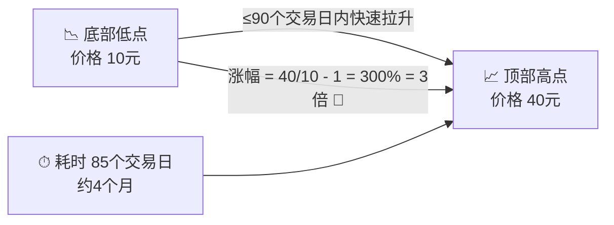
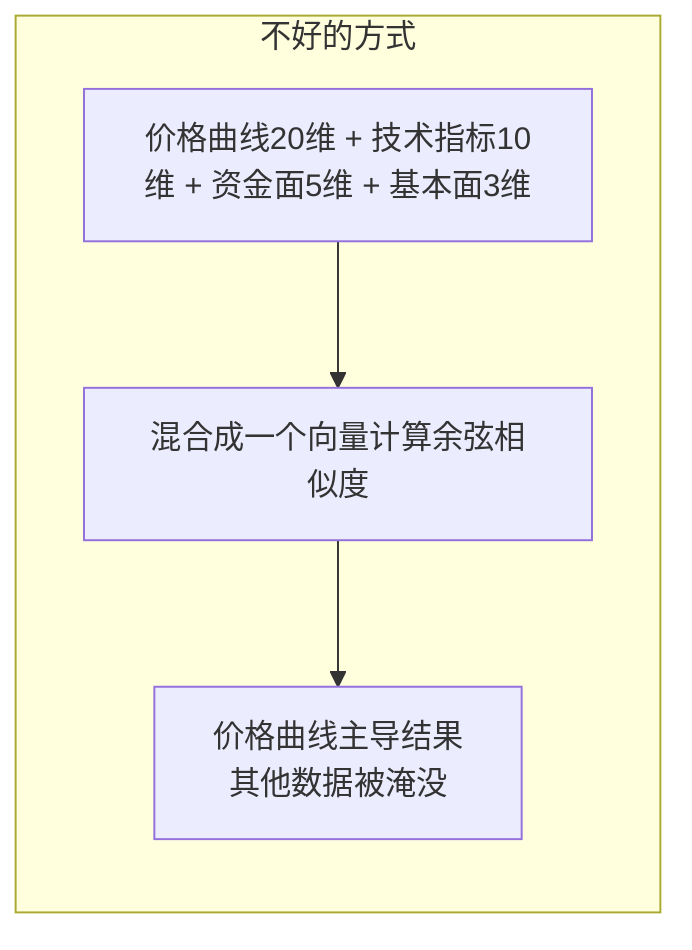
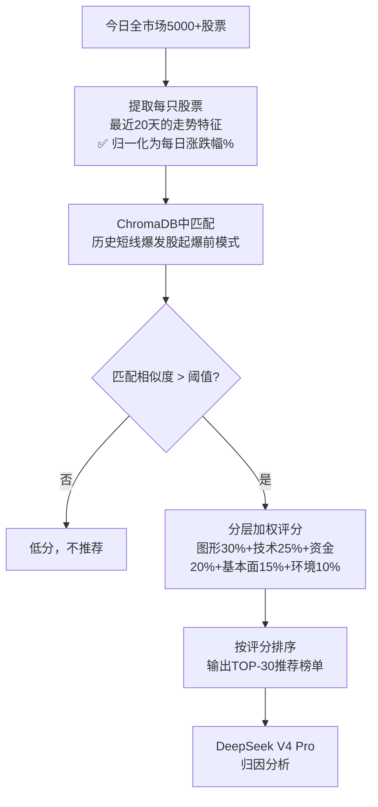

# 模块2：ChromaDB 模式库 — 短线爆发模式挖掘 + 相似度匹配引擎

> **对应总规划**：[`00-总规划框架.md`](plans/00-总规划框架.md) → 模块2
> **合并自**：`优化方案-模式采样预测引擎.md` + `相似度匹配方案优化.md`

---

## 一、一句话说清楚核心思路

> **只研究"≤90个交易日内涨幅3倍以上的短线爆发股"**：
>
> 1. 回测扫描2010-2024所有 **在≤90个交易日内从低点涨到超过3倍** 的股票
> 2. 提取每一只的**完整快速上涨过程**
> 3. 分析：**在快速上涨过程中，哪个位置买进去，后续上涨概率最高？**
> 4. 提取**最佳入场点之前的走势特征** → 这就是短线爆发股"起爆前"的标准模样
> 5. 每天扫描全市场，找**当前长得像"起爆前"的股票**

---

## 二、ChromaDB 的双重角色

ChromaDB 在本系统中承担**双重角色**：

```
角色1（核心）：短线爆发模式向量库
  → 存储所有历史"3倍以上短线爆发"的起爆前20天特征向量
  → 用于每日全市场相似度匹配

角色2（辅助）：文本知识向量库
  → 存储研报、公告的文本向量
  → 用于相似案例的上涨逻辑解释
```

---

## 三、历史模式挖掘 — 找出短线爆发股

### 3.1 什么是"短线爆发股"？



**入选条件：**

```
从阶段低点到阶段高点：
1. 累计涨幅 ≥ 3倍（300%）
2. 耗时 ≤ 90个交易日
```

| 类型        | 例子                   | 是否入选      | 原因                     |
| ----------- | ---------------------- | ------------- | ------------------------ |
| 🚀 短线爆发 | 90天内涨3倍以上        | ✅ 正是要找的 | 短期暴力拉升，规律性强   |
| 🐢 慢牛长牛 | 3年涨5倍（如消费白马） | ❌ 排除       | 时间太长，不适合短线交易 |
| 📉 随机波动 | 某股3个月涨20%         | ❌ 排除       | 涨幅太小，没有参与价值   |

### 3.2 回测流程

```mermaid
flowchart TB
    subgraph 第一步：回测找出所有短线爆发股
        A1[遍历2010-2024<br/>全市场数据] --> A2[筛选低点到高点<br/>≤90个交易日<br/>涨幅 ≥ 3倍的行情段]
        A2 --> A3[提取每段短线爆发的<br/>完整快速上涨走势图]
    end

    subgraph 第二步：分析最佳入场点
        A3 --> B1[将爆发过程分为多个阶段<br/>底部盘整/启动/加速/高潮/见顶]
        B1 --> B2[模拟每个阶段入场<br/>统计后续上涨概率和盈亏比]
        B2 --> B3[找到最佳入场点<br/>即上涨概率最高+盈亏比最大的位置]
        B3 --> B4[提取最佳入场点<br/>前20天的走势特征<br/>这就是"起爆前信号"]
    end

    subgraph 第三步：构建短线爆发模式库
        B4 --> C1[将所有短线爆发股的<br/>"起爆前特征"存入ChromaDB]
        C1 --> C2[每一条记录：<br/>入场前20天价格曲线(归一化)<br/>+ 全部关联数据<br/>+ 入场后短期涨幅结果]
    end
```

### 3.3 最佳入场点分析

对每段短线爆发行情，分成多个可能的入场点：

```mermaid
graph TD
    subgraph 一只短线爆发股从10元到40元（耗时85天）
        A[底部 10] --> B[底部盘整结束<br/>价格 12 第30天]
        B --> C[启动第一波<br/>价格 15 第40天]
        C --> D[第一次回调<br/>价格 13 第45天]
        D --> E[主升浪开始<br/>价格 18 第55天]
        E --> F[加速拉升<br/>价格 28 第70天]
        F --> G[高潮见顶<br/>价格 40 第85天]
    end
```

**分析维度**：
| 指标 | 计算方式 | 含义 |
|------|----------|------|
| 后续涨幅 | 入场价到顶部最高价 | 最多能赚多少 |
| 上涨概率 | 入场后T+5日涨幅>5%的概率 | 买入后短期胜率 |
| 最大回撤 | 入场后曾出现的最大浮亏 | 买入后要承受多少波动 |
| 盈亏比 | 平均盈利/平均亏损 | 赚亏比例 |
| 最优目标 | `argmax(上涨概率 × 盈亏比)` | 性价比最高的入场点 |

### 3.4 存入ChromaDB的"起爆前模式"样本

> ⚠️ **重要设计决策**：价格曲线必须归一化，不能存绝对价格！
> 否则20块的股票和5块的股票形态完全相同但因价格量级不同无法匹配。
> 采用方案：**百分比变化序列**（每日涨跌幅），纯形态匹配。

```python
起爆前模式 = {
    # ===== 核心：入场前20天的价格图形走势（归一化）=====
    # ✅ 用每日涨跌幅(%)替代绝对价格 → 价格无关，纯形态匹配
    "起爆前_价格曲线_pct": [0.0, -2.0, -3.1, 1.1, 2.1, 4.1, 2.9, -1.9,
                          4.9, 1.9, -4.5, 2.9, 3.7, 2.7, 2.6, -1.7,
                          3.4, 1.7, 2.5, 2.4],
    "起爆前_成交量曲线": [-15.0, -10.0, 5.0, 20.0, -8.0, ...],  # 相对于20日均量的变化率%
    "起爆前_波动率": 2.5,                  # 20天平均真实波幅ATR(归一化)
    "起爆前_形态分类": "W底突破+回踩不破",
    "起爆前_均线排列": "MA5上穿MA20",

    # ===== 入场后验证结果 =====
    "入场后_T+1涨幅": 3.5,                # 次日（短线核心）
    "入场后_T+5涨幅": 15.2,               # 5日后（短线核心）
    "入场后_T+20涨幅": 45.0,              # 20日后
    "整段剩余涨幅": 210.0,                # 入场点到顶点的剩余涨幅
    "入场后_最大回撤": -5.2,              # 曾承受的最大浮亏

    # ===== 元信息 =====
    "ts_code": "300750.SZ",
    "stock_name": "宁德时代",
    "entry_date": "2020-05-15",
    "entry_price": 12.8,                   # 仅用于回测，不参与匹配
    "total_gain": 3.2,                     # 整段涨幅（倍）
    "total_duration": 78,                  # 整段耗时（天）
    "industry": "新能源",
    "market_env": "震荡市",
}
```

---

## 四、相似度匹配方案 — 分层匹配 + 加权评分

### 4.1 核心问题

把所有特征揉在一起算相似度 → 价格曲线（20维）占维度优势 → 其他数据被淹没。



### 4.2 分层匹配架构

```mermaid
flowchart TD
    subgraph 第一层：图形匹配【粗筛】
        S1[当前股票<br/>20天价格曲线<br/>百分比变化] --> S2[ChromaDB<br/>余弦相似度匹配]
        S2 --> S3[筛选出Top-100<br/>图形最相似的历史案例]
    end

    subgraph 第二层：多维评分【精排】
        S3 --> T1[对Top-100<br/>计算综合评分]
        T1 --> T2[技术面评分<br/>均线/MACD/RSI/量比 25%]
        T1 --> T3[资金面评分<br/>主力净流入/大单占比 20%]
        T1 --> T4[基本面评分<br/>PE分位/ROE/利润增速 15%]
        T1 --> T5[市场环境评分<br/>大盘/板块热度 10%]
        T2 & T3 & T4 & T5 --> T6[综合评分 = 加权求和]
    end

    subgraph 第三层：AI深度分析
        T6 --> U1[DeepSeek V4 Pro<br/>对Top-30进行归因分析]
        U1 --> U2["为什么这些股票评分高？<br/>哪些维度匹配度最强？"]
    end
```

### 4.3 评分公式

```
第一层（图形粗筛）：
  仅用20天价格曲线(百分比变化)做余弦相似度 → 找出Top-100

第二层（多维精排）：
  综合评分 = 图形相似度 × 0.30
           + 技术面评分 × 0.25
           + 资金面评分 × 0.20
           + 基本面评分 × 0.15
           + 市场环境评分 × 0.10
```

### 4.4 各维度评分细节

**技术面评分（25%）**：

```python
def 技术面评分(当前, 历史案例):
    score = 0
    if 当前['ma5>ma10'] == 历史案例['ma5>ma10']: score += 20
    if 当前['ma10>ma20'] == 历史案例['ma10>ma20']: score += 20
    if 当前['macd_bullish'] == 历史案例['macd_bullish']: score += 20
    if abs(当前['rsi_14'] - 历史案例['rsi_14']) < 10: score += 20
    if abs(当前['volume_ratio'] - 历史案例['volume_ratio']) < 0.5: score += 20
    return score
```

**资金面评分（20%）**：

```python
def 资金面评分(当前, 历史案例):
    score = 0
    if (当前['net_amount'] > 0) == (历史案例['net_amount'] > 0): score += 30
    if abs(当前['net_amount_ratio'] - 历史案例['net_amount_ratio']) < 0.1: score += 35
    if abs(当前['large_order_ratio'] - 历史案例['large_order_ratio']) < 0.1: score += 35
    return score
```

**基本面评分（15%）** — PE分位、ROE、利润增速是否匹配
**市场环境评分（10%）** — 大盘状态、板块热度是否一致

### 4.5 完整匹配维度

| 维度        | 权重 | 匹配内容                   | 回答的问题           |
| ----------- | ---- | -------------------------- | -------------------- |
| 📈 价格图形 | 30%  | 20天价格曲线形状（归一化） | 走势图像不像？       |
| 📊 技术面   | 25%  | 均线/MACD/RSI/量比         | 技术状态是否一致？   |
| 💰 资金面   | 20%  | 主力净流入/大单占比        | 资金是否在流入？     |
| 📋 基本面   | 15%  | PE分位/ROE/利润增速        | 估值和质量是否匹配？ |
| 🌍 市场环境 | 10%  | 大盘/板块状态              | 整体环境是否相似？   |

---

## 五、特征向量组成（50+维）

| 类别         | 维度数 | 包含内容                                   |
| ------------ | ------ | ------------------------------------------ |
| 价格曲线特征 | 20维   | T-20到T-1的每日涨跌幅%（归一化，价格无关） |
| 成交量特征   | 5维    | 量比、均量变化率、放量天数等               |
| 均线特征     | 6维    | MA5/MA10/MA20/MA60的位置和斜率             |
| 技术指标     | 10维   | MACD、RSI、KDJ、布林带位置、ATR            |
| 资金面       | 5维    | 主力净流入率、大单占比                     |
| 基本面       | 3维    | PE分位、ROE、利润增速                      |
| 市场情绪     | 3维    | 板块热度、换手率、大盘状态                 |

---

## 六、文本知识库（辅助）

### 6.1 存储内容

| 数据源       | 内容                         | 更新频率 |
| ------------ | ---------------------------- | -------- |
| 券商研报摘要 | 每只股票的近期研报核心观点   | 按需     |
| 公司公告     | 业绩预告、重大合同、重组等   | 每日     |
| 财经新闻     | 相关行业/个股的新闻标题+摘要 | 每日     |

### 6.2 用途

文本知识库不参与评分计算，仅用于：

1. 为推荐榜单中的每只股票提供上涨逻辑解释
2. Agent对话时回答"为什么推荐这只股票"

---

## 七、ChromaDB 部署配置

```python
import chromadb

client = chromadb.PersistentClient(path="./data/chroma_db")

# 创建模式向量集合
pattern_collection = client.create_collection(
    name="short_term_patterns",
    metadata={"hnsw:space": "cosine"},  # 余弦相似度
)

# 添加一条模式
pattern_collection.add(
    embeddings=[feature_vector],        # 50+维特征向量
    metadatas=[metadata_dict],          # 元数据
    ids=["pattern_20200515_300750"],    # 唯一ID
)
```

### 配置参数

| 参数           | 值                             |
| -------------- | ------------------------------ |
| 存储路径       | `./data/chroma_db`             |
| 持久化方式     | 磁盘持久化                     |
| 集合数量       | 2个（模式库 + 文本库）         |
| 模式库预估规模 | ~2000条（每段短线爆发行情1条） |
| 检索延迟       | < 100ms                        |

---

## 八、每日全市场扫描流程



---

## 九、与DeepSeek V4 Pro的协作

```
第一层（ChromaDB，纯计算，毫秒级）：
  价格曲线匹配 → 粗筛Top-100

第二层（本地计算，秒级）：
  技术面+资金面+基本面+环境 → 加权评分 → 精排Top-30

第三层（DeepSeek V4 Pro，只处理Top-30）：
  对Top-30进行深度归因分析
  "这30只股票中，评分最高的几只为什么高？"
  "哪些维度的匹配度最强？"
```

---

## 十、可行性总结

| 步骤             | 可行性      | 说明                                    |
| ---------------- | ----------- | --------------------------------------- |
| 找出短线爆发行情 | ✅ 简单     | 用SQL找≤90天内低点到高点涨幅≥300%的区间 |
| 分段分析入场点   | ✅ 简单     | 每段行情取5个关键位置分别回测           |
| 提取起涨前特征   | ✅ 实现简单 | 入场点前20天的数据在MySQL中都有         |
| ChromaDB存储     | ✅ 现成     | 几千条起涨前模式，完全不在话下          |
| 每日全市场匹配   | ✅ 性能充足 | 5000只去匹配几千条模板，毫秒级完成      |

---

## 十一、政策文本向量库存储说明（设计归 Agent 系统规划 §十八）

> **归属修正**：政策知识库 RAG 的完整设计（P0/P1/P2 分期落地路径）属于**政策解读 Agent 第 2 层记忆知识层**的增强方案，
> 已归入 [`plans/03-Agent系统.md`](plans/03-Agent系统.md) **§十八**。本章仅保留 **ChromaDB 存储层面**的关联说明，避免文档错位与重复。

- **角色2 文本知识向量库（原 §六）**：研报/公告/新闻文本库，用于推荐逻辑解释与 Agent 对话
- **政策文本向量库（RAG）**：存储复用本模块 `vector_store.py` 的 PersistentClient + collection 封装模式
  （`_InMemoryCollection` 降级、metadata 清洗），新增文本 collection `policy_texts_v1024`，不另起炉灶；
  Chunk 模型、BM25+向量混合召回、bge 重排、Graph RAG/CRAG、历史对标增强等完整设计见
  [`plans/03-Agent系统.md`](plans/03-Agent系统.md) §十八
- **形态向量库（角色1，本模块核心）**：短线爆发模式匹配，与政策 RAG 相互独立、互不干扰
