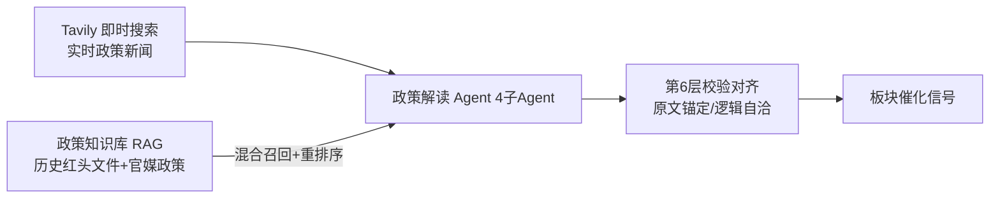
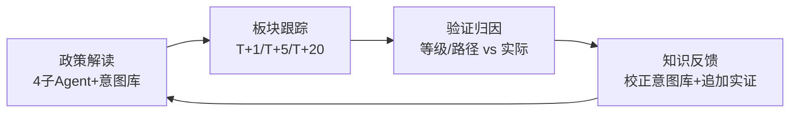
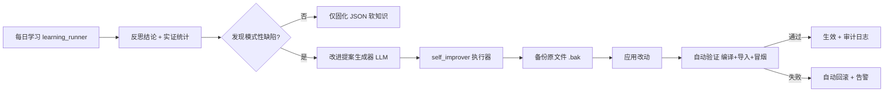

# 模块3：AI Agent 系统 — 多 Agent 协作精筛 + 统一决策 Agent（每日推荐最后一环）

> **状态**：v3 重写（多 Agent 协作 + 统一决策，替代 v2 单 Agent）
> **定位**：纯个人本地自用；规则层（daily_scan）产出候选池后，Agent 做**语义级最后一环精筛**
> **对齐**：[`09-每日推荐详细规划.md`](plans/09-每日推荐详细规划.md) + 本模块作为第五层
> **一句话**：多个能力 Agent 从各自视角分析候选股（政策 / 消息面 / 个股语义），由**统一决策 Agent** 汇总做最终 Top-N 决定并给出理由。

---

## 一、总体架构（多 Agent 协作 + 统一决策）

```mermaid
flowchart TB
    subgraph 模块9 daily_scan（非本模块）
        R[全市场5535 → 四层规则过滤] -->|候选池约476| CAND
    end

    subgraph 本模块 多Agent精筛层
        CAND[候选池] --> PA[候选画像Agent]
        CAND --> PL[政策解读Agent]
        CAND --> NS[消息面验证Agent]
        PA --> SA[个股语义精筛Agent]
        PL --> SA
        NS --> SA
        SA --> UD[统一决策Agent]
    end

    UD -->|最终榜单 Top-N + 理由| FE[前端展示]
```

**多 Agent 协作原则**：每个 Agent 只做单一职责的"事实提取/单视角判断"，不做最终决定；
所有单视角信号汇入**统一决策 Agent**，由它做最终精筛与排序（降低单点幻觉、提升稳定）。

---

## 二、Agent 清单与职责总览

| #   | Agent                  | 职责                                                                         | 输入                    | 输出                                                              |
| --- | ---------------------- | ---------------------------------------------------------------------------- | ----------------------- | ----------------------------------------------------------------- |
| 1   | **候选画像 Agent**     | 组装每只候选的量化画像（不调 LLM，纯规则）                                   | 候选池 JSON + 59 维特征 | 每只候选的结构化画像（形态/概率/命中条件/风险/关键特征/所属板块） |
| 2   | **政策解读 Agent**     | 判断候选股所属板块/题材近期政策催化强度（4 子 Agent 协作，见 §三）           | 候选板块 + 政策知识库   | 板块级催化信号（S/A/B/C/利空 + 政策要点 + 历史对标）              |
| 3   | **消息面验证 Agent**   | 用 Tavily 实时搜索候选股近期新闻/公告/题材，识别"利好落地/超跌反抽/板块退潮" | 候选 ts_code/name       | 消息面结论 + 新闻摘要 + 置信度                                    |
| 4   | **个股语义精筛 Agent** | 综合量化画像 + 政策 + 消息面，给出 select/skip + score_adjust + 个股理由     | 画像 + 政策 + 消息面    | 个股精筛决策                                                      |
| 5   | **统一决策 Agent**     | 汇总所有精筛决策，做最终 Top-N 排序与最终理由                                | 全部 Agent 输出         | 最终榜单 + agent_reason                                           |

> 注：候选画像 Agent 与个股语义精筛 Agent 可合并实现为"精筛主 Agent"，政策解读与消息面为其提供"催化信号"；
> 但**政策解读 Agent 内部必须保留 4 子 Agent 分工**（用户指定设计）。

---

## 三、政策解读 Agent（用户指定设计：4 子 Agent 协作）

> 来源：用户提供《自用政策-A股分析Agent 完整实现细节规划》核心层。
> 定位：把"政策 → 板块"的催化信号供给个股精筛，是候选股"是否有实质驱动"的关键判断源。

### 3.1 政策要素抽取 Agent

- **任务**：从政策原文提取客观信息，不做主观推演。
- **字段**：发布主体、生效时间、有效期、核心目标与量化指标（装机量/产值/补贴金额）、支持方向、限制/淘汰领域、配套措施（补贴/税收/专项资金）。
- **约束**：只提取原文明确表述，未提及标"未明确"；每项标注原文片段位置。

### 3.2 产业链映射 Agent

- **任务**：把政策关联到申万行业、概念板块、产业链环节。
- **逻辑**：基础映射库（政策关键词 → 申万行业 → 概念板块 → 产业链上下游）→ 细化上中下游 → 补充衍生受益。
- **输出**：直接受益 / 间接受益 / 利空受限 三类，标注申万行业 + 概念板块。

### 3.3 利好程度分级 Agent

- **任务**：量化政策影响力度。
- **分级**：S 级（国务院顶层+万亿级+全行业）/ A 级（部委专项+千亿级+细分重磅）/ B 级（地方配套+百亿级+常规支持）/ C 级（部门通知+小幅调整）/ 利空级（监管收紧/补贴退坡）。
- **打分维度**：发布层级、资金规模、覆盖范围、市场预期差、历史同类政策影响。

### 3.4 历史对标分析 Agent

- **任务**：匹配历史相似政策，参考板块行情。
- **逻辑**：向量检索 Top3 历史相似政策 → 政策发布后 1/3/7/30 天对应板块涨跌幅/量能 → 对比当前环境差异。
- **约束**：只做事实统计，明确"历史数据仅参考，不代表未来"。

### 3.5 政策数据源与 RAG（自用、本地）

| 项目         | 方案                                                                                                                                            |
| ------------ | ----------------------------------------------------------------------------------------------------------------------------------------------- |
| 采集         | `feedparser`（RSS 优先：中国政府网/发改委/央行/工信部/财联社电报/新闻联播文字稿）+ `newspaper3k`/`BeautifulSoup4` 正文提取；控制频率每日 1-2 次 |
| 去重         | 标题哈希 + 正文前 200 字哈希双重去重                                                                                                            |
| 存储         | SQLite（结构化元数据：标题/时间/发布单位/来源分类/标签/正文/摘要）                                                                              |
| 向量库       | Chroma（复用现有，新增 `policy_kb` 集合）或 FAISS；`bge-large-zh-v1.5` 本地 embedding                                                           |
| 分块         | LangChain `SemanticChunker`（500-800 字/块，重叠 100 字）                                                                                       |
| 产业链映射库 | 初始人工维护主流赛道映射表，随分析持续校准                                                                                                      |

---

## 四、消息面验证 Agent（Tavily 实时搜索）

> 用户已提供 Tavily API Key，用于验证候选股实时消息面。

- **任务**：对每只候选股（Top-K 内）实时搜索近期新闻/公告/题材，识别三类陷阱：
  ① 利好落地出货（涨停/大涨后消息兑现追高风险）
  ② 超跌反抽/题材垃圾（图形相似但无实质驱动）
  ③ 板块退潮（同题材已过炒作周期）
- **输入**：候选 ts_code / name / 所属概念（来自 concept_detail / ths_member）。
- **输出**：`{verdict: "利好/中性/利空/存疑", reason, news_snippets, confidence}`。
- **配置**：`TAVILY_API_KEY` 写入 `.env`；搜索每日一次（榜单精筛时）；失败降级为"无消息面信号"（不阻塞）。

---

## 五、个股语义精筛 Agent（综合判断）

- **输入**：候选画像（量化）+ 政策信号（板块催化）+ 消息面信号（个股新闻）。
- **任务**：判断每只候选 select/skip，输出：
  ```json
  {
    "ts_code": "600036.SH",
    "action": "select | skip",
    "score_adjust": -20, // 综合概率微调（-20~+10）
    "confidence": "high | mid | low",
    "reason": "平台突破+券商板块政策利好，公司Q3预增；消息面无出货迹象"
  }
  ```
- **约束**：强规则过滤（ST/涨停封死/流动性）不可被 Agent 覆盖；Agent 只做末端微调。

---

## 六、统一决策 Agent（最终决定）

- **输入**：所有个股精筛决策 + 规则综合概率 + 政策/消息面置信度。
- **决策逻辑**：
  1. 汇总 `select` 的候选，`final_score = 规则综合概率 × (1 + score_adjust%) × 置信度加权`；
  2. 剔除被多个 Agent 标记"利空/存疑"的候选（投票式排除）；
  3. 排序 → 取 **Top-N**（默认 20，可配置）；
  4. 为每条生成**最终理由**（合并个股理由 + 政策/消息面要点）。
- **失败降级**：任一 Agent 失败 → 该信号置"未知"，统一决策 Agent 基于可用信号决策；全部 LLM 失败 → 降级纯规则榜单。

---

## 七、端到端流水线

```
1. 读取当日候选池（daily_recommend/daily_YYYYMMDD.json）
2. 候选画像 Agent：为 Top-K（默认100）组装结构化画像 + 所属板块
3. 政策解读 Agent（4 子 Agent）：对涉及的板块做政策要素/映射/分级/历史对标 → 板块催化信号
4. 消息面验证 Agent：对候选股做 Tavily 搜索 → 消息面信号
5. 个股语义精筛 Agent：画像 + 政策 + 消息面 → select/skip + score_adjust + reason
6. 统一决策 Agent：汇总 → 投票排除 → 排序 → Top-N + 最终理由
7. 落盘 daily_recommend/daily_YYYYMMDD_agent.json + 前端展示
```

---

## 八、可验证性与回滚

1. **A/B 对比**：同时落盘"纯规则榜单"与"Agent 最终榜单"，按 T+5/T+20 命中率对比，验证多 Agent 是否真正提升。
2. **回滚**：Agent 结果是追加字段（`agent_reason`/`agent_confidence`）+ 末端排序；`AGENT_ENABLED=false` 即回纯规则。
3. **诚实边界**：
   - 政策/消息面结论锚定原文/新闻，prompt 强制"原文未提及→未明确"，禁止脑补；
   - LLM 可能幻觉/误判 → 只做末端微调，不覆盖强规则；历史对标仅参考；
   - Agent 只做研究辅助，最终决策由使用者自己做出。

---

## 九、成本控制

| 项       | 策略                                                                                       |
| -------- | ------------------------------------------------------------------------------------------ |
| LLM 调用 | 只对 Top-K（100）候选精筛；政策解读按"涉及板块"去重调用（约 10-20 次）；合计约 20-40 次/日 |
| 消息面   | Tavily 搜索 Top-K 候选，每日一次精筛时触发                                                 |
| 模型     | DeepSeek（主）+ Tavily（消息面）；可配                                                     |
| 失败降级 | 各 Agent 独立降级，不阻塞主流程                                                            |

---

## 十、模块与代码结构（实现蓝图）

```
backend/app/agents/
  ├── __init__.py
  ├── llm_client.py            # DeepSeek/Tavily 客户端（调用/重试/JSON 降级）
  ├── prompts.py               # 各 Agent Prompt + JSON schema
  ├── candidate_profiler.py    # 候选画像 Agent（纯规则组装，含所属板块）
  ├── policy_agent.py          # 政策解读 Agent（编排 4 子 Agent）
  │   ├── extractor.py         #   ① 政策要素抽取
  │   ├── industry_map.py      #   ② 产业链映射（+ 映射库）
  │   ├── grading.py           #   ③ 利好程度分级（S/A/B/C/利空）
  │   └── history_benchmark.py #   ④ 历史对标（向量检索 + 板块行情）
  ├── news_agent.py            # 消息面验证 Agent（Tavily）
  ├── refine_agent.py          # 个股语义精筛 Agent
  └── decision_agent.py        # 统一决策 Agent（汇总/投票/排序/Top-N）

backend/app/data/news_collector.py   # 政策 RSS 采集（feedparser）+ 正文提取 + SQLite 入库
backend/app/data/policy_kb.py        # 政策知识库（Chroma 集合 policy_kb + 分块 + embedding）

backend/app/api/predictions.py       # 新增 /agent/refine + /agent/status（日志捕获仿 daily_scan）

frontend/src/views/Recommend.vue     # Agent 理由列 + 政策/消息面标签 + 精筛日志面板
```

### 配置项（config.py / .env）

```
AGENT_ENABLED=true
AGENT_TOP_K=100
AGENT_FINAL_TOP_N=20
AGENT_MODEL=deepseek-chat
TAVILY_API_KEY=tvly-dev-...   # .env（已提供）
POLICY_RSS_URLS=[...]          # 政策信源 RSS
```

---

## 十一、API 与前端

- `POST /api/v1/predictions/agent/refine`：读取当日候选池 → 多 Agent 精筛（后台）→ 落盘 agent 版榜单。
- `GET /api/v1/predictions/agent/status`：状态 + 详细日志（`_ListHandler` 捕获，前端实时）。
- `GET /api/v1/predictions/today`：返回 `agent_reason` / `agent_confidence` / 政策与消息面标签。
- 前端 Recommend.vue：榜单新增 **Agent 理由列**、**政策/消息面标签**、"🤖 Agent 精筛"按钮 + 精筛日志面板。

---

## 十二、分期落地

- **阶段 1（MVP）**：候选画像 Agent + 个股语义精筛 Agent + 统一决策 Agent（先无政策/消息面，纯量化画像精筛）→ 跑通"候选池 → Agent 榜单"闭环。
- **阶段 2**：接入**消息面验证 Agent（Tavily）** → 精筛纳入实时消息，识别利好出货/板块退潮。
- **阶段 3**：接入**政策解读 Agent（4 子 Agent）**：先手工/半自动维护映射库，后接 RSS 采集 + 政策知识库 RAG。

---

## 十三、待实现清单（供 code 模式执行）

- [ ] ① `agents/llm_client.py`：DeepSeek + Tavily 客户端（调用/重试/JSON 降级）
- [ ] ② `agents/prompts.py`：各 Agent Prompt + JSON schema
- [ ] ③ `agents/candidate_profiler.py`：候选画像组装（量化 + 所属板块）
- [ ] ④ `agents/refine_agent.py` + `agents/decision_agent.py`：个股精筛 + 统一决策（阶段 1 闭环）
- [ ] ⑤ `agents/news_agent.py`：Tavily 消息面验证（阶段 2）
- [ ] ⑥ `agents/policy_agent.py`（4 子 Agent：extractor/industry_map/grading/history_benchmark）+ 映射库（阶段 3）
- [ ] ⑦ `app/data/news_collector.py` + `app/data/policy_kb.py`：政策采集 + 知识库 RAG（阶段 3）
- [ ] ⑧ `app/api/predictions.py`：`/agent/refine` + `/agent/status`（日志捕获仿 daily_scan）
- [ ] ⑨ `frontend/src/views/Recommend.vue`：Agent 理由列 + 政策/消息面标签 + 精筛日志面板
- [ ] ⑩ `config.py` / `.env`：Agent 配置 + `TAVILY_API_KEY`
- [ ] ⑪ 端到端验证：候选池 → 多 Agent 精筛 → 统一决策 → 前端展示理由 + 日志实时

---

## 十四、归因知识接入 Agent 精筛（增强，用户确认）

> 背景：归因分析（attribution.py）目前只服务回测报告，对每日推荐是**间接影响**
> （关键特征已固化进条件概率表）。本增强让**历史成功规律直接进入 Agent 精筛**。

### 14.1 目标

把回测归因产出的"关键特征（高 AUC）+ 成功画像（success_profile）"写入 Agent 精筛上下文，
让 LLM 在判断候选股时**参考历史成功样本的共性规律**（哪些特征/组合倾向成功）。

### 14.2 设计（三步）

```
回测步骤7 归因分析 → 固化 attribution_kb.json（关键特征+成功画像+判别方向）
                              ↓
Agent 精筛加载 attribution_kb → 构造"历史成功规律"文本
                              ↓
写入 REFINE/BATCH_REFINE Prompt → LLM 参考规律判断候选股
```

**① 回测固化归因知识（runner.py）**

- 回测步骤 7 产出 `attribution.rankings`（含 `is_key`/`auc`/`success_mean`/`failure_mean`）与 `success_profile`
- 落盘 `backend/data/attribution_kb.json`（新增 `save_attribution_kb` / `load_attribution_kb`）

**② Agent 加载归因上下文（agents/**init**.py）**

- `run_agent_refine` 加载 `attribution_kb.json`
- 构造文本：`历史成功规律：特征X(AUC 0.72，成功均值↑ 放量/资金净流入)、特征Y(AUC 0.68，低 PE 分位)…`
  （只取 `is_key` 的高 AUC 特征 + `success_profile` 方向，控制 token）

**③ 写入 Prompt（agents/prompts.py）**

- `REFINE_USER_TMPL` 新增 `{attribution_kb}` 字段：`历史成功样本共性：…`
- `BATCH_REFINE_USER_TMPL` 可选加入，供批量粗筛参考
- 精筛 LLM 依据该规律判断"该候选是否符合历史成功画像"

### 14.3 预期效果

- Agent 精筛从"纯语义/消息面判断"升级为"**参考历史统计规律 + 语义判断**"
- 例如：归因显示"放量突破 + 主力净流入 + 低估值分位"是成功关键 → LLM 精筛时重点核查这些特征，
  不符合成功画像但消息面热闹的（烟雾弹/出货）更易被识别排除

### 14.4 实施清单

- [x] ① `attribution.py`/新增：`save_attribution_kb` / `load_attribution_kb`（落盘关键特征+成功画像）
- [x] ② `runner.py`：回测步骤 7 后调用 `save_attribution_kb`
- [x] ③ `prompts.py`：`REFINE_USER_TMPL` 加 `{attribution_kb}`；`BATCH_REFINE` 可选
- [x] ④ `agents/__init__.py`：加载 attribution_kb → 构造上下文 → 传入精筛
- [x] ⑤ 验证：回测产出 kb → Agent 精筛理由体现"历史成功规律"参考
  - ✅ `backend/data/attribution_kb.json` 已由现有回测报告生成（11 个关键特征 + 10 条组合规则）
  - ✅ 验证通过：save/load 正常、`_build_attribution_txt` 构造文本合理、空 kb 降级正常
  - ✅ 后续回测会覆盖更新 kb（runner 步骤 7 自动落盘）

## 十五、反思层（Reflection Layer）⭐用户核心需求"要越来越聪明"

> 背景：Agent 精筛目前是"决策一次即结束"——推荐后从不看结果、从不反思。
> 本层建立**推荐→结果→反思→教训→反馈**的闭环，让系统从失败中学习，越用越聪明。

### 15.1 一句话

每天扫描推荐后，等 T+5 结果出来：**没涨的为什么没涨**？用 LLM 逐只反思，把反复出现的错误教训
固化到 reflect_kb，**下次精筛时作为"失败教训"参考**，避免重蹈覆辙。

### 15.2 闭环四步

```
① 结果回填：monitor hits 的 t5_ret 由 None → 实际 T+1/T+5 涨幅（daily 表前复权）
② 失败反思：对 T+5 未兑现的推荐，LLM 逐只分析"为什么没涨"（输入当时理由/画像/信号 + 实际走势）
③ 教训固化：错误类型 + 具体教训 + 关联信号，累计去重（同类 count++），高频教训才生效
④ 反馈精筛：把高频失败教训构造为文本，写入 REFINE/BATCH_REFINE Prompt → 下次精筛参考
```

### 15.3 关键设计

- **反思口径**：T+5 涨幅 >5% = 成功（与 monitor/回测一致）；失败股才反思，控制成本
- **反思范围**：优先 Agent 最终榜单（10 条）的失败股；规则榜单可扩展
- **反思输入**：推荐时 Agent 理由（daily\_\*\_agent.json）+ 命中特征 + T+1/T+5 实际走势
- **反思输出（LLM JSON）**：`error_type`（利好误判/出货未识别/追高/形态失效/市场环境/消息真空/估值透支/其他）、`lesson`（一句话教训）、`fix`（下次修正规则）、`confidence`
- **教训去重**：相同 error_type+lesson 合并，count++；`count>=2` 才进入反馈（避免单次偶然）
- **反馈方式**：`reflect_kb.json` 高频教训 → `_build_reflect_txt()` → 精筛 Prompt"历史失败教训"区块
- **知识边界**：反思只服务 Agent 判断，不直接改规则概率（与归因知识同理，防参数漂移）

### 15.4 实施清单

- [x] ① `reflect_agent.py`/新增：结果回填（backfill）+ 失败反思（LLM）+ reflect_kb 固化/加载
- [x] ② `prompts.py`：`REFLECT_SYSTEM/REFLECT_USER_TMPL` + `REFINE/BATCH_REFINE` 加 `{reflect_kb}`
- [x] ③ `refine_agent.py`：透传 reflect_txt
- [x] ④ `agents/__init__.py`：加载 reflect_kb → 构造失败教训文本 → 传入精筛
- [x] ⑤ `main.py`：定时任务（每日 20:00 回填+反思）；`api` 反思报告接口（/reflect/run|status|report）
- [x] ⑥ 验证：回填→反思→reflect_kb→精筛 Prompt 链路
  - ✅ `_calc_outcome` 用真实历史走势验证（20260601 推荐 T+5=-8.32% 正确计算）
  - ✅ LLM 反思真实输出结构化教训（利好误判 → reflect_kb 固化，count=1 暂不反馈防偶然）
  - ✅ build_reflect_txt 只输出 count>=2 高频教训；空库降级正常；报告 API + 定时任务已生效
  - ✅ 当前推荐均为 8/8、8/10（T+5 未到期），回填 0 为正常；到期后定时任务自动积累教训

## 十六、政策解读 Agent 按 7 层内部架构对齐（用户提供蓝图）

> 明确区分：**「系统 5 层架构」= 采集/存储/RAG/Agent/输出**（宏观）；**「Agent 内部 7 层」= 感知/记忆/规划/工具/推理/校验/输出**（微观，本 §）。
> 本 § 以用户提供的权威 7 层架构为**设计总纲**，§16.4 起为当前实现与这些规范的对齐现状。

### 16.1 权威 7 层架构规范（用户提供，政策解读 Agent 设计总纲）

| 层             | 定位                | 核心职责                                    | 本场景实现要点                                                                                                 |
| -------------- | ------------------- | ------------------------------------------- | -------------------------------------------------------------------------------------------------------------- |
| 1 感知接入层   | 感官系统/输入入口   | 输入接收、格式统一、异常过滤、预处理        | 统一输入 Schema：用户提问/爬虫政策文本/结构化元数据/行情数值 → 标准化；过滤乱码/重复/无效                      |
| 2 记忆与知识层 | 长期记忆+专属知识库 | 知识存储、语义检索、上下文记忆、状态留存    | 历史政策向量库、产业链映射库、申万行业库、历史对标库（长期）；会话缓存（短期）；非结构化→向量库、结构化→SQLite |
| 3 规划调度层   | 决策大脑/中枢       | 任务拆解、流程编排、子 Agent 调度、异常处理 | 固定串行：要素抽取→产业链映射→利好分级→历史对标→行情工具→汇总（MVP 写死，后期 LangGraph）                      |
| 4 工具执行层   | 手脚/能力外延       | 工具封装、调用执行、结果回传                | 政策检索工具、行情数据工具（Tushare/AkShare）、文本处理工具、计算工具；Function Call                           |
| 5 推理生成层   | 业务核心/专业思考   | 领域专用推理、逻辑传导、内容生成            | 4 套专用推理（要素/传导/分级/对标），独立 Prompt+输出约束，不自由发挥                                          |
| 6 校验对齐层   | 质检部门/质量风控   | 事实校验、逻辑校验、风险对齐、错误修正      | 原文锚定、逻辑自洽、风险提示、幻觉回退重生成                                                                   |
| 7 输出交互层   | 输出接口/用户触达   | 格式渲染、多渠道输出、交互响应              | Markdown 报告、问答回复、Streamlit/网页、本地存档                                                              |

### 16.2 政策数据源（感知接入层"政策从哪来"，权威定义）

> 政策解读 Agent 的输入来自 4 类来源，统一经感知接入层标准化后进入推理：

| 来源                                             | 形态                              | 当前项目状态                                      |
| ------------------------------------------------ | --------------------------------- | ------------------------------------------------- |
| ① 用户自然语言提问                               | 对话式（"最新储能政策对A股影响"） | ⚠️ 未接入（`agent.py` 对话接口可扩展）            |
| ② 爬虫原始政策文本 / 新闻联播文稿 / 红头文件正文 | 长文档/非结构化文本               | ❌ 无采集器（`app/rag` 空壳；建库方案见 §18.9 ①） |
| ③ 数据库结构化元数据（发布单位/时间/来源分类）   | 结构化记录                        | ⚠️ 无政策元数据表（可建 `policy_meta` 表）        |
| ④ 行情接口数值（板块涨跌幅/估值）                | 数值                              | ✅ 已有 `daily`/`index_daily` 表（工具层可复用）  |

> 当前实际：`analyze_sector` 仅用 Tavily 搜索（源②的即时替代）；①③④ 为后续扩展点。

#### 权威采集信源清单（用户确认：采集必须来自权威官方源，防小道消息/烟雾弹）

| 信源类型            | 具体网站                                                         | 采集方式                | 更新频率                           |
| ------------------- | ---------------------------------------------------------------- | ----------------------- | ---------------------------------- |
| 顶层政策 / 红头文件 | 中国政府网（国务院文件库）、国家发改委、央行、工信部、财政部官网 | RSS 订阅 + 专栏页面爬虫 | 每日 2 次（早 10 点、晚 8 点）     |
| 官媒核心新闻        | 新闻联播文字稿（央视网）、新华网、人民网首页要闻                 | RSS + 正文提取          | 每日 1 次（晚 8 点新闻联播结束后） |
| 财经产业新闻        | 财联社电报、证券时报、上海证券报官方                             | RSS + API               | 每小时 1 次                        |
| 行业监管政策        | 证监会、银保监会、能源局、科技部等部委官网                       | 专栏定向爬虫            | 每日 1 次                          |

> 落地说明：本清单为源②（爬虫政策文本）的**权威来源**，对应 §18.9 ① 采集方案；
> 采集内容结构化入 `policy_meta` 元数据表（发布单位/时间/来源分类），正文入政策语料库 → RAG（§十八）；
> 当前 Tavily 搜索仅作信源建立前的即时替代。原则：**只采权威官方源，来源不明确的小道消息直接丢弃**（与"防烟雾弹"一致）。

### 16.3 3 层 MVP 简化方案（个人自用，快速跑通）

> 初期不严格拆 7 层，合并为 3 层核心快速跑通全链路，后期再逐步拆分：

1. **知识输入层**（感知+记忆合并）：数据接入、存储、检索
2. **核心分析层**（规划+推理+工具合并）：固定工作流串行 4 步分析
3. **结果输出层**（校验+输出合并）：生成固定格式研究报告

> 当前 `policy_agent.py` 实际即按此 3 层组织：输入(Tavily)→分析(4子Agent+校验)→输出(signal_to_text)；
> 后续按需再拆出规划调度层、校验对齐层（第 6 层已具雏形）。

### 16.4 当前实现 7 层对齐现状（实施前 vs 本次增强）

| 层               | 职责                         | 实施前                 | 本次增强                                                                              |
| ---------------- | ---------------------------- | ---------------------- | ------------------------------------------------------------------------------------- |
| 1 感知接入层     | 输入标准化/异常过滤          | ⚠️ 仅 Tavily 输入      | —（MVP 保持，后续可加统一 Schema）                                                    |
| 2 记忆与知识层   | 长期知识库+检索              | ⚠️ 5 条硬编码种子      | ✅ `policy_history.json` 持久化历史库，可扩充加载                                     |
| 3 规划调度层     | 任务拆解/子 Agent 调度       | ✅ 固定串行 4 子 Agent | ✅ 保持不变（符合 MVP）                                                               |
| 4 工具执行层     | 工具封装（行情/检索/计算）   | ⚠️ 仅 Tavily           | —（后续加行情/计算工具）                                                              |
| 5 推理生成层     | 4 套专用推理                 | ✅ 完整                | ✅ 保持不变                                                                           |
| **6 校验对齐层** | **防幻觉/逻辑自洽/风险对齐** | **❌ 缺失**            | **✅ 新增 `validate()`：原文锚定+逻辑自洽+漏风险检查，`signal_to_text` 标注校验状态** |
| 7 输出交互层     | 格式化输出                   | ⚠️ 仅内部文本          | —（后续加 Markdown 报告）                                                             |

### 16.5 本次落地

- **第 6 层校验对齐**（[`prompts.py`](prompts.py) `POLICY_VALIDATE_SYSTEM/TMPL` + [`policy_agent.py`](policy_agent.py) `validate()`）
  - 4 子 Agent 串行后执行校验：`anchored`（原文锚定/脑补识别）、`logic_ok`（分级与力度匹配）、`missed_risks`（漏利空/限制条款）、`verdict`（通过/需修正）
  - `signal_to_text` 对"需修正/含脑补/漏风险"输出 ⚠️ 标注 → 精筛 LLM 看到政策信号可信度打折（与防烟雾弹一脉相承）
- **第 2 层知识持久化**：`_SEED_HISTORY` → `data/policy_history.json`（可追加真实政策案例，反思/复盘可扩充）
- 校验失败/无历史库均优雅降级，不阻断主流程

### 16.6 验证

- ✅ 真实校验 LLM 调用：对忠实解读输出 `{anchored:true, verdict:通过, missed_risks:[]}`；`signal_to_text` 标注"校验通过"
- ✅ 历史库加载：文件缺失回退 5 条种子；`policy_history.json` 可写可扩充
- ✅ 全量 `py_compile` 通过，精筛链路不受影响

### 16.7 第 1/4/7 层后续迭代路径（结合项目实际，按需落地）

> 当前第 1/4/7 层标注"保留"，本小节给出**具体可执行**的迭代方案，全部遵循"按需、不强加"。

- **第 1 层 感知接入层**：先为 `analyze_sector` 的 Tavily 输入加字段校验（标题/正文/来源非空、去重、截断），
  建立统一输入规范；待政策 RAG（§十八）落地后，把 RAG 检索结果与 Tavily 结果统一为同一输入结构再进 4 子 Agent
- **第 4 层 工具执行层**：行情数据工具——用现有 `daily`/`index_daily` 表实现"板块/指数区间涨跌幅"统计工具，
  供历史对标/产业链映射做量化佐证（无需新采集）；政策检索工具在 RAG 落地后补
- **第 7 层 输出交互层**：新增 `report_to_markdown(sig)`，把政策信号（要素/受益板块/利好等级/历史对标/校验结论）
  输出为 Markdown 报告，供前端"政策解读"面板或本地存档（对齐 plans/06 前端规划）

## 十七、政策知识 RAG：已实施（原"暂不建"决策 → 用户确认完整落地）

> **决策变更记录**：原 §十七 为"暂不建政策库"决策留白；用户后续确认**完整落地**
> （采集器 + RAG 全链路，见 §十八）。现政策解读 Agent 采用 **RAG 知识库检索优先 + Tavily 回退** 双源方案。

### 17.1 实施后事实（更新）

- `app/rag/` 原为空壳；现落地为 [`app/data/news_collector.py`](news_collector.py)（权威信源采集 → SQLite）
  - [`app/data/policy_kb.py`](policy_kb.py)（结构分块 + bge embedding + Chroma + 混合召回 + 重排 + 溯源）
- 政策解读 Agent 信息获取：**RAG 检索优先**（policy_kb，已建库时），**回退 Tavily** 即时搜索
- 权威信源：§16.2 清单（RSS/专栏爬虫 → SQLite `policy_docs` 表）；官方 RSS 多不可用时以种子语料 + Tavily 抓取兜底

### 17.2 历史决策记录（已被 §十八 完整落地取代）

- 原"暂不实施"考量：无数据源 / Tavily+校验已够用 / 避免复杂化 —— 用户在 2026-08 确认改为完整落地

## 十八、政策知识库 RAG — 落地路径（已实施 ✅）

> **实施状态**：2026-08 完整落地——采集器 + 结构分块 + bge embedding + Chroma + BM25/稠密混合召回 + bge-reranker 重排 + 强制溯源。
> P0 基础层已实现；P1（Query Rewrite/分层检索/事后校验）与 P2（Graph RAG/CRAG）为后续可选项（按需不强加）。

> **归属**：政策知识库 RAG 是**政策解读 Agent 第 2 层（记忆与知识层）**的增强方案，故设计归入
> 本 Agent 系统规划（§十八），并衔接 §十七"当前暂不实施"的决策留白。
> **原则**：按项目实际需求落地，**不强加**。当前阶段政策解读走 Tavily 即时搜索 + 第 6 层原文锚定校验已够用，
> 本设计用于"政策文档量大、需要本地检索/跨文档推理"时按 P0→P1→P2 顺序实施。

### 18.1 定位与边界

- **定位**：为政策解读 Agent 4 子 Agent 提供"可检索的政策语料 + 历史对标"；是 Tavily 即时搜索的**补充，非替代**。
- **边界**：
  - 只做政策/行业文本的语义检索与溯源，**不参与**形态匹配（形态匹配是回测/每日推荐的形态向量库职责）
  - 检索结果必须通过第 6 层校验对齐（原文锚定）后才进入推理，防幻觉底线不变
  - 高成本能力（Graph RAG/CRAG）在 P2 才考虑，P0 先把"检索准、能溯源"做扎实



### 18.2 与现有代码的对接（复用优先）

| 现有模块                                      | 复用方式                                                                                                                                                            |
| --------------------------------------------- | ------------------------------------------------------------------------------------------------------------------------------------------------------------------- |
| [`backtest/vector_store.py`](vector_store.py) | 复用其 ChromaDB PersistentClient + collection 封装模式（`_InMemoryCollection` 降级、metadata 清洗），**新增文本 collection**，不另起炉灶（存储细节见 02 §六 角色2） |
| [`policy_agent.py`](policy_agent.py)          | `analyze_sector` 的"获取政策文本"环节，由"仅 Tavily"扩展为"RAG 检索 + Tavily 补充"双源                                                                              |
| [`prompts.py`](prompts.py)                    | 复用 `POLICY_VALIDATE_*`（第 6 层）强制原文锚定；新增 `RAG_SYSTEM` 检索式生成约束                                                                                   |
| [`llm_client.py`](llm_client.py)              | 复用 `deepseek_chat` JSON 模式做 Query Rewrite/重排/校验；`tavily_search` 保持                                                                                      |

### 18.3 数据模型

**政策文档 Chunk（入库单元）**

```python
policy_chunk = {
    "text": "第一章 总则...第一条 为加快新型电力系统建设...",   # 单块 500-800 字符
    "metadata": {
        "doc_id": "GWY-2026-017",
        "title": "关于加快推进新型电力系统建设的指导意见",
        "publish_date": "2026-03-15",
        "publisher": "国务院",             # 国家级/部委级/地方级
        "policy_level": "国家级",
        "industries": ["电力设备", "储能", "新能源"],   # 所属行业标签
        "section": "第一章/第三条",         # 结构边界定位，用于溯源
        "source": "红头文件",
    },
}
```

**Collection 规划**

| collection           | 维度                          | 规模预估     | 说明                                                |
| -------------------- | ----------------------------- | ------------ | --------------------------------------------------- |
| `policy_texts_v1024` | 嵌入维度（bge-large-zh 1024） | 数千条 Chunk | 政策文本向量库                                      |
| `policy_history`     | 结构化                        | 数百条       | 历史政策→板块行情对标（对接 `policy_history.json`） |

**元数据价值**：检索前先按 `policy_level`/`industries`/`publish_date` 过滤，再语义匹配，效率与精度双提升。

### 18.4 P0 必做基础层（性价比最高，先做）

1. **文档分块：结构优先 + 语义自适应**
   - 结构优先切分：红头文件按「文号 / 发布单位 / 章·节·条 / 段落标题」边界切块，保证单块语义完整
   - 语义自适应拆分：超长段落用语义相似度二次拆分，避免生硬切断
   - 参数：单块 500-800 字符、重叠 15%-20%；每块挂元数据（时间/级别/行业）
2. **混合召回：BM25 + 稠密向量 + RRF 融合**
   - BM25（稀疏）：精确匹配文号、专有名词、固定术语（"第123号文""储能补贴标准"）
   - 稠密向量（语义）：匹配"新能源支持政策" ↔ "风光发电扶持措施"这类同义表述
   - 融合：RRF 倒数排名融合（免调权重，稳定）
3. **模型选型（中文专项）**
   - 嵌入：`bge-large-zh-v1.5`（首选）/ `Qwen3-Embedding`（备选）
   - 重排序：`bge-reranker-v2-m3`，把 Top20 粗召回精筛到 Top3-5，降低输入大模型噪声
4. **生成约束：强制原文锚定**（延续第 6 层）
   - 每个核心结论标注出处，格式「【原文依据：第一章第三条】」
   - 原文未提及必填「原文未明确」，禁止推演脑补；输出固定结构化模板

### 18.5 P1 效果进阶层（解决长尾，第二阶段）

1. **查询侧增强**：Query Rewrite（口语→规范检索式）+ 多查询生成（RAG Fusion，3-5 个语义等效查询合并，召回率 +40%）+ 政策术语同义扩展（"风光大基地"↔"风电光伏大型基地"）
2. **分层检索（RAPTOR 思想）**：构建「全文摘要→章节摘要→段落原文」三级树；全局问题先匹配摘要、细节问题下沉原文，适配长红头文件
3. **二阶段忠实度核查**：生成后独立校验逐句核对与检索上下文的对应，删除无依据表述，幻觉率再降 ~30%

### 18.6 P2 高阶架构层（适配政策-A股分析核心）

1. **Graph RAG：政策-产业链关联推理**
   - 从政策文档抽取实体（行业/产业链环节/补贴项目/资金规模）与关系（支持/限制/配套/传导至），构建政策知识图谱
   - 与 A股产业链映射打通：支持多跳推理（"乡村振兴基建→上游建材→对应板块龙头"）、跨政策叠加力度、全局总结
   - **落地建议**：加 Query Router——简单事实问题走普通 RAG，关联分析/全局总结走 Graph RAG，兼顾效果与成本
2. **CRAG 纠错型 RAG（自动质量门控）**
   - 绿灯：相关性高直接生成；黄灯：改写查询二次检索；红灯：无内容则终止并提示"知识库无对应政策"
   - 适合无人值守的每日政策分析，保证输出质量下限
3. **历史对标增强检索**：把「历史政策→对应板块行情」纳入知识库，分析新政策自动检索相似历史政策的市场表现，实现"政策文本→历史对标→行情参考"完整链路

### 18.7 分期落地顺序 + 验收

| 阶段     | 内容                                                                                | 验收标准                                                  |
| -------- | ----------------------------------------------------------------------------------- | --------------------------------------------------------- |
| 第1步 P0 | 政策语料采集入库 + 结构分块/元数据 + BM25+向量混合召回 + bge 重排 + 强制溯源 Prompt | 检索 Top5 命中率 ≥ 80%；生成结论可溯源到原文条款          |
| 第2步 P1 | Query Rewrite + 分层检索 + 事后校验                                                 | 长尾问题召回率提升；幻觉率较 P0 再降                      |
| 第3步 P2 | Graph RAG + CRAG + 历史对标库                                                       | 可回答"跨政策叠加力度/产业链传导"类问题；输出质量下限受控 |

> 前置判断：只有出现"政策文档量大、需本地检索、需跨文档/产业链推理"的真实需求，才启动第 1 步；
> 在此之前维持 Tavily + 校验现状（§十七）。

### 18.8 避坑指南（用户确认的原则）

1. **不要上来就上 Graph RAG**：P0 基础优化能解决绝大多数问题，高阶是锦上添花
2. **不要盲目加大召回数量**："宽召回 + 精排序"才是正解——Top20 粗召回 + 重排留 Top5，远好于 Top10 直接生成
3. **元数据比文本本身重要**：发布时间/级别/所属行业先结构化，检索先过滤再匹配，效率和精度大幅提升
4. **不强加**：每一项落地前先确认"项目是否真实需要"，避免为架构完整性堆叠功能

### 18.9 落地前置与增强联动（结合项目实际，补齐关键缺口）

**① 数据源采集（P0 硬前置）**

- 项目当前**没有任何政策采集器**（`app/rag` 空壳、无 RSS/爬虫），RAG 必须依赖"政策语料从哪来"
- MVP 采集：**先用 Tavily 批量抓取历史政策 + 每日增量**（复用 `tavily_search`，按板块/行业关键词拉取官方政策标题+正文），结构化后入库——不新增采集基础设施
- 后续可做专用 `policy_collector`（官方站点 RSS + 正文抽取，对齐 §三"政策数据源与 RAG"），按需再上
- 历史对标数据：用现有 `daily`/`index_daily` 表统计"政策发布日→板块指数 T+1/T+7 表现"，回填 `policy_history`（无需新采集）

**② 模型部署与硬件约束**

- `bge-large-zh-v1.5` / `bge-reranker-v2-m3` 需本地下载模型（sentence-transformers/ONNX，约 1-2GB），首次离线安装
- 自用单机 CPU 可跑，但嵌入/重排有内存与延迟代价；入库批量向量化 + 每日增量两段式，避免运行期阻塞
- 模型路径进 `config.py`（如 `EMBED_MODEL_PATH`/`RERANK_MODEL_PATH`），缺失时 RAG 自动停用回退 Tavily

**③ 降级与回退（可选增强必须可关）**

- RAG 作为 feature-flag 可选增强（`config: policy_rag_enabled`），默认关闭
- 检索失败/无结果自动回退 Tavily（复用现有"失败降级不阻断"模式）；上线后可一键关闭回到旧方案

**④ 与反思层/归因层联动**

- `reflect_kb` 中"政策利好误判/利好兑现出货"类教训（§十五），在 P2 反向加权检索与生成：
  命中高风险特征（涨停后/近10日大涨 + 政策利好）时加强校验提示
- 与归因知识同理：教训仅影响判断（提示/降权），**不改规则概率**，防参数漂移

**⑤ 当前基线记录（衡量 RAG 收益的前提）**

- 实施前先记录 Tavily 现状基线：政策信号在精筛中的采纳率、被校验标记为"需修正"的比例、政策类推荐股失败率
- §18.7 的验收标准（Top5 命中率 ≥80%）以该基线为对照，量化 RAG 是否真正带来增益

## 十九、政策自学层（Policy Self-Learning Layer）⭐"理解官方潜在意思 + 越来越聪明"

> 背景：政策解读目前是"读一次即结束"——能抽取要素/分级/对标，但**不理解官方书面的潜在意图**，
> 也不看解读后板块是否真的按预期走。本层让政策 Agent **自学 + 深度研究**，越解读越准。

### 19.1 定位

政策解读 Agent 第 2 层（记忆知识层）的**自学增强**，三件事：

1. **理解官方书面潜在意思**：官方措辞往往委婉（"稳妥推进/规范发展/研究制定"），本层建立**措辞→潜在意图**知识库，解读时标注"字面 vs 潜在意图"
2. **从政策→市场验证中自学**：解读后跟踪对应板块实际表现，回填"政策→板块→表现"实证库，校正解读（利好等级/传导路径）
3. **深度研究**：结合实证库做传导路径与受益标的深入分析，而非停留在要素罗列

> 与反思层（§十五，个股维度）构成**双学习闭环**：
> 反思层学"推荐个股为什么没涨"；政策自学层学"政策解读准不准、板块如何反应"。

### 19.2 两大知识库（第 2 层记忆知识增强）

**① 政策措辞-意图库 `policy_intent_kb.json`**（官方书面潜在意思的领域词典）

| 官方措辞示例                          | 潜在意图 / 真实力度              |
| ------------------------------------- | -------------------------------- |
| 大力发展 / 加快 / 强力支持            | 强利好：财政+税收+考核多重保障   |
| 稳妥推进 / 有序开展 / 研究制定        | 中性偏谨慎：试点先行，非全面铺开 |
| 规范发展 / 严控 / 坚决遏制 / 防止过度 | 收紧利空 / 行业出清              |
| 吹风会 / 预期引导 / 适时出台          | 预期管理：情绪催化，落地待观察   |
| 万亿级 / 千亿级 / 中央财政支持        | 量化资金利好                     |
| 装机量 / 渗透率 / 产值目标            | 量化景气指引                     |

- 初始内置领域知识（种子）+ **自学校正**：从政策-板块实证反馈修正措辞的实际市场影响（力度/持续性）

**② 政策-板块实证库 `policy_impact_kb.json`**（自学核心载体）

```
每条记录：
  policy：政策标题/日期/措辞类别/解读的利好等级/预测传导路径
  sector：对应板块（申万/概念）
  outcome：板块指数 T+1/T+5/T+20 实际涨幅
  verdict：解读准确（利好等级与涨幅匹配）/ 过乐观 / 过悲观 / 传导路径偏差
```

- 每次解读后跟踪板块实际表现并回填；相似政策检索优先用实证数据（替代/补充静态种子 `_SEED_HISTORY`）

### 19.3 自学闭环四步



```
① 政策解读：4 子 Agent + 意图库深度解读（标注"潜在意图"，不只要素抽取）
② 板块跟踪：解读后 T+1/T+5/T+20 跟踪对应板块指数/受益标的实际表现
③ 验证归因：对比解读的利好等级/传导路径 vs 实际表现 → 判定准不准、哪里偏差
④ 知识反馈：校正 policy_intent_kb（措辞实际力度）+ 追加 policy_impact_kb（实证案例）→ 下次解读更准
```

### 19.4 深度研究增强（"要深入研究"）

- 政策解读输出新增 `deep_intent`（潜在意图研判）字段：字面表述 vs 官方真实意图 vs 市场预期差
- 传导路径深入：结合实证库不只列"直接受益"，还给出**实证验证过的传导链**（哪些环节真涨、哪些没兑现）
- 联动 reflect_kb（§十五）"政策利好误判"教训：命中高风险措辞（规范/稳妥/涨停后利好）时加强风险提示

### 19.5 与现有模块衔接

- 复用 §十五 反思层的回填模式做板块跟踪（`daily`/`index_daily` 表已有，无需新采集）
- RAG 建库后（§十八），`policy_intent_kb`/`policy_impact_kb` 可作为检索源（第 2 层记忆知识）
- 与 `reflect_kb` 互补：个股教训（"利好误判"）反哺政策解读风险判断
- 知识边界：仅影响政策判断与风险提示，**不改规则概率**（与归因/反思同理，防参数漂移）

### 19.6 实施清单（供 code 模式）

- [ ] ① `policy_intent_kb.json`：官方措辞→潜在意图映射库（内置种子 + 自学校正函数）
- [ ] ② `policy_impact_kb.json`：政策→板块实证库（解读后 T+1/T+5/T+20 跟踪回填）
- [ ] ③ `policy_agent` 新增"潜在意图研判"：`extract` 后结合意图库输出 `deep_intent`
- [ ] ④ 板块跟踪任务：每日定时统计政策对应板块指数表现 → 回填实证库（复用反思层回填模式）
- [ ] ⑤ 自学反馈：解读准确性校验 → 校正意图库 + 追加实证库
- [ ] ⑥ 深度研究输出：解读参考实证库传导链 + reflect_kb 风险教训
- [ ] ⑦ 验证：解读输出含潜在意图；实证库随运行增长；解读准确性提升

## 二十、多 Agent 统一学习能力（Learning Layer）⭐"每个 Agent 都要自学与反思"

> 背景：§十五 反思层（个股维度）与 §十九 政策自学层（政策维度）是"点状"学习。
> 用户要求**多 Agent 都得有自学能力、反思能力**——本 § 把"判断→结果→反思→教训→反馈"提炼为
> **所有 Agent 的通用横切能力（Learning Layer）**，每个 Agent 关联自己的知识库，统一机制、统一调度。

### 20.1 各 Agent 学习能力矩阵（谁学什么、反思什么）

| Agent            | 判断输出                   | 可验证结果             | 反思/自学什么            | 知识库                                | 现状             |
| ---------------- | -------------------------- | ---------------------- | ------------------------ | ------------------------------------- | ---------------- |
| 候选画像 Agent   | 画像组装（纯规则）         | —                      | 无需（规则层，不调 LLM） | —                                     | 无需             |
| 政策解读 Agent   | 利好等级/传导路径/潜在意图 | 板块 T+1/T+5/T+20 表现 | 解读准不准、意图判断偏差 | `policy_intent_kb`+`policy_impact_kb` | §19 已设计待实施 |
| 消息面验证 Agent | verdict/烟雾弹/出货风险    | 个股后续走势           | 烟雾弹/利好出货是否误判  | `news_lesson_kb`                      | 待设计           |
| 个股精筛 Agent   | select/skip+score_adjust   | T+5 兑现               | 精筛决策对错             | `reflect_kb`                          | §15 已实施       |
| 统一决策 Agent   | 最终排序/理由              | 榜单 T+5 表现          | 排序质量/理由是否误导    | `decision_kb`                         | 待设计           |

### 20.2 统一机制（复用 §15 的通用化）

```
统一学习管线（learning_runner）：
① 结果回填 backfill：各 Agent 判断记录 → 事后实际结果（板块/个股 T+N，复用 §15 回填模式）
② 反思 reflect：对"判断失误"的样本 LLM 反思（各 Agent 专用反思 Prompt）
③ 教训固化 upsert：error_type/lesson/fix/signal_hint/count/samples 去重合并（统一 kb 结构）
④ 反馈注入 inject：高频教训（count>=2）构造文本 → 注入对应 Agent 的 Prompt（复用 attribution/reflect 注入模式）
```

- **统一 kb 规范**：所有 Agent 知识库同构 `{agent, error_type, lesson, fix, signal_hint, count, samples}`，便于统一读写/去重/反馈
- **统一调度**：一个 `learning_runner` 每日定时跑所有 Agent 的回填+反思（复用 §15 `_run_reflection_job` 扩展）
- **知识边界**：所有学习知识仅影响判断/风险提示，**不改规则概率**（统一防漂移原则）

### 20.3 实施路径（由已落地→逐步覆盖）

1. **已落地**：个股精筛 → `reflect_kb`（§15）
2. **已设计待实施**：政策解读 → 意图/实证库（§19）
3. **待扩展（复用同一套 learning_runner）**：
   - 消息面验证 → `news_lesson_kb`：反思"烟雾弹/利好出货是否误判"（T+5 走势验证 verdict 对错）
   - 统一决策 → `decision_kb`：反思"最终榜单排序质量/理由是否误导"
4. **纯规则层**（候选画像）无需反思

### 20.4 知识库全景（"越用越聪明"的完整资产）

| 知识库                  | 来源             | 服务 Agent        | 状态        |
| ----------------------- | ---------------- | ----------------- | ----------- |
| `attribution_kb.json`   | 回测归因（统计） | 个股精筛/统一决策 | ✅ 已实施   |
| `reflect_kb.json`       | 个股反思         | 个股精筛          | ✅ 已实施   |
| `policy_intent_kb.json` | 政策措辞自学     | 政策解读          | 📋 §19 设计 |
| `policy_impact_kb.json` | 政策-板块实证    | 政策解读          | 📋 §19 设计 |
| `news_lesson_kb.json`   | 消息面反思       | 消息面验证        | 🆕 待设计   |
| `decision_kb.json`      | 决策反思         | 统一决策          | 🆕 待设计   |

### 20.5 统一学习层代码骨架（供 code 模式）

```
backend/app/agents/learning_runner.py   # 统一回填+反思+固化+反馈调度（复用 reflect_agent 模式）
backend/app/agents/*_agent.py           # 各 Agent 增加：判断时 load 自己的 kb → inject 教训
backend/data/*_kb.json                  # 各 Agent 同构知识库
```

## 二十一、政策市场兑现度（已涨过 = 政策过期）⭐用户核心洞察

> 用户指出："很多政策股市都已经涨过了，说明政策就过期了"。
> 政策的交易价值不在"发布新"，而在"市场是否已 price in"。时间衰减（§18 RAG）只处理"时间老"，
> 不处理"时间新但板块已涨"。本节补上**市场反应维度**。

### 21.1 机制（已实施 ✅）

- `policy_learning.sector_recent_gain(sector, n=10)`：把板块名解析为申万指数（复用 resolve_sector_index），
  查 `index_daily` 近 10 个交易日累计涨幅 → 反映政策利好是否已被板块上涨兑现。
- `policy_agent.analyze_sector`：产出 `market_priced = {sector, gain_10d, priced_in, verdict}`。
- `policy_agent.signal_to_text`：已兑现 → 注入 `⚠️兑现:利好已兑现（追高风险）`，精筛 Agent 据此降权。

### 21.2 兑现度分级（近 10 日板块涨幅）

| 区间       | 判定       | 信号                     |
| ---------- | ---------- | ------------------------ |
| ≥ +15%     | 利好已兑现 | ⚠️ 追高风险（利好出尽）  |
| +5% ~ +15% | 部分反应   | 注意追高                 |
| -3% ~ +5%  | 未明显反应 | 催化仍在发酵（价值最高） |
| ≤ -3%      | 板块回调   | 政策催化尚未被反应       |

### 21.3 ⚠️ 性能坑：index_daily 必须建 ts_code 索引

实际库 `index_daily` 表（2731 万行）由采集器动态建表，ts_code 为 TEXT 且无 ts_code 索引 →
所有 `WHERE ts_code=?`（含 sector_recent_gain 与 policy_learning 已有函数）全表扫描，曾导致查询卡死数小时。
已修复：`ALTER TABLE index_daily ADD INDEX idx_index_daily_code_date (ts_code(12), trade_date);`
（TEXT 列需前缀索引；`init.sql` 中的 index_daily 因有 `PRIMARY KEY(ts_code,trade_date)` 无此问题）。

### 21.4 三态信号方向（知识库双向化：利好 / 中性 / 反向避雷）⭐用户核心洞察

> 用户指出："政策知识库不应只是利好标志，过期政策与已上涨兑现的利好看反而应标记为反面消息"。
> 政策信号从"单向利好"升级为**三态方向**，反向信号作为**利空/避雷**供精筛硬性排除。

- `analyze_sector` 输出 `signal_direction`（positive/neutral/reverse）+ label/reason。
  判定：政策本身利空（grade=利空）→ reverse；政策利好 + 板块近10日已涨≥15%（利好出尽）→ reverse；
  利好 + 部分反应 → positive/neutral；利好 + 未反应 → positive（催化未兑现，价值最高）。
- `signal_to_text`：reverse 信号最前置 `⚠️反面信号:...`，明确"出货/回调风险，建议规避"。
- `agents/__init__.py`：reverse 板块注入 `【政策反向信号-硬性】...应优先 skip 或大幅降权（避雷）`，
  与消息面"利好出货强制 skip"（refine_agent 硬性兜底）并列，形成"利好→催化 / 过期利好→反向避雷"的双向闭环。

## 二十二、自我改进执行器（Self-Improver）——反思 Agent 获得 Zoo code 读写改代码能力 ⭐

> 用户核心诉求："反思与自学能力的 Agent 必须具有像 Zoo code 一样的能力，可以有读写的权限，
> 这样自学与反思后可以修改整个项目的代码。"（暂先出设计文档，不写代码）

### 22.1 定位与目标

- **现状局限**：反思/自学 Agent 只会把教训写进知识库 JSON（`reflect_kb.json` / `policy_impact_kb.json` /
  `news_lesson_kb.json` / `decision_kb.json`），属"软知识"——仅供 LLM 提示注入，**无法修改系统代码本身**。
- **目标**：给反思/自学 Agent 增加"Zoo code 能力"（读文件 / 改文件 / 验证 / 回滚），让它们在反思后
  直接优化策略参数、阈值、规则甚至修复缺陷，实现**数据驱动 + 代码自进化**的真·越用越聪明。
- **两类进化**：
  - 软知识（已有）：教训 → JSON 知识库 → 提示注入
  - 硬进化（新增）：反思发现"模式性缺陷" → 结构化改进提案 → self_improver 应用 → 验证生效/回滚

### 22.2 总体架构



### 22.3 改进提案（结构化，LLM 生成）

LLM 基于「反思教训 + 实证统计 + 当前代码片段」产出，**不直接盲改**，而是结构化 diff：

```json
{
  "id": "imp_20260811_001",
  "target": "policy_agent.py",
  "param": "兑现度阈值 priced_threshold",
  "old": 0.15,
  "new": 0.12,
  "type": "threshold",
  "evidence": "近30日5次利好出尽案例中4次板块涨幅处于12%-15%后追高亏损",
  "impact": "影响板块兑现度分级与反向避雷触发",
  "confidence": 0.7
}
```

- `type`：`threshold`（数值阈值）/ `rule`（规则分支）/ `prompt`（prompt 措辞）/ `bugfix`（缺陷修复）
- 约束：只允许数值/字符串级修改，禁止结构性重写（防 LLM 改坏）

### 22.4 self_improver 执行器能力（仿 Zoo code）

```
backend/app/agents/self_improver.py
  read_file(path)          # 读当前代码片段（供提案与验证）
  apply_change(path, patch)# 应用改动（先备份）
  backup(path)             # 写 .bak
  validate()               # py_compile + 模块导入 + 冒烟测试（如 policy_kb.build_index 走通）
  rollback(path)           # 验证失败自动回退 .bak
  audit_log(entry)         # 写 self_improve_log.json
```

### 22.5 触发机制（何时自动进化）

`learning_runner` 每日反思后调用 `suggest_improvements()`，满足任一即触发：

- 同一 Agent 的教训 **≥3 次指向同一参数/规则**（如"兑现度阈值过高导致追高"）
- 某阈值区间的实证命中率**显著偏离基线**（如"利好出尽"区间追高亏损率 > 60%）
- 归因分析显示某特征权重方向与常识相反（attribution_kb 冲突）
- 手工触发：`POST /api/v1/system/improve`（可选）

### 22.6 可改进白名单（初始）

| 文件                                    | 可改进项                                                     |
| --------------------------------------- | ------------------------------------------------------------ |
| `data/policy_kb.py`                     | CHUNK_SIZE/CHUNK_OVERLAP、时间衰减半衰期(180天)、BM25 top_k  |
| `agents/policy_agent.py`                | 兑现度阈值(15%/5%/-3%)、max_age_days(1095)、meta_filter 用法 |
| `agents/news_agent.py`                  | 利好出货涨幅窗口/阈值(n=10)                                  |
| `agents/refine_agent.py` + `prompts.py` | score_adjust 区间(-20~10)、避雷规则措辞                      |
| `backtest/risk_filter.py`               | 风险过滤阈值                                                 |
| `backtest/feature_extractor.py`         | 特征集/归一化参数                                            |
| `core/config.py`                        | feature-flag 默认值（如 policy_rag_enabled）                 |

核心框架（`__init__.py` 编排、`main.py` 调度、`ws.py` 采集、数据库迁移）**只读**，不在白名单。

### 22.7 安全护栏（四重）

1. **白名单 + 类型约束**：只允许白名单文件的数值阈值/字符串规则级修改，禁止结构重写
2. **改动前备份**：自动写 `.bak`
3. **改动后自动验证**：`py_compile` + 模块导入 + 冒烟测试，失败即回滚
4. **审计日志 + 可回滚**：`self_improve_log.json` 记录每次改进（前后 diff / 证据 / 验证结果），
   提供 `rollback_improvement(id)` 一键回退

### 22.8 数据资产

- `self_improve_log.json`：改进历史（新增）
- `improve_effect.json`：改进有效性追踪（改进后 K 日实证是否优于改进前，防止"盲目进化"）
- 现有知识库（reflect/attribution/policy_impact/...）作为提案依据

### 22.9 实施清单（供 code 模式）

- [ ] `self_improver.py`：备份/改/验证/回滚/审计核心 + `self_improve_whitelist.json`
- [ ] `suggest_improvements.py`：LLM 提案生成器（读反思 kb + 代码片段 + 实证统计）
- [ ] `learning_runner.py` 集成：反思后调用提案生成 → 自动应用/回滚
- [ ] `improve_effect.py`：改进有效性追踪（对比改进前后命中率）
- [ ] API：`GET /api/v1/system/improve`（历史）+ `POST .../improve`（手工触发）+ `POST .../improve/rollback`
- [ ] 前端「自我进化」页：改进历史 + 一键回滚

### 22.10 风险与诚实边界

- 自动改代码存在破坏风险 → 四重护栏 + 默认白名单 + 失败即回滚，**永不阻塞每日推荐主流程**
- LLM 提案可能不准 → 验证失败回滚；**改进本身也要被评估**（22.8 improve_effect），无效改进被标记不再复用
- 明确"不能保证"：参数优化不能保证一定提升命中率，需后续实证验证，遵循 §5.7 诚实边界
