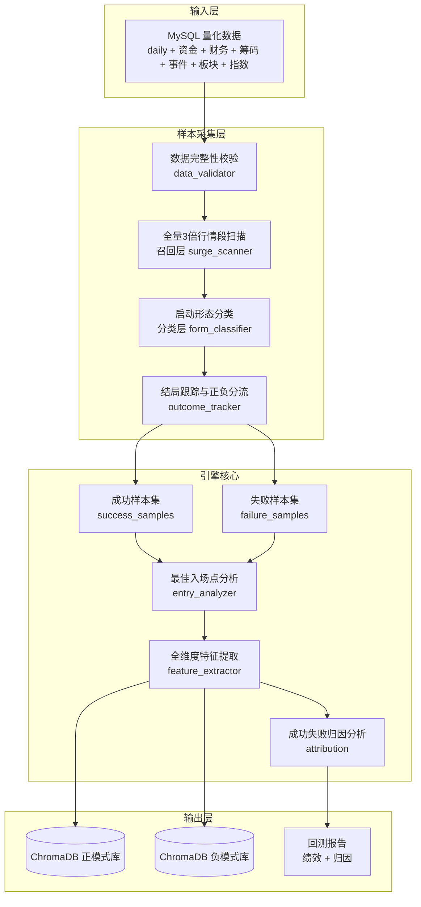
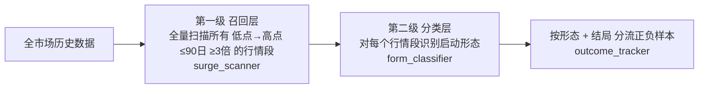
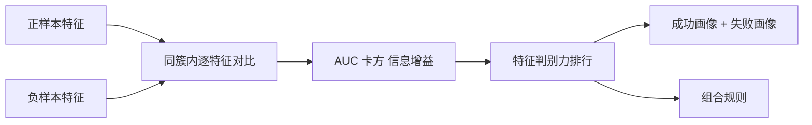
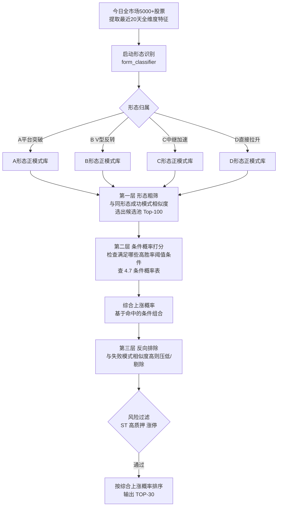

# 模块4：回测引擎 — 历史短线爆发模式挖掘（正负样本双轨 + 精准采集）

> **对应总规划**：[`00-总规划框架.md`](plans/00-总规划框架.md) → 模块4
> **数据来源**：[`01-数据模块-Tushare接口全览.md`](plans/01-数据模块-Tushare接口全览.md)、[`01b-MySQL建表方案.md`](plans/01b-MySQL建表方案.md)
> **模式库消费方**：[`02-ChromaDB模式库.md`](plans/02-ChromaDB模式库.md)
> **前端回测中心**：[`06-前端开发.md`](plans/06-前端开发.md)
> **版本**：v0.17（核心：回测新增条件概率统计 + 全特征归一化[所有维度分位/Z-score] + 每日推荐按综合上涨概率排序）

---

## 一、回测引擎定位

回测引擎**不是**通用的"验证交易策略收益"框架，而是服务于**历史短线爆发模式挖掘**的专用引擎，是全系统最核心的离线数据资产生产器。

> **回测的最终目的**：遍历 2010 年至今全 A 股历史数据 → **精准采集"成功爆发"与"启动失败"两类样本** → 提取入场前的共同特征（成功特征 + 失败特征）→ 构建正/负两个模式库 → 每日全市场扫描时"正向匹配加分 + 反向匹配排除"，最终输出更可靠的 TOP-30 推荐榜单。

### 为什么样本采集精准度是成败关键？

整个系统的预测质量**完全取决于模式库样本质量**：

```
样本不精准（混入噪音） → 特征无规律 → 归因失真 → 推荐命中率低
样本精准（纯净可比）   → 特征有区分度 → 归因可靠 → 推荐命中率高
```

**最常见的三个样本污染问题**：

| 问题             | 现象                                           | 后果                                       |
| ---------------- | ---------------------------------------------- | ------------------------------------------ |
| 把"反弹"当"爆发" | 一路下跌后超跌反弹 3 倍，被误当成功案例        | 正模式库混入噪音，推荐超跌股               |
| 正负样本不可比   | 负样本随便找"没涨的股票"，形态与正样本完全不同 | 归因结论错误（差异是形态差异而非成败差异） |
| 标签未来函数     | 用到了入场后才有的信息                         | 回测虚高，实盘失效                         |

本规划将**样本精准采集方法论**作为核心章节（第三章），用"全量召回 + 形态分类 + 同形态正负配对"从机制上解决上述问题。

### 回测产出物（下游消费方）

| 产出物                     | 消费方            | 说明                                  |
| -------------------------- | ----------------- | ------------------------------------- |
| 短线爆发**成功**行情段清单 | 入场点分析器      | 原始成功行情段（起点/终点/涨幅/耗时） |
| 启动**失败**行情段清单     | 失败样本构建器    | 同形态但未达 3 倍、随后回落的行情     |
| 最佳入场点 + 入场后结果    | 特征提取器        | 每个成功/失败行情段 1 个参考入场点    |
| 起爆前 **成功特征向量**    | ChromaDB 正模式库 | 每日正向匹配（加分推荐）              |
| 起爆前 **失败特征向量**    | ChromaDB 负模式库 | 每日反向匹配（排除/减分）             |
| 成功/失败**归因分析**      | 回测中心/个股详情 | "为什么成功/为什么失败"可解释结论     |
| 模式有效性统计             | 回测中心/历史复盘 | 命中率、准确率、盈亏比                |

### 回测与每日推荐的闭环（回测到底产出什么）

**回测引擎是"历史模式匹配预测"系统的训练 + 验证环节**。它不只是"产出模式库"，最终交付的是**一份可执行的"每日推荐效果验证结论"**：

```
[训练集 2010至近2年]
  → 模式挖掘：全量召回 → 形态分类 → 正负分流 → 特征提取
  → 产出 正/负模式库

[验证集 近2年至今]  ← 与训练集严格分离
  → 用模式库模拟"每日推荐"（每天选 TOP-30）
  → 统计模拟推荐的命中率 / 准确率 / 盈亏比
  → A/B 对比 + 统计显著性检验（见第五章）
  → 结论：这套方案相比基线到底提升多少、是否显著
  → 决策：Go（可上线） / No-Go（回退或调参）

[上线后]
  → 每日推荐实际运行
  → 月度监控：实际命中率 vs 回测命中率
  → 滚动再验证（模式失效检测）
```

**回测最终交付物清单（回测跑完，你实际拿到手的东西）**：

| 交付物           | 内容                                                  | 用途                             |
| ---------------- | ----------------------------------------------------- | -------------------------------- |
| ① 正/负模式库    | 起爆前特征向量集合（ChromaDB，几千条）                | 每日推荐匹配的模板               |
| ② 回测验证报告   | 模拟每日推荐的命中率/准确率/盈亏比 + A/B对比 + 显著性 | **回答"方案有没有用、提升多少"** |
| ③ 归因分析       | 成功画像 / 失败画像 / 判别力排行                      | 推荐解释、风险提示               |
| ④ 上线决策结论   | Go / No-Go + 参数建议                                 | 决定是否接入每日推荐             |
| ⑤ 模式有效性统计 | 按月有效性、失效模式清单                              | 持续监控与更新                   |

**回测验证报告长什么样（具体示例）**：

```json
{
  "date": "2026-08-07",
  "method": "Walk-Forward 滚动验证（月度重建）",
  "period": "2024-08 ~ 2026-07（样本外，未参与建模）",

  "samples": {
    "surge_segments": 45000, // 召回层全量3倍行情段
    "success": 1986, // 正样本
    "failure_A": 3120,
    "failure_B": 2110 // 负样本
  },

  "ab_test": {
    "对照组A（仅正向匹配）": {
      "top30_命中率": "41.2%",
      "top30_准确率": "18.5%",
      "平均T+5": "+2.1%"
    },
    "实验组B（+负模式库）": {
      "top30_命中率": "44.8%",
      "top30_准确率": "21.3%",
      "平均T+5": "+2.8%"
    },
    "实验组C（完整方案）": {
      "top30_命中率": "48.6%",
      "top30_准确率": "24.7%",
      "平均T+5": "+3.5%"
    },
    "C vs A 提升": {
      "命中率": "+7.4pct",
      "准确率": "+6.2pct",
      "显著性": "p=0.003<0.05 ✅"
    },
    "T+20延续率": { "A": "55%", "C": "63%", "结论": "延续性不劣化 ✅" }
  },

  "decision": "GO（可上线）",
  "params": { "排除强度λ": 0.5, "形态阈值": "默认" }
}
```

> **一句话说明**：回测跑完，你拿到手的核心是一张**对照表**——"完整方案 vs 基线方案"在最近两年的模拟每日推荐中，命中率/准确率提升了多少、是否统计显著。这张表决定系统上不上线。

### 回测与推荐对齐的三大核心风险（设计约束确认）

> 以下三个风险是回测引擎设计的**核心约束**，规划中的所有机制均围绕化解这三个风险而设计。实现时**必须**逐条满足，缺一不可。

| #   | 风险                                                                   | 后果                               | 规划中的化解机制（必须满足）                                                                        |
| --- | ---------------------------------------------------------------------- | ---------------------------------- | --------------------------------------------------------------------------------------------------- |
| 1   | **回测与推荐目标脱节**：回测产出"模式库"，但每日推荐要的是"今天的预测" | 验证的是模式库本身，不代表推荐效果 | ① 验证集**模拟每日推荐流程**（非只验证模式库，见第五章 Walk-Forward）② 上线决策门                   |
| 2   | **历史命中 ≠ 实盘命中**：回测用历史相似案例，实盘有未来不确定性        | 回测虚高，实盘失效                 | ① 样本外验证（近 2 年未参与建模）② 上线决策门 ③ 月度滚动再验证                                      |
| 3   | **口径不一致**：正样本以"整段 3 倍"定义，但每日推荐预测的是"短期上涨"  | 模式库优化方向偏差                 | ① 3.4.1 双层结构（建模用整段3倍、评估用多周期）② 样本记录 T+5/T+20 多周期结果 ③ T+5/T+20 双确认评估 |

> **验收标准**：回测引擎上线前，必须逐条对照上表确认三个风险均有对应机制落地，否则视为未完成。

### 回测数据时间范围

| 区间           | 用途                                        |
| -------------- | ------------------------------------------- |
| 2010 至近 2 年 | **训练集**：构建正/负模式库（候选模式采样） |
| 近 2 年至今    | **验证集**：交叉验证模式匹配准确率、命中率  |

> 数据覆盖 **2010 年至今**（滚动更新）；训练集/验证集采用滚动切分，随新数据入库自动推进。

---

## 二、总体架构（正负双轨 + 精准采集）



### 代码目录规划

```
backend/app/backtest/
├── __init__.py
├── data_validator.py     # 数据完整性校验（采集前必须通过）
├── surge_scanner.py      # 全量3倍行情段扫描（召回层，保证不漏）
├── form_classifier.py    # 启动形态分类（分类层，按形态建模）
├── outcome_tracker.py    # 结局跟踪与正负分流
├── pattern_miner.py      # 成功样本集构建（基于形态分类）
├── failure_miner.py      # 失败样本集构建（同形态失败）
├── entry_analyzer.py     # 最佳入场点分析（正负通用）
├── feature_extractor.py  # 全维度特征提取（60+ 维，正负共用）
├── attribution.py        # 成功/失败归因分析（判别力评估）
├── threshold_analyzer.py # 条件概率统计（全表全字段阈值→上涨概率）⭐新增
├── validator.py          # 模式有效性交叉验证
├── metrics.py            # 绩效指标计算
├── loader.py             # 数据加载/预处理（复权/停牌/涨停过滤）
└── runner.py             # 回测任务编排与持久化
```

---

## 三、样本精准采集方法论（核心）⭐

> 本章是回测引擎的**核心**。样本采集不精准，后续所有分析都失去意义。

### 3.0 核心权衡：精准度 vs 召回率

**必须同时避免两个极端**：

```
极端1【只求精准，牺牲召回】：
  只用"平台突破"识别启动点 → 会漏掉 V型反转、中继加速、直接拉升、
  连板等大量真实 3 倍爆发 → 模式库不全，每日推荐覆盖面窄 ❌

极端2【只求召回，牺牲精准】：
  粗暴用"低点→高点涨幅≥3倍"扫描 → 混入超跌反弹、仙股、一字板等
  大量噪音 → 模式库被污染，推荐命中率低 ❌
```

**正确方案（本规划）**：**两级流水线——全量召回 + 形态分类**。



> **核心原则**：召回层**宁可多抓、不可漏抓**（保证不漏任何 3 倍爆发），分类层负责**区分形态、剔除噪音、正负配对**（保证精准）。两级职责分离，同时满足召回率与精准度。

### 3.1 第一级：全量扫描（召回层，surge_scanner.py）——保证不漏

**目标**：把 2010 年至今所有"≤90 个交易日涨幅 ≥3 倍"的行情段**全部找出来**，不遗漏任何形态。

**关键口径：涨幅从"启动点 T0"算起，而不是从任意低点算起**（统一所有形态的衡量基准，避免中继加速型用"绝对低点"导致涨幅虚高/失真，见 3.2 判定优先级）。

**算法（宽松扫描，召回优先）**：

```
输入：某股票 daily 全量 OHLCV（前复权价）
输出：所有候选行情段 [局部低点, 启动点 T0, 高点, 涨幅, 耗时]

Step1 全量滑动窗口扫描（不预设形态）：
  - 遍历所有交易日，识别"有效局部低点"：
     低点日收盘价需低于其前后各 3 日（排除单日脉冲低点）
  - 从每个局部低点向后 90 个交易日内寻找最高点
  - 若 高点/低点 - 1 ≥ 2.5 → 记录为候选（预标记阈值，宁多勿漏）

Step2 预标记阈值说明（2.5 vs 3.0）：
  - 候选阈值 2.5：保证"真实 3 倍"行情因复权/除权/数据误差落在
    [2.5, 3.0) 边缘时不漏网
  - 最终"正样本"判定仍用严格 ≥3 倍（在 3.3 分流阶段执行）
  - [2.5, 3.0) 的候选：进入第二级形态分类后，若最终涨幅不足 3 倍
    → 不成为正样本，可转为"接近成功"的失败样本或直接丢弃

Step3 去重叠：
  - 同一股票相邻/重叠行情段合并或保留最强一段
  - 同一股票可产生多段历史爆发行情

Step4 合法性预过滤（只过滤"绝对无法交易"的）：
  - 剔除退市整理 / ST
  - 剔除上市 < 60 个交易日（次新一字板干扰）
  - 剔除 90 日内停牌累计 > 50% 的极端样本（数据不可靠）

Step5 输出全部候选行情段，供第二级分类
```

**为什么这步不筛形态**：因为 3 倍爆发的启动方式多种多样——平台突破、V 型反转、中继加速、直接拉升、连板等。**任何形态都有机会成为正样本**，召回层必须全部保留，由第二级负责区分。

### 3.2 第二级：启动形态分类（分类层，form_classifier.py）——保证精准

**目标**：对召回层产出的每个 3 倍行情段，识别其"启动形态"，并为每类形态分别构建正/负模式库。

**启动形态分类体系**（平台突破只是其中一种，不是唯一入口）：

| 形态类型     | 定义                              | 是否纳入正模式库                  |
| ------------ | --------------------------------- | --------------------------------- |
| E 连板型     | 连续涨停/一字板启动（含次新）     | ⚠️ 单独处理（难买入，可交易性低） |
| C 中继加速型 | 第一波上涨后平台整理，再次加速    | ✅                                |
| B V 型反转型 | 快速下跌后 V 型反转拉升（无平台） | ✅                                |
| A 平台突破型 | 底部横盘 20~60 日后放量突破启动   | ✅ 核心形态                       |
| D 直接拉升型 | 无明显平台/下跌/前涨，直接拉升    | ✅（兜底形态）                    |

**形态识别算法（按优先级判定，先判最特殊形态）**：

```
输入：候选行情段（含局部低点/启动点 T0/高点/走势）
输出：形态标签（E/C/B/A/D）

Step1 统一涨幅口径：
  - 涨幅一律从"启动点 T0"算起：最高价/T0价格 - 1
  - T0 = 该行情段主升浪的实际起涨点（平台突破点 / 反转点 / 加速点）

Step2 按优先级判定（先判最特殊、最易识别的形态）：

  ① 若 行情段内涨停/一字板占比高（如 >50% 交易日触及涨停）
      且 一字板次数多                                   → 形态E 连板

  ② 若 低点前已有第一波上涨（涨幅>50%）：
      且 上涨后存在平台整理（10~30 日横盘）后再加速      → 形态C 中继加速
      （关键：区别于 A——C 的启动点之前已有明显上涨段）

  ③ 若 低点前 20 日处于快速下跌（跌幅>25%）
      且 低点后放量 V 型反转（无平台）                  → 形态B V型反转
      （关键：区别于 D——B 的启动点之前有明显快速下跌）

  ④ 若 低点前存在 20~60 日横盘平台（波动<25%）
      且 低点后放量突破平台高点                         → 形态A 平台突破
      （关键：区别于 C——A 的启动点之前是底部横盘，无前期上涨）

  ⑤ 以上都不满足：
      且 低点后 10 日内涨幅>30%（连续放量大阳）          → 形态D 直接拉升

  若仍有歧义 → 取"启动点之前结构特征最接近"的形态，并降低置信度

Step3 每类形态独立管理：
  - 每类形态分别构建 正样本集 + 负样本集
  - 形态E（连板）单独标注"难买入"，不进普通每日推荐
```

**边界判定要点（防止 A/C、B/D 混淆）**：

| 易混对                   | 判定关键差异                                                                     |
| ------------------------ | -------------------------------------------------------------------------------- |
| A 平台突破 vs C 中继加速 | A：启动点前是**底部横盘**（无前期上涨）；C：启动点前**已有 >50% 上涨**后平台整理 |
| B V 反转 vs D 直接拉升   | B：启动点前**20 日快速下跌 >25%**；D：启动点前**无明显下跌**                     |
| D 直接拉升 vs 其他       | D 是兜底形态：无平台、无下跌、无前涨，纯放量大阳拉升                             |

### 3.3 正负分流（outcome_tracker.py）——按形态 + 结局

**核心原则**：**负样本必须与正样本"同形态"**——V 型反转的负样本只能是"V 型反转后失败"的样本，不能拿平台突破的失败样本混入。这样才能归因"同样形态下为何成败不同"。

```
输入：形态分类后的行情段 + 同形态的候选启动点
输出：样本标签（success / failure_A / failure_B / discard）

Step1 从启动点 T0 起，跟踪未来 90 个交易日（涨幅统一从 T0 启动价算起）：
  - 记录：最高价、最高涨幅、T+5/T+20 涨幅、最大回落幅度
  - 期间若停牌累计 > 20% 交易日 → 标记数据不完整，丢弃

Step2 分流规则（在同一形态内部进行，正样本严格 3 倍）：
  success   ：T0 后 90 日内 最高价/启动价 - 1 ≥ 3 倍
  near_success：最高涨幅在 [2.5, 3.0) 区间（召回层预标记边缘段）
               → 不成为正样本；若之后回落 >30% 则转为 failure_A
               （保证 [2.5,3.0) 边缘段不污染正样本库，同时不浪费）
  failure_A ：最高涨幅在 [50%, 150%) 区间，且从最高点回落 > 30%
               （半途而废：有攻击性但最终失败）
  failure_B ：启动后 20 个交易日涨幅 < 20%
               （伪启动：形似而无力，滞涨）
  discard   ：其余走势（保持样本纯净）

Step3 排除重叠：
  - 同一股票同一时段内，一个启动点只保留一个标签
  - 成功段与失败段不重叠
```

**负样本采集方式**：对每类形态，在同一形态的候选启动点中，按结局分流。若某形态失败样本不足，可在该形态内放宽采样或标注"样本不足，该形态单独统计"。

### 3.4.1 样本标签 vs 评估口径（双层结构，关键设计）

> **目标错位风险**：样本的"正负标签"（基于整段 3 倍）与每日推荐的"评估口径"（T+5 短线）**不是一回事**。必须显式区分，否则会出现"建模目标是 3 倍爆发、但评估却看 5 日涨幅"的口径错位。

```
问题举例：
  股票 X：整段 90 日涨 3 倍（建模正样本）✅
          但 T+5 只涨 1%（评估视角，不算短线成功）❌
  股票 Y：T+5 涨 8%（评估视角短线成功）✅
          但整段只涨 1.5 倍（达不到 3 倍，建模负样本）❌
```

**双层结构设计（本规划采用）**：

| 层级                        | 用途                       | 口径                                     |
| --------------------------- | -------------------------- | ---------------------------------------- |
| **建模标签**（label）       | 构建正/负模式库、归因分析  | 整段 3 倍（success/failure_A/failure_B） |
| **评估口径**（outcome\_\*） | 每日推荐效果验证、上线决策 | T+5 为主、T+20 为辅（多周期记录）        |

**处理方式**：

```
1. 建模阶段：用"整段 3 倍"定义正负样本（保证模式库聚焦真正的爆发股）
2. 评估阶段：用多周期结果（T+1/T+5/T+20/T+90）衡量每日推荐的真实表现
3. 关键：一个"3 倍爆发"正样本，其 T+5 结果可能一般——
   这正是需要"反向排除"和"入场点分析"的原因：
   - 推荐时优先匹配"入场后 T+5 表现好"的正样本（而不是整段好但 T+5 弱）
   - 归因分析分别做：整段成败归因 + T+5 短线成败归因
4. 每日推荐评分应同时考虑：
   - 与历史 3 倍爆发模式相似（长期潜力）
   - 与历史"入场后 T+5 表现好"的样本相似（短线胜率）
```

**结论**：建模标签与评估口径**分开记录、分开使用**——建库用整段 3 倍（聚焦），验证用多周期（真实），二者通过"多周期结果字段"打通，避免目标错位。

### 3.5 正负样本"同形态配对"确保可比性

> 在第二级形态分类（3.2）的基础上，**负样本必须与正样本同形态**，且进一步按"起爆前 20 天形态"精细聚类，保证归因可靠。

```
所有成功/失败样本 → 先按启动形态分组（A/B/C/D），再按"起爆前20天形态"聚类（KMeans，K=15~25 簇）
  → 每个形态簇内同时统计：
      成功样本数 / 失败样本数

  → 归因分析只对"同簇内成功 vs 失败"做对比
     （同形态前提下对比成败差异 → 才是真正的成败归因）

  → 若某簇只有成功或只有失败（样本不足）：
      说明该形态"注定成败"——本身是重要发现，
      但不进入归因对比，单独标注为"确定性形态"
```

**同形态配对的意义**：如果没有这一步，直接对比全体正负样本，会发现大量差异其实是"形态本身不同"造成的（例如平台突破型成功样本放量多、V 型反转型失败样本缩量多，这只是形态差异，不是成败差异）。只有同形态、同簇对比才能回答真正的业务问题：**"同样是平台突破，为什么这只成了、那只败了？"**

### 3.6 多级质量过滤（保证样本纯净）

| 过滤项       | 规则                                                | 目的             |
| ------------ | --------------------------------------------------- | ---------------- |
| 流动性       | 启动点前 60 日日均成交额 > 5000 万                  | 剔除僵尸股       |
| 特殊处理     | 剔除 ST / 退市整理 / 上市 < 60 日                   | 剔除异常标的     |
| 复权校验     | 前复权价单日涨跌幅异常（>30%）标记校验              | 保证涨幅真实     |
| 长期停牌复牌 | 启动点前长期停牌（>30 日）后复牌的样本单独标注/剔除 | 避免重组复牌噪音 |
| 停牌过滤     | 启动后 90 日内停牌累计 > 20% 交易日则丢弃           | 保证可交易性     |
| 数据完整     | 特征窗口与结局窗口数据完整，无截断                  | 避免标签误判     |
| 财务校验     | 财务字段异常值（ROE/毛利率超合理范围）标记校验      | 保证财务特征可靠 |
| 未来函数     | 特征只用 T0 前数据，结局只用 T0 后数据              | 铁律             |
| 形态置信     | 形态分类置信度过低（无法明确归类）的样本丢弃        | 保证形态标签可靠 |

### 3.7 时间对齐与未来函数控制

```
样本时间线：
  [启动前结构（平台/下跌/前涨）] → [T0 启动点] → [结局窗口 T0 ~ T0+90]

特征窗口：T0-20 ~ T0-1（起爆前 20 天）+ 启动前结构特征
结局窗口：T0 ~ T0+90（完全在特征之后）
训练/验证：2010至近2年（训练） vs 近2年至今（验证），严格分离
公告类特征：用 ann_date（公告日）而非 end_date（报告期）
```

### 3.8 样本量预估与平衡策略

```
全量 3 倍行情段规模预估（召回层口径，全市场约 5000 只 × 2010 至今约 16 年）：
  全市场历年 3 倍爆发行情段累计约 3 万~6 万个（含所有形态，宽松扫描）

形态分布预估（第二级分类）：
  平台突破型    ：约 35%
  V 型反转型    ：约 15%
  中继加速型    ：约 20%
  直接拉升型    ：约 20%
  连板型        ：约 10%（单独管理，难买入）

结局分流后：
  正样本（3倍爆发，全部保留） ：约 3万~6万个
  负样本（同形态失败）        ：每形态按 1:2 ~ 1:3 采样 → 数万个

平衡策略：
  正负样本按形态分别采样 1:2 ~ 1:3（避免负样本淹没正信号）
  按市场环境分层抽样（牛市/熊市/震荡市都保留样本）
  按行业/市值分层抽样（避免样本偏斜于少数板块）
  每类形态独立平衡，保证各形态样本量充足
```

### 3.9 数据完整性校验（采集前必须通过，data_validator.py）

```
回测启动前，强制校验：
  daily / adj_factor / suspend_d / stk_limit 是否覆盖 2010 至今
  各表行数、日期范围、缺失率统计
  stock_basic 股票池完整性
  校验不过 → 提示先补数据，不启动回测（防止用残缺数据产出劣质样本）
```

### 3.10 样本噪音全景图（如何避免"混入噪音"）⭐核心总结

> 用户核心关切："样本不精准（混入噪音）→ 特征无规律 → 归因失真 → 推荐命中率低"。
> 本节把**所有可能混入的噪音**系统分类，并逐一对应规避机制。**实现时须逐条落实**。

**噪音分类与规避一览表**：

| 类别     | 具体噪音                             | 危害                                             | 规避机制（章节）                                                                                                                                     |
| -------- | ------------------------------------ | ------------------------------------------------ | ---------------------------------------------------------------------------------------------------------------------------------------------------- |
| ① 行情段 | 超跌反弹被当"爆发"                   | 正模式库混入下跌反抽，推荐超跌股                 | 平台突破模型 + 有效局部低点识别（3.1）                                                                                                               |
| ② 行情段 | 一字板/连板（买不进）                | 样本不可交易，推荐失真                           | 形态 E 单独管理 + 涨停过滤（3.2/3.6）                                                                                                                |
| ③ 行情段 | 仙股/流动性极差                      | 特征无统计意义                                   | 流动性过滤：日均成交额 >5000 万（3.6）                                                                                                               |
| ④ 行情段 | 高位震荡"假突破"                     | 形态误判、噪音样本                               | 形态分类置信度阈值（3.2/3.6）                                                                                                                        |
| ⑤ 行情段 | 新股一字板干扰                       | 涨幅虚高、不可交易                               | 上市 <60 日剔除（3.1）                                                                                                                               |
| ⑥ 行情段 | **长期停牌后复牌跳空暴涨**           | 重组/借壳复牌一字板，非可交易爆发，失真          | 长期停牌（>30 日）后复牌的样本单独标注/剔除（3.1/3.6）                                                                                               |
| ⑦ 行情段 | **ST/风险警示股投机炒作**            | 摘帽/保壳炒作连板，与"3倍爆发"模式不同源         | 剔除 ST / 退市整理（3.1/3.6）                                                                                                                        |
| ⑧ 数据   | 复权错误/除权跳空                    | 涨幅虚高失真                                     | 前复权 + 单日涨跌幅异常校验（3.6）                                                                                                                   |
| ⑨ 数据   | 停牌过多                             | 特征/结局不完整                                  | 停牌累计 >20% 交易日丢弃（3.3/3.6）                                                                                                                  |
| ⑩ 数据   | 数据缺失/截断                        | 标签误判                                         | 数据完整性校验（3.6/3.9）                                                                                                                            |
| ⑪ 数据   | **财务数据异常/造假**                | 财务特征（ROE/毛利）不可靠，归因失真             | 统计异常检测：历史分位数异常（>99.5% 分位）+ 跨期突变检测（ROE 较上期突变超 50pct）+ 已知造假/立案名单剔除（3.6）                                    |
| ⑫ 标签   | 未来函数                             | 回测虚高、实盘失效                               | 特征窗口/结局窗口严格分离（3.7）                                                                                                                     |
| ⑬ 标签   | 结局不完整（截断）                   | 成败标签误判                                     | 结局窗口完整性校验（3.6）                                                                                                                            |
| ⑭ 标签   | 模棱两可样本                         | 正负边界模糊                                     | near_success 单独处理（3.3）                                                                                                                         |
| ⑮ 可比性 | 正负形态不可比                       | 归因失真                                         | 同形态配对聚类（3.5）                                                                                                                                |
| ⑯ 幸存者 | 退市股历史缺失                       | 高估成功率                                       | stock_basic 保留退市股，用上市期历史数据（3.1/3.9）                                                                                                  |
| ⑰ 独立性 | **系统性行情样本相关（牛/熊/震荡）** | 全市场同时暴涨→样本高度相关，放大单一模式        | 按市场环境分层抽样 + 同交易日去重（样本层与验证层都执行，见 5.2 Step4）+ **训练/验证时间边界不重叠（特征窗口不跨边界，防信息泄漏）**                 |
| ⑱ 独立性 | **板块联动/题材集体炒作**            | 同板块集体拉升→样本趋同，归因失真                | 按行业/板块分层抽样 + 板块内限流（3.8）                                                                                                              |
| ⑲ 可交易 | **涨跌停无法成交**                   | 推荐次日一字涨停买不进、跌停卖不出，实盘收益虚高 | 封板判定公式 `close >= up_limit×0.997`（触及即视为封死，无法成交）+ 明确收盘价成交假设：入场日收盘封板不可买入、平仓日收盘封板不可卖出（3.6/第五章） |

**噪音规避三道闸门（按流程顺序，与噪音类别对应）**：

```
闸门1【数据层】数据完整性校验（3.9）
  → 拦截：⑧复权错误 ⑩数据缺失 ⑪财务异常 ⑯幸存者偏差
闸门2【样本层】召回+分类+分流+质量过滤（3.1~3.6）
  → 拦截：①超跌反弹 ②一字板 ③仙股 ④假突破 ⑤新股 ⑥长期停牌复牌
           ⑦ST炒作 ⑨停牌过多 ⑫未来函数 ⑬结局不完整 ⑭模棱两可
           ⑮正负不可比 ⑰系统性相关 ⑱板块联动 ⑲涨跌停不可成交
闸门3【验证层】样本外 A/B 验证（第五章）
  → 兜底：即使上述有漏网，验证集命中率异常即暴露；
          同时验证层也执行"同交易日去重"与"涨跌停可交易性过滤"
```

> **兜底原则**：即使做了全部规避，仍可能有未预见的噪音。因此**必须以第五章样本外验证为准**——若验证集命中率异常（如远低于随机），说明仍有噪音或模式无效，需回查样本。

---

## 四、核心算法流程（基于精准样本）

### 4.1 成功样本集构建（pattern_miner.py）

基于第三章产出的 `success` 标签样本，补充入场点分析所需信息。

```
输入：success 样本（启动点 T0 + 结局数据）
输出：成功行情段记录

Step1 从 T0 启动价开始，定位主升段（按形态记录启动基准价）
Step2 记录：启动日、启动价、最高价日、最高涨幅、耗时、回落幅度、形态类型
Step3 关联行业/市值/板块（stock_basic / concept_detail）
```

### 4.2 失败样本集构建（failure_miner.py）

基于第三章产出的 `failure_A / failure_B` 标签样本，补充失败特征。

```
输入：failure 样本
输出：失败行情段记录（含失败类型标签 A/B）

Step1 记录失败关键节点（按形态记录启动基准价）：
  - failure_A：启动价、最高涨幅、最高价日、回落触发日、回落幅度
  - failure_B：启动价、滞涨确认日、20日涨幅
Step2 关联行业/市值/板块 + 形态类型
Step3 与成功样本集合并，进入"同形态配对"聚类（见 3.5）
```

### 4.3 最佳入场点分析（entry_analyzer.py）

对每段成功/失败行情，从启动点到高点之间模拟多个"潜在入场点"，统计每个位置的性价比。

**入场点候选（典型 5-7 个关键位置）**：

```mermaid
graph TD
    subgraph 一只短线爆发股从10元到40元（耗时85天）
        A[突破 10] --> B[启动第一波<br/>价格 12 第30天]
        B --> C[第一次回调<br/>价格 13 第45天]
        C --> D[主升浪开始<br/>价格 18 第55天]
        D --> E[加速拉升<br/>价格 28 第70天]
        E --> F[高潮见顶<br/>价格 40 第85天]
    end
```

**分析指标**：

| 指标     | 计算方式                    | 含义                 |
| -------- | --------------------------- | -------------------- |
| 后续涨幅 | 入场价到顶部最高价          | 最多能赚多少         |
| 上涨概率 | 入场后 T+5 日涨幅>5% 的概率 | 买入后短期胜率       |
| 最大回撤 | 入场后曾出现的最大浮亏      | 买入后要承受多少波动 |
| 盈亏比   | 平均盈利/平均亏损           | 赚亏比例             |
| 最优目标 | `argmax(上涨概率 × 盈亏比)` | 性价比最高的入场点   |

> 对**失败样本**同样分析入场点：重点看"如果在某个位置入场，失败概率有多大、回撤有多深"，为负模式库提供"危险信号"样本。

### 4.4 全维度特征提取（feature_extractor.py）

提取启动日**前 20 个交易日**的多维特征，**正样本与负样本共用同一套特征体系**（只有用同一套特征，才能做"正负对比归因"）。

> ⚠️ **重要设计决策**：价格曲线必须归一化，不能存绝对价格！否则 20 块的股票和 5 块的股票形态完全相同但因价格量级不同无法匹配。采用方案：**百分比变化序列**（每日涨跌幅），纯形态匹配。

**特征向量组成（8 大维度，60+ 维）**：

| 维度        | 来源表                                                   | 特征内容                                                | 维数 |
| ----------- | -------------------------------------------------------- | ------------------------------------------------------- | ---- |
| 📈 价格图形 | `daily`                                                  | 启动前 20 日每日涨跌幅%（归一化，价格无关）             | 20   |
| 📊 技术面   | `daily` + 衍生                                           | MA5/10/20/60 位置斜率、MACD、RSI、KDJ、布林带、ATR、ADX | 12   |
| 📉 量能面   | `daily` / `daily_basic`                                  | 量比、均量变化率、放量天数、换手率                      | 5    |
| 💰 资金面   | `moneyflow` / `block_trade` / `limit_list`               | 主力净流入率、大单占比、大宗折溢价、龙虎榜净买入        | 6    |
| 📋 基本面   | `fina_indicator` / `daily_basic`                         | ROE、毛利率、利润增速、PE/PB 分位                       | 5    |
| 👥 筹码面   | `stk_holdernumber` / `top10_holders` / `stk_holdertrade` | 股东户数变化、筹码集中度、大股东增减持                  | 4    |
| 🎯 事件面   | `forecast` / `dividend` / `repurchase` / `stk_rewards`   | 业绩预告类型、分红、回购、股权激励信号                  | 4    |
| 🌍 市场环境 | `index_daily` / `concept_detail` / `ths_member`          | 大盘状态、板块热度、所属题材活跃度                      | 5    |

#### 4.4.1 全特征归一化（不只是价格！所有维度都要归一化）⭐用户强调

> **用户核心观点**："其它的也得归一化呀，向量库的特征不仅仅是价格吧"——完全正确。
> 向量库 60+ 维特征由 8 大维度组成，**不只是价格曲线需要归一化，所有特征都必须归一化**，否则不同量纲的特征直接拼接算余弦相似度时，数值大的维度会主导、数值小的被淹没，跨股票也无法比较。

**为什么必须全特征归一化**：

```
如果只归一化价格，其他特征不归一化：
  换手率（0~20%）、PE（0~100）、量比（0~10）、成交额（亿级）、ROE（0~40%）
  → 成交额等大数值特征在余弦相似度中占绝对主导
  → 换手率、ROE 等小数值特征被淹没，等于没参与匹配
  → 向量库失去"多维度对比"的意义
```

**各维度归一化方案**：

| 维度        | 特征示例            | 归一化方式                                         | 目的       |
| ----------- | ------------------- | -------------------------------------------------- | ---------- |
| 📈 价格图形 | 20日涨跌幅%         | 已是百分比（价格无关）✅                           | 跨价格匹配 |
| 📊 技术面   | RSI/KDJ/MACD/均线   | RSI/KDJ 天然 0~100；MACD 用 Z-score；均线用乖离率% | 跨股票可比 |
| 📉 量能面   | 量比/换手率         | 量比已相对均量；换手率用分位（相对全市场）         | 跨市值可比 |
| 💰 资金面   | 净流入率/大单占比   | 已是比率；绝对金额转"占成交额比例"                 | 跨市值可比 |
| 📋 基本面   | ROE/毛利率/PE       | 已是比率；PE/PB 用**分位**（相对全市场）           | 跨行业可比 |
| 👥 筹码面   | 股东户数变化/集中度 | 变化率%；集中度用分位                              | 跨股票可比 |
| 🎯 事件面   | 业绩预告/回购/激励  | 0/1 编码（已是类别）✅                             | 标准化     |
| 🌍 市场环境 | 板块热度/大盘状态   | 用**分位**（相对全市场/历史）                      | 跨时期可比 |

**统一归一化原则**：

```
1. 比率类特征（涨跌幅、换手率、净流入率、ROE、毛利率）
   → 已是价格/规模无关，直接使用 ✅

2. 绝对数值特征（成交额、市值、持仓量）
   → 转为"占比"或"分位"（相对全市场/相对自身历史）
   → 例：成交额 → 当日全市场成交额百分位

3. 有界指标（RSI、KDJ 天然 0~100）
   → 直接使用 ✅

4. 无界指标（MACD、均线斜率）
   → Z-score 标准化（减均值除标准差）或用分位

5. 最终拼接前：
   → 所有维度统一做一次 Z-score 或 Min-Max 归一化
   → 确保每个特征对余弦相似度的贡献均衡
```

**实现要点（feature_extractor.py）**：

```
特征提取时对每个字段记录归一化方式（type: ratio/percentile/zscore/category）
  存入特征 schema，保证回测与每日推荐用同一套归一化参数
```

> **结论**：向量库的特征向量**全部维度**都要归一化——价格用百分比、绝对数值用分位、无界指标用 Z-score、类别用 0/1。只有全特征归一化，60+ 维才能在余弦相似度中公平参与，20 元股票与 5 元股票、大盘股与小盘股才能真正可比。

**单条样本结构（正负统一）**：

```python
行情样本 = {
    # ===== 核心：启动前20天的价格图形走势（归一化）=====
    "价格曲线_pct": [0.0, -2.0, -3.1, 1.1, 2.1, 4.1, ...],  # 20维
    "成交量曲线": [-15.0, -10.0, 5.0, 20.0, ...],          # 量能形态
    "波动率_atr": 2.5,

    # ===== 技术/量能 =====
    "均线排列": "MA5上穿MA20",
    "macd": "金叉", "rsi_14": 58.0, "量比": 1.8,
    "换手率": 3.2,

    # ===== 资金面 =====
    "主力净流入率": 12.5, "大单占比": 8.1,
    "龙虎榜净买入": 2350, "大宗折价率": -3.2,

    # ===== 基本面/筹码/事件 =====
    "roe": 16.5, "pe_分位": 42.0,
    "股东户数变化": -8.5, "大股东动向": "增持",
    "业绩预告": "预增", "是否回购": 1, "是否激励": 0,

    # ===== 市场环境 =====
    "大盘状态": "震荡市", "板块热度分位": 70.0,
    "题材活跃度": "高",

    # ===== 多周期标签（关键：与评估口径对齐）=====
    # 正/负样本标签（用于建模，基于整段3倍定义，见 3.3）
    "label": "success" | "failure_A" | "failure_B",

    # 多周期实际结果（用于每日推荐评估，T+5 为主评估口径）
    "outcome_t1": 1.2,                    # 入场后 T+1 涨幅
    "outcome_t5": 15.2,                   # 入场后 T+5 涨幅（主评估口径）
    "outcome_t20": 45.0,                  # 入场后 T+20 涨幅
    "outcome_t90": 210.0,                 # 入场后 T+90 涨幅
    "outcome_peak_gain": 310.0,           # 整段最大涨幅（3倍目标）
    "outcome_max_drawdown": -5.2,         # 入场后最大回撤

    # ===== 元信息 =====
    "ts_code": "300750.SZ", "stock_name": "宁德时代",
    "entry_date": "2020-05-15", "industry": "新能源",
    "market_env": "震荡市",
    "cluster_id": 3,                      # 同形态配对聚类编号（3.5）
    "form_type": "A",                     # 启动形态类型（A平台突破/B V反/C中继/D直接拉升/E连板）
}
```

**特征来源表映射（全维度，覆盖全部可用数据）**：

| 特征类别       | 数据表                                                                          | 说明                           |
| -------------- | ------------------------------------------------------------------------------- | ------------------------------ |
| 价格/技术/量能 | `daily`                                                                         | OHLCV + TA-Lib 衍生指标        |
| 量比/换手/估值 | `daily_basic`                                                                   | 换手率、量比、PE/PB/PS、市值   |
| 资金面         | `moneyflow` / `block_trade` / `limit_list`                                      | 主力资金、大宗、龙虎榜         |
| 财务面         | `fina_indicator` / `income` / `balancesheet` / `cashflow` / `fina_mainbz`       | ROE、毛利、现金流、主营结构    |
| 业绩事件       | `forecast` / `express`                                                          | 业绩预告/快报类型              |
| 筹码面         | `stk_holdernumber` / `top10_holders` / `top10_floatholders` / `stk_holdertrade` | 户数、集中度、增减持           |
| 公司事件       | `repurchase` / `stk_rewards` / `dividend` / `namechange` / `new_share`          | 回购、激励、分红、更名、次新   |
| 板块题材       | `concept_detail` / `ths_member` / `ths_daily`                                   | 板块归属、题材热度             |
| 市场环境       | `index_daily` / `index_dailybasic` / `margin`                                   | 大盘点位、大盘估值、两融情绪   |
| 公司基本面     | `stock_company` / `stock_basic`                                                 | 行业、地区、市值规模、上市时长 |

### 4.5 成功/失败归因分析（attribution.py）

**目的**：回答"为什么有些股票起爆成功、有些失败"，找出**判别力最强的特征**，并形成可解释结论。

**判别力评估方法（必须在同源簇内对比，见 3.5）**：

```
对每个形态簇内、每个特征维度 f：
  统计 该簇成功样本分布 vs 失败样本分布

  连续特征 → 用 AUC（ROC 曲线下面积）衡量判别力
             AUC > 0.6  有判别力
             AUC > 0.7  判别力强
             AUC ≈ 0.5  无判别力（正负无差异）

  离散特征 → 用信息增益 / 卡方检验衡量
             高卡方值 = 该特征与成败强相关

  跨簇汇总：加权平均得到全库判别力，同时保留"簇内判别力"（可发现环境相关规律）

输出：特征判别力排行榜（Top-N 决定成败的关键特征）
```

**归因分析产出**：

| 产出       | 内容                                                                       |
| ---------- | -------------------------------------------------------------------------- |
| 成功画像   | 成功样本中显著偏高的特征组合（如：主力净流入率高 + 筹码集中 + 板块热度高） |
| 失败画像   | 失败样本中显著偏高的特征组合（如：无量拉升 + 大股东减持 + 业绩预减）       |
| 关键特征榜 | 判别力 Top-N 特征及其正负分布区间                                          |
| 组合规则   | 成功高概率组合 / 失败高概率组合（供每日推荐使用）                          |



### 4.6 模式有效性验证（validator.py）

用近 2 年至今的数据，验证 2010 年至近 2 年构建的模式库，防止过拟合。

**验证维度**：

| 指标       | 定义                                   |
| ---------- | -------------------------------------- |
| 命中率     | 匹配相似模式后，实际出现上涨的比例     |
| 准确率     | T+5 上涨幅度达到预期（>5%）的比例      |
| 排除有效度 | 负模式库成功排除"伪起爆"的比例（新增） |
| 平均收益   | 匹配后的平均 T+5 收益                  |
| 盈亏比     | 平均盈利 / 平均亏损                    |
| 分位数收益 | T+5 收益的 P25/P50/P75，看分布         |

**验证流程**：

```
Step1 取验证集（近 2 年至今）每只股票每日"当前20天特征"
Step2 到正模式库检索 Top-20 相似成功模式
Step3 到负模式库检索 Top-20 相似失败模式
Step4 对比：仅正向推荐 vs 正负双向推荐，验证排除机制带来的准确率提升
Step5 汇总准确率/命中率/盈亏比/排除有效度 → 输出回测报告
```

**防过拟合机制**：

- 模式库**按时间加权**：近期案例权重更高（市场风格变化适应）
- **滚动回测验证**：按月/季度滚动，持续跟踪模式有效性
- **按月更新**模式有效性统计，失效模式自动降权/剔除
- 正负样本**比例平衡**：采样控制，避免负样本过多淹没正信号

### 4.7 条件概率统计（threshold_analyzer.py）⭐用户核心需求

> **用户核心需求**：回测不只要"形态像不像"，更要统计"**当股票达到某些阈值条件时，后续上涨概率有多大**"。形态向量库只做粗筛，真正决定推荐的是"满足哪些高胜率条件"。

**目标**：从精准样本库中统计出**特征阈值 → 上涨概率**的条件概率表，供每日推荐按条件组合打分。

#### 4.7.0 统计范围：覆盖全部数据表、个股所有相关信息 ⭐用户强调

> **用户要求**：条件概率统计不能只统计几个示例特征，而要**遍历全部数据表的全部数值/分类字段**，个股相关的所有信息都要纳入统计。

**统计字段来源（覆盖 MySQL 全部业务表）**：

| 数据表                                    | 纳入统计的字段示例                               |
| ----------------------------------------- | ------------------------------------------------ |
| `daily`                                   | 涨跌幅、振幅、量比、换手率、均线乖离等（技术面） |
| `daily_basic`                             | PE/PB/PS、总市值、流通市值、换手率、量比         |
| `moneyflow`                               | 主力净流入率、大单/中单/小单占比、净流入额       |
| `stk_limit`                               | 涨停/跌停距离（距涨停价空间）                    |
| `suspend_d`                               | 近期停牌天数（作为风险参考）                     |
| `block_trade`                             | 大宗折溢价率                                     |
| `income` / `balancesheet` / `cashflow`    | 营收增速、净利润增速、资产负债率、现金流质量     |
| `fina_indicator`                          | ROE、毛利率、净利率、EPS、BPS                    |
| `forecast` / `express`                    | 业绩预告类型、快报增速                           |
| `stk_holdernumber`                        | 股东户数变化率（筹码集中度）                     |
| `top10_holders` / `top10_floatholders`    | 前十大股东集中度、机构持仓变化                   |
| `stk_holdertrade`                         | 大股东增减持方向、幅度                           |
| `repurchase` / `stk_rewards` / `dividend` | 回购/激励/分红事件信号                           |
| `concept_detail` / `ths_member`           | 所属题材数量、题材热度                           |
| `index_daily` / `index_dailybasic`        | 大盘点位、大盘 PE/PB 分位                        |
| `margin`                                  | 两融余额变化、融资买入占比                       |
| `stock_company` / `stock_basic`           | 行业、地区、市值规模、上市时长                   |

**统计口径**：

```
对所有纳入字段：
  连续型字段 → 自动挖阈值（分位数/信息增益最优切分）→ 各区间上涨概率
  分类型字段 → 统计各取值类别的上涨概率（如业绩预告"预增"类别的概率）
  事件型字段 → 统计"有该事件 vs 无该事件"的上涨概率差异
```

#### 4.7.0.1 价格无关性（20 元股票 vs 5 元股票的形态能否匹配）⭐关键设计

> **用户核心问题**："20 元的股票和 5 元的股票，形态能匹配上么？"

**答案：能匹配，但前提是形态与阈值都使用"价格无关"的表示。**

**① 形态匹配的价格无关（已落实在 4.4）**：

```
不存"绝对价格"，而是存"百分比变化序列"（每日涨跌幅）：

  20 元股票：20 → 22 → 24 → 21 → 26  （5天）
            涨跌幅：[+10%, +9.1%, -12.5%, +23.8%]
  5 元股票： 5 → 5.5 → 6 → 5.25 → 6.5 （5天）
            涨跌幅：[+10%, +9.1%, -12.5%, +23.8%]

  → 两者百分比序列完全相同 → 形态向量完全一致 → 余弦相似度 = 1.0
  → 20 元和 5 元股票的"同形态"能完美匹配
```

**② 条件概率统计的价格无关（本小节补充落实）**：

```
阈值统计必须使用"比例/比率类"特征，而非"绝对数值"特征：

  ✅ 价格无关（可用）：
     量比、换手率、涨跌幅%、主力净流入率、ROE、毛利率、
     PE/PB 分位、股东户数变化率、市值分位、板块热度分位

  ❌ 价格相关（避免直接当阈值，或需归一化）：
     绝对股价、绝对成交额、绝对市值
     → 若使用，必须转为"分位"或"与市场对比的相对值"
     （如：股价分位、成交额是当日全市场的百分位）
```

**实现要点**：

```
threshold_analyzer 遍历全表字段时：
  1. 优先使用比例/比率类字段（涨跌幅、量比、换手率、净流入率、ROE 等）
  2. 绝对数值字段（股价/市值/成交额）→ 先转成"分位数"或"相对市场百分位"再统计
  3. 确保：一个 20 元股票的阈值条件，对 5 元股票同样可判断、同样适用
```

> **实现要点**：threshold_analyzer 遍历所有业务表的数值字段，自动产出完整条件概率表；不预设"哪些字段重要"——让数据自己说话，从全量字段中筛选出真正高胜率的阈值条件。

#### 4.7.1 单特征阈值 → 上涨概率

对每个特征维度 f，统计"当 f 达到不同阈值时，T+5 上涨概率"：

```
例：特征"量比"（volume_ratio）
  量比 ≥ 3.0   → 样本 320 个 → T+5 上涨概率 68.5%
  量比 2.0~3.0 → 样本 850 个 → T+5 上涨概率 54.2%
  量比 < 2.0   → 样本 4100 个 → T+5 上涨概率 38.1%
  → 结论：量比 ≥ 3.0 是显著高胜率阈值
```

**阈值自动挖掘**（不靠人工拍脑袋）：

```
对每个连续特征：
  用分位数（20/40/60/80 分位）或信息增益，自动找"最优切分点"
  → 切分后两组的上涨概率差异最大（信息增益最高）
  → 记录：阈值、高于阈值样本的上涨概率、低于阈值样本的上涨概率
```

#### 4.7.2 多特征组合 → 综合上涨概率

```
多特征联合条件概率：
  P(T+5 上涨 | 量比≥3 且 主力净流入率≥10% 且 换手率≥8%)
  = 满足全部条件的样本中，T+5 上涨的比例

  例：量比≥3 AND 主力净流入率≥10% AND 换手率≥8%
    → 样本 128 个 → T+5 上涨概率 76.8%
```

**组合挖掘方法**：从单特征高胜率阈值中，逐步组合（2 条件 → 3 条件 → 4 条件），
筛选"组合后概率显著提升且样本量足够（≥50）"的规则。

#### 4.7.3 条件概率表（产出物）

```
backtest_probability（MySQL 表）：
  feature      特征名（如 volume_ratio / net_amount_ratio / turnover_rate）
  threshold    阈值（如 ≥3.0）
  sample_count 满足条件的样本数
  up_prob      满足条件下 T+5 上涨概率
  t20_prob     T+20 上涨概率（辅助）
  combos       组合规则（如 量比≥3+净流入≥10%）
```

**每日推荐如何使用这张表**：

```
当前股票 → 提取特征 → 检查满足哪些高胜率条件
  → 命中条件越多、命中条件的上涨概率越高 → 综合上涨概率越高
  → 综合概率 = 基于命中的条件组合查表（或加权）
  → 按综合上涨概率排序 → 输出 TOP-30
```

> **关键转变**：形态向量库从"评分主体"降级为"粗筛工具"（只负责选出候选池），**最终排序依据是条件概率**。这样推荐可解释、可量化——"因为这股票量比 3.2（历史该阈值 T+5 上涨概率 68%）、主力净流入 12%（该阈值概率 65%），综合上涨概率约 70%"。

#### 4.7.4 与归因分析（4.5）的分工

| 模块         | 回答的问题                         | 输出                  |
| ------------ | ---------------------------------- | --------------------- |
| 4.5 归因分析 | 哪些特征**决定成败**（判别力）     | 特征判别力排行、画像  |
| 4.7 条件概率 | **达到什么阈值时概率多大**（量化） | 阈值-概率表、组合规则 |

> 归因分析找出"重要特征"，条件概率统计找出"重要特征的临界阈值和对应概率"——两者结合，构成完整的高胜率条件体系。

---

## 五、回测效果验证实验（如何证明准确率提升）⭐新增

> **诚实声明**：回测引擎**无法"预先保证"**每日推荐准确率一定提高。回测的价值在于通过**严谨的样本外统计验证**，实证"哪种方案真正提升准确率"并**量化提升幅度**；只有验证通过的方案才允许接入每日推荐。本章设计一套**可证伪**的验证实验机制。

### 5.1 核心问题：如何"证明"回测方案有效？

**不能凭设计推理下结论**，必须用**样本外数据 + 对比实验 + 统计显著性**来证明：

```
设计上"看似合理" ≠ 实际有效
样本外验证是唯一可信的证据来源
```

**三个必须满足的条件**：

| 条件       | 含义                                      | 不满足的后果             |
| ---------- | ----------------------------------------- | ------------------------ |
| 样本外验证 | 用未参与建模的近期数据测试（近 2 年至今） | 过拟合假象，实盘失效     |
| 对照组对比 | 必须有"无新机制"的基线方案对比            | 无法归因提升来源         |
| 统计显著性 | 提升幅度需通过统计检验（非偶然）          | 样本量不足导致的虚假提升 |

### 5.2 A/B 对比实验设计（核心）

**目的**：量化"形态分类 + 负模式库反向排除"相比"仅正向匹配"是否真的提升准确率。

```
对照组 A【基线】：
  仅正向匹配（无形态分类、无负模式库）
  → 即：只用正模式库全局余弦匹配，取 Top-30

实验组 B【+负模式库】：
  正向匹配 + 负模式库反向排除（不做形态分类）

实验组 C【完整方案】：
  形态分类 + 同形态正负模式库 + 反向排除（本规划完整设计）
```

**验证执行（Walk-Forward 滚动验证，模拟每日推荐的真实更新方式）**：

> 关键：实际每日推荐中，模式库会随新数据**不断更新**。因此验证不能"一次性切分"（用 2010-近2年建库后在近2年一次性测试），而必须**滚动重建模式库**，才能真正模拟线上行为。

```
Step1 明确"推荐频率"与"重建频率"分离：
  - 每日推荐：每个交易日用当前模式库跑推荐（频率=日）
  - 模式库重建：每月用"截至当月末的全部数据"重建一次（频率=月）
  - 验证全程模拟这一节奏

Step2 滚动窗口设定（月度重建，理由见下方对比表）：
  - 从 2016 年起，以"截至当月末的数据"重建 A/B/C 三套模式库
  - 用"下月"的每个交易日跑每日推荐
  - 每月推进：纳入本月新数据，重建模式库，再跑下月推荐
  - 循环推进至最新月份（Walk-Forward）

Step3 每月用当前模式库，在下月验证：
  - 提取下月每个交易日全市场股票的当前20天特征
  - 分别跑 A/B/C 三套方案的每日推荐
  - 记录推荐股票的 T+5 / T+20 实际表现

Step4 汇总整个滚动期（如近 2 年）的所有推荐结果：
  - 对比 A/B/C 的：准确率 / 命中率 / 盈亏比 / 回撤
  - 注意：每只股票、每个交易日的推荐结果只计一次（去重）

Step5 统计检验：确认 C 相比 A 的提升是否显著（非偶然）

Step6 输出验证报告：决定是否上线 / 上线哪套方案
```

**为什么重建频率选"月度"（而非周度/季度）**：

| 频率             | 合理性分析                                                                                |
| ---------------- | ----------------------------------------------------------------------------------------- |
| 周度             | 重建计算量大（全市场扫描+特征提取+入库），且一周数据增量不足以显著改变模式库，性价比低    |
| **月度**（推荐） | 平衡点：捕捉市场风格变化，同时控制重建成本；模式库的"3倍爆发样本"月增量有限，月度重建足够 |
| 季度             | 可能滞后于市场风格切换（如突发题材行情），模式库更新不及时                                |

**可选优化：月度全量重建 + 每日增量更新双轨**：

```
日常：每日把新数据中的新增样本增量加入模式库（只补新样本，不做全量重扫）
月末：全量重扫一次，确保模式库完整、无遗漏、旧样本剔除
→ 兼顾"推荐及时性"与"模式库完整性"
```

**为什么必须滚动（不能一次性）**：

| 方式                    | 问题                                                                                     |
| ----------------------- | ---------------------------------------------------------------------------------------- |
| 一次性切分（旧）        | 模式库固定用 2010-近2年建，测试近2年——但线上模式库每月在更新，验证结果不代表真实线上表现 |
| Walk-Forward 滚动（新） | 每月重建模式库再预测，**完全复刻线上"数据更新→重建→推荐"流程**，验证结果可信             |

### 5.3 评估指标（对比口径必须统一）

**主口径设计：T+5 短线有效性 + T+20 波段延续性（双确认）**

> **为什么不能只看 T+5**：单独用 T+5 会产生"5 日脉冲假阳性"——某股票 T+5 涨 8%（脉冲），但随后 20 日内回落，并不是真正的爆发启动。因此用 **T+5（短线启动）+ T+20（波段延续）双确认**：既确认短线有效，又排除"一日游/脉冲"。

| 指标            | 定义                                      | 对比用途             |
| --------------- | ----------------------------------------- | -------------------- |
| TOP-30 命中率   | 榜单股票 T+5 上涨（>0%）占比              | 短线有效性（主口径） |
| TOP-30 准确率   | 榜单股票 T+5 涨幅 >5% 占比                | 短线有效性（主口径） |
| TOP-30 延续率   | 榜单股票 T+20 涨幅仍 >0% 占比（波段延续） | **排除脉冲假阳性**   |
| TOP-30 双确认率 | T+5 涨>5% 且 T+20 仍 >0%（双确认命中）    | **核心质量指标**     |
| 平均 T+5 收益   | 榜单股票 T+5 平均涨幅                     | 收益对比             |
| 最大回撤        | 模拟持仓组合的最大回撤                    | 风险对比             |
| 排除有效度      | 负模式库排除的股票中"确实失败"比例        | 机制验证             |
| 提升幅度        | `准确率C - 准确率A`（百分点）             | 量化提升             |

> **口径说明**：主评估用 **T+5 短线有效性 + T+20 波段延续性双确认**（与短线爆发定位一致，同时排除脉冲假阳性）。上线决策门以 T+5 主口径为准，并要求 T+20 延续率不显著劣化。

### 5.4 统计显著性检验（防止"碰巧"提升）

```
对 A/B/C 三套方案在验证集每个交易日的准确率序列：

  配对检验（同交易日配对，排除市场环境差异）：
    用 McNemar 检验 或 配对 t 检验
    检验 C 方案准确率是否显著高于 A 方案

  判定标准：
    p < 0.05  → 提升显著，可视为真实提升
    p ≥ 0.05  → 提升不显著，不能宣称有效（需调整或放弃）

  同时报告 95% 置信区间：
    [准确率提升的下界, 上界] 不含 0 才算通过
```

### 5.5 上线决策门（Go / No-Go）

```
只有同时满足以下条件，才允许接入每日推荐：

  ✅ 样本外验证通过（近 2 年至今，未参与建模，Walk-Forward 滚动）
  ✅ 提升统计显著（p < 0.05，95% CI 不含 0）
  ✅ 提升幅度 ≥ 最小可接受值（如 TOP-30 准确率提升 ≥ 3 个百分点）
  ✅ T+20 延续不劣化（双确认口径：延续率不显著低于基线，排除脉冲假阳性）
  ✅ 风险不劣化（最大回撤不显著恶化）

任一不满足 → No-Go：
  - 回退到基线方案（对照组 A）
  - 或调参后重新验证（排除强度 λ、形态阈值、特征维度）
```

### 5.6 持续监控与滚动再验证（防止上线后失效）

```
上线后持续监控（月度）：
  1. 实际每日推荐命中率 vs 回测命中率对比
  2. 若实际命中率连续 2 个月显著低于回测值
     → 触发重新验证，考虑市场风格变化 / 模式失效

  2. 滚动再验证：
     每月用"最新数据"重新做一次 A/B/C 对比
     若更优方案出现 → 平滑切换到更优方案

  3. 模式失效检测：
     按月统计模式有效性，失效模式自动降权/剔除
```

### 5.7 明确的"不能保证"清单（诚实边界）

| 无法保证的事        | 原因                 | 缓解措施                        |
| ------------------- | -------------------- | ------------------------------- |
| 实盘一定盈利        | 未来市场不可完全预测 | 只用验证通过的方案 + 小仓位实盘 |
| 准确率持续提升      | 市场风格会变化       | 月度滚动再验证 + 失效检测       |
| 回测收益 = 实盘收益 | 滑点/冲击成本/涨跌停 | 回测含可交易性过滤（停牌/涨停） |
| 模式永远有效        | 历史模式可能失效     | 时间加权 + 按月更新有效性统计   |

> **核心原则**：回测是**验证工具**，不是**保证工具**。通过本章的 A/B 对比 + 样本外验证 + 统计检验，我们能**用数据回答**"这个方案到底有没有用、提升多少"，并只在数据支持时上线。

### 5.8 回测结果如何落地到每日推荐（诚实说明）⭐新增

> **用户核心问题**："每日推荐功能可以完美应用这些回测结果吗？"
> **诚实回答**：**不能"完美"应用**，但可以通过参数固化 + 流程对齐 + 实盘监控，把差距压到最小。

**为什么不能"完美"应用（四个本质差距）**：

| #   | 差距             | 说明                                                                           | 影响                                 |
| --- | ---------------- | ------------------------------------------------------------------------------ | ------------------------------------ |
| 1   | **对象不同**     | 回测验证的是"方案有效性"（C vs A 命中率差异）；每日推荐运行的是"方案C流程"     | 若实现有偏差，回测结论不成立         |
| 2   | **时点不同**     | 回测是"事后验证"（知道历史 T+5/T+20 结果）；每日推荐是"事前预测"（不知道未来） | 48.6% 是统计期望，非"今天30只也这样" |
| 3   | **粒度不同**     | 回测是"两年平均命中率"；每日推荐是"单日榜单"                                   | 单日命中率有波动（围绕期望值）       |
| 4   | **可交易性动态** | 回测用历史过滤；每日推荐当天有新的停牌/涨停/退市                               | 需实时过滤，可能与回测场景不同       |

**如何"尽量对齐"（减少差距的措施）**：

```
① 参数固化（防漂移）：
   - 回测验证通过的方案 C 的所有参数（排除强度λ、形态阈值、
     特征集、评分权重）必须固化为每日推荐的"标准配置"
   - 不允许实盘随意改动；任何改动必须重新回测验证
   → 确保"每日推荐运行的就是回测验证过的那套方案"

② 流程完全一致：
   - 每日推荐的特征提取、形态分类、正负匹配、排序代码
     必须与回测验证时使用同一套实现
   - 建议：回测与每日推荐共用同一套核心函数（feature_extractor /
     form_classifier / scorer），避免两套实现漂移

③ 实盘监控闭环：
   - 上线后每日记录实际推荐命中率
   - 月度对比：实际命中率 vs 回测期望命中率
   - 若实际连续 2 个月显著低于回测期望 → 触发重新验证或降级

④ 单日波动预期管理：
   - 前端/产品需向用户明确：回测 48.6% 是"长期平均"，单日可能
     高于或低于该值，不以单日论成败
```

**落地关系图**：

```
回测验证（近2年）      每日推荐（每天）         实盘监控（每月）
方案C命中率48.6%  →  用固化参数跑方案C   →  实际命中率 vs 期望
       │                  │                     │
       │ 参数固化防漂移    │ 流程完全一致         │ 触发再验证/降级
       └──────────────────┴─────────────────────┘
```

> **结论**：回测结果**可以**落地到每日推荐，但需要"参数固化 + 流程一致 + 实盘监控"三重保障，才能让每日推荐的表现贴近回测验证的期望。任何环节漂移都会导致回测结论失效。

---

## 六、每日推荐匹配机制（形态粗筛 + 条件概率打分 + 反向排除）⭐升级

> **核心转变（用户核心需求）**：形态向量库从"评分主体"降级为"粗筛工具"，**最终排序依据是"满足哪些高胜率条件 → 综合上涨概率"**（4.7 条件概率表）。这样推荐可解释、可量化。



**评分流程（三层）**：

```
第零层（形态识别）：
  识别当前股票启动形态（A/B/C/D），进入对应形态的模式库
  （形态E连板难买入，不进普通推荐）

第一层（形态粗筛）—— 只做候选池，不再是评分主体：
  用20天价格曲线(百分比变化)做余弦相似度
  → 在同形态正模式库检索 Top-100 作为候选池
  → 作用：快速过滤"形态完全不像"的股票，缩小计算范围

第二层（条件概率打分）—— 主评分依据（4.7 条件概率表）：
  对候选池每只股票，检查满足哪些高胜率阈值条件：
    量比≥3? 主力净流入率≥10%? 换手率≥8%? 均线多头? 板块热度高? ...
  查条件概率表，计算综合上涨概率：
    P(上涨) = 基于命中的单条件概率 + 命中的组合规则
  例：量比3.2(概率68%) + 净流入12%(概率65%) + 换手9%(概率60%)
      → 综合上涨概率 ≈ 70%
  命中高胜率条件越多、概率越高 → 排名越靠前

第三层（反向排除）：
  与同形态失败模式相似度高 → 综合概率压低或直接剔除
  负向抑制：最终概率 = 综合概率 × (1 - λ × 负向相似度归一化)
  λ 默认 0.5（回测调优）
```

**推荐的可解释输出**：

```
推荐理由示例：
  "该股当前量比 3.2（历史该阈值 T+5 上涨概率 68%）、
   主力净流入率 12%（历史该阈值概率 65%）、
   换手率 9%（历史该阈值概率 60%）、
   形态为平台突破型，综合上涨概率约 70%，风险等级：中"
```

**与旧机制的区别**：

| 维度     | 旧机制（形态评分主体） | 新机制（条件概率主体）           |
| -------- | ---------------------- | -------------------------------- |
| 排序依据 | 图形相似度加权分       | **综合上涨概率（条件概率）**     |
| 形态向量 | 评分主体               | **粗筛工具（候选池）**           |
| 可解释性 | "图形像历史牛股"       | **"满足 XX 条件，历史概率 XX%"** |
| 量化程度 | 相对分数               | **绝对概率（可直接理解）**       |
| 抗偶然性 | 受单个相似案例影响     | **基于大量样本统计，更稳健**     |

**反向排除保留**：

```
场景：股票 X 满足多个高胜率条件，但同时与"失败案例"相似度 80%
新机制：综合概率 70% → 负向抑制 → 概率被压低/剔除 → 避免踩雷
```

---

## 七、绩效分析指标（metrics.py）

回测引擎输出统一绩效指标，供前端"回测中心"与"历史复盘页"展示。

| 指标       | 公式                                 | 用途             |
| ---------- | ------------------------------------ | ---------------- |
| 累计收益率 | `(期末净值/期初净值) - 1`            | 整体表现         |
| 年化收益率 | `(1+累计收益)^(252/交易日数) - 1`    | 标准化对比       |
| 最大回撤   | `max(峰顶→谷底跌幅)`                 | 风险度量         |
| 夏普比率   | `(年化收益-无风险利率)/年化波动率`   | 风险调整后收益   |
| 胜率       | `盈利次数/总交易次数`                | 交易质量         |
| 盈亏比     | `平均盈利/平均亏损`                  | 收益质量         |
| 上涨概率   | 入场后 T+5 涨幅>5% 的概率            | 短线核心指标     |
| 命中率     | 匹配模式后上涨的比例                 | 模式有效性       |
| 排除有效度 | 负模式库排除的股票中"确实失败"的比例 | 负样本机制有效性 |

**回测报告结构**：

```
回测报告 = {
  "data_range": {"train": "2010至近2年", "valid": "近2年至今"},
  "samples": {
    "surge_segments": 45000,             # 全量3倍行情段总数（召回层）
    "success": 45000, "failure_A": 31200, "failure_B": 21100,
    "discarded": ...,                    # 丢弃样本数
    "pos_neg_ratio": "1:2.6"
  },
  "attribution": {
    "top_discriminative_features": [...],  # 判别力排行
    "success_profile": {...},               # 成功画像
    "failure_profile": {...},               # 失败画像
    "combo_rules": [...]                    # 组合规则
  },
  "match_stats": {...},
  "performance": {
    "cum_return": ..., "annual_return": ...,
    "max_drawdown": ..., "sharpe": ...,
    "win_rate": ..., "profit_loss_ratio": ...
  },
  "monthly_validity": [...],
  "expired_patterns": [...]
}
```

---

## 八、未来函数规避（回测铁律）

> 回测**必须**规避未来函数（look-ahead bias），否则结果失真。正负样本挖掘都必须遵守。

| 规则       | 说明                                                    | 涉及表                            |
| ---------- | ------------------------------------------------------- | --------------------------------- |
| 停牌过滤   | 停牌期间不可交易，必须剔除                              | `suspend_d`（suspend_flg='停牌'） |
| 复权处理   | 用前复权价，避免除权跳空误判涨幅                        | `adj_factor`                      |
| 涨停不可买 | 涨停板无法买入，入场日涨停则跳过                        | `stk_limit`（up_limit）           |
| 数据时点   | 特征只用 T 日及之前数据，禁用未来信息                   | 全部日频表                        |
| 涨跌停停牌 | 跌停/停牌无法卖出，平仓日需校验                         | `stk_limit` / `suspend_d`         |
| 公告时点   | 财报/事件特征用公告日（ann_date）而非报告期（end_date） | `forecast` / `income` 等          |
| 标签时点   | 成功/失败标签只用启动日之后的走势，特征只用启动日之前   | 全部                              |
| 结局完整   | 结局窗口数据不完整（停牌过多/截断）的样本直接丢弃       | 全部                              |

> 数据模块规划中明确：`suspend_d` 标注"回测必须过滤停牌股票"，`stk_limit` 标注"回测必须过滤涨停股票"，否则会产生未来函数。

---

## 九、数据依赖与存储

### 8.1 回测输入表（MySQL 现有表）

| 表名                                                                            | 回测用途                   |
| ------------------------------------------------------------------------------- | -------------------------- |
| `stock_basic`                                                                   | 全市场股票池               |
| `daily`                                                                         | 日线 OHLCV（回测核心数据） |
| `adj_factor`                                                                    | 前复权因子                 |
| `suspend_d`                                                                     | 停牌过滤（未来函数规避）   |
| `stk_limit`                                                                     | 涨跌停过滤（涨停不可买）   |
| `daily_basic`                                                                   | 换手率、量比、PE/PB、市值  |
| `moneyflow` / `block_trade` / `limit_list`                                      | 资金面特征                 |
| `fina_indicator` / `income` / `balancesheet` / `cashflow` / `fina_mainbz`       | 财务特征                   |
| `forecast` / `express`                                                          | 业绩事件                   |
| `stk_holdernumber` / `top10_holders` / `top10_floatholders` / `stk_holdertrade` | 筹码特征                   |
| `repurchase` / `stk_rewards` / `dividend`                                       | 公司事件                   |
| `concept_detail` / `ths_member` / `ths_daily`                                   | 板块题材                   |
| `index_daily` / `index_dailybasic` / `margin`                                   | 市场环境                   |
| `stock_company` / `namechange`                                                  | 公司基本面                 |

**索引要求**（与建表方案一致）：

```
【场景一：回测查询】按股票+日期范围查询
  → 索引：PRIMARY KEY (ts_code, trade_date)
  → 覆盖所有日频表（daily / daily_basic / moneyflow / stk_limit / adj_factor）
```

### 8.2 回测中间/结果表（新增，建议落地）

| 表名                        | 用途                        | 关键字段                                                                                                |
| --------------------------- | --------------------------- | ------------------------------------------------------------------------------------------------------- |
| `backtest_recall_segments`  | 全量3倍行情段（召回层）     | ts_code, low_date, high_date, gain_multiple, duration, form_type                                        |
| `backtest_surge_segments`   | 成功爆发行情段（正样本）    | ts_code, start_date, start_price, peak_date, peak_gain, duration, industry, form_type                   |
| `backtest_failure_segments` | 失败行情段                  | ts_code, start_date, start_price, peak_gain, failure_type(A/B), drawdown, form_type                     |
| `backtest_entry_points`     | 最佳入场点（正负通用）      | segment_id, entry_date, entry_price, win_rate, profit_loss_ratio, t1/t5/t20_return, max_drawdown, label |
| `backtest_patterns`         | 起爆前特征（正负统一）      | ts_code, entry_date, label, cluster_id, feature_json, result_json                                       |
| `backtest_attribution`      | 成功/失败归因               | cluster_id, feature_name, auc, info_gain, success_mean, failure_mean, is_key                            |
| `backtest_probability`      | 条件概率表（阈值→上涨概率） | table_name, feature, threshold, sample_count, up_prob, t20_prob, combos ⭐新增                          |
| `backtest_validity`         | 月度模式有效性              | month, hit_rate, accuracy, avg_return, exclude_effectiveness                                            |

> 说明：特征向量以 ChromaDB 为主存储（正/负两个集合，见 [`02-ChromaDB模式库.md`](plans/02-ChromaDB模式库.md)），MySQL 中间表用于回测过程的可追溯与增量重跑。

---

## 十、后端 API 规划

> 对应总规划"历史复盘API：回测预测准确率、查看历史表现"与前端"回测中心"。

| 方法   | 路径                                                            | 说明                                |
| ------ | --------------------------------------------------------------- | ----------------------------------- |
| `GET`  | `/api/v1/backtest/segments?ts_code=&date_from=&date_to=&label=` | 查询行情段（成功/失败可过滤）       |
| `GET`  | `/api/v1/backtest/segments/{segment_id}`                        | 行情段详情 + 入场点分析             |
| `GET`  | `/api/v1/backtest/startup/{ts_code}`                            | 查询某股票的全量3倍行情段（召回层） |
| `GET`  | `/api/v1/backtest/entry/{segment_id}`                           | 最佳入场点分析详情                  |
| `GET`  | `/api/v1/backtest/patterns/{pattern_id}`                        | 起爆前模式详情                      |
| `GET`  | `/api/v1/backtest/attribution`                                  | 成功/失败归因分析结果（判别力排行） |
| `GET`  | `/api/v1/backtest/attribution/{ts_code}`                        | 个股成败归因                        |
| `POST` | `/api/v1/backtest/run`                                          | 触发回测任务（离线/在线）           |
| `GET`  | `/api/v1/backtest/status/{task_id}`                             | 回测任务进度                        |
| `GET`  | `/api/v1/backtest/report`                                       | 回测报告（绩效 + 归因 + 样本统计）  |
| `GET`  | `/api/v1/history/accuracy?days=30`                              | 预测准确率统计（历史复盘页）        |
| `GET`  | `/api/v1/history/pattern/{pattern_id}`                          | 历史模式详情                        |

**回测任务编排（runner.py）**：

```python
# 回测任务状态流转
pending → running → success / failed

# 两种触发方式
# 1. 离线全量：一键重建正/负模式库（遍历全市场 2010 年至今）
# 2. 增量更新：仅对新数据/失效模式重算
```

---

## 十一、前端回测中心（页面）

> 对应总规划"回测中心：预测模型验证"与 [`06-前端开发.md`](plans/06-前端开发.md)。

**页面：回测中心（Backtest.vue）**

```
┌──────────────────────────────────────────────┐
│  📊 回测中心：预测模型验证                   │
│  ┌──────────────────────────────────────────┐ │
│  │  样本统计（精准采集）                    │ │
│  │  3倍行情段：45000 | 成功：45000 | 失败：52300│ │
│  │  正负比：1:2.6 | 排除有效度：68%         │ │
│  └──────────────────────────────────────────┘ │
│  ┌──────────────────────────────────────────┐ │
│  │  条件概率表（阈值→上涨概率）⭐核心       │ │
│  │  量比≥3:68% | 净流入≥10%:65% | 换手≥8%:60%│ │
│  │  组合规则：量比≥3+净流入≥10% → 76.8%    │ │
│  │  [按表/按字段筛选] [导出条件概率表]      │ │
│  └──────────────────────────────────────────┘ │
│  ┌──────────────────────────────────────────┐ │
│  │  绩效分析（训练集 vs 验证集）            │ │
│  │  命中率 | 准确率 | 盈亏比 | 最大回撤     │ │
│  └──────────────────────────────────────────┘ │
│  ┌──────────────────────────────────────────┐ │
│  │  成功/失败归因分析                       │ │
│  │  特征判别力排行 | 成功画像 | 失败画像    │ │
│  └──────────────────────────────────────────┘ │
│  [触发全量回测] [增量更新] [查看回测报告]    │
└──────────────────────────────────────────────┘
```

**页面：个股成败归因（StockDetail 扩展）**

- 个股当前特征 vs 成功/失败画像的对比
- "为什么这只股票可能成功/可能失败"的可解释分析
- **个股满足的高胜率条件清单 + 各条件历史上涨概率 + 综合上涨概率**（来自条件概率表）
- 命中相似历史成功案例 + 疑似相似失败案例并列展示

**页面：历史复盘页（HistoryReview.vue，已有规划）**

- 最近 30 天预测准确率趋势（折线图）
- 历史每日榜单查询
- 平均命中率展示 + 排除机制效果统计

---

## 十二、回测任务执行策略

| 类型         | 触发时机       | 说明                                                                                 |
| ------------ | -------------- | ------------------------------------------------------------------------------------ |
| 全量回测     | 模式库首次构建 | 数据校验 → 全量扫描 → 形态分类 → 正负分流 → 特征提取 → 条件概率统计 → 入库，异步执行 |
| 增量回测     | 每日/每周      | 新纳入数据 → 补提3倍行情段 → 更新正/负模式库 + 条件概率表                            |
| 条件概率复核 | 每月           | 重算全表全字段阈值→上涨概率，更新组合规则                                            |
| 归因复核     | 每月           | 重新评估特征判别力，更新成功/失败画像                                                |
| 有效性复核   | 每月           | 滚动验证模式有效性，失效模式降权/剔除                                                |
| 数据修复     | 数据修正后     | 按股票/日期范围重算受影响样本                                                        |

**执行建议**：

- 全量回测用**后台任务 + 断点续跑**（参考采集系统的持久化队列模式）
- 全量扫描与形态分类按股票分片并行，日志记录进度
- 回测结果落 MySQL 中间表，便于失败重跑与审计
- 全量扫描 → 形态分类 → 正负分流 → 特征提取 分阶段执行，每阶段落表后可复核

---

## 十三、风险与应对

| 风险                       | 影响                     | 应对措施                                            |
| -------------------------- | ------------------------ | --------------------------------------------------- |
| 数据缺失（daily 等不完整） | 产出劣质样本             | 强制数据完整性校验（3.9），不过关不启动             |
| 形态分类参数不当           | 形态标签不准             | 分类参数可配置，用验证集校准，置信度过低样本丢弃    |
| 正样本太少（3倍爆发稀缺）  | 正模式库样本不足         | 降低到 2 倍补充 + 相似案例加权平均 + 同形态配对扩样 |
| 正负样本不可比             | 归因失真                 | 同形态配对聚类（3.5），只在同簇内对比               |
| 负样本过多                 | 反向排除过严，误杀真机会 | 正负样本平衡采样 + 排除阈值 λ 调优                  |
| 模式过拟合                 | 历史相似但实盘不涨       | 滚动回测验证 + 按月更新模式有效性统计               |
| 市场环境剧变               | 历史模式失效             | 模式库按时间加权，近期案例权重更高 + 分环境样本     |
| 回测未来函数               | 结果虚高失真             | 严格停牌/涨停/复权/公告时点/结局完整过滤            |
| 全量回测耗时长             | 任务超时                 | 分片并行 + 断点续跑 + 结果缓存                      |

---

## 十四、实施步骤（对应总规划第二阶段 P0）

- [x] **数据准备与校验**：确认 daily/adj_factor/suspend_d/stk_limit 及资金/财务/筹码/事件/板块/指数数据完整（2010 年至今），实现 `data_validator.py`（backend/app/backtest/data_validator.py，含 6h 磁盘缓存；核心表全 ok，8 张 optional 板块/龙虎榜表未采集→warning）
- [x] **A/B 验证框架**：实现样本外验证实验框架（对照组 A 基线 / B 负模式库 / C 完整方案，见第五章）→ backend/app/backtest/validator.py
- [x] **loader.py**：数据加载 + 复权 + 停牌/涨停过滤 + 公告时点对齐 → backend/app/backtest/loader.py
- [x] **surge_scanner.py**：实现全量3倍行情段扫描（召回层，保证不漏）→ backend/app/backtest/surge_scanner.py
- [x] **form_classifier.py**：实现启动形态分类（平台突破/V反转/中继/直接拉升/连板）→ backend/app/backtest/form_classifier.py
- [x] **outcome_tracker.py**：实现结局跟踪与正负分流（success / failure_A / failure_B / discard）→ backend/app/backtest/outcome_tracker.py
- [x] **同形态配对聚类**：按启动形态 + 起爆前形态聚类，确保正负可比 → backend/app/backtest/cluster.py（自研 KMeans：kmeans++ + Lloyd，按 form 分组聚类 + 簇内归因汇总）
- [x] **pattern_miner.py / failure_miner.py**：成功/失败样本集构建（正负共用同一套特征口径）→ backend/app/backtest/pattern_miner.py、failure_miner.py
- [x] **entry_analyzer.py**：实现最佳入场点分析（t1_open/t1_close/回踩低吸/突破 4 策略，正负通用）→ backend/app/backtest/entry_analyzer.py
- [x] **feature_extractor.py**：实现 60+ 维全维度特征提取（正负共用同一套特征）→ backend/app/backtest/feature_extractor.py
- [x] **ChromaDB 模式库构建**：写入正/负模式库（按启动形态分组：`short_term_patterns_success_A~D` 与 `short_term_patterns_failure_A~D`，metadata 记录 form_type 与 cluster_id）→ backend/app/backtest/vector_store.py
- [x] **attribution.py**：实现同簇内成功/失败归因分析（判别力排行 + 画像 + 组合规则）→ backend/app/backtest/attribution.py + cluster.cluster_attribution
- [x] **threshold_analyzer.py**：实现条件概率统计（全表全字段阈值→上涨概率，见 4.7）⭐新增 → backend/app/backtest/threshold_analyzer.py
- [x] **validator.py + metrics.py**：交叉验证 + 绩效分析（含排除有效度），输出回测报告 → backend/app/backtest/validator.py、metrics.py
- [x] **runner.py + API**：回测任务编排与后端 API → backend/app/backtest/runner.py + api/backtest.py
- [x] **每日推荐接入负模式库反向排除**：综合评分公式升级 → backend/app/backtest/recommender.py（三层：形态粗筛→条件概率打分→反向排除）
- [x] **A/B 对比验证**：在验证集上跑三套方案，统计显著性检验（McNemar/配对 t），通过上线决策门才接入每日推荐 → validator.run_ab_validation
- [x] **持续监控**：月度滚动再验证 + 实际命中率 vs 回测命中率对比 → backend/app/backtest/monitor.py（记录基线/命中记录/月度漂移z检验/模式失效检测）+ api/backtest.py 4 个监控 API + main.py 月度定时任务（每月1日 00:30，APScheduler）
- [x] **前端回测中心**：Backtest.vue + 样本统计 + 个股成败归因 + 历史复盘页对接（含 A/B 验证结果展示）→ frontend/src/views/Backtest.vue

---

> **本文档为模块4详细规划 v0.8**：以"全量召回+形态分类"两级流水线确保不漏任何 3 倍爆发并保证精准、以"同形态正负配对"保证归因可靠、以"结局完整性+未来函数控制"保证标签纯净、以"第五章回测效果验证实验"用样本外 Walk-Forward 滚动验证 + A/B 对比实证准确率提升并设上线决策门、以"T+5/T+20 双确认"对齐回测与推荐目标、并固化"回测与推荐对齐三大核心风险"为设计约束。
> 与 [`02-ChromaDB模式库.md`](plans/02-ChromaDB模式库.md)（模式库存储与匹配）互为上下游：回测引擎负责"精准生产正负模式"，ChromaDB 负责"存储与正负双向匹配"。
