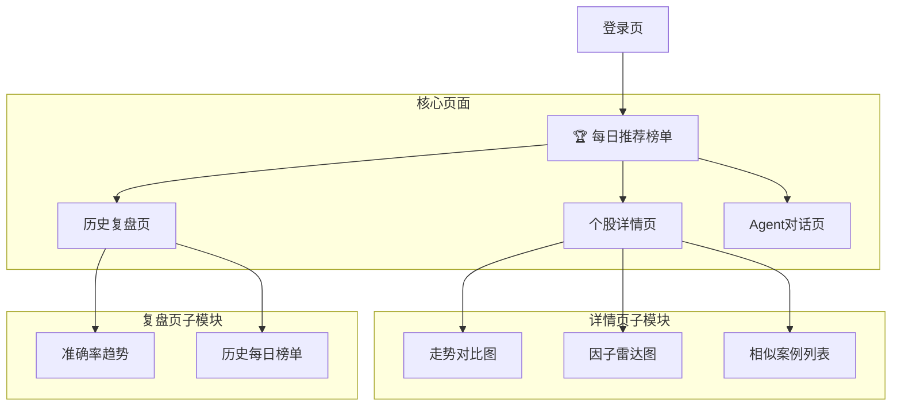

# 模块6：前端可视化 — 详细规划

> **对应总规划**：[`00-总规划框架.md`](plans/00-总规划框架.md) → 模块6

---

## 一、技术选型

| 组件      | 方案                                 | 说明             |
| --------- | ------------------------------------ | ---------------- |
| 框架      | Vue 3 + Composition API + TypeScript | 核心框架         |
| 构建工具  | Vite                                 | 快速构建         |
| 状态管理  | Pinia                                | 替代Vuex，更简洁 |
| 路由      | Vue Router 4                         | 页面路由         |
| UI库      | Element Plus                         | 组件库           |
| 图表      | ECharts + vue-echarts                | 数据可视化       |
| HTTP      | Axios                                | API请求          |
| WebSocket | 原生WebSocket                        | 实时推送         |

---

## 二、页面结构



---

## 三、页面详细设计

### 3.1 每日推荐榜单（首页）

**页面布局**：

```
┌──────────────────────────────────────────────┐
│  🏆 每日推荐榜单  2026-07-23  更新于18:30    │
│  ┌──────────────────────────────────────────┐ │
│  │ 排名 │ 股票 │ 评分 │ 相似案例 │ 风险 │ 操作 │ │
│  ├──────────────────────────────────────────┤ │
│  │ 🥇  │ 招商银行 │ 92 │ 2020.05相似89%│ 低 │ 详情 │ │
│  │ 🥈  │ 五粮液  │ 88 │ 2021.03相似85%│ 低 │ 详情 │ │
│  │ 🥉  │ 宁德时代 │ 85 │ 2022.11相似82%│ 中 │ 详情 │ │
│  │ ... │ ...     │ .. │ ...         │ ...│ ...  │ │
│  └──────────────────────────────────────────┘ │
│  📊 今日扫描：5023只股票 │ 推荐：30只        │
└──────────────────────────────────────────────┘
```

**功能点**：

- 按评分排序展示TOP-30
- 每只股票显示：评分、相似历史案例、风险等级
- 点击"详情"跳转到个股详情页
- 日期选择器查看历史榜单

### 3.2 个股详情页

**页面布局**：

```
┌──────────────────────────────────────────────┐
│  ← 返回榜单   招商银行 600036.SH  评分：92   │
├──────────────────────────────────────────────┤
│  ┌──────────┐  ┌──────────────────────────┐  │
│  │ 因子雷达图 │  │ 当前走势 vs 历史相似案例  │  │
│  │  技术面   │  │ ┌──────────────────────┐ │  │
│  │  ┌───┐   │  │ │ 📈 走势对比图        │ │  │
│  │  │   │ 资金│ │ │ 红线：当前招商银行    │ │  │
│  │  └───┘   │  │ │ 蓝线：2020年相似案例  │ │  │
│  └──────────┘  │ └──────────────────────┘ │  │
│                 └──────────────────────────┘  │
├──────────────────────────────────────────────┤
│  相似历史案例（Top-3）                        │
│  ┌──────────────────────────────────────────┐ │
│  │ 2020.05.15 相似度89% → T+5涨15.2%      │ │
│  │ 2022.11.03 相似度85% → T+5涨8.7%       │ │
│  │ 2023.06.20 相似度82% → T+5涨12.1%      │ │
│  └──────────────────────────────────────────┘ │
└──────────────────────────────────────────────┘
```

**功能点**：

- 因子雷达图：展示技术面/资金面/基本面/情绪面综合评分
- 走势对比图：当前股票20天走势 vs 历史相似案例的走势叠加
- 相似案例列表：Top-3最相似的历史案例，显示具体日期和后续涨幅

### 3.3 历史复盘页

**页面布局**：

```
┌──────────────────────────────────────────────┐
│  📊 预测准确率复盘                           │
│  ┌──────────────────────────────────────────┐ │
│  │  最近30天预测准确率趋势                  │ │
│  │  ┌────────────────────────────────────┐  │ │
│  │  │ 📈 折线图：每日命中率              │  │ │
│  │  └────────────────────────────────────┘  │ │
│  │  平均命中率：68.5%                       │ │
│  └──────────────────────────────────────────┘ │
├──────────────────────────────────────────────┤
│  历史每日榜单查询                             │
│  日期：___________  [查询]                   │
│  ┌──────────────────────────────────────────┐ │
│  │ 查询日期的TOP-30推荐列表                │ │
│  └──────────────────────────────────────────┘ │
└──────────────────────────────────────────────┘
```

### 3.4 Agent对话页

**页面布局**：

```
┌──────────────────────────────────────────────┐
│  🤖 Agent 智能分析                          │
├──────────────────────────────────────────────┤
│  ┌──────────────────────────────────────────┐ │
│  │  用户：为什么今天推荐招商银行？          │ │
│  ├──────────────────────────────────────────┤ │
│  │  Agent：招商银行当前走势与2020年5月...  │ │
│  │  相似度达到89%，当时5日涨幅15.2%...     │ │
│  └──────────────────────────────────────────┘ │
├──────────────────────────────────────────────┤
│  [输入问题...]                    [发送]    │
└──────────────────────────────────────────────┘
```

---

## 四、Pinia 状态管理

```typescript
// stores/prediction.ts
export const usePredictionStore = defineStore("prediction", {
  state: () => ({
    todayPicks: [], // 今日推荐列表
    selectedStock: null, // 当前查看的股票
    historyAccuracy: [], // 历史准确率
    loading: false,
  }),
  actions: {
    async fetchTodayPicks() {
      this.loading = true;
      const res = await axios.get("/api/v1/predictions/today");
      this.todayPicks = res.data.top_picks;
      this.loading = false;
    },
    async fetchStockDetail(tsCode: string) {
      const res = await axios.get(`/api/v1/predictions/today/${tsCode}`);
      this.selectedStock = res.data;
    },
  },
});
```

---

## 五、前端项目结构

```
frontend/
├── src/
│   ├── App.vue
│   ├── main.ts
│   ├── router/
│   │   └── index.ts              # 路由配置
│   ├── views/
│   │   ├── DailyPicks.vue        # 每日推荐榜单页
│   │   ├── StockDetail.vue       # 个股详情页
│   │   ├── HistoryReview.vue     # 历史复盘页
│   │   └── AgentChat.vue         # Agent对话页
│   ├── components/
│   │   ├── PredictionCard.vue    # 推荐卡片组件
│   │   ├── SimilarityChart.vue   # 走势对比图组件
│   │   ├── FactorRadar.vue       # 因子雷达图组件
│   │   ├── AccuracyChart.vue     # 准确率图表组件
│   │   └── StockTable.vue        # 股票表格组件
│   ├── stores/
│   │   └── prediction.ts         # Pinia状态
│   ├── api/
│   │   └── index.ts              # Axios封装
│   └── utils/
│       └── format.ts             # 格式化工具
├── package.json
├── vite.config.ts
└── Dockerfile
```

---

## 六、env 配置

```bash
# .env
VITE_API_BASE_URL=http://localhost:8000/api/v1
VITE_WS_URL=ws://localhost:8000/ws
```
