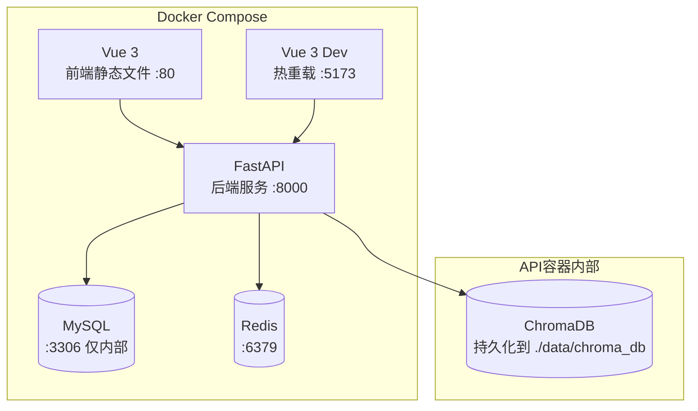

# 模块7：部署与运维 — 详细规划

> **对应总规划**：[`00-总规划框架.md`](plans/00-总规划框架.md) → 模块7

---

## 一、Docker 容器化

### 1.1 服务架构



### 1.2 docker-compose.yml（当前实际使用版）

```yaml
services:
  api:
    build:
      context: ./backend
      dockerfile: Dockerfile
    ports:
      - "8000:8000"
    environment:
      - DB_HOST=mysql
      - DB_PORT=3306
      - DB_USER=quant_user
      - DB_PASSWORD=quant_pass_2024
      - DB_NAME=quant_db
      - REDIS_HOST=redis
      - REDIS_PORT=6379
      - TUSHARE_TOKEN=${TUSHARE_TOKEN}
      - DEEPSEEK_API_KEY=${DEEPSEEK_API_KEY}
    volumes:
      - ./data:/app/data # 含 chroma_db/
      - ./logs:/app/logs
    depends_on:
      mysql:
        condition: service_healthy
      redis:
        condition: service_started
    restart: always
    # ChromaDB 在 API 容器内作为本地持久化目录运行

  mysql:
    image: mysql:8.0
    # ports: "3306:3306"  # 注释掉，宿主机已有MySQL避免冲突
    environment:
      MYSQL_ROOT_PASSWORD: root_pass_2024
      MYSQL_DATABASE: quant_db
      MYSQL_USER: quant_user
      MYSQL_PASSWORD: quant_pass_2024
    volumes:
      - mysql_data:/var/lib/mysql
    healthcheck:
      test: ["CMD", "mysqladmin", "ping", "-h", "localhost"]
      interval: 5s
      timeout: 10s
      retries: 20
      start_period: 30s
    restart: always

  redis:
    image: redis:7-alpine
    ports:
      - "6379:6379"
    volumes:
      - redis_data:/data
    restart: always

  frontend:
    build:
      context: ./frontend
      dockerfile: Dockerfile
    ports:
      - "80:80"
    depends_on:
      - api
    restart: always

  frontend-dev:
    image: node:20-alpine
    working_dir: /app
    ports:
      - "5173:5173"
    volumes:
      - ./frontend:/app
    command: sh -c "npm install && npm run dev -- --host 0.0.0.0"
    depends_on:
      - api

volumes:
  mysql_data:
  redis_data:
```

### 1.3 各服务 Dockerfile（当前实际使用版）

```dockerfile
# backend/Dockerfile
FROM python:3.11-slim-bookworm
# 注意：不使用TA-Lib（编译问题），改用pandas/numpy计算技术指标

WORKDIR /app

COPY requirements.txt .
RUN pip install --no-cache-dir -r requirements.txt

COPY . .

CMD ["uvicorn", "app.main:app", "--host", "0.0.0.0", "--port", "8000"]
```

```dockerfile
# frontend/Dockerfile
FROM node:20-alpine AS build
# 注意：18版本无法构建rolldown，必须用20+
WORKDIR /app
COPY package*.json ./
RUN npm install
COPY . .
RUN npm run build

FROM nginx:alpine
COPY --from=build /app/dist /usr/share/nginx/html
```

---

## 二、CI/CD 流水线

```yaml
# .github/workflows/deploy.yml
name: Deploy

on:
  push:
    branches: [main]

jobs:
  deploy:
    runs-on: ubuntu-latest
    steps:
      - uses: actions/checkout@v3

      - name: Build and deploy
        env:
          TUSHARE_TOKEN: ${{ secrets.TUSHARE_TOKEN }}
          DEEPSEEK_API_KEY: ${{ secrets.DEEPSEEK_API_KEY }}
        run: |
          docker-compose build
          docker-compose up -d
```

---

## 三、监控方案

### 3.1 基础监控

| 监控项       | 指标         | 告警阈值        | 工具          |
| ------------ | ------------ | --------------- | ------------- |
| API可用性    | HTTP状态码   | 5xx > 1%        | UptimeRobot   |
| API响应时间  | P95延迟      | > 2秒           | Prometheus    |
| 数据采集延迟 | 最新数据日期 | > 1天           | 自建检查      |
| 预测Pipeline | 是否按时完成 | 超过19:30未完成 | Cron+通知     |
| 磁盘使用率   | 磁盘空间     | > 80%           | Node Exporter |
| MySQL连接数  | 活跃连接     | > 150           | Prometheus    |

### 3.2 业务监控

| 监控项         | 说明                   | 频率 |
| -------------- | ---------------------- | ---- |
| 预测命中率     | TOP-10股票次日上涨比例 | 每日 |
| 平均涨幅       | TOP-10股票次日平均涨幅 | 每日 |
| 数据采集成功率 | 每日API调用成功率      | 每日 |
| 模式库数量     | ChromaDB中的模式总数   | 每周 |

### 3.3 日志系统

```python
# 日志配置
import logging

logging.config.dictConfig({
    'version': 1,
    'formatters': {
        'standard': {
            'format': '%(asctime)s [%(levelname)s] %(name)s: %(message)s'
        },
    },
    'handlers': {
        'file': {
            'class': 'logging.handlers.RotatingFileHandler',
            'filename': 'logs/quant.log',
            'maxBytes': 10485760,  # 10MB
            'backupCount': 5,
        },
    },
    'root': {
        'level': 'INFO',
        'handlers': ['file']
    }
})
```

---

## 四、环境变量配置

```bash
# .env 文件（不提交到git）
TUSHARE_TOKEN=your_tushare_token_here
DEEPSEEK_API_KEY=your_deepseek_api_key_here
DB_HOST=localhost
DB_PORT=3306
DB_USER=quant_user
DB_PASSWORD=quant_pass_2024
DB_NAME=quant_db
REDIS_HOST=localhost
REDIS_PORT=6379
LOG_LEVEL=INFO
```

```bash
# .env.example（提交到git）
TUSHARE_TOKEN=your_tushare_token_here
DEEPSEEK_API_KEY=your_deepseek_api_key_here
DB_HOST=localhost
DB_PORT=3306
DB_USER=quant_user
DB_PASSWORD=your_db_password
DB_NAME=quant_db
```

---

## 五、requirements.txt

```txt
# backend/requirements.txt
fastapi==0.104.1
uvicorn[standard]==0.24.0
sqlalchemy==2.0.23
alembic==1.13.0
pymysql==1.1.0
redis==5.0.1
apscheduler==3.10.4
tushare==1.3.9
pandas==2.1.4
numpy==1.26.2
TA-Lib==0.4.28
chromadb==0.4.22
langchain==0.0.340
langgraph==0.0.20
httpx==0.25.2
pydantic==2.5.2
python-jose[cryptography]==3.3.0
python-multipart==0.0.6
```

---

## 六、启动顺序

```bash
# 1. 克隆项目
git clone <repo_url>
cd ai-quant-agent

# 2. 配置环境变量
cp .env.example .env
# 编辑.env填入Tushare Token和DeepSeek API Key

# 3. 启动所有服务
docker-compose up -d

# 4. 初始化数据库
docker-compose exec api alembic upgrade head

# 5. 启动历史数据回填（首次部署）
docker-compose exec api python scripts/backfill_history.py

# 6. 验证服务
curl http://localhost:8000/api/v1/system/health
# 预期返回：{"status": "ok"}
```
