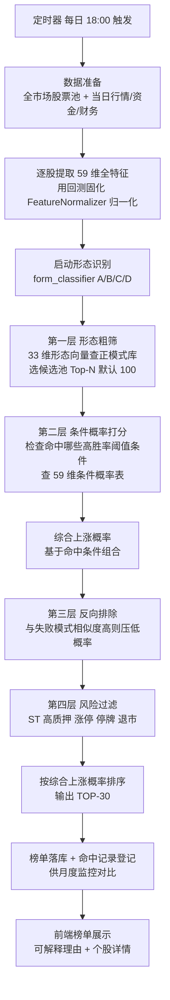

# 模块9：每日推荐详细规划 — 条件概率打分主体 + 形态粗筛（统一旧/新机制）

> **本文档目标**：统一散落在 [`00-总规划框架.md`](plans/00-总规划框架.md:128)（模块3 Agent 流水线）、[`02-ChromaDB模式库.md`](plans/02-ChromaDB模式库.md:306)（每日扫描流程）、[`04-回测引擎.md`](plans/04-回测引擎.md:1181)（第六章三层机制）、[`05-后端API.md`](plans/05-后端API.md:23)（预测接口）、[`06-前端开发.md`](plans/06-前端开发.md:50)（榜单页）中关于"每日推荐"的设计，统一为**一套机制**，并列出**待实现清单**供后续实施。
>
> **机制定版（用户核心需求）**：以 [`04-回测引擎.md`](plans/04-回测引擎.md:1181) 第六章为准——**条件概率打分为主体，形态向量只做粗筛**。旧机制（形态加权评分：图形30%+技术25%+资金20%+基本面15%+环境10%）作废。

---

## 一、一句话说清每日推荐

```
每日收盘后（约 18:00）：
  全市场 5000+ 只股票
  → 识别启动形态（A/B/C/D）
  → 形态粗筛：与同形态"成功模式库"相似度，选出候选池 Top-N
  → 条件概率打分：检查满足哪些"高胜率阈值条件"，按条件概率表算综合上涨概率（主评分）
  → 反向排除：与"失败模式库"相似度高 → 压低概率
  → 风险过滤：ST / 高质押 / 涨停不可买 / 停牌 / 退市 剔除
  → 按综合上涨概率排序 → 输出 TOP-30 榜单（可解释）
```

**核心转变**：最终排序依据是"**满足哪些高胜率条件 → 综合上涨概率**"，可解释、可量化；形态向量库从"评分主体"降级为"粗筛工具"。

## 二、与旧机制的差异（统一定版）

| 维度     | 旧机制（作废）                                            | 新机制（定版）                           |
| -------- | --------------------------------------------------------- | ---------------------------------------- |
| 排序依据 | 形态加权评分（图形30%+技术25%+资金20%+基本面15%+环境10%） | **综合上涨概率（条件概率表）**           |
| 形态向量 | 评分主体                                                  | **粗筛工具（候选池）**                   |
| 可解释性 | 图形像历史牛股                                            | **满足 XX 条件，历史概率 XX%**           |
| 量化程度 | 相对分数 0-100                                            | **绝对概率（可直接理解）**               |
| 抗偶然性 | 受单个相似案例影响                                        | **基于大量样本统计，更稳健**             |
| 展示字段 | score 92、similar_case 相似度89%                          | **综合上涨概率、命中条件列表、风险等级** |

**需对齐的旧文件**：06 前端榜单字段、05 API 的 score/similar_case、00 模块3 Agent 描述、02 八/九章 —— 全部按新机制字段更新（见第十一章）。

## 三、每日推荐流水线（端到端）



## 四、评分机制（四层，核心）

### 第零层：启动形态识别（当前时点）

- **关键区别（与回测）**：回测的 [`form_classifier.classify_segment`](ai-quant-agent/backend/app/backtest/form_classifier.py:86) 是对"历史行情段"分类（依赖 low/high 的 SurgeSegment）；每日推荐扫描的是"**当前时点**"，没有历史行情段，**不能直接复用** classify_segment
- 需新增 **`classify_current(df, end_idx)`**（当前时点形态识别）：
  - 输入：当前日及之前 60 个交易日走势
  - 复用 form_classifier 的判定阈值（`_detect_platform` 平台 / V反 / 中继 / 直接拉升 / 连板），以 end_idx 为"疑似启动点"
  - 输出：疑似形态 A/B/C/D/E + 置信度 + **启动确认**
- **启动确认（关键，防止把普通横盘当推荐）**：
  - A 平台突破：需"近 5 日放量突破平台高点 1.03 倍"
  - B V反：需"近 20 日快速下跌 >25% 后近 3 日放量反转"
  - C 中继：需"前一波涨 >50% 后平台整理再加速"
  - D 直接拉升：需"近 10 日涨幅 >30%"
  - 未通过启动确认 → 不推荐
- 形态 E（连板）难买入，不进普通推荐

### 第一层：形态粗筛（候选池，不再是评分主体）

- 用 **33 维形态核心向量**（[`MATCH_FEATURES`](ai-quant-agent/backend/app/backtest/feature_extractor.py:98)：价格图形+技术+量能）在 **同形态正模式库** 做余弦相似度检索
- 选出 Top-N 候选池（默认 100）——快速过滤"形态完全不像"的股票，缩小计算范围
- **说明**：这一步只做召回，不决定最终排序（最终排序由条件概率决定）

### 第二层：条件概率打分（主评分依据）

- 对候选池每只股票，检查满足哪些**高胜率阈值条件**（来自回测条件概率表）：
  - 量比≥3？主力净流入率≥10%？换手率≥8%？均线多头？质押比例低？业绩预告预增？...
- 查条件概率表（[`threshold_analyzer.py`](ai-quant-agent/backend/app/backtest/threshold_analyzer.py:1)），计算**综合上涨概率**：
  - `P(上涨) = 基于命中的单条件概率组合 + 命中的组合规则`
  - 例：量比3.2 概率68% + 净流入12% 概率65% + 换手9% 概率60% → 综合上涨概率约 70%
- 命中高胜率条件越多、概率越高 → 排名越靠前

### 第三层：反向排除（避雷）

- 与**同形态失败模式库**相似度高 → 综合概率压低或剔除
- 负向抑制：`最终概率 = 综合概率 × (1 - λ × 负向相似度)`，λ 默认 0.5（回测调优后固化）
- 场景：股票 X 满足多个高胜率条件，但形态与"失败案例"相似 80% → 概率被压低，避免踩雷

### 第四层：风险过滤

- ST / 退市整理 → 剔除（[`loader.is_st`](ai-quant-agent/backend/app/backtest/loader.py:185)）
- 股权质押比例过高（如 >50%，来自 pledge_stat）→ 剔除
- 当日涨停封死 / 一字板（无法买入，`is_sealed_up`）→ 剔除
- 当日停牌 → 剔除
- 流动性不足（日均成交额 < 下限）→ 剔除

## 五、与回测的对齐（参数固化防漂移）

**回测验证通过的方案，每日推荐必须原样运行**：

| 固化项     | 来源                             | 实现                                                  |
| ---------- | -------------------------------- | ----------------------------------------------------- |
| 归一化参数 | 回测 fit 的 FeatureNormalizer    | 落盘 `backend/data/feature_normalizer.json`，每日加载 |
| 条件概率表 | 回测 build_probability_table     | 需落盘（见待实现清单）                                |
| 形态阈值   | 回测 form_classifier 阈值        | 代码常量，不改                                        |
| 排除强度 λ | 回测调优                         | 固化 0.5                                              |
| 特征集     | 回测 59 维全特征 + 33 维形态子集 | FEATURE_NAMES / MATCH_FEATURES                        |

**流程一致**：每日推荐的特征提取、形态分类、归一化、打分必须与回测共用同一套核心函数（feature_extractor / form_classifier / FeatureNormalizer / threshold_analyzer），禁止两套实现。

**统计口径对齐（关键）**：回测的条件概率表 / 模式库基于"**已确认启动点**"样本（T+5>5% 概率）；每日推荐打分对象是"**疑似启动的当前时点**"。二者靠**第零层启动确认**对齐——只有通过启动确认的当前时点才进入打分，其"启动前状态"与回测启动点样本同分布（近似假设）。该假设由月度监控（实际命中率 vs 回测命中率，[`monitor.py`](ai-quant-agent/backend/app/backtest/monitor.py:1)）检验，显著漂移则触发再验证。

## 六、特征与归一化

- **全特征 59 维**：价格图形 20 + 技术 8 + 量能 5 + 资金 3 + 财务 9 + 筹码 3 + 事件 7 + 环境 4（来自现有 16 张表增强特征）
- **形态核心 33 维**（向量粗筛用）：价格图形 + 技术 + 量能
- **归一化**：[`FeatureNormalizer`](ai-quant-agent/backend/app/backtest/feature_extractor.py:311)——按类型差异化（category 保持 0/1、bounded 缩放到 0-1、ratio/percentile winsorized Z-score），参数固化落盘
- 缺失：中位数填充；有效比例 <10% 的特征 transform 后置 0（不参与相似度）

## 七、模块与代码结构（实现蓝图）

```
backend/app/backtest/
  recommender.py        # 已有：三层 scorer（recommend_single / recommend_market）
  feature_extractor.py  # 已有：59 维 + FeatureNormalizer + MATCH_FEATURES
  form_classifier.py    # 已有：形态识别
  vector_store.py       # 已有：ChromaDB 正/负模式库
  threshold_analyzer.py # 已有：条件概率表 + 打分
  loader.py             # 已有：数据加载 + is_st + 停牌/涨停过滤
  monitor.py            # 已有：命中记录 + 月度监控

backend/app/api/
  predictions.py        # 改造：/predictions/today 接入新机制（当前为旧简单预测）
  backtest.py           # 已有：回测 API + 监控 API

新增（见待实现清单）：
  daily_scan.py         # 每日全市场扫描编排（全市场逐股提取特征 → 粗筛 → 打分 → 过滤 → 榜单）
  risk_filter.py        # 风险过滤（ST/高质押/涨停/停牌/流动性）
```

## 八、接口设计（对齐新机制字段）

### `GET /api/v1/predictions/today`（改造）

```json
{
  "date": "2026-08-08",
  "generated_at": "2026-08-08T18:30:00",
  "total_scanned": 5535,
  "candidate_pool": 478,
  "top_picks": [
    {
      "rank": 1,
      "ts_code": "600036.SH",
      "name": "招商银行",
      "form_type": "A",
      "up_probability": 0.7, // 综合上涨概率（主排序）
      "hit_conditions": [
        // 命中的高胜率条件（可解释）
        { "feature": "volume_ratio", "threshold": 3.2, "up_prob": 0.68 },
        { "feature": "net_amount_ratio", "threshold": 0.12, "up_prob": 0.65 }
      ],
      "negative_similarity": 0.32, // 与失败模式相似度
      "risk_level": "低"
    }
  ]
}
```

### 其他接口

- `GET /api/v1/predictions/date/{date}`：历史榜单（已落库则查库，否则重算）
- `GET /api/v1/predictions/today/{ts_code}`：个股推荐详情（命中条件 + 走势对比 + 相似案例）
- `POST /api/v1/predictions/scan`：手动触发一次每日扫描（后台任务，返回状态）
- `POST /api/v1/predictions/scan/stop`：**停止扫描**（前端「停止扫描」按钮；协作式取消）
  - 语义：不是 kill 线程，而是在 `daily_scan` 逐股循环的**下一次迭代前**退出
    （单只股票 1~3 秒，故实际响应是秒级）；同一信号也让 Agent 精筛在**每批 LLM 调用前**退出
  - **停止时绝不落盘、不登记命中**：半成品榜单若落盘，会被次日自我验证/T+5 回填/命中登记
    当成正式推荐，污染 monitor_state 与进化反馈
  - 状态语义：`cancelled` 与 `failed`/`success` 区分开（前端显示"已停止"），
    `GET /scan/status` 额外返回 `cancel_requested`（用于显示"正在停止…"）
  - 每次启动新扫描前清空取消信号（防跨扫描残留 → 新扫描立刻自我中断）
  - 验收：[`verify_scan_stop.py`](ai-quant-agent/backend/scripts/verify_scan_stop.py:1) **32/32**（含"真跑一次立即停止"且校验无新文件落盘）
- `POST /api/v1/predictions/scan/confirm`：**用户点「是」→ 才真正扫描**（采集完成弹窗路径入口）
- `POST /api/v1/predictions/scan/dismiss?reason=...`：用户点「否/稍后」→ 本次不扫（留审计痕迹）

### 采集完成后「弹窗询问是否扫描」（不要每次都自动跑）

用户诉求原话："在采集跑完之后，弹窗显示是否跑每日推荐扫描，这样我可以方便控制"。

设计要点（**安全性优先**——宁可少扫也不擅自扫）：

| 模式                  | 行为                                                                                        | 适用             |
| --------------------- | ------------------------------------------------------------------------------------------- | ---------------- |
| `confirm`（**默认**） | 采集完成只标记 `_SCAN_CONFIRM.pending=True`，**不启动扫描**；由前端弹窗，用户点「是」才启动 | 默认（用户可控） |
| `auto`                | 旧行为：采集完成直接启动扫描                                                                | 想完全无人值守   |
| `off`                 | 完全不自动扫（纯手动）                                                                      | 调试 / 只想采集  |

- 模式来自**可进化参数** `auto_scan_after_collect`（[`add_plan23_params.py`](ai-quant-agent/backend/scripts/add_plan23_params.py:1) 注册，`choices=[confirm,auto,off]`）；
  读到的值非法一律**回退 confirm**（防止进化大脑写入脏值导致"永扫"或"永不扫"）
- 统一入口 [`handle_after_collection()`](ai-quant-agent/backend/app/api/predictions.py:364)：手动采集（[`data.py`](ai-quant-agent/backend/app/api/data.py:215)）与
  定时采集（[`main.py`](ai-quant-agent/backend/app/main.py:595)）**共用同一入口**——只改一条会出现"手动不弹窗、定时照扫"的不一致
- 前端两条路径都能问到用户：
  - 采集页 [`DataManage.vue`](ai-quant-agent/frontend/src/views/DataManage.vue:1)：WS `progress.status==='done'` 立即 `ElMessageBox` 询问 +
    15s 兜底轮询（WS 掉线/页面后打开也能问到）；**同一数据日期只弹一次**（选过"稍后再说"不再骚扰）
  - 推荐页 [`Recommend.vue`](ai-quant-agent/frontend/src/views/Recommend.vue:1)：顶部提示条（「立即运行」/「稍后再说」），跨页面/刷新后仍可见
  - 若扫描已在运行，点「确认」**不重复触发**（防双跑 → 重复落盘/重复命中登记）；
    且"已在扫描中"时**连弹窗都不弹**（点了也跑不了，只会让人困惑）
- `GET /scan/status` 额外返回 `confirm_pending`（pending/data_date/source）与 `auto_scan_mode`（前端可解释"为什么没弹窗"）
- 验收：[`verify_scan_confirm.py`](ai-quant-agent/backend/scripts/verify_scan_confirm.py:1) **49/49**
  （含"confirm 模式下调用采集完成**不启动扫描线程**"、"auto/off 兼容"、"running 时不重复触发/不弹窗"、两条采集路径一致性、前端接线）
- ⚠️ 已知限制（诚实登记）：`_SCAN_CONFIRM` 是**进程内内存态**，后端若在"采集完成"与"用户点击"之间重启，
  待确认标记会丢（表现为不弹窗，而不是误扫）。取舍：宁可漏问一次，也不把状态持久化后在隔天重启时
  弹出一个过期提示。若要改为持久化，只需把 `_SCAN_CONFIRM` 落到 `data/` 下一个小 json。

## 九、前端榜单设计（对齐新机制）

### 每日推荐榜单页（首页）

```
排名 | 股票 | 综合上涨概率 | 命中条件(前2) | 风险 | 操作
🥇   | 招商银行 | 70% | 量比3.2→68%、净流入12%→65% | 低 | 详情
🥈   | 五粮液   | 65% | 换手9%→60%、均线多头 | 低 | 详情
```

- 按综合上涨概率排序展示 TOP-30
- 每只显示：综合上涨概率、命中条件（可解释）、风险等级
- 点击详情 → 个股详情页

### 个股详情页

- 命中条件详情：每个高胜率条件的阈值 + 历史概率
- 走势对比：当前 20 天走势 vs 相似历史案例
- 相似案例：Top-3 相似模式 + 后续 T+5/T+20 涨幅

## 十、待实现清单（供 code 模式后续实施）

### ✅ 已实现（本轮已完成）

1. 三层 scorer：[`recommender.py`](ai-quant-agent/backend/app/backtest/recommender.py:52)（形态粗筛 → 条件概率打分 → 反向排除）
2. 59 维全特征 + 33 维形态子集 + FeatureNormalizer 归一化固化：[`feature_extractor.py`](ai-quant-agent/backend/app/backtest/feature_extractor.py:97)
3. 正/负模式库（ChromaDB，按形态分组）：[`vector_store.py`](ai-quant-agent/backend/app/backtest/vector_store.py:54)
4. 条件概率表 + 打分：threshold_analyzer.py
5. 命中记录 + 月度监控：monitor.py

### ⏳ 待实现（每日推荐闭环）

0. **当前时点形态识别** `classify_current`：复用 form_classifier 判定阈值但**不依赖历史段**，识别当前是否处于某形态"启动点前状态"并做启动确认（当前 [`recommender._classify_form`](ai-quant-agent/backend/app/backtest/recommender.py:67) 仅为简化占位）
1. **每日全市场扫描入口** `daily_scan.py`：全市场 5535 只逐股提取特征（复用 `build_extra_map` + `extract_features`）→ 形态识别 → 打分 → 排序 → TOP-30
2. **候选池机制**：第一层形态粗筛真正实现 Top-N 候选池（当前 recommend_market 逐只全算）
3. **风险过滤** `risk_filter.py`：ST/高质押/涨停封死/停牌/流动性 剔除
4. **predictions API 改造**：/predictions/today 接入新机制，返回综合上涨概率 + 命中条件（当前为旧简单预测）
5. **定时任务**：APScheduler 每日 18:00 触发每日扫描
6. **榜单持久化**：每日榜单落库或落盘，供历史查询
7. **命中记录回填**：每日推荐 T+5 后回填实际涨幅到 monitor（对接 `/api/v1/backtest/monitor/hits`）
8. **前端榜单页**：每日推荐榜单页 + 个股详情页（对齐新机制字段）
9. **条件概率表落盘固化**：回测产出的条件概率表落盘，每日推荐加载同一份（当前未落盘）

### 可选（增强）

10. **DeepSeek 归因**：对 TOP-30 做深度归因解释（00 模块3 设计，LangChain 已装）

## 十一、旧规划文件对齐指引（标注冲突）

| 旧文件                                                   | 章节    | 需对齐之处                                                                       |
| -------------------------------------------------------- | ------- | -------------------------------------------------------------------------------- |
| [`02-ChromaDB模式库.md`](plans/02-ChromaDB模式库.md:306) | 八/九章 | 每日扫描的"形态加权评分（图形30%+...）"改为"条件概率打分主体"；ChromaDB 只做粗筛 |
| [`06-前端开发.md`](plans/06-前端开发.md:50)              | 3.1/3.2 | 榜单字段 `评分/相似案例` 改为 `综合上涨概率/命中条件`                            |
| [`05-后端API.md`](plans/05-后端API.md:23)                | 2.1     | 响应字段 `score/similar_case` 改为 `up_probability/hit_conditions`               |
| [`00-总规划框架.md`](plans/00-总规划框架.md:128)         | 模块3   | Agent 职责描述中"ChromaDB 检索相似度评分主体"改为"形态粗筛 + 条件概率打分"       |

## 十二、风险与诚实边界

| 无法保证                    | 原因                          | 缓解                                            |
| --------------------------- | ----------------------------- | ----------------------------------------------- |
| 单日榜单必涨                | 事前预测，非事后验证          | 向用户明确 48.6% 是长期平均，不以单日论成败     |
| 每日推荐命中率 = 回测命中率 | 时点/对象/粒度/可交易性差异   | 参数固化 + 流程一致 + 月度监控（monitor）       |
| 形态粗筛不漏                | 候选池 Top-N 可能漏掉边缘形态 | N 取 100（可调），粗筛阈值宽松                  |
| 特征缺失                    | 部分关联表未采集              | 缺失特征中位数填充；未采集表不影响核心价格/量能 |

---

> **本文档为模块9统一规划 v1.0**：定版"条件概率打分主体 + 形态粗筛"机制，统一散落的旧机制，给出端到端流水线、参数固化、接口/前端字段设计，并列出 9 项待实现清单供后续 code 模式实施。
