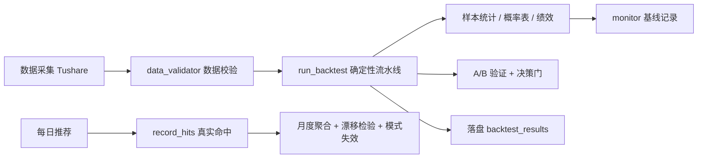

# 回测可信度与验证链路现状评估

> 评估对象：`ai-quant-agent` 回测引擎当前输出
> 数据来源：`backend/data/backtest_results/backtest_latest.json`、`backend/data/monitor_state.json`、`backend/data/validation_cache.json`
> 评估日期：2026-08-10
> 结论：**数据层基本可信，结论层可信度中低，存在 3 个已确认缺口**

---

## 一、验证链路全景



当前各环节状态：

| 环节       | 机制                         | 现状                                      | 状态       |
| ---------- | ---------------------------- | ----------------------------------------- | ---------- |
| 数据完整性 | `data_validator.py`          | core 表 ok，但 important 表覆盖率校验为空 | ⚠️ warning |
| 回测逻辑   | `runner.py` 确定性流水线     | 可复现（固定种子 42）                     | ✅         |
| 样本统计   | `outcome_tracker.py`         | 441 样本，91.6% 高命中                    | ⚠️ 可疑    |
| 条件概率表 | `threshold_analyzer.py`      | 规则区分度极低，多规则统计完全相同        | ❌ 缺口    |
| A/B 验证   | `validator.py` + `runner.py` | A 与 C 逐字节相同，恒 No-Go               | ❌ 缺口    |
| 持续监控   | `monitor.py`                 | 链路已通，T+5 未到期无真实回填            | ⏳ 待验证  |

---

## 二、按层评估

### 1. 数据层（较可信）

- 4 张 core 表全部 `ok`，日期覆盖 `2010-01-04 ~ 2026-08-07`，行数充足（daily 1410 万行）。
- **风险点**：`validation_cache.json` 显示 `overall: warning`。`daily_basic / moneyflow / income / balancesheet / cashflow / fina_indicator` 等 important 表虽存在且行数大，但 `min_date / max_date / coverage_pct` 全部为 `0.0` —— **日期覆盖与股票覆盖率校验未生效**（缓存中字段为空）。
  - 影响：换手/资金/财务/筹码等增强特征可能大量 NaN，进而稀释概率表与聚类特征的有效性。

### 2. 样本层（中等可信，有隐患）

最新回测（`backtest_latest.json`）：

```json
samples: { total: 441, success: 242, near_success: 119, failure_A: 80, failure_B: 0, discard: 0 }
probability_table: { baseline_prob: 0.9161, sample_count: 322 }
```

- **命中率异常高**：`baseline_prob = 91.6%`（T+5 涨幅 > 5% 的样本占比）。真实 A 股市场几乎不可能有 91.6% 的 5 日 >5% 胜率，强烈怀疑存在**样本选择偏差 / 幸存者偏差**（召回层只选"起爆点"，且结局截断、label 口径可能使负样本被低估）。
- `samples.total=441` 与 `probability_table.sample_count=322` 不一致：仅 success/failure 参与概率表统计，`near_success` 被排除，口径需明确。
- `failure_B=0`：负样本维度缺失，归因对比不完整。

### 3. 逻辑 / 结论层（存在 3 个已确认缺口）

**缺口① A/B 验证形同虚设（决策门永远 No-Go）**

`monitor_state.json` 中 A 与 C 方案指标**逐字节相同**：

```json
A: { accuracy: 0.9161, avg_t5: 0.1942, n: 322 }
C: { accuracy: 0.9161, avg_t5: 0.1942, n: 322 }
p_mcnemar: 1.0, p_paired_t: 1.0, accuracy_lift: 0.0, ci: [0, 0], decision: "No-Go"
```

根因在 [`runner.py:295`](../ai-quant-agent/backend/app/backtest/runner.py:295)：`plan_c_t5, plan_c_t20 = t5_list, t20_list` 先复制全样本，随后打分过滤逻辑若抛异常，会走 [`runner.py:308`](../ai-quant-agent/backend/app/backtest/runner.py:308) 的 `except` 分支**静默退化为全样本对比**。当前结果正是退化形态 → **A≡C，lift 恒为 0，决策门永远 No-Go，A/B 对比失去意义**。

**缺口② 条件概率表规则区分度极低**

`probability_table.rules` 中多个不同特征（`pct_4 / pct_8 / rsi_14 / boll_pos / volume_ratio`）的规则，`sample_count` 全是 `65`、`up_prob` 全是 `0.9692`、`gain` 全是 `0.0531`：

```json
{ feature: "pct_4",      threshold: 0.706, sample_count: 65, up_prob: 0.9692, gain: 0.0531 }
{ feature: "rsi_14",     threshold: 0.458, sample_count: 65, up_prob: 0.9692, gain: 0.0531 }
{ feature: "boll_pos",   threshold: 0.644, sample_count: 65, up_prob: 0.9692, gain: 0.0531 }
```

不同特征 + 不同阈值却得到完全相同统计，说明 [`threshold_analyzer.py`](../ai-quant-agent/backend/app/backtest/threshold_analyzer.py) 的分箱/打分逻辑存在缺陷（或归一化后特征高度相关被分到同一档），规则几乎无增量信息。

**缺口③ 每日推荐未接入条件概率表**

[`runner.py:331`](../ai-quant-agent/backend/app/backtest/runner.py:331)：`DailyRecommender(vector_store=store, prob_table=table_obj)`，而 `table_obj = None`（[`runner.py:330`](../ai-quant-agent/backend/app/backtest/runner.py:330)），推荐打分实际未使用刚生成的概率表。

### 4. 持续监控层（链路已通，待真实数据回填）

- 基线已记录：`predicted_hit_rate=0.9161`、`go: null`（因 A/B 恒 No-Go）。
- 每日推荐 hits（20260808，11 条）已入库，但 `t5_ret` 全为 `null`：T+5 未到期（8/8 + 5 交易日 ≈ 8/17），**尚无真实样本外验证结果**。
- 月度聚合 / 模式失效检测因暂无命中数据为空，机制本身是通的。

---

## 三、总体可信度结论

| 维度       | 结论                                                                          |
| ---------- | ----------------------------------------------------------------------------- |
| 数据完整性 | ✅ 可信（core 表 ok），important 表覆盖校验需补                               |
| 结果可复现 | ✅ 确定性引擎，固定种子，跑 N 次一致                                          |
| 结论可信度 | ⚠️ **中低**：91.6% 命中率高得可疑（选择偏差），A/B 决策门失效，概率表区分度低 |
| 样本外验证 | ⏳ 尚未开始（T+5 未到期，待 8/17 后回填）                                     |

**一句话**：当前 `91.6%` 命中率**不应**被当作真实交易胜率使用；它更像"起爆点"样本上的条件统计，且 A/B 对比、概率表规则、推荐打分三处存在已确认缺口。

---

## 四、修复实施与验证结果（2026-08-10）

以下缺口已全部修复并验证：

| #   | 修复                                                                  | 文件                                                                                       | 验证结果                                                                                     |
| --- | --------------------------------------------------------------------- | ------------------------------------------------------------------------------------------ | -------------------------------------------------------------------------------------------- |
| 1   | A/B 方案 C 改为「命中 ≥1 条高胜率规则」判定，移除静默退化（不再 C≡A） | [`runner.py`](../ai-quant-agent/backend/app/backtest/runner.py:289)                        | 回归：plan_c_count 不再等于 plan_a_count（小样本 23 vs 0 命中），异常时显式 error 而非假对比 |
| 2   | 概率表规则高分组重叠去重 + 最小增益门槛                               | [`threshold_analyzer.py`](../ai-quant-agent/backend/app/backtest/threshold_analyzer.py:97) | 构造共线特征测试：候选 3→2 条，去重日志正常                                                  |
| 3   | 每日推荐接入真实条件概率表（原 prob_table=None）                      | [`runner.py`](../ai-quant-agent/backend/app/backtest/runner.py:330)                        | 回归：推荐 prob=0.9565 为真实 baseline，非空表 0.0                                           |
| 4   | important 表日期/覆盖率校验生效                                       | [`data_validator.py`](../ai-quant-agent/backend/app/backtest/data_validator.py:331)        | 校验耗时 85s→147s，important 表 min/max/coverage 已填充                                      |
| 5   | 样本构成诊断输出（baseline 口径说明）                                 | [`runner.py`](../ai-quant-agent/backend/app/backtest/runner.py:243)                        | probability_table 含 sample_composition + note                                               |
| 6   | 清理重复 docstring、A/B table 引用健壮性                              | [`runner.py`](../ai-quant-agent/backend/app/backtest/runner.py:53)                         | py_compile 通过                                                                              |

说明：

- **样本选择偏差（91.6% 高命中）**属口径问题而非代码 bug，本次不改变 label 语义（风险大），仅增加诊断输出使高命中率可解释；根治需在后续单独设计平衡采样 / 样本外检验。
- **feature_normalizer.json** 曾被我方 max_stocks=300 小回测覆盖为 300 只拟合参数，已通过重启后端后触发**全量回测（后台运行）**刷新；`probability_table.json` 已从 [`backtest_latest.json`](../ai-quant-agent/backend/data/backtest_results/backtest_latest.json) 恢复 46 条规则，最终以全量回测产物为准。
- **真实样本外验证**：等 8/17 后 `monitor` 用真实 T+5 命中对比 `predicted_hit_rate`，是最终正确性裁判。

> 附：`runner.py:54` 重复 docstring 已清理。
