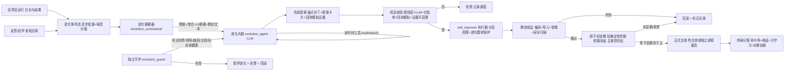
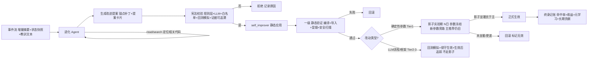
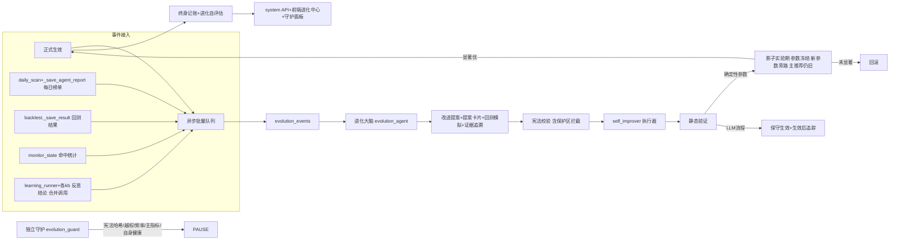
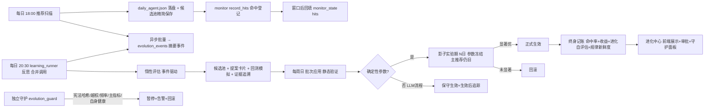

# 模块11：进化 Agent（Evolution Agent）— 全项目自我进化核心 ⭐

> 用户核心需求（原文提炼）：
>
> 1. "需要一个单独的 agent 可以接受反思与自学的结果"
> 2. "具有全项目的读写能力，可以优化任何功能，不限制，具有顶级的自我进化能力"
> 3. "这个得严格束缚，严格束缚的标准就是提高预测未来上涨的概率"
> 4. "全功能：不论前端后端，数据管理还是回测、每日推荐等等所有功能都要把报错日志传给这个 agent，结果也得给这个 agent 查看"
> 5. "但是要节省 token"
>
> **v8 修订版**：在 v7（A/B/C/D/E/F/G/H 组）基础上，纳入第八轮"实施/运维/数据/业务落地"审查修正 I1-I6：
> **MVP 最小闭环路径** / 进化系统自身运维保障 / 主指标窗口可配置对齐实际周期 / 候选池存储控制 /
> 审批超时策略 / 反思与评估合并调用。

---

## 一、一句话定位

一个**独立的进化大脑 Agent**：统一接收全项目（前端 / 后端 / 数据管理 / 回测 / 每日推荐）的**报错日志与运行结果** +
所有**反思与自学结论**，具有**全项目读写能力**；唯一宪法约束是**提高"预测未来上涨的概率"与"实际收益"**；
通过「增量 + 聚合 + 分层摘要 + 异步事件流 + 错误噪音分级 + 热路径缓存 + 惰性评估」机制**节省 token 且不阻塞主流程**；
所有改动遵循 **"提案 → 宪法校验（含历史回测模拟 + 证据可追溯）→ 影子实验期（仅确定性参数）→ 正式生效 → 终身记账"** 的**先验证后生效**闭环；
受**独立守护进程**监督（含进化系统自身运维保障），**进化模块自身不可被进化 Agent 修改**；
实施遵循 **MVP 最小闭环路径**（先跑通最小链路，再逐步扩展）。

与 plans/03-Agent系统.md §22（self_improver 执行器）分层：

- **§22 执行器** = 改代码的"手"（备份 / 验证 / 回滚 / 审计的机械能力）
- **本模块进化 Agent** = 决策的"大脑"（读全局信息 → 决定改什么 → 宪法校验 → 交执行器落地）

---

## 二、现状与差距

| 维度       | 现状（已实施）                    | 本模块目标                                                                  |
| ---------- | --------------------------------- | --------------------------------------------------------------------------- |
| 学习产物   | 反思/自学写 JSON 知识库（软知识） | 软知识 + 直接改代码（硬进化）                                               |
| 信息视野   | 各 Agent 只看自己的知识库         | 进化 Agent 看全项目日志与结果                                               |
| 改代码权限 | 无（代码参数写死）                | 全项目读写（分层权限 + 进化模块自保护）                                     |
| 进化标准   | 无统一标准                        | 宪法：提高预测上涨概率 + 实际收益（口径固化）                               |
| 生效能力   | 无                                | 参数热生效 / 独立进程安全重启                                               |
| 验证能力   | 无                                | 静态验证 + 影子实验期（确定性参数）+ 终身记账                               |
| 监督能力   | 无                                | 独立进化守护（外部监护 + 自身运维保障）                                     |
| 实施策略   | 无                                | **MVP 最小闭环先行**，避免一次性铺开                                        |
| Token/IO   | 无控制                            | 增量/聚合/分层摘要 + 异步批量 + 噪音分级 + 热路径缓存 + 惰性评估 + 合并调用 |

---

## 三、宪法约束（Constitution）——严格束缚的唯一标准

进化 Agent 的一切行为受最高准则约束，**不可违反**：

1. **唯一目标**：提高预测未来上涨的概率 + **实际收益**（以 §12 定义的主指标衡量）
2. **主指标口径固化不可变（H2）**：命中定义（T+5 上涨 vs 超额）、收益口径由配置**硬编码且标记"不可进化"**——进化 Agent 只能优化参数，不能改主指标定义本身（防自欺选最容易达标的定义）
3. 任何改动必须能**论证指向该目标**；与预测/收益无关的改动（纯重构 / 美化 / 炫技）一律拒绝
4. 每次改动遵循 **§7 进化闭环**：静态验证 → **影子实验期（仅确定性参数，生效前对照）** → 正式生效 → 终身记账
5. 禁止破坏现有稳定功能；改动必须可回滚、可审计、有版本、可解释（关联触发它的反思教训）
6. **不牺牲样本外稳健性**（C3）：禁止优化到历史噪声（防过拟合）
7. **不实无效补丁**（D7）：自动提案必须通过语法白名单；prompt 类改动默认人工审批（F9）；人工审批可放行危险操作（E10）
8. **最小改动原则（G3）**：优先微调参数（小步、一参数一改）；禁止大改已验证逻辑（除非有极强回测模拟证据）
9. **进化模块自保护（H1）**：`evolution_agent.py` / `evolution_config.json`（宪法部分）/ `self_improver.py` / `evolution_guard.py` **禁止被进化 Agent 修改**（除非人工审批）；违反 → 守护进程拦截 + 暂停进化 + 告警
10. 违反宪法 → 系统拒绝提案并记录原因（evolution_decisions.json）

> 一句话：**进化的唯一目的就是让系统更准地预测上涨、更稳地赚钱，且进化系统本身不能被自己摧毁。**

---

## 四、总体架构（先验证后生效的闭环 + 独立守护 + 自身运维）



### 4.1 分层权限（A1：全项目覆盖 ≠ 无验证门槛）

| 层级                 | 范围                                                                                                                                    | 验证门槛                                             | 默认策略                           |
| -------------------- | --------------------------------------------------------------------------------------------------------------------------------------- | ---------------------------------------------------- | ---------------------------------- |
| **Tier1 策略参数区** | 兑现度阈值 / 分块参数 / 时间衰减 / score_adjust 区间 / 风控阈值 / feature-flag 默认值（**确定性数值/规则**）                            | 静态验证 + **影子实验期**                            | 自动改 + 参数热生效                |
| **Tier2 业务逻辑区** | Agent 编排细节 / 检索逻辑 / 精筛/决策规则 / 前端组件逻辑（**含 LLM 流程**）                                                             | 更强证据 + 回测模拟 + **生效后追踪（不走影子，G1）** | 自动改（需更强证据）+ 独立进程重启 |
| **Tier3 核心框架区** | [`main.py`](ai-quant-agent/backend/app/main.py) 调度 / [`ws.py`](ai-quant-agent/backend/app/api/ws.py) 采集 / 数据库迁移 / 前端构建链路 | 高门槛 + 人工审批（hybrid）                          | 默认只读或人工审批                 |
| **进化模块保护区**   | `evolution_agent.py` / `evolution_config.json`（宪法）/ `self_improver.py` / `evolution_guard.py`（H1）                                 | **禁止进化 Agent 修改**                              | 仅人工审批                         |

"不限制"指**覆盖范围广**（前后端任意功能），而非"无验证门槛"——越靠近核心，门槛越高；**进化系统自身在保护区外**。

---

## 五、全局信息接入（所有模块报错日志 + 运行结果）

统一汇聚到 `evolution_events`，进化 Agent 通过摘要器消费：

| 来源       | 事件            | 内容                                                           |
| ---------- | --------------- | -------------------------------------------------------------- |
| 每日推荐   | 榜单 + 命中回填 | 推荐标的 / 实际 T+1~T+N 涨幅 / 是否命中                        |
| 回测       | 结果 + 归因     | 命中率 / 特征归因 / A-B 对比                                   |
| 数据管理   | 采集状态 + 错误 | 采集失败 / 数据缺口 / API 报错                                 |
| 政策知识库 | 检索 + 兑现度   | 检索命中 / 三态信号方向 / 板块涨幅                             |
| 反思/自学  | 教训 + 实证     | reflect / attribution / policy_impact / news_lesson / decision |
| 前端       | 操作日志 + 报错 | 页面异常 / 接口 4xx-5xx                                        |
| 后端全局   | 未捕获异常      | 异常堆栈 / 关键模块错误                                        |

### 5.1 低成本接入（B1：复用现有落盘，最小侵入）

- **优先复用现有落盘**，增量解析：`daily_recommend/*.json`、`backtest_results/*.json`、`monitor_state.json`、
  `quant.log`/`backend.log`、各 `*_kb.json`
- **关键节点轻量钩子**：统一 logger 加错误/告警写入事件流的 Handler；推荐/回测完成时上报一行结构化摘要
- **增量游标**：只消费"上次进化之后"的新事件

### 5.2 日志 Hook 防重入 + 异步批量（E1/E15）

- **防重入（E1）**：`EvolutionEventHandler.emit()` 内用 `threading.local` 标志置位，emit 内**禁止调用 logger**；写事件失败/慢时静默丢弃，绝不回流日志造成递归风暴
- **异步批量写入（E15）**：事件先进内存队列，后台线程批量 flush，不阻塞主流程
- **容量上限**：`evolution_events` 滚动删除（如保留最近 3 个月 / 10 万条）

### 5.3 错误噪音分级（F4）

- 错误分级：**单股/单源失败 = 噪音**（降权、聚合计数）；**全量失败 / 模式性错误 / 命中率骤降 = 高价值**（进 L0）
- 避免进化 Agent 被采集大量重复噪音淹没（ws.py 限频/单股失败）

---

## 六、Token 节省机制（关键）

1. **增量拉取**：游标/时间戳，只处理新事件
2. **错误聚合去重 + 噪音分级（F4）**：同签名聚合计数；噪音错误只记频次不进 L0
3. **L0 / L1 分层摘要 + 教训文本（G8）**：L0 必读（≈300 token），带上最新/最相关教训内容；L1 按需深读
4. **裁剪**：错误只传堆栈前 5 行；结果只传统计，不传全量 JSON
5. **对话压缩 + 状态快照（E5）**：system prompt 固定；每轮持久化状态快照，滚动摘要只引用快照 id
6. **失败冷却（B3）**：连续提案被拒/回滚达阈值 → 冷却期 + 置信度衰减
7. **超预算降级**：当日 LLM 消耗超限 → 只出建议不动手
8. **调度统一（D13）**：评估与批次分离
9. **成本限频（E9）**：进化 Agent 自身 DeepSeek 调用设独立预算/频次上限
10. **热路径缓存（G5）**：精筛热路径读 `evolution_config` 用进程内缓存 + mtime 检查
11. **惰性评估（H4）**：评估改为**事件驱动 + 惰性**——有显著新事件 / 错误突增 / 新反思教训 / 命中率变化才触发，稳定期不跑每日定时（低频保底，如每 3 日一次）
12. **合并调用（I6）**：反思（`learning_runner`）与进化评估**合并**——进化评估直接消费反思结果/教训摘要，**不重复调用 LLM** 重新分析（降本）

> 目标预算：单次评估 L0 ~300 token + 候选提案若干（每个 ~1.5k token）；因惰性评估 + 合并调用，实际年消耗大幅降低。

---

## 七、进化决策闭环（F1 时序 + G1 适用范围 + G2 证据追溯 + H3 参数冻结）



### 7.1 读代码工具（D6）

- 进化 Agent 具备 `read_file(path)` / `search(keyword)`，按需定位与深读相关代码（L1）
- `evolution_config.json` 登记**可进化参数锚点表**：`参数名 → 文件 + 锚点文本`

### 7.2 锚点补丁 + 提案卡片（D2 + E8）

```
提案补丁 = {
  "file": "app/agents/policy_agent.py",
  "anchor_old": "if gain_r >= 0.15:",
  "anchor_new": "if gain_r >= 0.12:",
  "type": "threshold",
  "evidence_src": "monitor_state.json hits 近30日区间统计",   # G2 证据必须可追溯
  "evidence": "...", "backtest_sim": {...}, "expected_impact": "...", "confidence": 0.7,
  "human_summary": "..."
}
```

- 执行器按 anchor_old 精确文本定位 + **唯一性校验**（匹配 0/≥2 处即拒绝）；禁止行号补丁；禁止整文件替换
- **提案卡片（E8）**：每个提案附带人类可读摘要，供 hybrid 人工审批界面展示

### 7.3 宪法校验（B2 + D7 + F3 + F5 + F9 + G2 + H1）

- **规则层**：Tier 范围、类型、可量化证据、**提案证据样本量 ≥30**、主指标相关、依赖检测（F5）、**目标文件是否在进化模块保护区（H1）**
- **历史回测模拟证据（F3）**：提案改参数后，用现有历史数据快速离线回测命中率+收益变化
- **证据可追溯（G2）**：`evidence` 必须引用可验证数据源（`monitor_state`/`probability_table`/`daily` 具体区间），规则层校验证据真实性，无法追溯 → 拒绝
- **依赖管理（F5）**：改动同一函数/参数的提案归同一批次，避免中间态自相矛盾
- **危险白名单（D7）**：自动提案只允许数值/字符串赋值、简单 if、prompt 文本替换；禁止新增 import / exec / eval / os / 删文件 / 网络请求
- **prompt 注入防护（F9）**：prompt 类改动默认人工审批
- **人工放行（E10）**：hybrid 下 Tier3 人工审批可放行危险操作（标注）
- **LLM 层**：语义合理性判断（防把噪声当规律）

### 7.4 一级静态验证（上线前，即时）

- 备份 → 应用锚点补丁 → `py_compile` + 模块导入 + 冒烟测试 + D7 AST 安全扫描
- 后端用 `py_compile`；**前端用 `vite build` / `vue-tsc` / lint**（A6/F10）

### 7.5 影子实验期（F1 时序 + G1 适用范围 + G6 期长 + H3 参数冻结）

- **适用范围（G1）**：影子实验**只适用于确定性参数**（Tier1 数值阈值 / 风控规则 / score_adjust 规则）——数值计算旁路可复现。**涉及 LLM 决策链路的改动（Tier2/3）无法影子**，改为"历史回测模拟 + 保守生效 + 生效后追踪"
- **时序**：静态验证通过后，**新参数以"影子/旁路"方式运行 N 个交易日**，**主推荐仍用旧参数**（E3 独立存 `evolution_shadow.db`）
- **实验期隔离（F6）+ 参数冻结（H3）**：影子实验期内，主推荐流程/数据源绝对不变，**被实验的参数加锁**——禁止其他改进批次、人工手动修改触碰该参数，到期才释放（防版本漂移污染同期对照）
- **期长控制（G6）**：影子期 ≤10 交易日，可并行 2-3 个确定性参数影子实验
- **裁决**：影子命中率 + 收益**显著优于主**（样本 ≥150、提升 ≥5pp、z 检验 p<0.1）→ **正式生效**；未显著/更差 → 回滚
- **周期（D9）**：T+5 需 5 交易日出首结果，总周期 = 观察 N 日 + T+5 等待

### 7.6 执行超时与异常降级（E14）

- 进化 Agent 单轮执行（LLM/提案/校验/回测模拟）设超时（如 60s），超时/异常 → 跳过本轮、记录、不阻塞下次

---

## 八、全项目读写权限、安全、生效机制、守护与自身运维（D1/D5/D7/D10/D12 + E2/E4/E10/E13 + G5/G9 + H1 + I2）

### 8.1 分层权限与安全

- 全项目可改，按 **§4.1 分层权限**控制门槛；**进化模块保护区（H1）除外**——`evolution_agent.py`/`evolution_config.json`（宪法部分）/
  `self_improver.py`/`evolution_guard.py` **禁止被进化 Agent 修改**（仅人工审批）
- 所有改动**必须**走 self_improver（备份 .bak → 验证 → 回滚 → 审计），禁止绕过；失败即回滚；**永不阻塞每日推荐/采集主流程**
- **版本快照（D5）**：每次改进 = 完整参数集 diff（git 文件级 + evolution_config 参数集版本）；同依赖改进归同一批次；回滚按版本整体恢复

### 8.2 独立进化守护（H1 核心：外部监护 + 自身运维保障 I2）

`evolution_guard.py` —— **不受进化 Agent 控制的独立监督模块**：

- **宪法哈希校验**：对 `evolution_config.json` 的"宪法部分"维护哈希基线，进化 Agent 试图篡改 → 拦截 + 暂停进化 + 告警
- **越权拦截**：进化 Agent 提案目标落在**进化模块保护区** → 直接拒绝
- **频率监控**：改进频率异常 / 连续失败 → 触发 B3 冷却 + 告警
- **主指标监控**：进化期间主指标持续下降 → 自动**暂停进化 + 回滚最近改进 + 告警**
- **自身运维保障（I2）**：守护同时监控**进化系统自身健康**——
  - 进化模块崩溃/卡死 → 自动重启进化模块（或降级为"只评估不应用"）
  - `evolution_events.db` / `evolution_shadow.db` 磁盘/行数超阈值 → 告警 + 滚动清理
  - 进化 Agent LLM 调用失败率异常 → 告警 + 冷却
- **自评估报告**：生成"进化 Agent 报告"（F8）供人工查看
- 守护进程自身**独立于进化 Agent**，进化 Agent 无法禁用/修改守护

### 8.3 生效机制（D1 + E2 + E4 + G5 + G9）

- **Tier1 参数热生效（E4）**：可进化参数**从硬编码改为读 `evolution_config.json`**；**改造点清单（F2）**见 §15.5
- **热路径缓存（G5）**：精筛热路径读 config 用**进程内缓存 + mtime 检查**
- **Tier2/3 独立进程重启（E2）**：进化 Agent 运行在 uvicorn 进程内**不能自己 kill 自己**——由**独立重启脚本**（复用 `start_all.sh` + nohup 延迟）在**避让窗口**执行 → 健康检查 → 失败自动回滚 .bak 恢复旧进程
- **单机重启实操（G9）**：`scripts/restart_backend.sh` 处理当前 uvicorn PID / 端口占用检测 / 启动失败回滚
- **前端发布（D12/F10）**：`vite build + vue-tsc` 最小验证 → nginx 部署 → 生效；默认人工审批
- **多 worker 一致性（E13）**：单 worker 可暂缓；热生效参数建议优先从 DB/共享缓存读取（预留）

### 8.4 审批模式与告警（B4 + D10 + I5 审批超时）

- **审批模式（B4）**：`auto / manual / hybrid`（推荐 hybrid：Tier1 自动、Tier2/3 + prompt + 进化模块改动人工确认，展示提案卡片）
- **审批超时策略（I5）**：hybrid/manual 下，待审批提案**超时未处理**（如 N 天可配置）→ **默认拒绝**（候选池清理），或降级为"仅 Tier1 自动"继续运行——避免无人值守时进化长期停摆、候选池/影子实验堆积
- **进化告警（D10）**：命中率骤降 / 改进过频 / 回滚过多 / 守护拦截 / **进化系统自身异常（I2）** → 告警（复用 [`monitor.py`](ai-quant-agent/backend/app/backtest/monitor.py)）

### 8.5 版本管理（B5）

- 与 git 集成：每次改进自动 `git commit`（带提案 id），可回退任意历史版本；无 git 时保留 `.bak` 链

---

## 九、与现有反思/自学层的衔接（职责边界 C2 + 可解释 E12 + 自评估 F8 + 合并 I6）

- [`learning_runner.py`](ai-quant-agent/backend/app/agents/learning_runner.py)：每日反思后，产出**反思结论摘要**写入事件流，并触发进化 Agent（惰性触发 H4）
- **合并调用（I6）**：进化评估**直接消费反思结论/教训摘要**（`reflect_kb`/`news_lesson_kb`/`decision_kb` 等），**不重复调用 LLM** 重新分析——反思"发现问题"、进化"决策改造"共享一次分析结果
- 各知识库（`reflect_kb` / `attribution_kb` / `policy_impact_kb` / `news_lesson_kb` / `decision_kb`）是决策依据
- **可解释回溯（E12）**：每个改进提案**关联触发它的反思教训 id**；改进生效/回滚后记录"反思→改进→效果"
- **进化 Agent 自评估（F8）**：统计提案采纳率 / 影子通过率 / 生效后提升率，输出"进化 Agent 报告"，反馈决策先验与人工
- **数据质量维度（H6）**：进化 Agent 输出不只限"策略参数/代码"，还应包含**数据质量修复建议**——发现采集缺口 → 建议补采/修采集器/加索引，因为数据是预测的基础

---

## 十、数据资产

| 文件                         | 内容                                                                                                                                                                     |
| ---------------------------- | ------------------------------------------------------------------------------------------------------------------------------------------------------------------------ |
| `evolution_events.db`        | 全项目事件流（异步批量 + 噪音分级 + 容量滚动上限 + 增量游标）                                                                                                            |
| `evolution_shadow.db`        | 影子实验期结果（确定性参数）（E3/F1/G1，独立于 monitor 主数据）                                                                                                          |
| `evolution_snapshots.json`   | 进化状态快照（E5：每轮关键指标 + 候选池摘要 + 教训文本引用）                                                                                                             |
| `evolution_ledger.json`      | 进化终身记账（G4）：每项改进从生效到被替代的累积超额收益 / 生命周期                                                                                                      |
| `evolution_decisions.json`   | 决策历史：提案（含提案卡片 + 回测模拟 + 证据可追溯 G2）/ 校验 / 影子 / 生效或拒绝                                                                                        |
| `improve_effect.json`        | 效果追踪（命中率+收益 F7 + 关联反思教训 id E12 + 元学习）                                                                                                                |
| `evolution_report.json`      | 进化 Agent 自评估报告（F8）：采纳率/影子通过率/生效后提升率                                                                                                              |
| `evolution_guard_state.json` | 守护状态（H1/I2）：宪法哈希基线 / 越权拦截 / 暂停标记 / **自身健康记录**                                                                                                 |
| `self_improve_log.json`      | 执行器审计（§22，前后 diff / 依据 / 结果 / 版本号）                                                                                                                      |
| `evolution_config.json`      | 进化配置（主指标[固化 H2] / 窗口[可配置 I4] / 样本门槛 / 观察窗口 / 冷却期 / 审批模式+超时 / token 预算 / 参数锚点表 / 生效方式 / 重启避让窗口 / 影子期长 / 保护区清单） |

> **候选池存储控制（I3）**：`daily_*_agent.json` 的候选池全量保存**只存必要字段**（ts_code + 关键特征 + 当日参数 + 命中），
> 不做全量特征快照；可选压缩/按周归档，控制磁盘增长。

---

## 十一、触发与调度（批次 + 冷却 A4/B3 + 统一 D13 + 避让 E2 + 期长 G6 + 惰性 H4 + 超时 I5）

- **惰性评估（H4）**：评估由**事件驱动**——显著新事件 / 错误突增 / 新反思教训 / 命中率变化才触发；稳定期不跑每日定时（低频保底，每 3 日一次）
- **每周批次应用（D13）**：每周评审候选池（同依赖同批 F5）→ 静态验证 → **影子实验期（确定性参数）或保守生效（LLM 改动）**
- **影子期调度（G6）**：确定性参数影子期 ≤10 交易日，可并行 2-3 个影子实验；`shadow_settle` 每日结算
- **参数冻结（H3）**：影子期被实验参数加锁，禁止其他改动触碰
- **审批超时（I5）**：待审批提案超时未处理 → 默认拒绝或降级仅 Tier1
- **重启避让（E2）**：Tier2/3 正式生效的重启只在空闲窗口执行
- **冷却期（A4）**：同一参数/文件改动后 N 交易日（如 10 日）内不再重复改
- **失败冷却（B3）**：连续被拒/回滚达阈值 → 冷却 X 天 + 置信度衰减
- **触发**：事件驱动评估 / 异常突增 / 手工 `POST /api/v1/system/evolve`
- **上限**：每批最多 M 个提案、LLM 消耗上限、超限降级

---

## 十二、主指标与效果评估（A3/C1/D4/D8/D9/D11 + E6/E11 + F7 + G4/G7/G8/G10 + H2/H5/H7 + I4）

### 12.1 主指标（A3 + E11 + F7 + G10 + H2 固化 + I4 窗口可配置）

- **主指标（双约束，F7，口径固化 H2）**：
  - ① **T+5 超额命中率**（命中 = 表现优于同期全市场平均）
  - ② **T+5 平均超额收益 / 盈亏比**
- **窗口可配置（I4）**：评估窗口（T+1 / T+5 / T+20）**可配置且默认对齐用户实际持有周期**（短线 T+1/T+5，中线 T+20）——
  需在实施时与用户确认实际策略周期，避免"进化最优"与用户使用错位
- **口径固化（H2）**：主指标定义由配置硬编码且标记"不可进化"——进化 Agent 只能优化参数，不能改指标口径
- **收益口径（G10）**：超额收益为**理论收益**（前复权涨幅，无滑点/成本），文档明确此边界
- **校准度**：辅以 Brier score；**辅助指标**：回测 A/B 命中率 / 归因一致性 / 信号方向正确率
- **基准数据（E11）**：`monitor_state` 无全市场基准——超额指标需从 `index_daily`/`daily` 现算同期全市场均值，或退化为绝对指标

### 12.2 防过拟合（C1）+ 最小改动原则（G3）

- 参数/规则改动在训练/验证/样本外分段验证；大改动（Tier2/3）需样本外验证
- **最小改动原则（G3）**：优先微调参数（小步、一参数一改）；禁止大改已验证逻辑（除非强回测模拟证据）
- 遵循回测 §5 A/B 与显著性检验

### 12.3 影子实验期（D3 + E3/E7 + F1/F6 + G1/G6 + H3）

- **生效前**：确定性参数以影子/旁路方式运行 N 日（≤10 交易日，G6），主推荐仍旧（F1）
- **适用范围（G1）**：仅确定性参数（Tier1）；LLM 流程改动走"回测模拟 + 保守生效 + 生效后追踪"
- **参数冻结（H3）**：影子期被实验参数加锁，禁止其他改动触碰（含人工）
- 当日保存候选池全量（**精简字段 I3**）+ 旁路计算；影子结果独立存 `evolution_shadow.db`（E3）；实验期主流程绝对不变（F6）

### 12.4 动态验证裁决参数（D4 + D14 + H5 对齐）

- **提案证据门槛**：≥30 样本（宪法校验用）
- **影子实验样本门槛**：≥150 样本（观察 15-30 交易日）
- **对齐 plans/10 验证体系（H5）**：进化 Agent 的验证标准**复用 plans/10 回测可信度体系**（A/B 对比、McNemar 检验、样本量要求）
- 命中率/收益最小提升 ≥5pp；显著性 z 检验 p<0.1；未达显著 → 维持原状（非失败回滚）

### 12.5 元学习（D8 + E6）

- `improve_effect.json` 聚合**改进类型 × 成功率**；**最小统计样本**（如 ≥20 个同类改进才更新先验），低于阈值用全局先验

### 12.6 验证周期（D9）+ 慢进化现实（G7）

- 窗口命中率需对应等待交易日；影子总周期 = 观察 N 日 + 窗口等待
- **慢进化现实（G7）**：推荐池小（每日 TOP-N≈10），单次影子结论需约 1 个月，进化节奏慢是现实——明确"慢进化"预期

### 12.7 漂移回归（D11）+ 长期记账（G4）+ 规律新鲜度（H7）

- 每季度 / 每 N 次改进后跑"默认参数基线"对比；改进后整体不如默认 → 回归评审
- **长期记账（G4）**：`evolution_ledger.json` 记录每项改进**从生效到被替代的整个生命周期的累积超额收益**，结合市场环境标记
- **规律新鲜度（H7）**：A 股短线规律衰减快（周级）——**每月重算 `probability_table.json`** 并对比进化优化的是否仍当前有效；规律显著失效 → 触发"规律重估"

### 12.8 进化 Agent 自评估（F8）+ 守护报告（H1/I2）

- 定期输出"进化 Agent 报告"：提案采纳率 / 影子通过率 / 生效后提升率；低采纳率 → 降权进化 Agent 或人工介入
- 守护输出"守护报告"：宪法哈希校验结果 / 越权拦截数 / 暂停事件 / **进化系统自身健康（I2）**

---

## 十三、实施策略与清单（MVP 先行 I1）

### 13.1 MVP 最小闭环路径（I1 核心：先跑通，再扩展）

**绝不一次性铺开** 8+ 模块，按"最小可行闭环 → 验证 → 逐步扩展"推进：

- **MVP（第 1 阶段）**：只优化 **1-2 个确定性参数**（如兑现度阈值）+ **简化影子**（无参数冻结、单实验）+ **无前端**（人工通过日志/API 看结果）+ **仅 Tier1 自动**
  - 链路：事件流（logger Hook + 复用落盘）→ 惰性评估（手动触发）→ 提案（LLM + 回测模拟）→ 静态验证 → **人工确认** → 简化影子 → 生效 → monitor 追踪
  - 目的：**跑通"采集→评估→提案→验证→生效→追踪"完整闭环**，验证进化链路真实可行
- **扩展 1（第 2 阶段）**：接入全部 Tier1 参数热生效（F2 改造）+ 完整影子实验（参数冻结 H3 + 并行 G6）+ 独立守护（H1）+ 终身记账（G4）
- **扩展 2（第 3 阶段）**：Tier2/3（独立进程重启 E2）+ 前端「进化中心」+ 惰性评估 H4 + 合并调用 I6 + 规律新鲜度 H7

> MVP 先行可让问题在最小闭环中暴露（而非铺开后难定位），也验证"进化确实提升预测"后再投入完整工程。

### 13.2 实施清单（供 code 模式）

- [ ] **MVP**：`evolution_events`（防重入 logger Hook E1 + 异步批量 E15 + 噪音分级 F4 + 复用落盘 + 增量游标）+ `evolution_config.json`
- [ ] **MVP**：`evolution_summarizer.py`（L0/L1 摘要 + 错误聚合 + 状态快照 E5 + 教训文本 G8）
- [ ] **MVP**：`evolution_agent.py`（读摘要 + read/search + 提案生成 + 提案卡片 E8 + 宪法校验 + 回测模拟 F3 + 证据可追溯 G2 + 依赖管理 F5 + D7 白名单 + prompt 审批 F9 + 最小改动 G3 + 超时 E14 + 限频 E9 + 数据质量建议 H6）
- [ ] **MVP**：`self_improver.py`（含保护区拦截 H1）+ 简化 `evolution_shadow.py` + `evolution_apply.py`（Tier1 热生效改造 F2/G5）
- [ ] **扩展1**：完整 `evolution_shadow.py`（参数冻结 H3 + 并行 G6 + 隔离 F6 + 显著性裁决）+ `evolution_guard.py`（H1：宪法哈希/越权/频率/主指标 + **自身运维 I2**）+ `evolution_ledger.py`（G4）+ `improve_effect.py`（F7/E11/E6/F8 + 对齐 plans/10 H5）
- [ ] **扩展2**：Tier2/3 独立进程重启（E2/G9）+ main.py 调度（惰性 H4 + 影子结算 + 守护巡检 + 避让 E2 + 审批超时 I5）+ system API + 前端「进化中心」
- [ ] **扩展2**：learning_runner 合并调用（I6）+ 规律新鲜度 H7 + 窗口可配置对齐实际周期（I4）

---

## 十四、风险与诚实边界

- **自动改代码风险**：宪法校验（含 D7 + F3 + G2 证据追溯）+ 分层权限 + 备份 + 静态验证 + 影子实验期（确定性参数 G1）+ 独立进程重启 + 回滚 + git，多道护栏，永不阻塞主流程
- **自毁风险（H1）**：进化模块保护区 + **独立守护 evolution_guard**（外部监护 + **自身运维保障 I2**），防"自修改系统自毁"且进化系统自身可自愈
- **日志/IO 风险（E1/E15）**：事件流防重入 + 异步批量 + 噪音分级 + 容量上限 + 热路径缓存 G5 + **候选池精简存储 I3**
- **改进不一定有效**：`improve_effect.json` + 终身记账 G4 + 元学习（最小样本）+ 对齐 plans/10 H5，无效改进标记不再复用；进化 Agent 自身也被评估（F8）
- **工程复杂度（I1）**：**MVP 最小闭环先行**，避免一次性铺开失败
- **诚实边界**：参数优化不能保证提升命中率或收益，需实证验证；收益为理论收益（G10，无滑点/成本）；评估窗口需对齐实际策略周期（I4）；遵循 04-回测引擎 §5.7
- **进化速度**：默认"慢进化"（惰性评估 H4、每周批次、影子期 ≤10 日、冷却期、强验证、避让交易时段重启）
- **Token/成本**：惰性评估 + 合并调用（I6）+ 每日预算 + 限频，超限降级/停止
- **市场不可控**：影子实验用同期新旧对照 + 相对基准 + 规律新鲜度检查（H7），明确"不能保证"的边界
- **生效依赖**：改动若未走生效机制（§8.3）则不生效、影子实验失效——这是闭环运转的第一前提

---

## 十五、接入设计（落点到项目代码）⭐按规划读取项目后的具体接入方案

本节把 §4~§12 的抽象设计**逐项落到现有项目文件/函数/数据结构**，作为 code 模式实施的地图。

### 15.1 接入总览（模块 ↔ 进化大脑 + 守护）



### 15.2 事件上报接入（复用落盘优先 + 防重入 logger Hook）

| 模块            | 现有数据源                                                                                                                                   | 上报方式                                             | 具体接入点                                                                                                       |
| --------------- | -------------------------------------------------------------------------------------------------------------------------------------------- | ---------------------------------------------------- | ---------------------------------------------------------------------------------------------------------------- |
| 后端/全模块错误 | [`core/logger.py`](ai-quant-agent/backend/app/core/logger.py:11) 的 quant logger                                                             | **防重入 logger Hook（E1）+ 噪音分级（F4）**         | `setup_logger()` 加 `EvolutionEventHandler`（threading.local 防重入 + emit 禁调 logger + 异步入队 + 按签名分级） |
| 每日推荐        | `daily_YYYYMMDD.json` + `daily_YYYYMMDD_agent.json`（[`predictions._save_agent_report`](ai-quant-agent/backend/app/api/predictions.py:206)） | **复用落盘 + 1 行钩子**                              | 进化 Agent 读两文件；`_save_agent_report` 末尾追加"榜单摘要事件"；候选池全量保存（**精简字段 I3**）              |
| 命中回填        | [`monitor.record_hits`](ai-quant-agent/backend/app/backtest/monitor.py:93) 写 `monitor_state.json`                                           | **复用（命中数据）**                                 | 主指标命中数据源；基准从 index_daily 现算（E11）                                                                 |
| 回测            | [`backtest._save_result`](ai-quant-agent/backend/app/api/backtest.py:62) 落盘 `backtest_results/*.json`                                      | **复用落盘 + 1 行钩子**                              | 读 backtest_latest.json；`_save_result` 末尾追加"回测摘要事件"                                                   |
| 反思/自学       | [`learning_runner.run_all()`](ai-quant-agent/backend/app/agents/learning_runner.py:251) + 各 `*_kb.json`                                     | **复用落盘 + run_all 末尾触发（惰性 H4 + 合并 I6）** | `run_all()` 末尾调用 `evolution.evaluate()`（消费反思结果，不重复 LLM），写结论摘要 + 关联教训 id（E12）         |
| 数据管理采集    | [`ws.py`](ai-quant-agent/backend/app/api/ws.py) 采集                                                                                         | **logger Hook 覆盖 + 噪音分级**                      | 单股失败=噪音；全量失败/数据缺口=高价值（进 H6 数据质量建议）                                                    |
| 前端            | 前端 console/接口 4xx-5xx                                                                                                                    | 前端钩子（可选）                                     | 进化中心页上报到 `/system/evolve/event`                                                                          |

### 15.3 调度接入（[`main.py`](ai-quant-agent/backend/app/main.py:76) lifespan scheduler）

在现有 scheduler 基础上新增：

- `evolution_evaluate`：**事件驱动 + 惰性触发（H4）**（非每日定时；显著新事件/教训/命中率变化才跑）
- `weekly_evolution_apply`：每周日 22:00 —— 候选池批次应用（同依赖同批 F5）→ 静态验证 → 影子实验期（确定性参数）或保守生效（LLM 改动）
- `shadow_settle`：每日 —— 结算到期影子实验（含参数冻结释放 H3），裁决生效/回滚
- `evolution_guard_scan`：每日 —— 独立守护巡检（宪法哈希 / 越权 / 频率 / 主指标 / **自身健康 I2** / 规律新鲜度 H7）
- `pending_approval_cleanup`：每日 —— 审批超时清理（I5）
- 失败冷却 / 告警复用 `monitor.run_monitor` 通道

### 15.4 主指标数据源（复用 + 补充）

- **命中数据**：`monitor_state.json["hits"]`（date/ts_code/pred_prob/t5_ret/hit）——零新增
- **收益数据（F7）**：由 hits 的 `t5_ret` 聚合平均超额收益（需 E11 基准现算）；理论收益口径（G10）；**窗口可配置（I4）**
- **显著性**：复用 [`monitor._prop_ztest`](ai-quant-agent/backend/app/backtest/monitor.py:40)；对齐 plans/10（H5）
- **影子（F1/E3/E7/G1/H3）**：候选池全量当日保存（精简 I3）+ 旁路计算（仅确定性参数）+ 参数冻结，结果独立存 `evolution_shadow.db`
- **规律新鲜度（H7）**：每月重算 `probability_table.json`，对比进化优化参数是否仍对应当前有效规律

### 15.5 可进化参数锚点表 + 改造点清单（E4/F2 + G1 适用 + H1 保护区）

| 参数                   | 文件                                                                                             | 锚点（anchor_old）                           | 层级  | 生效                | 改造点类型（F2）                | 影子适用（G1） | 保护区（H1）               |
| ---------------------- | ------------------------------------------------------------------------------------------------ | -------------------------------------------- | ----- | ------------------- | ------------------------------- | -------------- | -------------------------- |
| 兑现度阈值 15%         | [`policy_agent.py`](ai-quant-agent/backend/app/agents/policy_agent.py:229)                       | `if gain_r >= 0.15:`                         | Tier1 | 热生效              | 函数内硬编码 → 改读 config      | ✅             | 否                         |
| 部分反应 5% / 回调 -3% | `policy_agent.py`                                                                                | `gain_r >= 0.05` / `gain_r <= -0.03`         | Tier1 | 热生效              | 函数内硬编码 → 改读 config      | ✅             | 否                         |
| 时效 max_age_days      | `policy_agent.py`                                                                                | `max_age_days=1095`                          | Tier1 | 热生效              | 函数内硬编码 → 改读 config      | ✅             | 否                         |
| CHUNK_SIZE             | [`policy_kb.py`](ai-quant-agent/backend/app/data/policy_kb.py:26)                                | `CHUNK_SIZE = 400`                           | Tier1 | 热生效              | 模块级常量 → 改读 config        | ✅             | 否                         |
| 时间衰减半衰期         | `policy_kb.py`                                                                                   | `d / 180.0`                                  | Tier1 | 热生效              | 函数内硬编码 → 改读 config      | ✅             | 否                         |
| 利好出货窗口           | [`news_agent.py`](ai-quant-agent/backend/app/agents/news_agent.py:21)                            | `n: int = 10`                                | Tier1 | 热生效              | 默认参数 → 改读 config          | ✅             | 否                         |
| 命中阈值               | `learning_runner.py` / `monitor.py`                                                              | `HIT_THRESHOLD = 0.05` / `HIT_RET_THRESHOLD` | Tier1 | 热生效              | 模块级常量 → 改读 config        | ✅             | 否                         |
| 教训触发次数           | `learning_runner.py`                                                                             | `MIN_COUNT_TO_FEEDBACK = 2`                  | Tier1 | 热生效              | 模块级常量 → 改读 config        | ✅             | 否                         |
| 精筛常量               | [`agents/__init__.py`](ai-quant-agent/backend/app/agents/__init__.py:27)                         | `MAX_POLICY_SECTORS = 5` 等                  | Tier2 | 重启                | 模块级常量 → 改读 config 或重启 | ❌ LLM 流程    | 否                         |
| score_adjust 区间      | [`prompts.py`](ai-quant-agent/backend/app/agents/prompts.py)                                     | `-20 到 10`                                  | Tier2 | 重启+人工审批（F9） | prompt 文本 → 需审批            | ❌             | 否                         |
| feature-flag           | [`core/config.py`](ai-quant-agent/backend/app/core/config.py:9)                                  | `agent_enabled` 等                           | Tier1 | 热生效              | 复用 Settings                   | ✅             | 否                         |
| **进化宪法/守护**      | `evolution_config.json`(宪法) / `evolution_agent.py` / `self_improver.py` / `evolution_guard.py` | 保护区                                       | -     | -                   | -                               | -              | **✅ 禁止进化 Agent 修改** |

> **改造点清单（F2）**：逐一登记"函数内硬编码 / 模块级常量 / 默认参数"三类改造点，全部改为每次调用读
> `evolution_config.json`（热路径用 mtime 缓存 G5）；未改造前由 self_improver 直接改代码锚点，改造后仅改配置。
> **影子适用边界（G1）**：仅确定性参数（Tier1）可走影子实验期；影响 LLM 流程的改动（Tier2/3）走保守生效+追踪。
> **保护区（H1）**：进化模块自身文件禁止被进化 Agent 修改，仅人工审批。

### 15.6 配置与生效接入

- `backend/data/evolution_config.json`：主指标[固化 H2] / 评估窗口[可配置 I4] / 样本门槛 / 观察窗口 / 冷却期 / 审批模式+超时 / token 预算 / 参数锚点表 / 重启避让窗口 / 影子期长 / 保护区清单
- **Tier1 热生效（E4/G5）**：模块读 evolution_config，热路径用进程内缓存 + mtime 检查
- **Tier2/3 独立进程重启（E2/G9）**：`evolution_apply.py` 写"待重启标记" → 独立重启脚本（`scripts/restart_backend.sh`）在避让窗口执行 → 健康检查 → 失败恢复
- **守护（H1/I2）**：`evolution_guard.py` 每日巡检（宪法哈希 / 越权拦截 / 频率 / 主指标 / **自身健康** / 规律新鲜度）
- **前端（D12/F10）**：`vite build + vue-tsc` 最小验证 → nginx 部署 → 生效（默认人工审批）

### 15.7 前端接入

- **API**（[`frontend/src/api/index.ts`](ai-quant-agent/frontend/src/api/index.ts:59) 新增 `/system/evolve` 组）：
  - `GET /api/v1/system/evolve`（决策历史 + 候选池 + 改进效果 + 提案卡片 + 影子实验看板 + 终身记账）
  - `POST /api/v1/system/evolve`（手工触发评估）
  - `POST /api/v1/system/evolve/rollback`（回滚指定改进）
  - `POST /api/v1/system/evolve/event`（前端错误上报）
  - `GET /api/v1/system/evolve/guard`（**守护报告 H1/I2**：宪法哈希 / 越权拦截 / 暂停事件 / 自身健康）
- **页面**：新增 `Evolution.vue`（事件流 / 决策历史 / 影子实验看板 / 改进效果 + 终身记账 / 提案卡片审批（含**超时 I5**）/ 一键回滚 / 告警 / 进化 Agent 报告 / 守护面板），路由挂侧边栏「进化中心」

### 15.8 数据流（端到端，先验证后生效 + 分型处理 + 守护）



### 15.9 MVP 实施路径（I1：先跑通最小闭环，再扩展）

**第 1 阶段 MVP（最小可行闭环）**——只做 1-2 个确定性参数，验证进化链路真实可行：

1. `evolution_events` 汇聚（logger Hook E1 + 复用落盘 + 增量游标）+ `evolution_config.json`（只登记 1-2 个锚点）
2. `evolution_summarizer.py`（L0/L1 摘要）
3. `evolution_agent.py`（简化：提案生成 + 宪法校验 + 回测模拟 F3 + 证据追溯 G2）
4. `self_improver.py`（简化：锚点补丁 + 备份/静态验证/回滚/审计）
5. `evolution_apply.py`（Tier1 热生效改造 F2，1-2 个参数）
6. **人工确认**（MVP 期不自动应用，提案经人工确认后生效）→ monitor 追踪

**第 2 阶段扩展 1**：完整影子实验（参数冻结 H3 + 并行 G6）+ 独立守护（H1/I2）+ 终身记账（G4）+ 惰性评估（H4）

**第 3 阶段扩展 2**：Tier2/3 独立进程重启（E2/G9）+ 前端「进化中心」+ 合并调用（I6）+ 规律新鲜度（H7）+ 审批超时（I5）+ 窗口对齐实际周期（I4）

> MVP 先行的意义：用最小代价验证"采集→评估→提案→验证→生效→追踪"整条闭环确实能提升预测，
> 确认有价值后再投入完整工程，避免 8+ 模块一次性铺开的高风险。

---

## 十六、实施落地记录（代码 ↔ 规划逐项对照）✅

> 本节记录已按 §13.2/§15 落地的代码与验证结果，作为规划"已实现"的可追溯底账。
> 核对方式：`py_compile` + 模块导入自检 + 端到端 API 实测 + 单测闭环。

### 16.1 落地文件清单（全部 ✅ 编译通过 + 导入正常）

| 模块     | 文件                                                                                   | 关键能力（对齐标注）                                                                                                                   |
| -------- | -------------------------------------------------------------------------------------- | -------------------------------------------------------------------------------------------------------------------------------------- |
| 事件流   | [`evolution_events.py`](ai-quant-agent/backend/app/agents/evolution_events.py)         | logger Hook 防重入 E1 + SQLite 增量游标 + **异步批量 E15**（后台线程批量落库）+ **噪音分级 F4**（仅 ERROR/WARNING）+ 队列满丢弃限频 E9 |
| 配置     | [`evolution_config.py`](ai-quant-agent/backend/app/agents/evolution_config.py)         | mtime 缓存热路径 G5 + 读失败回退默认 J1 + get/set/params_table/protected_files                                                         |
| 配置数据 | [`evolution_config.json`](ai-quant-agent/backend/data/evolution_config.json)           | 10 个可进化参数锚点 + 宪法（main_metric immutable H2）+ thresholds + approval_timeout_days I5 + eval_window I4 + 保护区 H1             |
| 摘要     | [`evolution_summarizer.py`](ai-quant-agent/backend/app/agents/evolution_summarizer.py) | L0 摘要 + **E5 状态快照**（evolution_snapshots.json 滚动 200 条）                                                                      |
| 进化大脑 | [`evolution_agent.py`](ai-quant-agent/backend/app/agents/evolution_agent.py)           | LLM 提案 + 宪法校验（含样本门槛 D14 + H3 冻结 + 保护区 H1）+ 回测模拟 F3 + 证据追溯 G2 + **E8 提案卡片** + 超时 E14（复用 llm_client） |
| 执行器   | [`self_improver.py`](ai-quant-agent/backend/app/agents/self_improver.py)               | Tier1 热生效 + Tier2/3 代码锚点补丁（备份/静态验证/失败恢复）+ 保护区拦截 H1 + 待重启标记 + 审计 + 回滚 + H3 冻结拦截                  |
| 影子     | [`evolution_shadow.py`](ai-quant-agent/backend/app/agents/evolution_shadow.py)         | 简化影子旁路 F1 + 显著性裁决 + **参数冻结 H3** + **并行上限 G6**（3）+ 期长上限 + **隔离 F6**（旁路，主流程不变）                      |
| 效果追踪 | [`improve_effect.py`](ai-quant-agent/backend/app/agents/improve_effect.py)             | F7 独立模块：基线记录 + 命中率对比追踪（evolution_shadow 复用）                                                                        |
| 守护     | [`evolution_guard.py`](ai-quant-agent/backend/app/agents/evolution_guard.py)           | 宪法哈希 + 越权拦截 + 频率监控 + 主指标 + 自身健康 I2 + **规律新鲜度 H7**                                                              |
| 记账     | [`evolution_ledger.py`](ai-quant-agent/backend/app/agents/evolution_ledger.py)         | G4 终身记账（开账/更新/结账/报告）                                                                                                     |
| 接入 API | [`system.py`](ai-quant-agent/backend/app/api/system.py)                                | evolve 全套：status/evaluate/confirm/settle/rollback + events/event + restart(/status)                                                 |
| 事件钩子 | [`predictions.py`](ai-quant-agent/backend/app/api/predictions.py:238)                  | 榜单摘要事件（每日推荐）                                                                                                               |
| 事件钩子 | [`backtest.py`](ai-quant-agent/backend/app/api/backtest.py:71)                         | 回测摘要事件                                                                                                                           |
| 合并调用 | [`learning_runner.py`](ai-quant-agent/backend/app/agents/learning_runner.py:251)       | 反思完成事件 + **I6 合并调用**（run_all 末尾触发 evaluate）                                                                            |
| 调度     | [`main.py`](ai-quant-agent/backend/app/main.py:121)                                    | 守护巡检 03:00 + 影子结算 03:30 + **惰性评估 H4** 每 3 日 + **每周日批次应用 D13** + **审批超时清理 I5**                               |
| 重启     | [`restart_backend.sh`](ai-quant-agent/scripts/restart_backend.sh)                      | E2/G9 独立进程重启：PID/端口/优雅停止/健康检查/失败回滚/避让窗口                                                                       |
| F2 改造  | `policy_agent`/`news_agent`/`policy_kb`/`monitor`/`reflect_agent`/`learning_runner`    | 6 参数硬编码→读 config 热生效（F2/E4/G5）                                                                                              |
| 前端     | [`Evolution.vue`](ai-quant-agent/frontend/src/views/Evolution.vue)                     | 进化中心：候选池/影子/守护/终身记账/事件流/回滚/重启 + 前端事件上报                                                                    |
| 前端     | [`api/index.ts`](ai-quant-agent/frontend/src/api/index.ts) + router + Layout           | evolve API + 「🧬 进化中心」路由与导航                                                                                                 |

### 16.2 已登记的 10 个可进化参数（F2/E4）

| 参数                        | 默认  | 范围     | 层级 | 生效   | 消费点                                                                              |
| --------------------------- | ----- | -------- | ---- | ------ | ----------------------------------------------------------------------------------- |
| `policy_priced_threshold`   | 0.15  | 0.05-0.4 | T1   | 热生效 | [`policy_agent`](ai-quant-agent/backend/app/agents/policy_agent.py) 兑现度          |
| `policy_partial_threshold`  | 0.05  | 0.0-0.3  | T1   | 热生效 | `policy_agent` 部分反应                                                             |
| `policy_reversal_threshold` | -0.03 | -0.2-0.0 | T1   | 热生效 | `policy_agent` 回调                                                                 |
| `policy_max_age_days`       | 1095  | 90-3650  | T1   | 热生效 | `policy_agent` RAG 时效                                                             |
| `policy_kb_chunk_size`      | 400   | 200-800  | T1   | 热生效 | [`policy_kb`](ai-quant-agent/backend/app/data/policy_kb.py) 分块                    |
| `policy_kb_decay_halflife`  | 180   | 30-720   | T1   | 热生效 | `policy_kb` 时效衰减                                                                |
| `news_gain_window`          | 10    | 3-30     | T1   | 热生效 | [`news_agent`](ai-quant-agent/backend/app/agents/news_agent.py) 涨幅窗口            |
| `hit_threshold`             | 0.05  | 0.01-0.2 | T1   | 热生效 | `monitor`/`learning_runner`/`reflect_agent` 命中                                    |
| `lesson_min_count`          | 2     | 1-5      | T1   | 热生效 | `learning_runner`/`reflect_agent` 教训次数                                          |
| `policy_max_sectors`        | 5     | 1-10     | T2   | 重启   | [`agents/__init__.py`](ai-quant-agent/backend/app/agents/__init__.py:27) 精筛行业数 |

### 16.3 验证记录（实测通过）

- **后端全模块** `py_compile` 通过；进化 8 模块 + `improve_effect` 导入自检 OK
- **H3/G6 闭环**：3 个并行影子 OK，第 4 个拒绝（"并行影子实验已达上限"），冻结标记/释放正确
- **Tier2 闭环**（E2/G9）：`policy_max_sectors 5→7` 代码锚点补丁 → 待重启标记 → config 同步 → `rollback_last` 恢复代码+config+清标记 ✅
- **重启脚本**：`--force` 完整重启（PID 更换 + 健康检查 + exit 0）✅
- **E5 快照**：`evolution_snapshots.json` 写入正常
- **事件流**：`/evolve/events` + `/evolve/event` 端到端（含前端页面打开上报 INFO）✅
- **H7 规律新鲜度**：`/evolve/status` 已含 `freshness: 规律新鲜度正常`
- 后端 PID 83902 健康运行；前端 vite 5173 运行中；前端 `vue-tsc + vite build` 通过

---

## 十七、剩余迭代方向（规划续写：未落地/可增强项）

> 以下为规划中标注但**尚未实施**的增强项，按价值排序，作为后续迭代路线图（非阻塞，核心闭环已可用）。

### 17.1 进化大脑能力增强（evolution_agent）

- **D6 读代码工具**：进化 Agent 调用 read/search 读项目源码（锚点定位、上下文理解）→ 提升提案质量（当前提案仅基于 L0 摘要与参数表）
- **F5 依赖管理**：同依赖提案同批处理（当前每周批次逐一提案独立处理）
- **F9 prompt 审批**：prompt 文本改动（`prompts.py` score_adjust 区间）需人工审批，进 Tier2 审批流
- **G8 教训文本接入**：L0 摘要携带 `reflect_kb`/`news_lesson_kb`/`decision_kb` 高频教训（合并调用 I6 的进一步深化）
- **H6 数据质量建议**：进化提案除策略参数外，输出数据缺口/采集修复/加索引建议（发现采集缺口 → 建议补采/修采集器）

### 17.2 进化自评估与元学习（F8/D8/E6）

- **evolution_report.json（F8）**：统计提案采纳率 / 影子通过率 / 生效后提升率，输出"进化 Agent 报告"（当前仅 ledger 记效果）
- **元学习（D8/E6）**：无效改进标记不再复用 + 最小样本后总结"哪类改进有效"
- **E12 可解释回溯**：每个改进提案关联触发它的反思教训 id（"反思→改进→效果"全链路可追溯）

### 17.3 工程与运维

- **B5 git 集成**：每次改进自动 `git commit`（带提案 id），可回退任意历史；无 git 时保留 `.bak` 链（当前仅有 `.bak`）
- **D10 告警**：命中率骤降 / 改进过频 / 回滚过多 / 守护拦截 → 告警（复用 `monitor.run_monitor` 通道）
- **E13 多 worker 一致性**：热生效参数从 DB/共享缓存读取（当前单 worker，进程内 mtime 缓存）
- **数据管理采集分级**（§15.2）：单股失败=噪音；全量失败/数据缺口=高价值事件（进 H6 建议）

### 17.4 前端增强

- **进化 Agent 报告页**（F8）：采纳率/通过率/提升率可视化
- **提案卡片审批**（E8）：前端卡片展示（方向/基线/影响面/证据）+ 超时倒计时（I5）
- **告警中心**（D10）：告警事件列表 + 一键回滚

### 17.5 验收建议（§16 落地后）

1. **真实运行观察**：让每日推荐 + 学习层跑数周，观察 `evolution_snapshots.json` 命中率趋势
2. **手动触发一次评估**：`POST /api/v1/system/evolve/evaluate` → 前端进化中心确认提案 → 影子 → settle 裁决
3. **验证"越用越聪明"**：对比进化前后 monitor 命中率（`/evolve/status` 的 ledger/效果看板）
4. **回滚演练**：对 Tier1 热生效参数与 Tier2 代码补丁各做一次 rollback 演练

> **诚实边界**：参数优化/代码补丁**不能保证**提升命中率或收益，需实证验证；收益为理论收益（G10，无滑点/成本）；评估窗口需对齐实际策略周期（I4，`eval_window` 字段）；遵循 plans/04 回测 §5.7。
