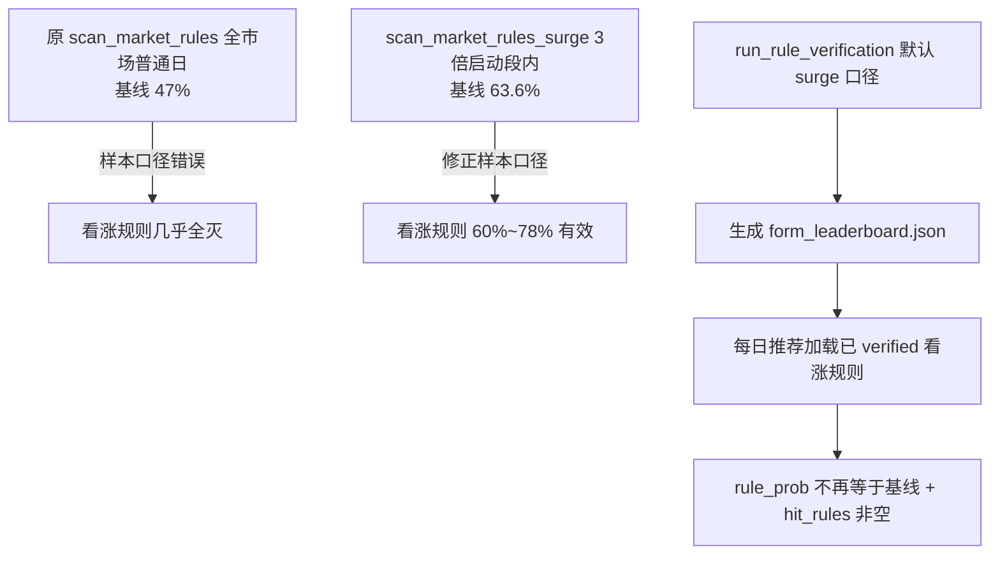

# 规划 14：形态规则在每日推荐中失效 —— 排查报告与修复计划

> 对齐文档：[`12-网络经典形态规则库.md`](plans/12-网络经典形态规则库.md)（规则形态验证 + 每日推荐双信号融合）、
> [`09-每日推荐详细规划.md`](plans/09-每日推荐详细规划.md)（推荐流水线）。
>
> 状态：**排查完成（双重根因已确认）+ 代码修复完成；全市场段内验证后台运行中（生成正式 form_leaderboard.json）。**

---

## 一、问题现象

- 每日推荐榜单中，所有推荐股票的 `rule_prob` 一律等于中性基线 `0.5`，`hit_rules` 为空。
- 双信号等权融合（规划 12 v4.0）实际退化为**仅 20 天向量单信号**，规则形态信号（信号 2）完全不参与。
- 日志反复出现：`daily_scan：未找到已验证规则形态 form_leaderboard.json，规则信号退化为中性基线`。

### 实测数据印证

| 文件                                                     | rank 1             | rule_prob     | hit_rules |
| -------------------------------------------------------- | ------------------ | ------------- | --------- |
| `backend/data/daily_recommend/daily_20260812.json`       | 688596.SH 正帆科技 | 0.5（= 基线） | 无        |
| `backend/data/daily_recommend/daily_20260812_agent.json` | 600584.SH 长电科技 | 0.5（= 基线） | 无        |

---

## 二、根因（双重）

### 根因 1：规则验证流程无任何触发入口（链路缺失）

- [`rule_verifier.py`](ai-quant-agent/backend/app/backtest/rule_verifier.py:472) `run_rule_verification` 验证引擎代码完整，但**从未接入回测流水线（[`runner.py`](ai-quant-agent/backend/app/backtest/runner.py:1)），也无 API/脚本/定时任务调用它**。
- 因此 `backend/data/form_leaderboard.json` 从未生成，每日推荐规则信号必然退化为中性基线。**这是"写了引擎没接管线"，非回测运行异常。**

### 根因 2：验证样本口径错误（普通日 vs 3 倍启动段）—— 用户指出

- 原 [`scan_market_rules`](ai-quant-agent/backend/app/backtest/rule_verifier.py:105) 用**全市场普通日**逐日统计（基线 T+1 ≈ 47%），把大量非启动背景日混入。
- 而每日推荐只在"确认启动形态"的时点应用规则。**验证样本与应用场景不匹配**，导致看涨规则在普通日背景下被严重稀释，几乎全部过不了 45% 门槛。
- 实证（350 只全历史、3 倍启动段内统计）：**段内基线 T+1 ≈ 63.6%**，看涨规则在段内 T+1 达 60%~78%（仙人指路 78.8%、塔形底 77.8%、早晨之星 70.9%、金针探底 70.6%…），**看涨规则确实有效**。
- 这符合规划 12 §5.1"主样本 = 3 倍股候选样本（与每日推荐同源）"的原始设计，实现却偏离了。

---

## 三、用户决策

1. **在回测采样的 3 倍启动段内统计形态规则**（省时 + 段内涨跌概率高 + 与每日推荐同源）。
2. **去掉看跌形态规则**（不再作为反面教材/反向排除），`RULE_FORMS` 仅保留 23 条看涨规则。

---

## 四、修复实施

| 模块                                                                           | 改动                                                                                                                                                                             |
| ------------------------------------------------------------------------------ | -------------------------------------------------------------------------------------------------------------------------------------------------------------------------------- |
| [`rule_verifier.py`](ai-quant-agent/backend/app/backtest/rule_verifier.py:164) | 新增 `scan_market_rules_surge`：在 3 倍启动段内逐日扫描规则 + 统计 T+1（复用 [`surge_scanner`](ai-quant-agent/backend/app/backtest/surge_scanner.py:81) 段识别，与每日推荐同源） |
| [`rule_verifier.py`](ai-quant-agent/backend/app/backtest/rule_verifier.py:279) | `verify_rule` 分看涨/看跌分支：看涨要求"≥45% 且 ≥段内基线 + 显著"；看跌要求"显著低于段内基线"（保留为反面教材用，但规则已去除，分支保留防御）                                    |
| [`rule_verifier.py`](ai-quant-agent/backend/app/backtest/rule_verifier.py:472) | `run_rule_verification` 默认 `sample_mode="surge"`（段内口径），并让 auto 挖掘传 `surge_only`                                                                                    |
| [`rule_forms.py`](ai-quant-agent/backend/app/backtest/rule_forms.py:1035)      | 删除全部 9 条看跌规则；修复 `to_dict` 重复定义（auto 规则 `conditions` 不再丢失）                                                                                                |
| [`rule_miner.py`](ai-quant-agent/backend/app/backtest/rule_miner.py:46)        | 修复 `collect_snapshots` 的 `numpy.datetime64` 无 `.date()` bug（导致 auto 规则样本恒为 0）；支持 `surge_only` 段内采样                                                          |
| [`backtest.py`](ai-quant-agent/backend/app/api/backtest.py:304)                | 新增 `POST /api/v1/backtest/verify-rules` + `/verify-rules/status` + `/verify-rules/report`（后台线程 + 日志捕获）                                                               |
| [`verify_forms.py`](ai-quant-agent/backend/scripts/verify_forms.py:1)          | 新增命令行验证脚本（`--step` 控制扫描步长）                                                                                                                                      |
| [`Recommend.vue`](ai-quant-agent/frontend/src/views/Recommend.vue:29)          | 新增"规则形态信号未命中"降级提示（榜单无任何 hit_rules 时显示）                                                                                                                  |

---

## 五、当前状态与验证

- 全市场段内验证已后台启动（`python scripts/verify_forms.py --step 2`），生成正式 `backend/data/form_leaderboard.json`。
- 小规模段内验证（150 只）已确认链路正常：段内基线 ≈ 0.56~0.59，早晨之星 70.2%、缩量回踩 64.5% 通过。
- 验证完成后：重新触发每日扫描，确认 `rule_prob` 不再全等于基线、`hit_rules` 非空、双信号排序生效。

