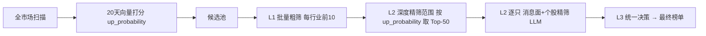
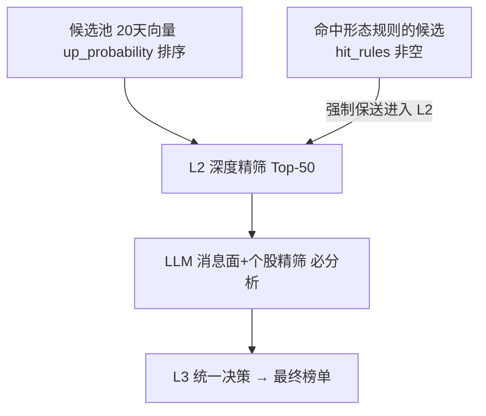

# 规划 15：形态规则作为 LLM 精筛召回增强（不再与 20 天向量并行等权）

> 对齐：[`14-形态规则在每日推荐失效排查与修复计划.md`](plans/14-形态规则在每日推荐失效排查与修复计划.md)（已修复规则验证链路）、
> [`03-Agent系统.md`](plans/03-Agent系统.md)（L1/L2/L3 精筛流水线）。
>
> 用户设计变更（明确）：
>
> 1. **第一步筛选不要与 20 天向量单信号并行**——形态规则不再作为与 20 天向量等权的信号 2 参与主排序。
> 2. **用形态规则完善"候选股未被 LLM 分析/搜索"的缺陷**——在现有 L1/L2/L3 中，命中形态规则的候选即使按 20 天向量排不进 L2 深度精筛 Top-50，也**强制提升进入前 50**，让 LLM 一定能分析到它们。

---

## 一、现状与问题

### 1.1 当前每日推荐流水线（daily_scan → Agent 精筛）



### 1.2 现状缺陷

- **daily_scan 主排序**：当前是"双信号等权"（`final_score = 0.5×norm_up + 0.5×norm_rule`），用户要求回到 20 天向量单信号。
- **L2 深度精筛范围**（[`agents/__init__.py`](ai-quant-agent/backend/app/agents/__init__.py:140)）：
  ```python
  sub_profiles.sort(key=lambda p: -p.get("up_probability", 0))
  deep_profiles = sub_profiles[:DEEP_TOP_N]   # DEEP_TOP_N=50
  ```
  仅按 20 天向量 `up_probability` 取前 50 → **形态规则命中的股票若 up_probability 不高，就不会被 LLM 分析/搜索**，这正是用户要弥补的缺陷。
- **[`build_candidate_profile`](ai-quant-agent/backend/app/agents/candidate_profiler.py:81) 未透传 `hit_rules`**（形态规则命中信息），LLM prompt 里看不到形态规则维度。

---

## 二、新设计方案

### 2.1 核心思路

- **第一步筛选（daily_scan 主排序）**：回到 20 天向量单信号（`up_probability` 降序），去掉双信号等权融合。
- **形态规则作为"L2 保送机制"**：命中已验证形态规则的候选，即使不在 L2 深度精筛 Top-50 内，也**强制追加进入 L2**，确保 LLM 一定分析/搜索到它们。
- 形态规则命中信息透传给 LLM prompt（作为额外评判维度）。

### 2.2 改动点

| 文件                                                                                  | 改动                                                                                                                                        |
| ------------------------------------------------------------------------------------- | ------------------------------------------------------------------------------------------------------------------------------------------- |
| [`daily_scan.py`](ai-quant-agent/backend/app/backtest/daily_scan.py:346)              | 主排序改为 `up_probability` 单信号降序（去掉 `final_score` 双信号等权作主排序）；保留 `hit_rules` / `rule_prob` 字段供 Agent 保送与前端展示 |
| [`candidate_profiler.py`](ai-quant-agent/backend/app/agents/candidate_profiler.py:81) | `build_candidate_profile` 增加透传 `hit_rules`；`profile_to_text` 把形态规则命中（规则名+次日上涨率）加入可读文本                           |
| [`agents/__init__.py`](ai-quant-agent/backend/app/agents/__init__.py:140)             | L2 深度精筛范围：`sub_profiles[:DEEP_TOP_N]` 后**强制追加所有 `hit_rules` 非空的候选**（去重），并日志记录保送数量                          |

### 2.3 L2 保送逻辑（agents/**init**.py）

```python
sub_profiles.sort(key=lambda p: -p.get("up_probability", 0))
deep_profiles = sub_profiles[:DEEP_TOP_N]
# 形态规则命中保送：命中已验证形态规则的候选强制进入 L2（即使不在 Top-50）
rule_locked = [p for p in sub_profiles if p.get("hit_rules")]
seen = {p.get("ts_code") for p in deep_profiles}
for p in rule_locked:
    if p.get("ts_code") not in seen:
        deep_profiles.append(p)
        seen.add(p.get("ts_code"))
logger.info(f"[agent_refine] L2 深度精筛范围: {len(deep_profiles)} 只（含形态规则保送 {len(deep_profiles) - DEEP_TOP_N} 只）")
```

### 2.4 流程示意



---

## 三、需要确认的细节

1. **保送数量上限**：形态规则命中候选通常很少（每日数只~十几只），默认不设上限直接全部保送；若命中过多需设上限（如保送 ≤ 20 只）避免 L2 成本失控。
2. **L2 成本影响**：每保送一只多一次"消息面（Tavily）+ 个股精筛 LLM"调用，命中数少时成本增量可忽略。
3. **前端展示**：推荐页仍展示 `rule_prob` / `命中规则` 列（已实现），排序回归 `up_probability` 后展示不受影响。

---

## 四、实施步骤（已完成）

1. [`daily_scan.py`](ai-quant-agent/backend/app/backtest/daily_scan.py:364)：主排序改 `up_probability` 单信号（去掉双信号等权作主排序），保留 `hit_rules` / `rule_prob`。
2. [`candidate_profiler.py`](ai-quant-agent/backend/app/agents/candidate_profiler.py:81)：`build_candidate_profile` 透传 `hit_rules`（原始列表 + 文本）与 `rule_prob`；`profile_to_text` 增加"形态规则命中[...]"展示。
3. [`agents/__init__.py`](ai-quant-agent/backend/app/agents/__init__.py:140)：L2 深度精筛范围加入形态规则保送（Top-50 后强制追加所有 `hit_rules` 非空候选，去重 + 日志"含形态规则保送 N 只"）。

### 验证结果（已完成）

- **daily_scan 主排序**：600 只扫描，TOP8 `up_probability` 严格降序（0.816→0.771）；命中"早晨之星"的金房能源带 `hit_rules=['zaochenzhixing']`。
- **画像透传**：`hit_rules` 原始列表 / `hit_rules_txt="金针探底→次日上涨率68%"` / `rule_prob` 均正确，LLM prompt 可见。
- **L2 保送逻辑**（合成数据）：up_prob=10 命中仙人指路、up_prob=5 命中金针探底的候选均被强制保送进 L2；未命中规则的低分候选不被误保送。
- 顺带发现预存问题（非本次引入）：`daily_scan` 命中登记 `record_hits` 因 `monitor` 循环 import 报错（不影响榜单生成）。

### 遗留清理（已完成）

- 移除 `daily_scan` 的 `final_score` 双信号归一化逻辑（规划 12 遗留，主排序已改 `up_probability` 单信号后无任何消费方）：删除 `final_score`/`_up_raw`/`_rule_raw` 字段、`W1_20D`/`W2_RULE`/`RULE_NORM_MIN_OFFSET`/`RULE_NORM_MIN_FLOOR` 常量、`rule_upper` 计算。验证：`daily_scan` 导入正常，无残留引用。
