# 规划 17：进化中心改造 —— 次日自我验证闭环 + 全项目可进化

> 对齐：[`11-进化Agent.md`](plans/11-进化Agent.md)（进化大脑/守护/影子/记账）、
> [`09-每日推荐详细规划.md`](plans/09-每日推荐详细规划.md)（每日推荐流水线）、
> [`03-Agent系统.md`](plans/03-Agent系统.md)（反思层）。
>
> 状态：**改造完成（MVP 闭环）** —— 后端编译 / evolution_config JSON / 冒烟测试均通过。

---

## 一、用户核心想法（原文提炼）

1. **当天做每日推荐，第二天出现新的日线行情就"自我验证"** —— 验证"为啥每日推荐的股票没有涨"。
2. 进化中心要**有管理整个项目的全部权限**，能**修改回测和每日推荐的逻辑**。
3. **中心思想：进化成"高概率上涨的每日推荐的股票"** —— 一切进化都围绕"让次日推荐的股票更可能上涨"。

---

## 二、现状评估：当前进化中心合理在哪、差距在哪

### 2.1 当前进化中心（合理之处）

- 架构正确：**提案 → 宪法校验 → 影子期（先验证后生效）→ 正式生效 → 终身记账**，受独立守护监督，可回滚、可审计。
- Token 控制：增量事件 + L0 摘要 + 惰性评估 + 合并反思，避免浪费。
- 全项目信息接入：`evolution_events` 日志 Hook + 各模块结果落盘复用。

### 2.2 与用户想法的差距（3 个关键问题）

| #   | 用户想法                                        | 现状                                                                                               | 差距                                                                 |
| --- | ----------------------------------------------- | -------------------------------------------------------------------------------------------------- | -------------------------------------------------------------------- |
| 1   | **次日（T+1）出现新日线行情就自我验证**         | 推荐命中验证走 `backfill_outcomes()`，**T+5 才回填**；`run_reflection()` 也是 **T+5 后**才反思失败 | 反馈周期太长（5 个交易日），推荐逻辑失效要近一周才暴露，无法及时进化 |
| 2   | **验证"为啥每日推荐的股票没有涨"（失效归因）**  | 只统计"是否命中"（hit 布尔）+ 月度漂移，反思是 T+5 后的泛化教训                                    | **没有"次日逐只失效归因"**——不回答"这只票昨天推荐了、今天为什么没涨" |
| 3   | **进化中心管理全项目 + 修改回测与每日推荐逻辑** | `evolution_config.json` 只登记 **9 个参数**（政策/新闻/命中阈值），不覆盖回测与每日推荐核心逻辑    | 权限范围小，无法改回测/推荐逻辑，目标也不聚焦"每日推荐上涨"          |

### 2.3 结论

当前进化中心是"**参数微调器**"，不是用户想要的"**每日推荐自我进化大脑**"。需要：

1. 新增**次日自我验证闭环**（T+1 回填 + 失效归因 + 固化知识库 + 进化事件），让反馈周期缩到 1 天；
2. 把**回测与每日推荐的核心逻辑数值纳入可进化参数表**（负向抑制强度、榜单条数、相似度门槛、回测结局门槛等），进化中心可读可改（热生效 + 锚点补丁 + 独立重启）；
3. 进化大脑 L0 摘要**聚焦每日推荐命中**（T+1 命中率 / 失效归因 TOP / 改进方向），一切提案围绕"让推荐的股票更可能上涨"。

---

## 三、目标架构

```mermaid
flowchart LR
  A[每日 16:30 采集 → 每日推荐扫描] --> B[榜单落盘 + monitor 登记]
  B --> C[次日 新日线行情（下一次采集后）]
  C --> D[daily_verify 自我验证: T+1 回填]
  D --> E[识别失败: 推荐了但次日没涨]
  E --> F[失效归因 LLM: 为什么没涨 → 归因类型+教训+fix]
  F --> G[固化 verify_kb + 写进化事件]
  G --> H[进化大脑 evaluate: L0 含验证结果]
  H --> I[改进提案: 聚焦每日推荐/回测逻辑]
  I --> J[宪法校验 + 影子期/锚点补丁]
  J --> K[生效 → 下一轮每日推荐更优 ↑]
```

---

## 四、数据资产

| 文件                              | 内容                                                                        |
| --------------------------------- | --------------------------------------------------------------------------- |
| `backend/data/verify_kb.json`     | 次日自我验证知识库：每期验证（T+1 命中率 / 失败明细 / 归因统计 / 改进方向） |
| `monitor_state.json`（扩展）      | 命中记录新增 `t1_ret` / `verified_at`（次日回填）                           |
| `evolution_events.db`（新增事件） | 每日验证完成 / 失效归因汇总 / 改进方向（供进化大脑）                        |
| `evolution_config.json`（扩展）   | 新增每日推荐/回测可进化参数（见 §六）                                       |

---

## 五、次日自我验证闭环（`app/agents/daily_verify.py`，新模块）

### 5.1 步骤

1. **`backfill_t1()`**：遍历 `monitor_state.hits` 中 `t1_ret` 为空且已过次日的推荐，用日线前复权计算 **T+1 涨幅**（复用 `reflect_agent._calc_outcome` 的基准口径：推荐日最近交易日为 T0，取 T+1）。同时保留 T+5 未到的情况等待原逻辑。
2. **`run_daily_verify(limit_days=1)`**：
   - 取最近 N 日榜单（`daily_recommend/daily_*_agent.json` 优先，回退 `daily_*.json`），与 `monitor_state.hits` 对齐；
   - 对每只已回填 T+1 的推荐：`t1_ret <= 0`（未涨/下跌）判为**失败案例**，记录其 `form_type / similarity / up_probability / negative_score / hit_rules / condition_values` 快照；
   - 统计：总数 / 上涨数 / 平盘 / 下跌 / **T+1 命中率（>0 视为次日上涨）** / 平均 T+1 收益；
   - 失败案例 ≥1 时，**逐只（或 TOP-K）LLM 失效归因**，输出 `error_type / lesson / fix / signal_hint / confidence`；
   - 归因按类型聚合 count，提取**改进方向**（如"负向抑制过强/相似度虚高/条件概率与次日无关/市场普跌系统性拖累"）；
   - 固化 `verify_kb.json` + 写 `evolution_events` 事件（INFO 验证完成、WARNING 命中率骤降）。
3. **`build_verify_txt()`**：构造"次日验证结论"文本（供进化大脑 L0，含 T+1 命中率 / 归因 TOP3 / 改进方向）。

### 5.2 失效归因维度（error_type）

- `形态识别误判`：form_type 对应相似度虽高但非真实启动段；
- `相似度虚高`：pos_sim 高但负向抑制/条件不支撑；
- `条件概率与次日无关`：condition_table 是历史统计，样本分布变化导致失效；
- `市场环境拖累`：大盘普跌系统性下跌（需对照指数）；
- `利好出货/消息面反转`：推荐后出现利空/兑现；
- `排序偏差`：Agent 精筛改序导致入选标的实际更弱；
- `其他`。

### 5.3 与现有 T+5 反思的分工

- `daily_verify`（次日）：**快反馈、聚焦"当天推荐为何不涨"**，为进化中心提供即时依据；
- `reflect_agent`（T+5）：**慢确认、固化长期教训**，两者互补，均写入各自知识库，进化大脑合并消费。

---

## 六、全项目可进化权限（`evolution_config.json` 扩展）

新增可进化参数（纳入 `params` 表），覆盖回测与每日推荐核心逻辑：

| 参数                   | 默认 | 范围         | 锚点/热生效                       | 说明                                          |
| ---------------------- | ---- | ------------ | --------------------------------- | --------------------------------------------- |
| `daily_lambda_exclude` | 0.5  | [0,1]        | 热生效（daily_scan 读取）         | 负向抑制强度（负模式相似度抑制）              |
| `daily_top_k`          | 30   | [5,50]       | 热生效（daily_scan 读取）         | 榜单条数                                      |
| `daily_rule_lambda`    | 0.3  | [0,1]        | 热生效（daily_scan 读取）         | 看跌规则负向抑制强度（预留）                  |
| `hit_threshold`        | 0.05 | [0.01,0.2]   | 已有                              | T+5 命中阈值                                  |
| `t1_hit_threshold`     | 0.0  | [-0.02,0.05] | 热生效（daily_verify 读取）       | **次日命中判定阈值**（>0 为上涨，可进化微调） |
| `verify_lookback_days` | 1    | [1,7]        | 热生效                            | 次日验证回看最近 N 个交易日榜单               |
| `outcome_success_gain` | 3.0  | [2,5]        | Tier2 锚点补丁（outcome_tracker） | 回测"成功=3倍"结局门槛                        |
| `risk_pledge_max`      | 0.5  | [0,1]        | Tier2 锚点补丁（risk_filter）     | 质押率风控上限（回测/推荐共用）               |

> 说明：`hot_reload` 参数直接热生效；`Tier2` 锚点补丁参数经 `self_improver.apply_patch` 改代码 + 独立重启生效——这即"进化中心可修改回测与每日推荐逻辑"的安全落地方式（先备份→唯一锚点→静态验证→失败回滚）。

---

## 七、改造文件清单

| 文件                                         | 改动                                                                        |
| -------------------------------------------- | --------------------------------------------------------------------------- |
| `backend/app/agents/daily_verify.py`         | **新增**：次日自我验证核心（T+1 回填/失效归因/verify_kb/进化事件）          |
| `backend/data/evolution_config.json`         | 扩展参数表（§六）+ 触发钩子                                                 |
| `backend/app/backtest/daily_scan.py`         | `LAMBDA_EXCLUDE`/`DEFAULT_TOP_K` 改读 `evolution_config`（热生效可进化）    |
| `backend/app/agents/evolution_summarizer.py` | L0 摘要加入"次日验证"块（T+1 命中率/归因 TOP/改进方向）                     |
| `backend/app/agents/evolution_agent.py`      | System Prompt 聚焦"每日推荐进化"；提案方向引导                              |
| `backend/app/api/system.py`                  | 新增 `/evolve/verify/status`、`/evolve/verify/run`、`/evolve/verify/report` |
| `backend/app/main.py`                        | 新增每日自我验证调度（采集后 ~18:00 触发，或并入学习任务前）                |
| `frontend/src/api/index.ts`                  | 新增 verify 相关 API                                                        |
| `frontend/src/views/Evolution.vue`           | 新增"次日自我验证"面板                                                      |
| `plans/17-进化中心改造-次日自我验证闭环.md`  | 本文档                                                                      |

---

## 八、验证口径（主指标聚焦）

- **次日命中（T+1）**：推荐次日前复权涨幅 `> t1_hit_threshold`（默认 0）计为"次日上涨命中"；
- **进化的唯一目标**：提高"每日推荐股票 T+1 上涨概率 + T+5 命中率 + 实际收益"（宪法口径固化，不可自改）；
- 进化中心读 L0（含次日验证结论）→ 提"改参数/改回测/改推荐逻辑"提案 → 宪法校验（样本≥门槛）→ 影子/锚点补丁 → 生效 → 记账。

---

## 九、安全与守护

- 沿用 `self_improver`（备份/唯一锚点/静态验证/失败回滚/审计）+ `evolution_guard`（宪法哈希/频率/主指标/暂停）；
- 新增的可进化参数**默认 Tier1 热生效**（可回滚），`outcome_success_gain`/`risk_pledge_max` 等 Tier2 锚点补丁默认需更强证据或人工确认；
- 次日验证本身**只读不改**（不碰推荐主流程），只产出归因结论与事件，不阻塞每日推荐/采集。

---

## 十、实施与验证结果（MVP）

| 项                                | 结果                                                                                                                                                                             |
| --------------------------------- | -------------------------------------------------------------------------------------------------------------------------------------------------------------------------------- |
| 后端编译（`py_compile`）          | 通过：`daily_verify` / `daily_scan` / `evolution_summarizer` / `evolution_agent` / `system` / `main`                                                                             |
| `evolution_config.json` JSON 校验 | 通过（新增 7 个可进化参数全部可读）                                                                                                                                              |
| 冒烟（参数读取）                  | `daily_lambda_exclude=0.5` / `daily_top_k=30` / `daily_rule_lambda=0.3` / `t1_hit_threshold=0.0` / `verify_lookback_days=1` / `risk_pledge_max=0.5` / `outcome_success_gain=3.0` |
| 冒烟（榜单加载）                  | `_load_report_detail('20260817')` 合并规则版+Agent 版共 206 只（与 `monitor_state.hits` 同源覆盖）                                                                               |
| 调度                              | `main.py` 新增每日 17:30 `daily_self_verify`（采集+推荐完成后对昨日推荐做 T+1 自我验证）                                                                                         |
| API                               | `GET/POST /system/evolve/verify/status`、`/run`、`/report`                                                                                                                       |
| 前端                              | `Evolution.vue` 新增"次日自我验证"面板（T+1 命中率/涨平跌/平均收益/失效归因/改进方向/失败明细 + 手动触发）                                                                       |

> 说明：真实"次日归因"需待下一交易日新日线入库后，由每日 17:30 任务（或前端手动触发）自动执行；本 MVP 闭环代码已验证就绪。

### 后续可扩展（非本 MVP）

1. ~~失效归因引入**大盘对照**（个股 T+1 涨幅 − 指数 T+1 涨幅），区分"系统性下跌"与"个股逻辑失效"~~ → **已实现，见 §十一**；
2. 归因统计与 `form_leaderboard` / `condition_table` 联动，自动把"长期失效的形态/条件"降权（进回测产物再固化）；
3. 进化提案可按归因 `param_hint` 直接映射到具体可进化参数，形成"归因→参数→回测模拟→影子"的自动链路。

---

## 十一、失败归因的「外部证据层」（已实现，2026-09-20）

用户诉求（原话）：

> "我希望进化大脑在分析每日推荐为啥会失败的时候，其中一个方面要从以往的大盘或者个股日线
> 以及个股资料中找原因，就像回测一样，找出原因"

### 11.1 改造前的问题（为什么必须做）

归因 prompt 里只有【推荐依据 + T+1 涨幅】，LLM 看不到：

| 看不到的东西   | 后果                                                            |
| -------------- | --------------------------------------------------------------- |
| 同期大盘涨跌   | 大盘系统性下跌时个股跟跌 → 被误判成"形态识别误判"               |
| 推荐后真实走势 | "跌停放量出货" vs "缩量横盘"性质不同，看不到就分不清            |
| 期间利空事件   | 业绩预减/股东减持/高质押/大宗折价造成的下跌，被算到选股逻辑头上 |

结果：**把外因当内因** → 进化大脑去改形态识别/相似度阈值/条件概率表 → 越改越偏
（与 plans/23 的"回测好看、实盘失效"属同一类错误）。

### 11.2 实现：[`failure_context.py`](ai-quant-agent/backend/app/agents/failure_context.py:1)

三类证据，全部来自**已采集的表**（只读、逐块可降级；拿不到就显式标"数据缺失"，绝不编造）：

| 证据块             | 数据来源                                                                                                                    | 产出                                                                                                 |
| ------------------ | --------------------------------------------------------------------------------------------------------------------------- | ---------------------------------------------------------------------------------------------------- |
| `market` 大盘      | `index_daily`（上证/深证/创业板，落盘缓存 12h）                                                                             | [D, D+N] 各指数涨跌 + 推荐前 20 日环境 + 是否系统性下跌 + 窗口是否走完                               |
| `stock` 个股日线   | `daily` + `adj_factor`（`prepare_stock_data`）                                                                              | 区间收益/T+1/最大涨幅/真实回撤/冲高回落/跌停天数/放量下跌/跌破 MA20/跳空低开/停牌缺口                |
| `profile` 个股资料 | `forecast`/`express`/`stk_holdertrade`/`pledge_stat`/`stk_holdernumber`/`dividend`/`repurchase`/`stk_rewards`/`block_trade` | 业绩预告·快报方向、股东净增减持、质押比例、股东户数变化（筹码分散/集中）、大宗折溢价、分红/回购/激励 |

- **口径一致**：大盘与个股都用 `D+1 买入`口径（与 `daily_verify._calc_multi` 一致），
  因此"个股收益 − 大盘收益"是可相减的真实超额；
- **窗口自适应**：T+1 次日验证时 5 日窗口必然没走完 → 能走多少算多少，
  并显式标注"复盘窗口尚未走完"，**不假装完整**。

### 11.3 外因/内因分离（关键设计）

`cause_prior` 先验判据（仅作起点，LLM 必须结合证据自行判断，不得照抄）：

| 判据                               | 结论                                     |
| ---------------------------------- | ---------------------------------------- |
| 大盘 ≤ -2% 且个股与大盘差距 ≤ 3pct | `external_market`（跟跌 = 外因）         |
| 个股跑输大盘 ≥ 5pct                | `internal_logic`（选股/择时问题 = 内因） |
| 个股下跌且期间有利空事件           | `external_news`                          |
| 跌停/跌破 MA20 且无更好解释        | `internal_technical`                     |
| 数据缺失                           | `insufficient_data`（**不硬判**）        |

**外因案例不计入改进方向**（`_aggregate`）：外因的 `param_hint` 一律"无需调参"，
且会被排除在 `improvements` 之外。理由：拿运气当规律会让参数越调越偏。

### 11.4 两条归因路径都已接入

- **次日快反馈**（`daily_verify._verify_one_day`）：逐只构建证据 → 注入 prompt →
  失败记录落 `evidence` / `cause_prior` / `external_cause` / `evidence_basis`（可审计）；
- **T+5 慢反思**（`reflect_agent.run_reflection`）：同一套证据注入 `REFLECT_USER_TMPL`，
  教训落库带 `external_cause` / `evidence_basis`；`build_reflect_txt()` 会告诉进化大脑
  "其中 N 条属外因，不应作为改形态/阈值的依据"；
- **进化大脑 L0 文本**（`build_verify_txt()`）新增一行：
  "外因归因: X% 的失败属外因（已排除在改进方向之外）"。

### 11.5 可进化参数（新增 2 个 → 共 51 个）

| 参数                      | 默认 | 说明                                                |
| ------------------------- | ---- | --------------------------------------------------- |
| `verify_evidence_enabled` | 1    | 证据层总开关（0 = 回到"只看推荐依据+涨幅"的旧行为） |
| `verify_evidence_days`    | 5    | 复盘窗口（交易日，1~20）；窗口未走完会显式标注      |

### 11.6 ⚠️ 未来函数护栏（最重要的一条）

本模块**故意使用推荐日之后的数据**（事后复盘的用途）。一旦被预测侧引用就会变成
前瞻偏移（look-ahead bias）——回测虚高、实盘失效。因此：

- 只允许 `daily_verify` / `reflect_agent` 两条归因路径引用；
- `daily_scan` / `feature_extractor` / `extra_feature_loader` / `recommender` /
  `risk_filter` / `vector_store` / `threshold_analyzer` / `form_classifier` /
  `runner` / `pattern_miner` **一律不得** import 它；
- [`verify_failure_evidence.py`](ai-quant-agent/backend/scripts/verify_failure_evidence.py:1)
  的 G 组断言专门守这条边界（后人一旦误用，测试立即失败）。

### 11.7 验收

[`verify_failure_evidence.py`](ai-quant-agent/backend/scripts/verify_failure_evidence.py:1) → **58/58**：
A 三类证据齐备（真实数据，含口径/窗口断言）、B 6 条判据、C 5 条降级（不崩/不编造）、
D 12 条 prompt 接线（两条路径）、E 6 条外因分离、F 4 条参数热生效、G 13 条未来函数护栏、
H 2 条 prompt 渲染（防占位符漏传在真实运行时才炸）。
前端 `Evolution.vue` 同步展示「🌐 外因归因」占比 + 失败明细「外部证据（外因）」列。

真实样本实测（`301008.SZ @ 20260801`，窗口已走完）：大盘同期 +2.93%/+2.69%/+1.73%，
个股 +26.41%（T+1 +0.66%），期间放量下跌 1 天、停牌缺口 1 天；
资料面板命中"业绩预告预减 / 股东净减持 28.54% / 股东户数 +35.1%"。

回归：`verify_evolution_integration` 28/28、`verify_scan_stop` 32/32、
`verify_scan_confirm` 49/49、`verify_collection_timing` 29/29 全通过。
