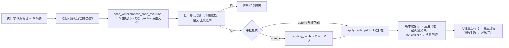

# 规划 18：进化大脑"自己写代码" —— 闲时自动进化回测与每日推荐逻辑

> 对齐：[`11-进化Agent.md`](plans/11-进化Agent.md)（进化大脑/执行器/守护）、
> [`17-进化中心改造-次日自我验证闭环.md`](plans/17-进化中心改造-次日自我验证闭环.md)（次日验证闭环）。
>
> 状态：**改造完成（v2，按用户决策）** —— 放开安全限制，进化大脑可修改全部逻辑与参数；
> 唯一限制 = 提高每日推荐股票之后上涨概率；闲时自动进化 + 多周期"主升浪"目标。

---

## 一、用户核心想法（原文提炼）

1. **进化大脑要像 ZOO CODE 一样有"自己写代码"的能力** —— 不只是调参数/单值补丁，而是能生成并落地一段代码逻辑。
2. **对接回测和每日推荐**：进化大脑能修改回测与每日推荐逻辑。
3. **在闲时（没有进程在运行时）自动修改**回测和每日推荐逻辑。
4. **进化目标：高概率"次日大涨 + 之后主升浪"的系统**。
5. **v2 决策：不要安全限制，可修改全部逻辑与参数；唯一限制 = 必须让每日推荐股票之后上涨概率高。**

---

## 二、现状评估：当前进化大脑能"自己写代码"吗？

| 能力                                  | 现状（plans/17 之前）                                            | 结论                      |
| ------------------------------------- | ---------------------------------------------------------------- | ------------------------- |
| Tier1 参数热生效                      | ✅ `evolution_config.set_param` 即时生效                         | 只能调数值                |
| Tier2/3 单值锚点补丁                  | ✅ `self_improver.apply_patch`（anchor_old→anchor_new 单值替换） | 只能改一个常量            |
| **生成式代码块替换（自己写代码）**    | ❌ 无                                                            | **缺失，本次新增**        |
| 闲时检测（无回测/扫描/精筛/采集在跑） | ❌ 无统一入口                                                    | **缺失，本次新增**        |
| 多周期"主升浪"验证                    | ❌ 只有 T+1 / T+5                                                | **本次增强 T+1/T+5/T+20** |

> 结论：改造前进化大脑**不具备真正"自己写代码"的能力**，只到"单值锚点补丁"级别。
> 本次通过新增 [`code_writer.py`](ai-quant-agent/backend/app/agents/code_writer.py:1) 补齐，并配闲时调度。

---

## 三、生成式代码进化（`code_writer.py`）

### 3.1 闭环（v2：放开安全限制）



### 3.2 唯一限制 + 工程护栏（v2，用户决策）

**唯一限制（唯一宪法）**：`_goal_check()` 强制提案必须指向"提高每日推荐股票之后的上涨概率"
（reason/evidence 需含上涨概率/命中/主升浪等目标词），与目标无关的改动一律拒绝。

**工程护栏（正确性/可恢复性所需，非安全限制）**：

1. `py_compile` 编译验证（语法错误必拦，否则系统直接崩）；
2. 版本化备份 `.bak.*` + 失败自动回滚（改坏可一键恢复）；
3. 唯一锚点定位（避免改错位置）；支持 **整文件重写**（`full_content`，真正"修改全部逻辑"）；
4. 待重启标记 + 独立进程重启生效（`restart_backend.sh`，失败回滚 `.bak`）；
5. 可进化文件清单 `EVOLVABLE_FILES`（回测/每日推荐/Agent 精筛相关 17 个文件，可扩展）。

**安全级别**（`evolution_config.code_evolution.security_level`）：

- `full`（**默认**）：无 AST 白名单 / 无保护区，可改任意回测/推荐逻辑与参数（`ast_safe_scan(strict=False)` 仅查语法）；
- `safe`（可选）：保留 AST 白名单 + 进化模块保护区（保守模式，可切换回）。

### 3.3 闲时检测（[`is_idle()`](ai-quant-agent/backend/app/agents/code_writer.py:252)）

统一检查：回测（`backtest._STATE`）、每日扫描（`predictions._SCAN_STATE`）、Agent 精筛（`_AGENT_STATE`）、反思（`_REFLECT_STATE`）、数据采集（`ws.has_pending_tasks`）——全部非 running 才算空闲。

---

## 四、多周期"主升浪/大涨"目标（`daily_verify.py` 增强）

- `_calc_multi()`：回填 **T+1 / T+5 / T+20** 前复权涨幅（数据到位才回填）；
- `_verify_one_day()` 新增：**主升浪（T+5）命中率**（`t5_ret ≥ wave_hit_threshold`）、`wave_failures`（已到 T+5 未走出主升浪）；
- `build_verify_txt()` 输出主升浪结论，供进化大脑进化依据；
- 新参数 `wave_hit_threshold`（默认 5%，可热生效进化）。

---

## 四B、环节级归因：定位"回测/每日推荐哪个环节出问题"（用户核心诉求）

进化大脑不仅要"逐只归因"，更要回答"**是回测与每日推荐的哪个环节导致次日不涨**，怎么优化该环节"。

### 环节定义（[`STAGE_MAP`](ai-quant-agent/backend/app/agents/daily_verify.py:268)）

| 环节                           | 对应文件/参数                                    |
| ------------------------------ | ------------------------------------------------ |
| `stock_pool` 股票池/数据       | loader / 数据采集                                |
| `form_identify` 形态识别       | `form_classifier.py` / `surge_scanner.py`        |
| `feature_extract` 特征提取     | `feature_extractor.py`                           |
| `pattern_match` 正模式库相似度 | `vector_store.py`（ChromaDB 正模式库）           |
| `neg_exclude` 负向抑制         | `daily_lambda_exclude`                           |
| `condition_score` 条件概率打分 | `threshold_analyzer.py` / `condition_table.json` |
| `rule_signal` 规则信号         | `rule_verifier.py` / `form_leaderboard.json`     |
| `risk_filter` 风险过滤         | `risk_filter.py` / `risk_pledge_max`             |
| `rank_select` 排序 TOP-K       | `daily_top_k` / `daily_scan.py` 排序             |
| `agent_refine` Agent 精筛      | `refine_agent.py` / `decision_agent.py`          |
| `backtest_product` 回测产物    | `normalizer` / `probability_table` / 模式库      |
| `market` 市场环境（系统性）    | 指数对照                                         |

### 归因字段（逐只 LLM 新增）

每只失败股票归因新增：`stage`（哪个环节）、`stage_hint`（该环节具体问题）、`optimize`（如何优化该环节/参数使上涨概率更高，指明文件或参数）。

### 环节聚合（[`_aggregate()`](ai-quant-agent/backend/app/agents/daily_verify.py:327)）

跨失败案例按环节聚合 → `stage_report`：**问题最大环节 + 占比 + 优化方向**（写入 `verify_kb.json`，供 L0 摘要与前端展示）。

### 进化闭环

`stage_report` → 进化大脑 L0 摘要"环节归因TOP" → [`code_writer`](ai-quant-agent/backend/app/agents/code_writer.py:311) 写代码 prompt 优先优化问题最大环节对应的**文件/参数** → 闲时自动改逻辑 → 下一轮验证检验提升。

---

## 五、配置（`evolution_config.json`）

```json
"code_evolution": {
  "enabled": true,
  "approval": "auto",
  "security_level": "full",
  "target": "唯一宪法：提高每日推荐股票之后的上涨概率（次日大涨 + 后续主升浪）",
  "max_code_patches_per_day": 2
}
```

- `enabled`：生成式代码进化总开关；
- `approval`：`auto`（系统空闲即自动应用，默认）/ `manual`（先生成待人工确认）；
- `security_level`：`full`（默认，无安全限制）/ `safe`（AST 白名单 + 保护区）；
- `target`：**唯一宪法**（唯一限制）。

---

## 五B、系统图谱（`system_map.py`）—— 把回测与每日推荐的逻辑+参数总结给进化大脑

用户需求：把当前回测逻辑与参数、每日推荐逻辑与参数总结成图谱给进化大脑，方便其更方便地修改与优化，
且图谱**会随进化修改而动态更新**。

### 能力

- [`build_map()`](ai-quant-agent/backend/app/agents/system_map.py:120)：实时构建图谱——
  - **每日推荐流水线**（11 环节：股票池/形态识别/特征提取/正模式相似度/负向抑制/条件打分/规则信号/风险过滤/排序TOP-K/Agent精筛/市场环境），每环节含当前逻辑 + **关键实现 detail（函数/常量/公式）** + 关键参数当前值 + 文件 + 可调方向；
  - **回测流水线**（9 步：数据清洗/形态启动段/结局分流/特征拟合/模式库/条件表/A-B打分/规则验证/入场指引），每步含 **detail（关键函数/阈值）**；
  - **全部可进化参数**（18 个，evolution_config 实时读取：当前值/范围/锚点/热生效/文件）；
  - 环节 → 文件/参数映射（`STAGE_MAP` + `EVOLVABLE_FILES`）；
  - **形态定义**（A平台突破/B V型反转/C中继加速/D直接拉升/E连板/U，含判定阈值）；
  - **特征体系**（59+ 维：33 形态向量[20价格+8技术+5量能] + ~30 条件参数[资金/基本/筹码/事件/ST风险]）；
  - **关键常量**（12 个，含可进化映射：FEATURE_WINDOW / MIN_LIST_TRADING_DAYS / MIN_AVG_AMOUNT / BREAKOUT_PCT / SUCCESS_GAIN / HIT_RET_THRESHOLD / PLEDGE_RISK_RATIO 等）；
  - **知识库/软知识**（11 项，Agent 精筛与进化依据：decision_kb / reflect_kb / news_lesson_kb / policy_impact_kb / policy_intent_kb / attribution_kb / verify_kb / policy_kb.sqlite / evolution_events.db 等）；
  - 回测产物文件清单（10 项，含存在性）；
  - **运行时序**（12:00–14:00 进化任务+次日验证窗口 / 16:30 采集+扫描）。
- [`build_map_txt()`](ai-quant-agent/backend/app/agents/system_map.py:240)：生成 LLM 可读图谱（short=True 精简喂写代码 prompt；short=False 完整含 detail/知识库/产物/时序）；
- [`save_map()`](ai-quant-agent/backend/app/agents/system_map.py:279)：写 `data/evolution_map.json` 快照（前端/审计查看）。

### 动态性（图谱随进化而变）

每次 `build_map()` 实时读 `evolution_config` 参数当前值 + 产物文件状态；进化大脑改参数/产物后，图谱自动反映最新状态。

### 接入

- 进化大脑：`code_writer` 写代码 prompt 注入图谱（告诉它能改什么环节/参数）→ 结合环节归因定位问题最大环节；
- L0 摘要：`evolution_summarizer` 加"系统图谱"行（环节/步骤/参数数）；
- API：`GET /evolve/map`（[`system.py`](ai-quant-agent/backend/app/api/system.py:223)）；
- 前端：[`Evolution.vue`](ai-quant-agent/frontend/src/views/Evolution.vue:729) "🗺️ 系统图谱"面板（每日推荐流水线/回测流水线/可进化参数/产物，可折叠查看）。

---

## 六、改造文件清单

| 文件                                                                                     | 改动                                                                                               |
| ---------------------------------------------------------------------------------------- | -------------------------------------------------------------------------------------------------- |
| [`code_writer.py`](ai-quant-agent/backend/app/agents/code_writer.py:1)                   | **新增**：生成式代码进化执行器（full 无安全限制/工程护栏/闲时检测/提案与确认/喂图谱）              |
| [`system_map.py`](ai-quant-agent/backend/app/agents/system_map.py:1)                     | **新增**：系统图谱生成器（回测+每日推荐逻辑与参数，实时动态）                                      |
| [`daily_verify.py`](ai-quant-agent/backend/app/agents/daily_verify.py:1)                 | 多周期回填（T+1/T+5/T+20）+ 主升浪验证 + **环节级归因**（stage_report）                            |
| [`evolution_config.json`](ai-quant-agent/backend/data/evolution_config.json:1)           | 新增 `wave_hit_threshold` + `code_evolution` 配置块（full/auto）                                   |
| [`evolution_summarizer.py`](ai-quant-agent/backend/app/agents/evolution_summarizer.py:1) | L0 摘要：环节归因TOP + 系统图谱行                                                                  |
| [`main.py`](ai-quant-agent/backend/app/main.py:203)                                      | 每日 04:20 `code_evolution_idle` 闲时进化调度：auto 自动应用 + 处理遗留 pending + 自动独立重启生效 |
| [`system.py`](ai-quant-agent/backend/app/api/system.py:189)                              | 新增 `/evolve/code/*` + `/evolve/map` API                                                          |
| [`api/index.ts`](ai-quant-agent/frontend/src/api/index.ts:96)                            | 新增 code_writer / verify / map API                                                                |
| [`Evolution.vue`](ai-quant-agent/frontend/src/views/Evolution.vue:573)                   | 新增"生成式代码进化""次日验证(环节归因)""系统图谱"面板                                             |
| `plans/18-进化大脑自己写代码-闲时自动进化.md`                                            | 本文档                                                                                             |

---

## 七、验证（编译 + 冒烟）

- `py_compile`：`code_writer` / `daily_verify` / `daily_scan` / `evolution_summarizer` / `evolution_agent` / `system` / `main` 全部通过；
- `evolution_config.json` JSON 校验通过；
- `security_level=full`（默认）：`ast_safe_scan(strict=False)` 无安全限制（`import os`、`os.system()` 均放行，仅查语法），仅 `safe` 模式才做 AST 白名单；
- 唯一宪法 `_goal_check`：含目标词（上涨/概率/命中/主升浪）通过；空/无关提案拒绝；
- `EVOLVABLE_FILES` 17 个回测/推荐/精筛文件可进化；锚点一致性校验通过；`is_idle=True`。

> 说明：真实"LLM 生成代码提案"需配置 `DEEPSEEK_API_KEY` 后，由每日 04:20 闲时任务（`approval=auto` 自动应用）或前端"生成代码提案"按钮触发；工程护栏（备份 → 编译 → 回滚 → 独立重启）已就绪，改坏可回滚 `.bak`。

---

## 八、全自动闭环（进化大脑自动进行，一切自动运行）

每日全自动运行时间线（全程无人值守）：

| 时刻  | 任务                                     | 作用                                                              |
| ----- | ---------------------------------------- | ----------------------------------------------------------------- |
| 12:05 | `_guard_scan_job`                        | 进化守护巡检（只读安全看门狗）                                    |
| 12:10 | `_daily_verify_job`（次日，推后一天）    | 次日自我验证：T+1 回填 → 失效归因 → 环节级归因 → 固化 `verify_kb` |
| 12:20 | `_shadow_settle_job`                     | 影子实验结算 + 效果追踪 + 终身记账刷新                            |
| 12:35 | `_lazy_evaluate_job`（每 3 日）          | 惰性评估保底（生成进化提案）                                      |
| 12:50 | `_code_evolution_job`（`approval=auto`） | 生成式代码进化：自动应用 + 处理遗留 pending + 自动独立重启生效    |
| 13:05 | `_pending_cleanup_job`                   | 审批超时清理                                                      |
| 13:20 | `_weekly_apply_job`（周日）              | 每周批次应用（进入影子）                                          |
| 13:35 | `_run_learning_job`                      | 个股反思 + 政策自学 + 消息面反思 + 决策反思                       |
| 16:30 | `_run_daily_collection_job`              | 数据采集 + 每日推荐扫描（`run_full_collection`）                  |

> **进化任务集中在 12:00–14:00 窗口**（用户要求）：进化任务定在中午（午间休市/下午开盘初），互相错开避免同时触发。**次日自我验证推后一天**：不在当天 17:30 赶（用户六点下班来不及），改到**次日 12:10**——此时前一日 16:30 采集的数据已完全齐备，验证"前日推荐在最新交易日"的表现（"当天验证前天的自我验证"）。

> **空闲触发规则（16:30 定时采集 + 每日推荐扫描）**：每日 16:30 的 `_run_daily_collection_job` 仅在系统空闲（`code_writer.is_idle()` 为 true，即无 回测/采集/每日扫描/Agent精筛/反思 在跑）时才触发；若后台有任务运行中则跳过本次定时触发（记日志不抢资源），改由人工按钮或后续调度触发。

> **进化中心不在其他功能运行时运行**（用户要求）：进化中心的所有执行任务统一经 [`_evolution_idle_check()`](ai-quant-agent/backend/app/main.py:18)（复用 `code_writer.is_idle()`，检测 回测/每日扫描/Agent精筛/反思/数据采集）把关，后台忙则跳过本次：统一学习(13:35)、次日自我验证(次日12:10)、影子实验结算(12:20)、惰性评估(12:35)、每周批次应用(周日13:20)、审批超时清理(13:05)、生成式代码进化(12:50)。**例外**：守护巡检(12:05)为只读安全看门狗，随时运行以监控忙碌期间的系统健康。

`_code_evolution_job` 全自动流程（[`main.py`](ai-quant-agent/backend/app/main.py:203)）：

1. 系统空闲（`is_idle`）且进化未暂停才执行；
2. `mode=auto`：先自动处理上次遗留 `pending_patches`（`apply_pending`，逐一走 备份→编译→回滚 工程护栏）；
3. 本轮 `propose_code_evolution`（auto 直接 `apply_code_patch` 落盘 + 写"待重启标记"）；
4. 存在待重启标记（代码改动需进程重启才生效）→ 自动调用 `self_improver.evolution_apply()` 触发**独立进程** `restart_backend.sh` 重启（避让窗口 + 健康检查 + 失败回滚 `.bak`）；
5. 重启后调度任务重新注册，次日继续闭环 —— 进化全程无人值守。

> 唯一约束仍是"唯一宪法"：所有自动代码改动必须服务于"提高每日推荐股票之后的上涨概率"；改坏由 `.bak` 版本化备份随时回滚。
