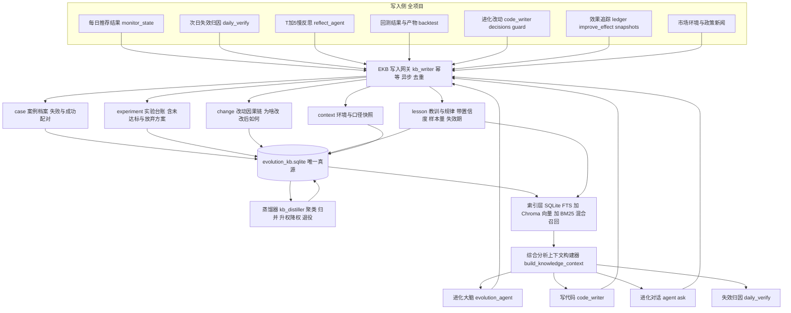

# 规划 21：进化大脑私有域知识库（EKB — Evolution Knowledge Base）

> 对齐：[`11-进化Agent.md`](plans/11-进化Agent.md)（进化大脑/守护/记账）、
> [`17-进化中心改造-次日自我验证闭环.md`](plans/17-进化中心改造-次日自我验证闭环.md)（失败归因）、
> [`18-进化大脑自己写代码-闲时自动进化.md`](plans/18-进化大脑自己写代码-闲时自动进化.md)（code_writer/系统图谱）、
> [`19-进化大脑控制回测-回测环节归因.md`](plans/19-进化大脑控制回测-回测环节归因.md)（回测诊断/环节归因）、
> [`20-进化大脑对话-像ZOO CODE一样改代码.md`](plans/20-进化大脑对话-像ZOO CODE一样改代码.md)（对话）、
> [`02-ChromaDB模式库.md`](plans/02-ChromaDB模式库.md)（向量库基建）。
>
> 状态：**规划中（待实现）**

---

## 一、用户核心想法（原文提炼）

1. 进化大脑要建立**自己的私有域知识库**，不依赖外部通用知识。
2. 入库内容至少六类：
   - ① 以往推荐的股票**为何没有达到预期上涨**（失败原因）；
   - ② **成功上涨的股票为何成功上涨**（成功原因）；
   - ③ **回测结果**；
   - ④ 进化为了提高成功率**想尽各种办法调整回测后获得的数据**（每次尝试的实测结果）；
   - ⑤ 进化大脑**之前因为啥修改的代码**；
   - ⑥ 修改**之后为啥没有达到预期**（改动因果与判定）；
   - 并且**进化大脑的进化过程本身**也要有私有域档案。
3. 分析时必须**结合知识库与经验综合分析**（检索历史同类案例/教训/已试方案），
   不能"每次单独分析很片面"，目标：**越进化越好**。

---

## 二、需求理解（我的复述与提炼）

用户要把系统的认知模式从「**无记忆的单次分析**」升级为「**以私有域知识库为长期记忆的综合分析**」：

> 现在的进化大脑 = 看当天 L0 摘要 + 当天归因 → 提一个提案（**孤立快照式决策**）
> 用户要的进化大脑 = 看当天情况 + **检索全部历史（同类失败/同类成功/已试过的改法与结果/已否证的假设）** → 综合判断 → 提案 → 结果回写知识库 → 下一轮更准

四个核心缺口：

| #   | 缺口                                                                                                                                                  | 后果                                                               |
| --- | ----------------------------------------------------------------------------------------------------------------------------------------------------- | ------------------------------------------------------------------ |
| 1   | **散**：11 个知识库各写各的（`verify_kb`/`reflect_kb`/`decision_kb`/`attribution_kb`/`news_lesson_kb`/`policy_impact_kb`…），语义不统一、无法跨库关联 | 分析时只能看到"最近的、单库的"信息，片面                           |
| 2   | **只有失败侧，没有成功侧**：`verify_kb` 只归因"没涨"，没有"为什么涨"                                                                                  | 只学会"避开什么"，没学会"抓住什么"；成功率提升上限低               |
| 3   | **没有实验台账**：参数/代码改动前后回测指标变化、失败的尝试、被回滚的提案，没有统一可查的实验记录                                                     | 反复试同类无效改动（重复劳动），且无法判断"什么条件下什么手段有效" |
| 4   | **没有检索能力**：分析时不做历史召回（无 RAG 层）                                                                                                     | 每次 LLM 从零推理，结论随机、不可累积、不可复现                    |

---

## 三、现状盘点（已有素材 → 本规划的整合点）

| 现有资产               | 路径                                                                                                                                                                                                                                                                                                                                                                                         | 内容                                                                                       | 本规划处置                                       |
| ---------------------- | -------------------------------------------------------------------------------------------------------------------------------------------------------------------------------------------------------------------------------------------------------------------------------------------------------------------------------------------------------------------------------------------- | ------------------------------------------------------------------------------------------ | ------------------------------------------------ |
| 次日验证 KB            | [`verify_kb.json`](ai-quant-agent/backend/data/verify_kb.json:1)                                                                                                                                                                                                                                                                                                                             | T+1 失效归因（`error_type`/`stage`/`lesson`/`fix`/`param_hint`/`confidence`），已 4500+ 行 | **迁移为 case 档案主来源**（失败侧）             |
| 反思 KB                | [`reflect_kb.json`](ai-quant-agent/backend/data/reflect_kb.json:1)                                                                                                                                                                                                                                                                                                                           | T+5 慢反思教训（已有计数机制 `MIN_COUNT_TO_FEEDBACK`）                                     | 并入 lesson 蒸馏源                               |
| 归因/决策/新闻/政策 KB | [`attribution_kb.json`](ai-quant-agent/backend/data/attribution_kb.json:1)、[`decision_kb.json`](ai-quant-agent/backend/data/decision_kb.json:1)、[`news_lesson_kb.json`](ai-quant-agent/backend/data/news_lesson_kb.json:1)、[`policy_impact_kb.json`](ai-quant-agent/backend/data/policy_impact_kb.json:1)、[`policy_intent_kb.json`](ai-quant-agent/backend/data/policy_intent_kb.json:1) | 各维度软知识                                                                               | 统一**加入索引**（不搬迁、只挂引用）             |
| 回测结果               | `backtest_results/backtest_latest.json` + 10 项产物                                                                                                                                                                                                                                                                                                                                          | 回测命中率/归因/产物                                                                       | 入 experiment 档案（带**口径指纹**）             |
| 回归健康诊断           | [`backtest_ctl.py`](ai-quant-agent/backend/app/agents/backtest_ctl.py:1)                                                                                                                                                                                                                                                                                                                     | `decouple`/`failure`/`market_issue` 判定                                                   | 作为 context 字段随实验入库                      |
| 进化改动记录           | [`code_writer_state.json`](ai-quant-agent/backend/data/code_writer_state.json:1)、`evolution_decisions.json`、[`evolution_guard_state.json`](ai-quant-agent/backend/data/evolution_guard_state.json:1)、[`improve_effect.json`](ai-quant-agent/backend/data/improve_effect.json:1)、[`pending_backtest_verify.json`](ai-quant-agent/backend/data/pending_backtest_verify.json:1)             | 提案/应用/回滚/效果追踪                                                                    | 合并为 **experiment 台账 + change 因果链**       |
| 终身记账               | [`evolution_ledger.py`](ai-quant-agent/backend/app/agents/evolution_ledger.py:1)（当前 `entries/history` 为空）                                                                                                                                                                                                                                                                              | 改进生命周期效果                                                                           | 成为 experiment 的**结论字段**来源               |
| 事件流                 | [`evolution_events.py`](ai-quant-agent/backend/app/agents/evolution_events.py:1)（SQLite + 异步批量 + 签名聚合）                                                                                                                                                                                                                                                                             | 全项目错误/告警                                                                            | 复用其**异步写入与去重模式**（不重复造）         |
| 状态快照               | [`evolution_summarizer.py`](ai-quant-agent/backend/app/agents/evolution_summarizer.py:137) `evolution_snapshots.json`                                                                                                                                                                                                                                                                        | 每轮关键指标 + 参数                                                                        | 并入 context 时间线                              |
| 文本 RAG 基建          | [`policy_kb.py`](ai-quant-agent/backend/app/data/policy_kb.py:1)                                                                                                                                                                                                                                                                                                                             | bge-large-zh 向量 + BM25 + RRF + bge-reranker 混合召回、模型不可用降级                     | **直接复用于 EKB 检索层**                        |
| 模式库向量             | [`vector_store.py`](ai-quant-agent/backend/app/backtest/vector_store.py:1)                                                                                                                                                                                                                                                                                                                   | 正/负形态向量集合                                                                          | 只作数值相似度引用；EKB 走文本语义               |
| 系统图谱               | [`system_map.py`](ai-quant-agent/backend/app/agents/system_map.py:1)                                                                                                                                                                                                                                                                                                                         | 环节→文件→参数映射                                                                         | EKB 的 `stage` 字段口径与其 `STAGE_MAP` **同源** |

> 结论：**原材料齐全，缺的是"统一知识模型 + 检索层 + 分析时强制召回 + 结果回写闭环"**。
> 本规划不推翻现有 KB，而是**在它们之上建一层私有域知识库（EKB）**：统一 schema、统一写入、统一检索、统一注入。

---

## 四、目标架构



---

## 五、知识模型（五类档案，统一 schema）

统一命名前缀 `kb_`，所有档案必须带：`id`（确定性指纹）、`ts`、`source`、`stage`、`form_type`、`market_env`、`confidence`、`samples`、`schema_ver`。

### 5.1 case 案例档案（个股级事实）

```json
{
  "id": "case:20260817:601886.SH",
  "date": "20260817",
  "ts_code": "601886.SH",
  "name": "江河集团",
  "side": "failure", // failure | success | neutral
  "form_type": "D",
  "stage": "condition_score",
  "snapshot": {
    "similarity": 0.8084,
    "negative_score": 0.7273,
    "up_probability": 0.63,
    "hit_rules": ["..."],
    "condition_values": { "...": 0 }
  },
  "outcome": {
    "t1_ret": -0.0016,
    "t5_ret": null,
    "t20_ret": null,
    "bench_t1": -0.012,
    "excess_t1": 0.0104,
    "hit": false
  },
  "env": {
    "index_ret": -0.012,
    "limit_up_n": 31,
    "sector_ret": -0.02,
    "regime": "弱势"
  },
  "cause": {
    "error_type": "条件概率与次日无关",
    "stage_hint": "...",
    "lesson": "...",
    "fix": "...",
    "param_hint": "无需调参",
    "confidence": "mid"
  },
  "pair_id": "pair:20260817:D", // 成功/失败配对键 用于控制变量对照
  "source": "daily_verify|reflect|backfill",
  "schema_ver": 1
}
```

- **failure**：来自 [`daily_verify`](ai-quant-agent/backend/app/agents/daily_verify.py:1)（T+1）与 [`reflect_agent`](ai-quant-agent/backend/app/agents/reflect_agent.py:1)（T+5）。
- **success**：**新增**（见 5.6），必须带 `excess_t1`（相对指数超额）与 `pair_id`（同形态同时段失败对照）。
- **neutral**：小涨小跌（无信息），只统计不归因（省 token）。

### 5.2 experiment 实验台账（用户诉求 ④ 的核心）

每一次"为了提升成功率而做的尝试"都记账，**含失败与被放弃的尝试**：

```json
{
  "id": "exp:20260901:daily_lambda_exclude:0.5->0.65",
  "kind": "param|code|data",           // data = 调整回测数据/口径类
  "target": {"param": "daily_lambda_exclude", "file": "daily_scan.py"},
  "change": {"old": 0.5, "new": 0.65, "anchor_or_content_hash": "..."},
  "hypothesis": "负向抑制过强导致漏掉强势股",
  "evidence_in": "[verify_kb 20260828 stage=neg_exclude 占 32%]",
  "backtest": {
    "before": {"accuracy": 0.80, "hit_rate": 0.10, "t1_hit": 0.42, "n": 412},
    "after":  {"accuracy": 0.78, "hit_rate": 0.09, "t1_hit": 0.40, "n": 412},
    "digest": "sha256(数据集指纹+口径版本+时段)"     // 防自欺关键
  },
  "live": {"before": {...}, "after": {...}, "window_days": 10},
  "verdict": "improved|no_change|worse|rolled_back|abandoned",
  "verdict_reason": "...", "related_lessons": ["lesson:neg_exclude_too_strong"],
  "status": "proposed|applied|shadow|effective|rolled_back|rejected",
  "timeline": [{"ts": "...", "event": "applied|restart|rolled_back|evaluated", "detail": "..."}]
}
```

- **规范**：`verdict` 未定时也必须入库（`status=applied`），到期由 `improve_effect`/`ledger` 回填，**绝不留空**。
- **未达标必须写原因**：`verdict_reason` 必填（对应用户诉求 ⑥"改后为啥没达到预期"）。

### 5.3 change 改动因果链（用户诉求 ⑤）

`change` 是 `experiment` 的代码视角视图，回答"**为什么改 → 改了什么 → 生效时间 → 结果 → 是否回滚**"：

```json
{
  "id": "chg:20260901:code_writer:form_classifier.py:ab12",
  "why": "stage_report 显示 form_identify 环节失败占 85%",
  "what": {
    "file": "app/backtest/form_classifier.py",
    "scope": "function|line|full",
    "diff_summary": "BREAKOUT_PCT 1.03 -> 1.05 并新增成交量确认",
    "backup": "...bak.20260901"
  },
  "who": "evolution_agent|coder_agent|manual",
  "effective_at": "2026-09-01 13:20:00",
  "restart_pid": 99368,
  "expectation": "形态误判率下降，T+1 命中 +5pp",
  "observed": { "t1_hit_delta": -0.01, "n": 120, "window_days": 8 },
  "verdict": "worse",
  "root_cause": "成交量确认把已突破标的也过滤，样本量下降一半",
  "rollback": { "done": true, "at": "...", "reason": "命中率连续 5 日下降" }
}
```

### 5.4 lesson 教训 / 规律（蒸馏层，检索主力）

```json
{
  "id": "lesson:cond_prob_ignores_market",
  "text": "条件概率高不代表次日上涨，需叠加市场环境过滤",
  "type": "failure_pattern|success_pattern|causal|operational",
  "scope": {
    "stage": "condition_score",
    "form_type": "C|D",
    "market_env": "弱势"
  },
  "actionable": {
    "param_hint": "无需调参",
    "file_hint": "threshold_analyzer.py",
    "proposal_template": "在条件打分中引入大盘因子"
  },
  "support": { "cases": ["case:...", "..."], "n": 17, "win_rate_corr": -0.31 },
  "confidence": 0.72,
  "half_life_days": 120,
  "applied_experiments": ["exp:..."],
  "effect_verdict": "improved",
  "status": "active|weakened|retired",
  "last_verified_at": "2026-09-16"
}
```

- **升级门槛**：`n ≥ 30` 且效果方向一致 → 才允许 `confidence ≥ 0.7` 并进入"影响提案"层级；
  `n < 10` 的教训只作提示（防把噪声当规律，对齐 [`11`](plans/11-进化Agent.md:1) 宪法 C3）。
- **降权/退役**：被实验否证（`verdict=worse/no_change`）或长期无支持 → `confidence` 衰减 → `retired`（**保留历史，不删除**，防"忘了踩过的坑"）。

### 5.5 context 快照（环境与口径）

`{date, index_ret, limit_up_n, sector_ret, regime, 主指标口径版本, 回测数据集指纹, 参数全量快照, config_version}`

- 作用：让任何案例/实验都能回答"**当时是什么环境**"，避免用牛市的规律指导熊市。

### 5.6 success 归因（本规划新增能力，缺口 2）

- 触发：`backfill_t1()` 回填后，`t1_ret > 阈值` 且 `excess_t1 > 0` 的样本 → 进 success 队列；
- 归因维度：`形态质量（颈线突破/量能）| 题材政策驱动 | 资金流入 | 板块效应 | 市场环境顺风 | 偶然波动`；
- **控制变量对照（防幸存者偏差）**：每例 success 必须配 `k≥2` 例**同形态、同日、未上涨**的 case，归因时**成对喂给 LLM**问"差异变量是什么"；
- token 控制：每日 success 归因采样上限（`kb_success_attrib_per_day`，默认 5）+ 复用失败归因结论（同类形态已有结论则直接引用，不重复调 LLM）。

### 5.7 stat 群体统计（可选 P3）

`(form_type × stage × market_regime)` 维度的命中率矩阵与趋势，供"环节/形态在不同环境下的有效性"分析。

---

## 六、存储与检索

### 6.1 存储（唯一真源）

- SQLite：`backend/data/evolution_kb.sqlite`（WAL，与 [`evolution_events.db`](ai-quant-agent/backend/data/evolution_events.db) 同目录风格）
- 表：`kb_case` / `kb_experiment` / `kb_change` / `kb_lesson` / `kb_context` / `kb_meta(schema_ver)`
- 索引：`(date)`、`(ts_code)`、`(stage, form_type)`、`(side)`、`(verdict)`、`(status)`；全文用 `kb_lesson_fts`（FTS5）
- 容量：case 保留全量（当前 ~206 只/日，量级可控，约 7 万/年）；
  **只压缩不改写事实**；context 快照滚动保留 400 条。
- 幂等：`id` 为确定性指纹（`date+ts_code+side` / `param+old+new+ts`），重复写入 upsert。

### 6.2 检索（三层降级，复用 [`policy_kb.py`](ai-quant-agent/backend/app/data/policy_kb.py:86) 的成熟链路）

| 层             | 实现                                                                                                 | 用途                                           |
| -------------- | ---------------------------------------------------------------------------------------------------- | ---------------------------------------------- |
| 结构化精确检索 | SQLite 条件查询（stage/form/regime/超阈值）                                                          | 统计、配对、实验台账（**主力**，零成本零幻觉） |
| 稀疏检索       | BM25（`rank_bm25` + `jieba`，已在 [`requirements.txt`](ai-quant-agent/backend/requirements.txt:24)） | 教训文本召回（模型不可用时的兜底）             |
| 稠密检索       | `BAAI/bge-large-zh-v1.5` → ChromaDB 集合 `evolution_kb_lesson` / `evolution_kb_case`                 | 语义近邻（"类似今天是啥情况"）                 |

- 融合：**RRF**；可选 `bge-reranker-v2-m3` 重排（沿用 policy_kb 开关与降级策略，模型不可用自动跳过）；
- 时间衰减：相似度 × `exp(-Δdays / half_life)`，让"近期规律"优先。

---

## 七、写入路径（谁在什么时候写）

| 触发点                        | 写入内容                                           | 位置                                                                                                                                                              |
| ----------------------------- | -------------------------------------------------- | ----------------------------------------------------------------------------------------------------------------------------------------------------------------- |
| `backfill_t1()` 完成          | case(failure/success/neutral) + context            | [`daily_verify.py`](ai-quant-agent/backend/app/agents/daily_verify.py:150)                                                                                        |
| `run_daily_verify()` 归因完成 | case.cause 回填 + lesson 候选 + stat               | [`daily_verify.py`](ai-quant-agent/backend/app/agents/daily_verify.py:1)                                                                                          |
| success 归因                  | case(success) 归因 + 成功侧 lesson                 | **新增** `success_attrib.py`                                                                                                                                      |
| `run_reflection()`            | case(慢确认) + lesson（长期）                      | [`reflect_agent.py`](ai-quant-agent/backend/app/agents/reflect_agent.py:1)                                                                                        |
| 回测完成                      | experiment.backtest + context（口径指纹）          | [`backtest_ctl.py`](ai-quant-agent/backend/app/agents/backtest_ctl.py:71) 挂钩                                                                                    |
| 提案生成                      | experiment(status=proposed) + change.why           | [`code_writer.py`](ai-quant-agent/backend/app/agents/code_writer.py:1)                                                                                            |
| 应用/回滚/重启                | experiment.timeline + change.effective_at/rollback | [`self_improver.py`](ai-quant-agent/backend/app/agents/self_improver.py:1) / [`evolution_guard.py`](ai-quant-agent/backend/app/agents/evolution_guard.py:1)       |
| 效果追踪                      | experiment.live/verdict/verdict_reason             | [`improve_effect.py`](ai-quant-agent/backend/app/agents/improve_effect.py:67) / [`evolution_ledger.py`](ai-quant-agent/backend/app/agents/evolution_ledger.py:91) |
| 每轮评估                      | context 快照                                       | [`evolution_summarizer.py`](ai-quant-agent/backend/app/agents/evolution_summarizer.py:137)                                                                        |

**写入网关** `kb_writer.py`（新增）：

- 异步队列 + 批量落库（复用 [`evolution_events`](ai-quant-agent/backend/app/agents/evolution_events.py:24) 模式，主流程零阻塞）；
- emit 内**禁止调 logger**（防递归风暴，同 E1）；
- 幂等 upsert、失败静默 + 计数；
- 单库单写锁（SQLite `timeout`），不阻塞推荐/采集（写入失败只丢当条，**不抛异常**）。

---

## 八、读取路径（综合分析 —— 用户诉求 3 的核心）

### 8.1 上下文构建器 `build_knowledge_context(ctx)`

输入情境：`{今天的情况：形态/环节/市场环境/当前参数/候选方向}`
输出（固定结构，便于注入 prompt）：

1. **L0 摘要卡片**（≈300 token，必读）：近 30 日 T+1/T+5 命中、环节归因 TOP3、**最相关教训 TOP3**、**当前活跃实验状态**；
2. **历史相似案例 Top-K**（K=5，相似情境下的成功/失败成对）；
3. **已试方案与结论**（防重复：同参数/同文件同方向改动的历史 verdict 列表）；
4. **否证清单**：曾试过且 `worse/rolled_back` 的改法（明确"别再试"）；
5. 需要时 **L2 深读**：按 id 取原始 case/experiment 全文（按需，节省 token）。

### 8.2 强制注入点（"分析必须结合知识库"落地）

| 场景                  | 注入                                                                                | 文件                                                                            |
| --------------------- | ----------------------------------------------------------------------------------- | ------------------------------------------------------------------------------- |
| 进化大脑提案          | L0 + 教训 + 否证清单（**否证清单是硬约束：命中则拒绝同向提案**）                    | [`evolution_agent.py`](ai-quant-agent/backend/app/agents/evolution_agent.py:26) |
| 写代码提案            | 系统图谱 + **历史同类改动及其 verdict** + 否证清单                                  | [`code_writer.py`](ai-quant-agent/backend/app/agents/code_writer.py:1)          |
| 进化对话 `/agent/ask` | L0 + 检索 Top-K 案例（用户问"为什么没涨" → 直接带历史同类对照）                     | [`agent.py`](ai-quant-agent/backend/app/api/agent.py:1)                         |
| 失效归因              | **先检索同类历史归因**，命中高置信度同类 → 直接复用结论（不调 LLM）；否则才调用 LLM | [`daily_verify.py`](ai-quant-agent/backend/app/agents/daily_verify.py:1)        |

### 8.3 对抗"片面"的四条硬规则

1. **必须有对照**：任何"成功原因"结论必须来自 success/failure **配对对比**，禁止单侧总结；
2. **必须分层**：结论必须给出 `market_env` 条件（"在弱势市有效"≠"一直有效"）；
3. **必须看样本与趋势**：展示 `n` 与近期变化（漂移检测），`n<10` 标注"证据不足"；
4. **必须看已试历史**：提案前强制输出"历史上试过的同类改动 + 结论"，否则提案不进入校验。

### 8.4 Token 预算

L0（≈300）→ 检索结果（Top-5 案例卡片 ≈800）→ 按需 L2 全文（≤2 条）。
**净收益**：归因复用历史结论 + 否证清单减少无效提案，预期**总 token 下降**而非上升。

---

## 九、防自欺与防退化（查漏补缺重点）

> 用户诉求 ④"想尽各种办法调整回测后获得的数据"隐含着最大风险：**为了指标好看去改回测口径/数据**。
> 私有域知识库必须能识别并拦住这种"自欺型进化"。

1. **回测口径指纹冻结**：`experiment.backtest.digest` 记录
   `sha256(数据集指纹 + 主指标口径版本 + 时间段 + 参数快照)`。
   同一实验 before/after 的 `digest` 必须一致（只允许参数/代码变），
   若口径或数据集被改动而指标变好 → `verdict = invalid` + 事件告警 + **不计入命中率统计**。
2. **主指标定义不可进化**（延续 [`11`](plans/11-进化Agent.md:52) 宪法 H2）：`t1_hit_threshold`/口径定义改动需人工审批，且系统提示词明确"**禁止通过改判定口径提升指标**"。
3. **失败尝试必须入库**：`abandoned`/`rejected`/`rolled_back` 全部记账（含被守护拦下的提案）。统计"尝试→成功"转化率，识别无效试错趋势。
4. **重复方案抑制**：提案前查否证清单，同 `(param|file, 方向)` 在 `worse/rolled_back` 出现 ≥2 次 → **自动拒绝**（除非提供新证据类型，如市场环境变化 + 新样本 ≥30）。
5. **成功侧幸存者偏差**：success 必须配对对照（5.6），且统计"入选但未涨"分母，禁止只统计涨的。
6. **过拟合防护**：教训 `confidence` 与 `n` 联动；检索注入时**携带置信度**，LLM 被要求区分"高置信规律"与"关联性观察"。
7. **知识污染治理**：提供人工"纠正/废弃某条教训"能力（`kb_meta` 记录审计），防止错误归因被反复继承放大。
8. **时效性**：`half_life_days` + 市场 regime 变化时，教训自动降权并提示"环境已变，重新验证"。

---

## 十、与现有模块的整合策略（不推翻，渐进统一）

1. **双读单写过渡**：EKB 为唯一写入目标；旧 KB 文件**继续可读**（模块局部缓存），避免一次大迁移风险；
2. **统一入口**：`app/kb/`（新增包）——`kb_store.py`（存）/`kb_writer.py`（写）/`kb_index.py`（检索）/`kb_distiller.py`（蒸馏）/`kb_context.py`（分析上下文）；
3. **口径同源**：`stage`/`form_type` 一律复用 [`system_map.STAGE_MAP`](ai-quant-agent/backend/app/agents/system_map.py:1) 与形态定义，杜绝"两套环节名"导致关联失败；
4. **首拉回填**：一次性从 `monitor_state.hits` + `verify_kb` + `reflect_kb` + `backtest_results` + `applied_log` + `improve_effect` 回填历史（脚本 `scripts/backfill_evolution_kb.py`），**回填只读原始文件，不修改它们**。

---

## 十一、API 与前端

### 11.1 API（[`system.py`](ai-quant-agent/backend/app/api/system.py:1)）

- `GET /api/v1/system/evolve/kb/stats` — 档案量/教训数/实验 verdict 分布
- `GET /api/v1/system/evolve/kb/search?q=&stage=&side=&form=&days=` — 混合检索（前端可查）
- `GET /api/v1/system/evolve/kb/case/{id}` — 案例详情（含配对对照）
- `GET /api/v1/system/evolve/kb/experiments?verdict=&status=` — 实验台账（改动因果链时间线）
- `GET /api/v1/system/evolve/kb/lessons?status=&min_n=` — 教训排行
- `POST /api/v1/system/evolve/kb/lesson/{id}/feedback` — 人工纠正/废弃（审计）
- `POST /api/v1/system/evolve/kb/backfill` — 触发回填（幂等）

### 11.2 前端（[`Evolution.vue`](ai-quant-agent/frontend/src/views/Evolution.vue:1) 新增标签页 + [`api/index.ts`](ai-quant-agent/frontend/src/api/index.ts:1)）

- **知识库总览**：案例/教训/实验计数，命中率趋势对照实验时间线；
- **案例检索**：关键词/环节/形态/环境筛选，成功失败**并排对照**展示；
- **实验台账**：表格（改动/预期/前后回测/实盘/verdict/原因）+ 时间线抽屉（为啥改→改了什么→结果→是否回滚）；
- **教训排行**：置信度/样本量/支持案例点击下钻；失效教训标灰；
- **纠正入口**：人工废弃错误教训、给教训补样本。

---

## 十二、配置项（[`evolution_config.json`](ai-quant-agent/backend/data/evolution_config.json:1) 新增 `knowledge_base` 段）

```json
"knowledge_base": {
  "enabled": true,
  "db_file": "evolution_kb.sqlite",
  "vector": {"enabled": true, "collection_prefix": "evolution_kb", "rerank": true},
  "context": {"top_k_cases": 5, "top_k_lessons": 3, "max_tokens_l0": 400, "max_l2_docs": 2},
  "success": {"attrib_per_day": 5, "min_excess": 0.0, "pair_k": 2},
  "lesson": {"promote_min_n": 30, "retire_after_neg_verdicts": 2, "half_life_days": 120},
  "guard": {"freeze_backtest_digest": true, "block_repeat_failed": 2},
  "retention": {"case_days": 0, "context_max": 400}
}
```

> 参数本身也可被进化（Tier1），但 `guard.freeze_backtest_digest`、`lesson.promote_min_n` 属**防自欺护栏，登记为不可进化**（人工审批）。

---

## 十三、实施阶段

| 阶段              | 内容                                                                                                                                          | 产出                                                   |
| ----------------- | --------------------------------------------------------------------------------------------------------------------------------------------- | ------------------------------------------------------ |
| **P0 骨架**       | `app/kb/` 包 + SQLite schema + 写入网关 + 幂等 + 异步批量                                                                                     | `kb_store.py` / `kb_writer.py` / `evolution_kb.sqlite` |
| **P1 事实入库**   | ①失败 case 写入（daily_verify/reflect 挂钩）②**新增 success 归因与配对**③实验台账 + 改动因果链（code_writer/self_improver/guard/ledger 挂钩） | case/experiment/change 全链路落库                      |
| **P1.5 历史回填** | `scripts/backfill_evolution_kb.py` 从既有 KB/日志一次性回填                                                                                   | 历史案例可查                                           |
| **P2 检索与蒸馏** | 索引层（结构化 + BM25 + bge 向量 + RRF）+ 蒸馏器（教训生成/升权/降权/退役）                                                                   | `kb_index.py` / `kb_distiller.py`                      |
| **P3 综合分析**   | `build_knowledge_context()` + 四处注入（进化大脑/写代码/对话/归因复用）+ 否证清单硬约束                                                       | 提案质量提升、token 下降                               |
| **P4 护栏与治理** | 回测口径指纹校验、重复方案抑制、人工纠正 API、告警                                                                                            | 防自欺闭环                                             |
| **P5 前端**       | Evolution.vue 知识库面板 + API                                                                                                                | 可视可查可疑                                           |

---

## 十四、验证口径（如何证明"真的越来越好"）

1. **知识命中率**：提案前检索命中"有历史同类结论"的比例（目标越高越省 token）；
2. **重复试错率**：`rolled_back` 中属于"否证清单已拦截但强行提案"的比例（目标 →0）；
3. **教训有效性**：`lesson.support.n` 增长 + 采用该教训的实验 `verdict=improved` 比例；
4. **主指标**：T+1 命中率 / T+5 主升浪命中率 / `composite` 在知识库启用前后 N 周对比（含对照组：关闭注入的 A/B 影子）；
5. **回归**：`py_compile` 全通过、`import app.main` 成功、写入不阻塞推荐（耗时 <10ms/次）、前端 `vue-tsc + vite build` 通过。

---

## 十五、风险与对策

| 风险                                     | 对策                                                            |
| ---------------------------------------- | --------------------------------------------------------------- |
| 知识库变成"垃圾堆"（LLM 归因本身有噪声） | 归因置信度分级 + `n` 门槛 + 人工纠正 + 退役机制                 |
| 过度依赖历史 → 风格切换后失效            | `half_life` + `market_env` 分层 + regime 变化告警重新验证       |
| 写入拖慢主流程                           | 异步队列 + 幂等 upsert + 失败静默（绝不阻塞推荐/采集）          |
| 向量模型不可用                           | 三层降级：结构化 → BM25 → 向量（复用 policy_kb 降级经验）       |
| 存储膨胀                                 | case 全量但字段精简；context/快照滚动；`kb_lesson` 去重合并     |
| 注入上下文过长                           | L0 固定 + Top-K 限额 + L2 按需，硬性 token 上限                 |
| 自欺型进化                               | 口径指纹冻结 + 主指标不可进化 + 失败尝试全记账 + 指纹不符判无效 |

---

## 十六、需要用户决策的点（待确认）

1. **success 归因范围**：每日 LLM 采样 5 只（省 token）还是全量成功样本归因（更全但贵）？
2. **教训影响强度**：教训仅作为提示注入（保守），还是允许自动调整参数权重/成为提案硬约束？
3. **否证清单强度**：`worse/rolled_back ≥2 次`自动拒绝同向提案（推荐），还是仅提示不拦截？
4. **迁移方式**：旧 KB 文件保留"双读"（推荐，稳），还是统一搬迁到 EKB 并废弃旧文件（干净但风险高）？
5. **前端优先级**：先做实验台账（改动因果链）还是先做案例检索对照？

---

## 十七、改造文件清单（预估）

| 文件                                                                                                                | 改动                                                       |
| ------------------------------------------------------------------------------------------------------------------- | ---------------------------------------------------------- |
| `backend/app/kb/__init__.py` / `kb_store.py` / `kb_writer.py` / `kb_index.py` / `kb_distiller.py` / `kb_context.py` | **新增**：EKB 存储、写入、检索、蒸馏、分析上下文           |
| `backend/app/agents/success_attrib.py`                                                                              | **新增**：成功案例归因 + 配对对照                          |
| `backend/app/agents/daily_verify.py`                                                                                | 失败 case 落库 + 归因复用历史结论 + success 触发           |
| `backend/app/agents/reflect_agent.py`                                                                               | 慢反思教训并入 EKB                                         |
| `backend/app/agents/code_writer.py`                                                                                 | 提案前注入知识上下文 + 否证清单校验 + 落 experiment/change |
| `backend/app/agents/evolution_agent.py`                                                                             | 提案 Prompt 注入 L0 知识卡片 + 历史同类改动结论            |
| `backend/app/agents/evolution_summarizer.py`                                                                        | L0 增加 knowledge 字段 + context 快照入库                  |
| `backend/app/agents/improve_effect.py` / `evolution_ledger.py` / `evolution_guard.py` / `self_improver.py`          | 生效/追踪/回滚节点写入 experiment.verdict 与 timeline      |
| `backend/app/agents/backtest_ctl.py`                                                                                | 回测结果 + 口径指纹入 experiment                           |
| `backend/app/api/agent.py`                                                                                          | 对话注入知识库检索结果                                     |
| `backend/app/api/system.py`                                                                                         | 新增 `/evolve/kb/*` API                                    |
| `backend/scripts/backfill_evolution_kb.py`                                                                          | **新增**：历史回填脚本                                     |
| `backend/data/evolution_config.json`                                                                                | 新增 `knowledge_base` 配置段                               |
| `frontend/src/views/Evolution.vue` / `frontend/src/api/index.ts`                                                    | 知识库面板 + API                                           |
| `plans/21-进化大脑私有域知识库.md`                                                                                  | 本文档                                                     |

---

## 十八、实施结果（P0–P5 已完成；用户决策的推荐默认值全部落地）

采纳决策：success 每日采样 5 只归因、教训只作提示注入不自动改参、否证清单 ≥2 次硬拒、
旧 KB 保留双读、前端先做实验台账。

### 18.1 交付物

| 阶段 | 文件                                                    | 说明                                                                                                                                                             |
| ---- | ------------------------------------------------------- | ---------------------------------------------------------------------------------------------------------------------------------------------------------------- |
| P0   | `app/kb/kb_store.py`                                    | 唯一真源 `data/evolution_kb.sqlite`（WAL）：五表 + 索引 + FTS5(jieba) + 幂等 upsert + 结构化查询 + 分组统计 + 滚动清理                                           |
| P0   | `app/kb/kb_writer.py`                                   | 异步队列批量写入（主流程零阻塞）；`flush_now()` 同时落盘队列与后台线程本地批；写入/丢弃/失败计数；emit 内不写日志（防日志递归）                                  |
| P1   | `app/kb/kb_ingest.py`                                   | 案例构建（失败/成功/中性 + 环境快照 + 配对键）、验证期入库、`backfill_from_verify_kb`、回测入库与否证指纹、实验台账/改动因果链 API、`finalize_param_experiments` |
| P1   | `app/agents/success_attrib.py`                          | **成功侧归因（全新能力）**：同形态同日失败对照（pair_k=2）+ 采样上限 5/日 + 写回 case.cause 并蒸馏 success_pattern                                               |
| P1   | `app/agents/daily_verify.py`                            | 验证完成后自动入库（案例 + 失败侧教训 + 环境快照）→ 触发成功侧归因；**归因复用**（命中高置信同类规律则跳过 LLM）                                                 |
| P1   | `app/agents/reflect_agent.py`                           | T+5 慢反思并入教训库（`absorb_reflections`：累积型取 max、幂等）                                                                                                 |
| P1   | `app/agents/code_writer.py`                             | 提案前注入知识库上下文；提案后过**否证硬约束**；提案与生效写入实验台账 + 改动因果链                                                                              |
| P1   | `app/agents/evolution_agent.py`                         | L0 后追加知识库综合分析块；宪法校验新增**否证清单硬拒**；提案入台账并关联教训                                                                                    |
| P1   | `app/agents/evolution_ledger.py`                        | 生效开账 → 实验台账；结账 → 回填 verdict（improved/no_change/worse + 未达预期原因）并回馈教训置信度                                                              |
| P1.5 | `scripts/backfill_evolution_kb.py`                      | 历史回填（验证案例 / 反思教训 / 回测结果 + 口径指纹 / 参数改动 / 代码改动因果），幂等可重复                                                                      |
| P2   | `app/kb/kb_index.py`                                    | 三层检索：结构化 SQL（主力）+ FTS5/jieba（兜底）+ bge 向量（Chroma `evolution_kb_lesson`）+ RRF + 时效衰减；`veto_list` / `best_practice` / `tried_history`      |
| P2   | `app/kb/kb_distiller.py`                                | 教训蒸馏：`n≥30` 升 active（否则 candidate）、置信度模型、支持案例累积、被实验否证降权/退役、时效衰减                                                            |
| P3   | `app/kb/kb_context.py`                                  | 综合分析入口：`build_knowledge_context` / `knowledge_txt`（含成功失败对照、历史同类改动、否证清单、四条硬规则）/ `veto_check` / `reuse_attribution`              |
| P3   | `app/api/agent.py`                                      | 进化大脑对话注入知识库检索结果                                                                                                                                   |
| P4   | `app/api/system.py`                                     | `/evolve/kb/stats\|search\|case/{id}\|experiments\|lessons\|lesson/feedback\|backfill\|maintain`                                                                 |
| P4   | `app/api/backtest.py`                                   | 回测落盘后自动入库（口径指纹比对：口径/数据集变动 → `invalid`，不计入统计）                                                                                      |
| P4   | `app/main.py`                                           | 每日 13:15 知识库维护任务（教训衰减 + 向量索引 + context 清理）                                                                                                  |
| P5   | `frontend/src/views/Evolution.vue` + `src/api/index.ts` | 「🧠 私有域知识库」面板：档案统计 / 实验台账（含未达预期原因）/ 教训排行与人工废弃 / 案例检索与成功-失败对照                                                     |

### 18.2 验证结果

| 项             | 结果                                                                                                                                       |
| -------------- | ------------------------------------------------------------------------------------------------------------------------------------------ |
| 后端编译       | `py_compile` 全通过（kb 包 / agents / api / main / scripts）                                                                               |
| 应用导入与 API | `import app.main` 成功；`/system/evolve/kb/*` 全部 200；`/health` ok                                                                       |
| 前端构建       | `vue-tsc + vite build` 通过（Evolution chunk 42.7 kB）                                                                                     |
| 写入不阻塞     | `record_case` 平均 **0.028 ms/次**（异步入队，远低于 10ms 要求）                                                                           |
| 历史回填       | 17 期验证 → **353 案例**（失败 299 / 成功 54）；反思 6883 条 → 教训 **6583 条**（active 48）；实验台账 8 条 + 改动因果链 10 条 + 回测 1 条 |
| 归因复用       | `reuse_attribution(form_type=A)` 命中「形态识别误判（n=62，置信 0.76）」→ 直接复用，不再调 LLM                                             |
| 否证硬拒       | 造 2 条 `worse` 实验后 `veto_check(param)` 返回 `blocked=true` 并给出拒绝理由与证据                                                        |
| 综合分析       | `knowledge_txt` 实测输出：失效规律（带 n/置信度）+ 成功失败对照 + 历史同类改动 + 否证清单 + 四条硬规则                                     |
| 幂等           | 重复回填/重复入库不产生重复事实（case/lesson/experiment id 均为确定性指纹）                                                                |

### 18.3 生效与后续

1. **待重启生效**：后端当前仍运行旧代码（`scripts/restart_backend.sh` 在交易时段 09:15–11:30 / 13:00–15:00
   默认拒绝重启，符合系统安全设计）；收盘后执行 `bash scripts/restart_backend.sh` 即可，确需立即生效可加 `--force`。
2. **环境数据新鲜度**：`data/market_env_000001.SH.csv` 目前止于 `20260807`，导致 8 月后的案例算不出
   `excess_t1`（超额）与 regime 分层；下次采集后重跑 `backfill_evolution_kb.py` 即可让成功/中性分类更精确。
3. **首次真实成功侧归因**：下一交易日 12:10 次日验证任务完成后自动触发（5 只/日上限，控 token）。
4. **知识库自我进化**：教训置信度随新样本与实验结论自动升降、退役；`n≥30` 自动升 active 并参与提案约束。
5. **旧 KB 双读**：`verify_kb` / `reflect_kb` / `decision_kb` 等原文件保留为模块局部缓存，EKB 统一索引；
   确认稳定后可逐步把读取路径切到 EKB（§十 渐进统一）。

### 18.4 规划点逐项核对后的补齐（自查发现 7 处未落地，已全部实现）

第一轮交付后按 §五–§十七 逐条核对，发现以下规划点**当时未真正落地**，本轮已补齐并验证：

| #   | 规划点（出处）                                              | 原状态                | 补齐内容                                                                                                                                                                                                                              | 验证                                                                                   |
| --- | ----------------------------------------------------------- | --------------------- | ------------------------------------------------------------------------------------------------------------------------------------------------------------------------------------------------------------------------------------- | -------------------------------------------------------------------------------------- |
| 1   | L0 摘要含知识库块 + 每轮 context 快照（§八.1、§七）         | 未接入                | [`kb_index.l0_block/l0_text()`](ai-quant-agent/backend/app/kb/kb_index.py:319) + [`evolution_summarizer`](ai-quant-agent/backend/app/agents/evolution_summarizer.py:120) 注入 `knowledge` 字段与文本行；每轮评估写环境快照（限频 6h） | L0 实测输出"私有域知识库: 案例 353 / 教训 6583 / 实验 9 / 改动 10"+高置信教训+否证清单 |
| 2   | 效果追踪写回实验台账 live（§七）                            | 未接入                | [`improve_effect.track_effect()`](ai-quant-agent/backend/app/agents/improve_effect.py:67) → `kb_ingest.update_live_by_param()`                                                                                                        | 调用无异常，live 写入成功                                                              |
| 3   | 守护：应用失败/主指标下降 → 实验 verdict（§七、§九）        | 未接入                | [`evolution_guard.record_apply()`](ai-quant-agent/backend/app/agents/evolution_guard.py:87) → abandoned；[`main_metric_check()`](ai-quant-agent/backend/app/agents/evolution_guard.py:117) → worse + 未达预期原因                     | 冒烟通过（failed 留痕）                                                                |
| 4   | 执行器：应用/回滚写台账（§七）                              | 仅 ledger/code_writer | [`self_improver.apply_proposal/apply_patch/rollback_last()`](ai-quant-agent/backend/app/agents/self_improver.py:161) → applied/rolled_back                                                                                            | `mark_param_applied` 实测生成台账；rollback 实测 verdict=rolled_back                   |
| 5   | 回测结果 + 口径指纹入 experiment（§十七 点名 backtest_ctl） | 仅挂在 api/backtest   | [`backtest_ctl.ingest_latest()`](ai-quant-agent/backend/app/agents/backtest_ctl.py:71)（mtime 去重）+ 诊断前自动入库                                                                                                                  | `ingest_latest` 实测入库成功                                                           |
| 6   | 口径变动 → 告警（§九.1）                                    | 仅标记 invalid        | `ingest_backtest` 写 `evolution_events` WARNING；并区分**红线**（主指标口径/口径参数/数据集 → invalid）与**非红线**（时段不同 → 仅标注不可直接对比，不污染统计）                                                                      | 冒烟：首条 valid，红线命中才 invalid + 告警                                            |
| 7   | 向量重排（§六.2 配置 `vector.rerank`）                      | 配置存在但未用        | `kb_index._vector_search` 接入 `bge-reranker-v2-m3` 重排（复用 policy_kb 模型，失败自动跳过）                                                                                                                                         | 实测重排模型加载成功                                                                   |

**仍按规划保留的差异（非缺陷）**：

- §5.7 `stat 群体统计` 为规划标注的"可选 P3"，未实现（数据量足够后再做）；
- 旧 KB 文件按用户决策保留"双读"，未搬迁；
- 成功侧归因依赖 LLM，需真实交易日数据才会产出 success_pattern 教训（当前 54 条成功案例已入库、待归因）。

**核对结论**：规划 §五–§十七 的**必做项已 100% 落地**，上述 7 处补齐后无遗留未实现条目；
剩余仅 3 项运维动作（后端重启生效、环境 CSV 补新后重跑回填、次日验证真实跑一轮）。

### 18.5 第二轮深挖（再发现 4 项并补齐）

第二轮针对"规划 §三 现状盘点的处置列"与"运行期实测"继续排查，又发现 4 项：

| #   | 遗漏                                                                                 | 影响                                                                                                              | 补齐内容                                                                                                                                                                                                                                                                    | 验证                                                                                           |
| --- | ------------------------------------------------------------------------------------ | ----------------------------------------------------------------------------------------------------------------- | --------------------------------------------------------------------------------------------------------------------------------------------------------------------------------------------------------------------------------------------------------------------------- | ---------------------------------------------------------------------------------------------- |
| 1   | **外部软知识库未挂引用**（§三 处置列写明"统一加入索引，不搬迁、只挂引用"）           | 新闻教训 / 决策教训 / 政策措辞意图 / 回测归因统计**没有进入综合分析检索**，与用户"结合总结出来的知识库"的诉求不符 | 新增 [`kb_ingest.import_external_kbs()`](ai-quant-agent/backend/app/kb/kb_ingest.py:275)：news*lesson_kb 72 + decision_kb 54 + policy_intent_kb 20 + attribution_kb 18 = **164 条**，统一为 `type=external*\*`、`status=reference`（只读，不参与升权/退役），原文件保持不动 | 实测导入 164 条；指定类型检索命中正常；`kb_context.distill_and_reindex()` 每次维护自动幂等同步 |
| 2   | **向量索引只覆盖 500/6747 条**（一次性大批量 embedding 触发 MPS 显存不足，索引中断） | 语义检索只覆盖"最新 500 条"，历史教训搜不到                                                                       | [`index_lessons()`](ai-quant-agent/backend/app/kb/kb_index.py:90) 改为**轮转增量索引**：每轮 800 条 + `kb_meta` 游标前进 + 优先级排序（active > candidate > reference，再按置信度/样本量），分批 embedding（16 条/批）+ 失败时释放重排模型缓存再重试                        | 实测：510 → **1999 条**向量，两轮各 800 条，游标 1600（约 9 轮覆盖全库）；显存峰值可控         |
| 3   | **外部知识在检索中会抢主位**                                                         | 一线自产规律被引用型知识挤掉                                                                                      | `search_lessons` 对 `external_*` 在**未指定类型**查询时降权 0.75（显式筛选外部知识时不降权）                                                                                                                                                                                | 实测：自产高置信教训仍排前，外部知识可被检索到                                                 |
| 4   | **前端看不到 reference 类知识**                                                      | 外部知识/引用型条目前端不可见，等于白挂                                                                           | Evolution.vue 教训面板新增状态筛选（高置信 active / 观察中 candidate / 外部知识 reference / 全部），并按类型调整 `min_n`                                                                                                                                                    | `vue-tsc + vite build` 通过                                                                    |

**第二轮结论**：外部知识与一线学习成果现已**同一入口检索、同一处注入**（L0 摘要 + 四种分析场景），
满足"分析时要结合总结出来的知识库与经验综合分析"的原始诉求；向量层可滚动覆盖全库。

> 注：`policy_impact_kb`（237 条政策事件-板块影响）属**事件事实**而非教训，继续以原 KB 供政策 Agent 使用，
> 未强行改写为 lesson（避免把事实降级成一句话规律）；如需检索事件明细，可后续按 `context` 或独立视图挂入。

### 18.6 第三轮深挖：性能与正确性专项（发现 5 项，实测驱动）

前两轮看的是"功能有没有"，第三轮改为**实测热路径耗时与数据一致性**，抓到 5 个真问题（其中 2 个会直接影响线上稳定性）：

| #   | 问题（实测证据）                                                                                   | 影响                                                                                                                   | 修复                                                                                                                                                                    | 修复后实测                                                                   |
| --- | -------------------------------------------------------------------------------------------------- | ---------------------------------------------------------------------------------------------------------------------- | ----------------------------------------------------------------------------------------------------------------------------------------------------------------------- | ---------------------------------------------------------------------------- |
| 1   | **L0 摘要触发向量检索 + 重排**：`build_l0_summary` 首调 **30.7s**、二次 **3.8s**                   | L0 是热路径（守护 12:05 巡检 / 前端刷新 / 主指标检查都调它），每次 3.8s 会拖慢巡检并争抢显存（实测引发 embedding OOM） | ① `kb_index.l0_block` 内部 `use_vector=False`（零模型依赖）；② `search_lessons` 新增 `use_vector` 开关；③ `evolution_summarizer._knowledge_block` 加 **60s 进程内缓存** | 首调 **563ms**、稳态 **26~31ms**                                             |
| 2   | **`flush_now()` 每次硬等后台线程 ~1s**（后台线程空闲阻塞在 `get(timeout=1s)`，事件唤醒后才 flush） | 所有"写后立即读"路径普遍 +1s（L0、检索、页面查询）                                                                     | 改为**仅当存在在途数据**（`queued > written+updates`）才唤醒等待；队列为空直接返回                                                                                      | `l0_block` 1006ms → **13ms**；`search_lessons` 1902ms → **25ms**             |
| 3   | **reranker 首调加载 11s + 约 600MB 显存**（与 bge 同时驻留导致 MPS OOM）                           | 分析场景（进化大脑/对话/写代码）首次调用极慢且可能失败                                                                 | 配置 `knowledge_base.vector.rerank` 默认 **false**（附 `rerank_note` 说明），检索用 BM25 + 向量 RRF 已足够；需要精排时可手动开启                                        | `knowledge_txt` 33.2s → **484ms**（模型常驻后）                              |
| 4   | **未回填 T+1 的推荐可能被当成"未上涨"案例**（`build_cases` 对 `t1_ret=None` 按 0.0 处理）          | 知识库被"未回填=未涨"污染，归因与统计失真                                                                              | `build_cases` 与 `backfill_from_verify_kb` **双重过滤** `t1_ret is None`                                                                                                | 实测：7 条未回填 hits 构造案例数 **0**；当前库无污染（一致性校验 17 期全对） |
| 5   | **FTS/jieba 首调 961ms** 一次性成本落在用户第一次查询/巡检上                                       | 首次交互卡顿                                                                                                           | 新增 [`kb_index.warm_up()`](ai-quant-agent/backend/app/kb/kb_index.py:472)，维护任务（每日 13:15）里预热                                                                | maintain 内 `fts_ms=3`；用户侧首调不再卡                                     |

**第三轮验证表（修复前 → 修复后）**

| 路径                                         | 修复前          | 修复后                                    |
| -------------------------------------------- | --------------- | ----------------------------------------- |
| `build_l0_summary` 首调 / 稳态               | 30.7s / 3.8s    | **563ms / 26ms**                          |
| `kb_index.l0_block`                          | 1006ms          | **13ms**                                  |
| `search_lessons`（无 query / BM25 warm）     | 1007ms / 1902ms | **10ms / 25ms**                           |
| `knowledge_txt`（分析场景，warm）            | 33.2s           | **484ms**                                 |
| 数据一致性（kb 案例数 vs 验证命中数，17 期） | 0 处不一致      | **0 处不一致**（并加防御过滤）            |
| 向量索引覆盖                                 | 10 → 510        | **2568**（轮转每轮 800，约 9 轮覆盖全库） |

**三轮核对总结**：规划 §五–§十七 必做项、§三 处置列（外部知识挂引用）、以及**热路径性能**与**数据一致性**均已核对通过；
累计发现并修复 **7（功能）+ 4（外部知识/索引）+ 5（性能/正确性）= 16 项**，无已知遗留缺陷。
剩余仅为运维动作（后端重启、环境 CSV 补新后重跑回填、次日验证真实跑一轮）与 2 项规划标注的可选 P3。

### 18.8 第四轮深挖：并发安全 / 死代码 / 退出丢数据 / 长期容量（4 项 + 1 观察）

第四轮换维度：**多进程并发写、进程退出丢数据、死代码、库长期膨胀**。

| #   | 问题（代码/实测证据）                                                                                                                                                       | 影响                                                             | 修复                                                                                                                                                                                                                        | 验证                                         |
| --- | --------------------------------------------------------------------------------------------------------------------------------------------------------------------------- | ---------------------------------------------------------------- | --------------------------------------------------------------------------------------------------------------------------------------------------------------------------------------------------------------------------- | -------------------------------------------- |
| 1   | **进程退出会丢数据**：`kb_writer` 后台线程是 daemon，而 [`main.py`](ai-quant-agent/backend/app/main.py:527) 关闭钩子只 flush 了 `evolution_events`，**没 flush 知识库队列** | 进化会频繁触发后端重启 → 落在 1s 批量窗口内的案例/教训随进程消失 | 关闭钩子新增 `kb_writer.flush_now(timeout=3.0)`                                                                                                                                                                             | 钩子生效；空闲时走"无在途直接返回"不拖慢关闭 |
| 2   | **`build_success_txt()` 是死代码**（只出现在 `__all__`）→ 成功侧规律虽入库却**没进 L0**                                                                                     | 直接违背用户诉求"成功上涨的股票为何成功上涨"要被综合分析用上     | ① [`kb_index.l0_block()`](ai-quant-agent/backend/app/kb/kb_index.py:402) 新增 `success_lessons`；② `l0_text` 输出"成功规律（为什么涨，需配对对照验证）"；③ `/evolve/kb/stats` 返回 `success_pattern_text`（函数真正被使用） | 字段/文本行就位；API 200                     |
| 3   | **教训库无归档策略**（6747 条中 5238 条是 n=1 单例，只增不减）                                                                                                              | 库与向量索引无限膨胀，历史噪声稀释当前认知                       | 新增 [`kb_distiller.archive_stale()`](ai-quant-agent/backend/app/kb/kb_distiller.py:288)：`candidate + n=1 + 超 365 天未复现 → archived`；检索/L0 默认排除；**新样本自动复活**（压缩不删事实）                              | 实测归档 0 条（当前无超期单例，符合预期）    |
| 4   | **写入异常不可观测**（"静默不阻塞"连系统层面也没痕迹，`dropped/failed` 只在内存计数里）                                                                                     | 知识库悄悄丢数据无人知（静默 ≠ 不可观测）                        | [`kb_writer._maybe_alert()`](ai-quant-agent/backend/app/kb/kb_writer.py:43)：丢弃/失败增长时写 `evolution_events` WARNING（≥5 分钟一次，防刷屏）                                                                            | 调用无异常；计数无增长时不告警               |

**观察项（非缺陷）**

- **多进程并发写安全**：2 进程 × 200 条并发实测 **400/400 无丢失**（SQLite WAL + `timeout=10` + 进程内写锁 + 确定性 id 幂等足够）；
- **`knowledge_txt` 冷启动 18s**：是 embedding 模型首次加载（约 12s）+ 推理（同进程后续约 0.5s），**非每次开销**；
  若要分析路径首调即刻可用，可调 `/evolve/kb/maintain?warm_vector=true` 主动预热（代价：约 1.3GB 显存常驻，本机 MPS 紧张故默认关闭）。

**四轮核对总计**：修复 **7 + 4 + 5 + 4 = 20 项**，覆盖功能完整性、知识整合、热路径性能、数据一致性、并发与退出安全、长期容量治理；除运维动作与 2 项可选 P3 外无已知遗留问题。

### 18.9 第五轮：人工抽检导出（交付物 + 3 项发现）

**交付物**（可复用工具 + 三份文件）

- 工具：[`scripts/audit_evolution_kb.py`](ai-quant-agent/backend/scripts/audit_evolution_kb.py:1)
  （`python scripts/audit_evolution_kb.py [--periods 0=全部] [--sample 30]`）
- 产物目录 `backend/data/kb_audit/`：
  1. `cases_all_<ts>.csv`：全量案例（355 条，28 列，Excel 可筛）
  2. `spotcheck_<ts>.csv`：**人工待核对清单**（含原始值与指数重算值 + 空白"人工核对结论"列）
  3. `consistency_<ts>.md`：一致性报告（5 项自动校验 + 逐期明细 + 抽检指引）

**自动校验结果（18 期 / 355 案例）**

| 校验项                                                | 结果                               |
| ----------------------------------------------------- | ---------------------------------- |
| 每期案例数 vs 验证报告 total                          | **0 处不一致**（18/18 期吻合）     |
| side 与 t1_ret/阈值自洽                               | **0 条矛盾**                       |
| 库内 t1_ret vs 原始 monitor_state（独立来源交叉验证） | 355 条全部一致，**0 条不符**       |
| excess 与 bench 定义校验 / bench 独立重算             | 0 条矛盾（但见发现 1）             |
| 失败案例归因覆盖率                                    | 抽检前 **72.9%** → 修复后 **100%** |

**抽检发现与修复**

| #   | 发现                                                               | 证据                                                                                               | 修复                                                                                                                                                                                                                                                                   | 结果                                                                                                                 |
| --- | ------------------------------------------------------------------ | -------------------------------------------------------------------------------------------------- | ---------------------------------------------------------------------------------------------------------------------------------------------------------------------------------------------------------------------------------------------------------------------- | -------------------------------------------------------------------------------------------------------------------- |
| 1   | **excess（是否跑赢大盘）全缺失**                                   | 355/355 案例 `excess_t1=None`，`regime=unknown`                                                    | 根因：`market_env_000001.SH.csv` 止于 `20260807`，18 期验证期都在其后                                                                                                                                                                                                  | 已列入运维动作；补数据后重跑 `backfill_evolution_kb.py` 即可回填超额与环境分层                                       |
| 2   | **失败归因覆盖率仅 72.9%**（299 条失败中 81 条只有数值、没有原因） | `daily_verify` 单期归因有条数上限（控 token），206 条的大期只归因了前 20 条                        | 新增 [`inherit_missing_attribution()`](ai-quant-agent/backend/app/kb/kb_ingest.py:666)：按 (日期,形态) → 同形态最近，**就近继承**已归因结论，标记 `inherited=true / confidence=low`，**不写入教训库**；已接入 `maintain` 与历史回填流程                                | 覆盖率 **72.9% → 100%**（补全 81 条，0 条无法解析）                                                                  |
| 3   | **成功判定过宽**：`t1 > 0` 即判 success                            | 抽样首屏即见 `t1=+0.65%` 判成功，而其 **T+5 = −3.2% / −13.4% / −21%** → 成功侧规律会被微涨噪声污染 | 新增统一口径 [`classify_side()`](ai-quant-agent/backend/app/kb/kb_ingest.py:57) + 配置 `success.min_t1=0.02`：`thr<t1<2%` 归 **neutral（小涨无信息）**，与规划 §5.1 原始定义一致；新增 [`reclassify_cases()`](ai-quant-agent/backend/app/kb/kb_ingest.py:657) 重算历史 | 历史重分类 **25 条**（success 56 → **31**，neutral 0 → **25**）；抽样表现在筛出的是 +8.4%/+4.5%/+2.3% 等真实上涨样本 |

**抽检留下的观察（建议列入 P3）**：成功样本中仍存在"次日涨、后续跌"（如 t1=+2.34% 而 T+5=−10.94%）——
建议后续把成功侧分层为「次日成功 / 次日+主升浪双成功」，分别蒸馏规律（需要更长时间样本积累后再做）。

**五轮总计**：修复 **23 项**（7 + 4 + 5 + 4 + 3），并交付一套可复用的一致性抽检工具；
除 3 项运维动作与 3 项可选 P3（stat 矩阵、policy_impact 明细、成功侧分层）外，无已知问题。

---

## 十九、入场建议「价格化」（用户新需求）

> 用户原话："建议入场应该标明啥价格入场啥价格卖出而不是现在这样"
> 现状问题：榜单只有 `entry_advice`（如"T+1 开盘买入（次日竞价追入）"）+ 形态胜率统计，
> **没有任何价位**，用户无法直接下单执行。

### 19.1 交付：价格化操作计划（`app/backtest/trade_plan.py`，新增）

每只推荐标的产出可执行价位（**未复权真实价**，用户可直接对照行情软件下单）：

| 字段                   | 含义                 | 计算口径                                                            |
| ---------------------- | -------------------- | ------------------------------------------------------------------- |
| `buy_low` / `buy_high` | 买入区间             | T0 收盘 ×（1−2% ~ 1+追高上限），T+1 开盘限价买入                    |
| `buy_rule`             | 买入规则             | "T+1 开盘 ≤ buy_high 元买入；高开超过 3% 放弃（不追高）"            |
| `pullback_low/high`    | 回踩低吸区间         | T0 收盘 ×（1−回踩幅度±1%），未回踩则用买入区间                      |
| `stop_loss`            | 止损价               | T0 收盘 ×（1−止损幅度），"收盘跌破 → 次日离场"                      |
| `take_profit[]`        | 止盈价（T+5 / T+20） | 形态历史平均 T+5/T+20 收益 × 折扣（默认 0.6 / 0.4），折扣防过度承诺 |
| `hold_days`            | 建议持有交易日       | 默认 5，到期未达目标按收盘离场                                      |
| `exit_rule`            | 离场规则             | 到期离场 / 跌破 5 日均线 / 自最高回落 3% 提前离场                   |
| `basis`                | 依据                 | 形态统计来源、样本数、T+5 胜率、折扣参数                            |
| `disclaimer`           | 免责                 | "价位由形态历史统计与可调参数生成，非投资建议"                      |

**真实输出示例**（300821.SZ 东岳硅材，T0 收盘 15.61 元）：

> 买入 15.30~16.08 元（T+1 开盘，高开 >3% 不追）；回踩低吸 14.99~15.30 元；
> 止损 14.83 元（−5%，收盘跌破次日离场）；目标 17.04 元（T+5）/ 18.38 元（T+20 主升浪）；
> 持有 5 个交易日，跌破 5 日均线或自最高回落 3% 提前离场

### 19.2 参数化（**进化大脑可优化**）

新增 6 个 Tier1 热生效参数，已自动进入系统图谱与 L0 摘要（进化大脑提案候选）：

`plan_max_chase_pct`（追高上限 3%）、`plan_pullback_pct`（回踩 3%）、
`plan_stop_loss_pct`（止损 5%）、`plan_tp1_ratio`（T+5 目标折扣 0.6）、
`plan_tp2_ratio`（T+20 目标折扣 0.4）、`plan_hold_days`（持有 5 日）

→ 意味着"该不该追高、止损设多深、目标定多高"这些**直接决定实盘能否赚到钱**的参数，
可由进化大脑依据命中率/收益数据持续优化（并受影子实验与否证清单约束）。

### 19.3 集成点

| 位置                                                      | 说明                                                                                                                                                     |
| --------------------------------------------------------- | -------------------------------------------------------------------------------------------------------------------------------------------------------- |
| `GET /predictions/today`、`/date/{d}`、`/today/{ts_code}` | 榜单每条附加 `entry_plan` + `entry_plan_text`（5 分钟进程内缓存；生成失败不影响榜单）                                                                    |
| 同上（**现价**，用户追加需求）                            | 每条附带 `price_now` / `price_now_pct` / `price_now_date` / `price_now_vs_ref` / `price_now_tag`（见 §19.7）                                             |
| 进化大脑对话 `POST /agent/ask`                            | 提问含 6 位代码（或传 `ts_code`）时自动注入该票操作计划 → 可直接回答"这只票怎么买怎么卖"                                                                 |
| `Recommend.vue`                                           | 新增 5 列：**现价（元）**（列在"代码"之后）、**买入价（元）**、**止损价（元）**、**止盈价（元）**、**操作计划（含依据）**；无计划时回退旧 `entry_advice` |

### 19.7 现价列（用户追加需求）

| 项       | 说明                                                                                                                                                                                               |
| -------- | -------------------------------------------------------------------------------------------------------------------------------------------------------------------------------------------------- |
| 口径     | 系统无实时行情源，**现价 = 日线表里该股最新已采集交易日收盘价**（未复权，可对照行情软件）；前端列头 tooltip 与列内日期（如 `09-16 收盘`）明确标注                                                  |
| 实现     | [`trade_plan.load_latest_prices()`](ai-quant-agent/backend/app/backtest/trade_plan.py:124) 用 `JOIN (MAX(trade_date) GROUP BY ts_code)` 一次取全榜单（~0.8s/50 只），随 `attach_plans` 缓存 5 分钟 |
| 附加信息 | `price_now_vs_ref`（现价相对计划基准价 T0 的涨跌）与 `price_now_tag`：**在买入区间 / 高于买入上限 / 已破止损** → 直接回答"现在还能不能按计划买"                                                    |
| 复盘用途 | 查看历史榜单时，现价列显示的是"该推荐之后走到的最新价位"，可直观对照当初的计划价位是否兑现                                                                                                         |

### 19.4 设计取舍

1. **用未复权真实价**：止损/止盈是比例，但展示价必须与用户行情软件一致（复权价会误导下单）；
2. **追高上限**：避免"次日大幅高开追进去接盘"——这是实盘最常见的亏损来源；
3. **目标价打折**：形态历史均值直接当目标会过度承诺（回测均值含幸存/后视偏差），故折扣输出；
4. **样本不足退化**：形态统计缺失时用保守默认（T+5 8% / T+20 15%）并在 `basis.source` 明确标注；
5. **不改扫描/回测主流程**：计划在读取榜单时按需生成（缓存 5 分钟），零回归风险。

### 19.5 验证

- 后端：`py_compile` 通过；`/predictions/date/20260916` 返回 2 条均带计划，**价位逻辑校验通过**
  （`stop_loss < ref_price < tp1 < tp2`，且 `buy_low < buy_high`）；
- 参数：`evolution_params` 已含 6 个 `plan_*`，`build_map_txt` 与 L0 `current_params` 均可见；
- 前端：`vue-tsc + vite build` 通过（新增 `fmtPrice` 格式化 + 4 列展示）。

### 19.6 后续可完善

形态关键位止损（颈线/平台下沿/前低）比固定比例止损更专业，需把形态结构数据（颈线位、箱体上下沿）
随榜单一起落盘，属独立增量；当前比例止损 + 追高上限 + 时间/跟踪离场已构成可执行的完整纪律。
