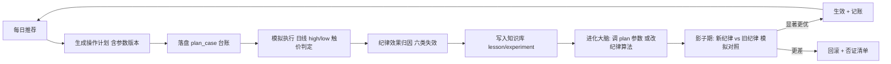
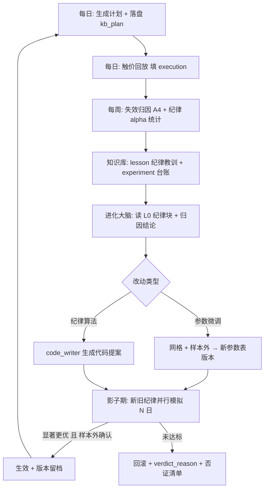

# 规划 22：交易纪律进化 —— 让进化大脑优化"买卖点位"本身

> 对齐：[`21-进化大脑私有域知识库.md`](plans/21-进化大脑私有域知识库.md:1) §十九（价格化操作计划）、
> [`11-进化Agent.md`](plans/11-进化Agent.md:1)（进化闭环/影子实验/终身记账）、
> [`17-进化中心改造-次日自我验证闭环.md`](plans/17-进化中心改造-次日自我验证闭环.md:1)（失效归因）、
> [`19-进化大脑控制回测-回测环节归因.md`](plans/19-进化大脑控制回测-回测环节归因.md:1)（回测控制）。
>
> 用户原话："这个建议的思路都要加入进化大脑，让进化大脑进化的越来越精准"
>
> 状态：**规划中（待实现）**

---

## 一、核心转变：从「信号进化」到「纪律进化」

现状：进化大脑优化的对象是**选股信号**（哪些票会涨：特征权重、阈值、形态、条件概率），
操作计划（[`trade_plan.py`](ai-quant-agent/backend/app/backtest/trade_plan.py:1)）已把**纪律参数化**（6 个 `plan_*`），
但**没有任何机制评估"这些纪律本身赚不赚钱"**——进化大脑目前看不见"计划的执行结果"。

> 关键认知：**用户赚不赚钱 = 选股能力 × 执行纪律**。
> 一只 T+5 涨 20% 的票，若追高 8% 买入、止损设 3%，用户照样亏钱；
> 一只只涨 6% 的票，若在 -3% 低吸、+5% 止盈，反而是正收益。
> 因此**纪律必须成为进化的一等公民**，与选股同等进化。



---

## 二、想法清单（16 条，按价值/可行性排序，标注体力与前置条件）

### A 组｜交易计划效果追踪（**基础，必须做**，P0）

| #   | 想法                                   | 怎么做（落地口径）                                                                                                                                | 价值                                                     |
| --- | -------------------------------------- | ------------------------------------------------------------------------------------------------------------------------------------------------- | -------------------------------------------------------- |
| A1  | **计划级记账**                         | 每日推荐生成计划时，把 `entry_plan` + **生成时的参数版本** + T0 价 落盘到新表 `kb_plan`（EKB 第 6 类档案）                                        | 计划成为可评估对象，否则纪律无处进化                     |
| A2  | **模拟执行（触价判定）**               | 之后每日用日线 `high/low` 判定：是否触及买入区间（成交）、是否触及止损/止盈、是否到期；产出 `fill_price / exit_price / plan_ret / hold_days_used` | 无需分钟数据即可精确回放"按计划执行会怎样"               |
| A3  | **纪律增益（alpha）对照**              | 同时算"若按计划执行"vs"若 T+1 收盘无脑买入持有到 T+5/T+20"的收益差                                                                                | 直接回答"纪律到底有没有用、值多少"                       |
| A4  | **六类失效归因（规则优先，不用 LLM）** | ①高开未追（错过）②追高被套 ③止损后反弹（假摔）④止盈过早（只吃一段）⑤到期不达标 ⑥未止损扩大亏损；按 形态×regime 聚合频率与代价                     | 每类失效**直接映射到一个待调参数**，比泛泛归因可操作得多 |

> A4 是本规划最重要的一条：**把"亏钱原因"翻译成"哪个参数错了"**。
> 例：假摔占比高 → 止损太紧（放宽 `plan_stop_loss_pct`）；止盈过早高 → 目标太保守（提高 `plan_tp1_ratio`）。

### B 组｜参数自适应（从"手工拍参数"到"有证据才改"，P1）

| #   | 想法                    | 要点                                                                                                                                                               |
| --- | ----------------------- | ------------------------------------------------------------------------------------------------------------------------------------------------------------------ |
| B5  | **分层参数**            | `plan_*` 不再是全局单值，而是 **形态 × 市场环境（强势/震荡/弱势）** 的分层表（如 A 形态突破用 3% 止损、D 直接拉升用 6%），样本不足时**收缩回退全局值**（防过拟合） |
| B6  | **效用函数升级**        | 网格择优的目标不能只看胜率（止损紧→胜率低但盈亏比好），改用 **期望收益 / 盈亏比 / 夏普** 三选一（可配置），并**含交易成本**（见 C9）                               |
| B7  | **参数网格 + 样本外**   | 对每个分层跑参数网格（如止损 3~8% 步长 0.5%、止盈折扣 0.3~1.0），**样本内选参 + 样本外确认**，产出"纪律参数表版本"→ 影子实验验证                                   |
| B8  | **选股 × 纪律联合优化** | 波动大的票放宽止损但降仓位；稳定形态收紧止损提高频率——把"选什么票"和"用什么纪律"放进同一个目标函数                                                                 |

### C 组｜现实约束（容易被忽略，但决定实盘能否兑现，P1）

| #   | 想法                         | 要点                                                                                                                                |
| --- | ---------------------------- | ----------------------------------------------------------------------------------------------------------------------------------- |
| C9  | **含成本口径**               | 计划收益统一按**含成本**计算（双边佣金+印花税 ≈0.15%、滑点 0.1%）；否则参数会偏向"高频薄利"被成本吃光的策略                         |
| C10 | **可成交性约束**             | 一字板/涨停封死、开盘价缺失、流动性不足 → 计划自动降级为"不可执行"并计入统计；进化应学会"**什么形态次日开盘可成交概率高**"          |
| C11 | **仓位与组合风控**           | 从"单票纪律"升级到"组合纪律"：每日最多 N 只、单票仓位上限、组合级回撤熔断（如 5 日累计 -8% 暂停新开仓）；这些规则同样参数化、可进化 |
| C12 | **极端行情熔断（不可进化）** | 大盘单日跌幅 >3% 或连续 3 日下跌 → 计划强制降级为"只减仓不加仓"；写入**宪法保护区**，仅人工审批可改                                 |

### D 组｜与知识库/归因闭环融合（让经验沉淀，P1-P2）

| #   | 想法                                    | 要点                                                                                                                                                                                           |
| --- | --------------------------------------- | ---------------------------------------------------------------------------------------------------------------------------------------------------------------------------------------------- |
| D13 | **纪律教训库**                          | 把"止损过紧被洗出""目标过高没兑现""高开追高被套"写成 `lesson`（带 n、置信度、regime），进 L0 与**否证清单** → 与现有知识库机制天然契合，重复错误会被硬拒                                       |
| D14 | **成功归因加入"执行质量"维度**          | 成功票分两类：**买入点抓到（浮盈充足）** vs **买点差但趋势救了**；只有前者是可复制的纪律证据。这会扩展 [`success_attrib.py`](ai-quant-agent/backend/app/agents/success_attrib.py:1) 的归因维度 |
| D15 | **反事实评估（off-policy evaluation）** | 对每只推荐模拟"多种纪律组合下会怎样"（止损 3/5/8% × 止盈 0.4/0.6/0.8 × 持有 3/5/10 日），**一次推荐产生 27 条经验**，样本效率提升一个量级；这是让进化"越来越准"的关键杠杆                      |

### E 组｜安全与可解释（防止纪律被进化成过拟合怪物，P0-P1）

| #   | 想法                             | 要点                                                                                                                                                                      |
| --- | -------------------------------- | ------------------------------------------------------------------------------------------------------------------------------------------------------------------------- |
| E16 | **红线（宪法保护区，不可进化）** | 止损上限 ≤10%、单票仓位上限、禁止"取消止损/越跌越买（摊平）"、禁止改判定口径；违反 → 守护拦截 + 暂停 + 告警                                                               |
| E17 | **纪律变更走影子期**             | 复用现有影子机制：新旧纪律并行模拟 N 日，显著更优才生效；未达标写 `verdict=worse` + 原因，进否证清单                                                                      |
| E18 | **版本化与审计**                 | 每版纪律参数表留版本（含证据：哪类失效、多少样本、样本外表现），支持一键回滚（复用 [`evolution_ledger`](ai-quant-agent/backend/app/agents/evolution_ledger.py:1) 与审计） |

### F 组｜进阶（数据允许时，P2-P3）

| #   | 想法                   | 要点                                                                                                                                            |
| --- | ---------------------- | ----------------------------------------------------------------------------------------------------------------------------------------------- |
| F19 | **动态止盈/移动止损**  | 从固定目标升级为 ATR/均线跟踪（回撤 3% / 跌破 MA5 / ATR×2），进化对象变为跟踪算法参数                                                           |
| F20 | **多周期目标冲突治理** | "T+1 大涨"与"T+20 主升浪"目标冲突（早卖错过后段）→ 分段止盈 + 保本移动（卖一半、剩余跟踪），进化决定分段比例                                    |
| F21 | **形态关键位止损**     | 用颈线/平台下沿/前低替代固定比例止损（需把形态结构数据随榜单落盘，独立增量）                                                                    |
| F22 | **元学习**             | 记录"哪类纪律改动在什么环境下有效"→ 形成"改进策略的选择策略"；[`kb_experiment`](ai-quant-agent/backend/app/kb/kb_store.py:1) 台账已具备数据基础 |

---

## 三、数据与结构设计

### 3.1 新档案：`kb_plan`（EKB 第 6 类）

```json
{
  "id": "plan:20260916:300821.SZ",
  "date": "20260916",
  "ts_code": "300821.SZ",
  "form_type": "C",
  "params_version": "plan_v3@20260916", // 生成计划时的纪律参数版本（可回溯）
  "plan": {
    "buy_low": 15.3,
    "buy_high": 16.08,
    "stop_loss": 14.83,
    "tp1": 17.04,
    "tp2": 18.38,
    "hold_days": 5,
    "pullback_low": 14.99,
    "pullback_high": 15.3
  },
  "t0_close": 15.61,
  "execution": {
    // 模拟执行结果（逐日回填）
    "filled": true,
    "fill_price": 15.72,
    "fill_date": "20260917",
    "exit_price": 17.1,
    "exit_date": "20260923",
    "exit_reason": "tp1",
    "plan_ret": 0.0878,
    "hold_days_used": 5,
    "cost_pct": 0.0025,
    "plan_ret_net": 0.0853
  },
  "baseline": { "buy_hold_t5_ret": 0.0642, "buy_hold_t20_ret": 0.131 },
  "alpha": { "vs_hold_t5": 0.0236, "vs_hold_t20": -0.0457 },
  "failure_type": "", // A4 六类之一（无则空）
  "env": { "regime": "震荡", "index_t1_ret": -0.003 }
}
```

### 3.2 参数版本表（`plan_params_version`）

`{version, params:{layer_key → {plan_stop_loss_pct, ...}}, evidence:{failure_type 分布, samples, 样本外表现}, created_at, status}`

- `layer_key` = `form_type × regime`（B5 分层），无分层数据时用 `"*"` 全局值；
- 记录**证据**是硬要求（防止"为了指标好看随便改"），与现有防自欺护栏一致。

### 3.3 新增可进化参数（Tier1 热生效；分层表可作为 Tier2 版本化落地）

| 参数                     | 默认         | 范围                | 说明                                                             |
| ------------------------ | ------------ | ------------------- | ---------------------------------------------------------------- |
| `plan_cost_pct`          | 0.0025       | [0, 0.01]           | 双边交易成本+滑点（评估口径，含成本才真实）                      |
| `plan_utility`           | `expectancy` | 枚举                | 网格择优目标：`expectancy` / `pl_ratio` / `sharpe`（防只看胜率） |
| `plan_min_samples`       | 30           | [10, 200]           | 分层生效的最小样本（不足则收缩回退全局）                         |
| `plan_max_stop_loss_pct` | 0.10         | 固定                | **红线（不可进化）**：止损上限                                   |
| `plan_max_positions`     | 5            | [1, 10]             | 每日最多持仓/推荐执行只数（组合纪律）                            |
| `plan_portfolio_dd_stop` | 0.08         | [0.03, 0.2]         | 组合级 5 日回撤熔断阈值（暂停新开仓）                            |
| `plan_trail_mode`        | `fixed`      | `fixed`/`ma5`/`atr` | 止盈模式（F19）；需配套算法实现                                  |

---

## 四、进化闭环（纪律版）



**验收口径（纪律是否真的变好）**

1. **纪律 alpha**：`mean(plan_ret_net − buy_hold_ret)` 逐月上升（核心指标）；
2. **六类失效占比**：假摔/追高被套/止盈过早等占比下降；
3. **期望收益**：`mean(plan_ret_net)` > 0 且稳定（含成本）；
4. **回撤**：单票最大回撤、组合最大回撤不恶化；
5. **可执行率**：计划可成交比例（filled rate）不下降。

---

## 五、防过拟合与防自欺（硬约束）

1. **样本内外分离**：参数在样本内选、样本外确认；样本外不达标一律拒绝；
2. **分层收缩**：分层样本 < `plan_min_samples` → 回退全局值（防"每层各拍一个参数"式过拟合）；
3. **成本口径不可绕过**：`plan_cost_pct` 评估必须含成本，禁止为"指标好看"调低；
4. **红线不可进化**：止损上限、仓位上限、禁止摊平/取消止损（[`evolution_guard`](ai-quant-agent/backend/app/agents/evolution_guard.py:1) 哈希保护）；
5. **证据可追溯**：每次纪律改动必须引用具体失效类型 + 样本量 + 样本外结果（沿用 [`kb_context.veto_check`](ai-quant-agent/backend/app/kb/kb_context.py:1) 硬拒机制）；
6. **影子期强制**：纪律改动一律先影子（因其直接影响实盘建议，比选股参数更敏感）。

---

## 六、实施阶段（建议顺序）

| 阶段     | 内容                                                                                | 产出                               |
| -------- | ----------------------------------------------------------------------------------- | ---------------------------------- |
| **P0**   | A1 计划落盘（`kb_plan`）+ A2 触价回放 + A3 纪律 alpha + A4 六类失效归因（规则实现） | 纪律可评估，周报可见"纪律赚了多少" |
| **P1**   | C9 成本口径 + C10 可成交性 + E16 红线参数 + E17 纪律走影子期                        | 评估真实、防过拟合                 |
| **P1.5** | D13 纪律教训入库 + D14 成功归因加入执行质量                                         | 经验沉淀进 L0/否证清单             |
| **P2**   | B5 分层参数 + B6 效用函数 + B7 网格/样本外 + D15 反事实评估（27 组合）              | 进化大脑开始自动调纪律             |
| **P2.5** | C11 组合仓位与熔断 + C12 极端行情熔断                                               | 从单票纪律到组合风控               |
| **P3**   | F19 跟踪止盈 + F20 多周期分段 + F21 形态关键位止损 + F22 元学习                     | 进阶纪律                           |

---

## 七、前置条件与风险

| 项           | 说明                                                                                                                       |
| ------------ | -------------------------------------------------------------------------------------------------------------------------- |
| **数据前置** | ①指数数据需补新（现止于 `20260807`）——不然 regime 分层与"超额"维度缺失，B5/D15 打折；②日线 high/low 已具备（触价判定够用） |
| 风险 1       | **参数过拟合**：样本量小、市场切换快 → 用样本外 + 分层收缩 + 半衰期加权（近期样本权重高）                                  |
| 风险 2       | **纪律频繁变动伤实盘**：纪律改动加"最小间隔 + 影子期 + 变更幅度限制"（如单次止损调整 ≤1pp）                                |
| 风险 3       | **模拟≠实盘**：日线触价忽略盘中顺序（同日既触止损又触止盈）→ 用**保守优先**（同日先判止损）并在报告标注                    |
| 风险 4       | **目标冲突**：T+1 与 T+20 目标互相拉扯 → 用复合效用（分段止盈）而非单一目标                                                |

---

## 八、与用户一句话总结

> 现在的进化大脑在学"**哪些票会涨**"；加上本规划后，它同时学"**这些票该怎么买、怎么卖、亏多少必须走、赚多少该走**"——
> 而且**用模拟执行的真实结果**来验证纪律，用知识库记住"哪种纪律在什么行情下有效/无效"，越跑越准。

---

## 九、实施结果（P0 + P1 部分 + P2 简版已落地，2026-09-17）

### 9.1 交付物

| 模块                                            | 作用                                                                                                                                                                                 | 对应想法  |
| ----------------------------------------------- | ------------------------------------------------------------------------------------------------------------------------------------------------------------------------------------ | --------- |
| `app/backtest/plan_tracker.py`（新增）          | 计划台账落盘（`kb_plan`）+ **触价回放**（成交/止损/止盈/到期 + 含成本净收益 + 纪律 alpha）+ 五/七类失效归因 + 统计/教训蒸馏                                                          | A1–A4/D13 |
| `app/backtest/discipline_grid.py`（新增）       | **反事实评估**：180 组纪律（止损 4 × 止盈折扣 3 × 持有 3 × 追高上限 5）逐样本重放 → 分形态最优纪律 `discipline_grid.json`（样本内择优 + 样本外验证 + 可成交率/洗出率约束）           | B6/B7/D15 |
| `app/backtest/trade_plan.py`（扩展）            | 计划价位改为**证据驱动**：网格有正改进且样本外稳健才覆盖参数表；止损被红线 10% 截断；`basis.discipline_src` 说明来源                                                                 | B5/E16    |
| `app/kb/kb_store.py`（扩展）                    | 新增第 7 类档案 `kb_plan` 表（+ 3 索引）                                                                                                                                             | 3.1       |
| `evolution_config.json`（扩展）                 | 新增 `plan_cost_pct`（成本 0.25%）、`plan_max_stop_loss_pct`（红线 10%）、`plan_use_grid`、`plan_min_samples`、`plan_min_fill_rate`、`plan_max_washout`、`plan_grid_min_improvement` | 3.3       |
| 每日闭环（`main.py` / `api/predictions.py`）    | ① 精筛榜单落盘后自动写计划台账；② 次日验证后自动"回放待结算 + 沉淀纪律教训"；③ 知识库维护任务低频（>3 天）重建纪律网格                                                               | 四        |
| L0 摘要（`evolution_summarizer.py`）            | 新增"交易纪律"块（纪律 alpha / 失效 TOP / 反事实最优 / ⚠ 选股端结论），60s 缓存、零模型依赖                                                                                          | D13       |
| API + 前端（`api/system.py` / `Evolution.vue`） | 7 个接口（stats/list/replay/backfill/lessons/grid/grid-build）+ "🎯 交易纪律"面板（统计、失效分布、网格表、台账明细）                                                                | E-可解释  |

### 9.2 实测结果（355 个历史案例，2026-08-10 ~ 2026-09-16）

| 指标                             | 数值                                                                                            | 说明                                   |
| -------------------------------- | ----------------------------------------------------------------------------------------------- | -------------------------------------- |
| 计划台账 / 已回放                | 355 / 355                                                                                       | 全部完成触价回放                       |
| 成交率 / 未成交                  | **99.7% / 0.3%**                                                                                | 修正基准价后，"高开买不到"几乎不存在   |
| 已成交计划净收益（含成本）       | **−3.15%**（胜率 15.3%）                                                                        | 该窗口选股本身为负                     |
| 无纪律基准（T+1 收盘持有到 T+5） | **−4.27%**                                                                                      | 同期"随便买随便拿"更差                 |
| **纪律 alpha（vs 无脑持有）**    | **+1.29%**（62.4% 的单子跑赢基准）                                                              | 纪律确实在**减亏**                     |
| 失效类型 TOP                     | 止损后反弹（假摔）7.6%、止盈过早 2.8%、到期不达标 2.0%、追高被套 1.4%                           | 止损贴太紧是最大问题                   |
| 反事实最优（全局）               | 止损 5% / 折扣 40% / 持有 3 日 / 追高 5% → 期望 −2.65%（样本外 −0.67%）                         | **劣于当前参数（−2.44%）→ 不采纳**     |
| 分形态最优                       | D：止损 5% / 折扣 80% / 持有 5 日 → 期望 −1.06%（样本外 +1.82%，稳健）；A：−2.01%（n=24，回退） | 形态 D 的"拿更久 + 目标更远"分散了噪声 |

**结论（写进 L0，供进化大脑）**：全部纪律组合的期望皆为负 → **问题在选股端**（无纪律持有 −4.27%），
纪律的价值是**截断左尾**（+1.3%）；应优先提高入选质量/收紧信号，而不是靠继续调纪律把负期望"调好看"。

### 9.3 过程中发现并修掉的 3 个真缺陷（自查驱动）

| #   | 缺陷                                                                                       | 影响                                                                               | 修复                                                                       |
| --- | ------------------------------------------------------------------------------------------ | ---------------------------------------------------------------------------------- | -------------------------------------------------------------------------- |
| 1   | `backfill_from_cases` 用**今天的价格**当历史计划的 T0 基准（`load_t0_prices(..., today)`） | 历史计划价位全部锚错日期 → "26.8% 高开买不到"是**假象**，纪律统计失真              | 按案例**推荐日**分批取基准价（20 次查询替代 355 次）→ 成交率 99.7%         |
| 2   | 回放里"日内回踩成交"当天又判止损                                                           | 前视偏差（当日最低价可能早于限价单成交）→ 制造"93.5% 一进就被止损"的**退化最优解** | 日内成交者从**次日**起判离场（`plan_tracker` 与网格同步修正）              |
| 3   | 纪律网格的样本外判定用"OOS 期望 > 0"                                                       | 在负期望市场里永远判不通过，逻辑自相矛盾                                           | 改为**"样本外 alpha ≥ 0"**（相对无纪律基准稳健），并新增 `oos_vs_baseline` |

### 9.4 采纳门槛（防"越改越差"，已落地为参数）

网格结论只在同时满足以下条件时才覆盖 `trade_plan` 的价位：
① `deployable`（成交率 ≥ `plan_min_fill_rate` 30%）；
② 改进 > `plan_grid_min_improvement`（默认 0.2pct）；
③ `oos_pass`（样本外 alpha ≥ 0）；
④ 证据量 ≥ `plan_adopt_min_samples`（默认 30 笔成交样本）——**择优可放宽、采纳必须够样本**（实测拦住了 n=24 的形态 A）。
不满足 → 保持参数表纪律，并在计划的 `basis.grid` 写明原因（可解释，不静默）。
另：**洗出率 > `plan_max_washout`（85%）**的组合不参与择优 —— 止损贴到"一进就被打"的纪律不可部署。

### 9.5 尚未做（后续 P2.5/P3）

- C11 组合仓位与熔断（单票纪律 → 组合风控）、C12 极端行情熔断
- F19 跟踪止盈、F20 多周期分段止盈、F21 形态关键位（颈线）止损、F22 元学习
- B5 分层参数（形态 × regime）：**前置条件**是指数数据补新（`market_env_000001.SH.csv` 止于 20260807）
- 纪律影子期（E17 完整版）：目前用"采纳门槛 + 样本外"替代，尚未做"新纪律先跑一段影子期再切实盘"
