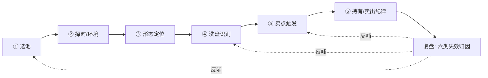
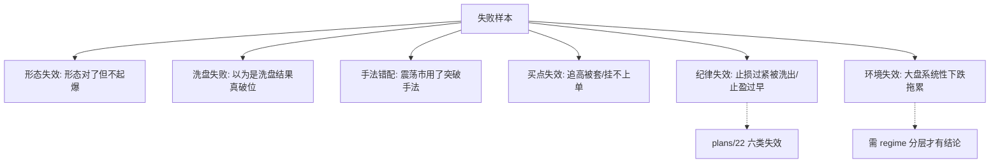
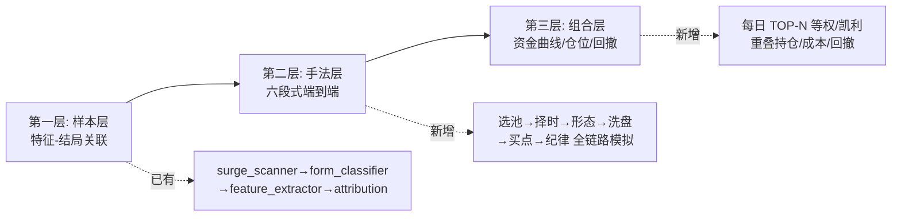
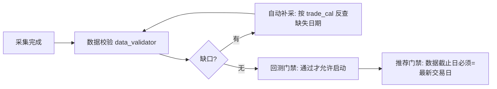

# 规划 23：回测增强与操盘手法知识库 —— 把"操盘经验"变成可回测、可进化的资产

> 对齐：[`00-总规划框架.md`](plans/00-总规划框架.md:1)（核心使命）、
> [`04-回测引擎.md`](plans/04-回测引擎.md:1)（样本精准采集 / 正负双轨 / A-B 显著性）、
> [`09-每日推荐详细规划.md`](plans/09-每日推荐详细规划.md:1)（推荐消费方）、
> [`12-网络经典形态规则库.md`](plans/12-网络经典形态规则库.md:1)（形态规则）、
> [`16-扩充形态规则库提高每日命中.md`](plans/16-扩充形态规则库提高每日命中.md:1)（规则扩充 + 验证）、
> [`19-进化大脑控制回测-回测环节归因.md`](plans/19-进化大脑控制回测-回测环节归因.md:1)（回测健康诊断）、
> [`21-进化大脑私有域知识库.md`](plans/21-进化大脑私有域知识库.md:1)（案例/实验台账）、
> [`22-交易纪律进化-让进化大脑优化买卖点位.md`](plans/22-交易纪律进化-让进化大脑优化买卖点位.md:1)（买卖点位纪律）
>
> 用户原话："我感觉得加强一下回测……应该选哪些股票，应该从哪里下手，怎么洗盘，怎么买入，
> 各种各样的操作手法，怎么采集到这些数据以便给每日推荐筛选参考。"
>
> 状态：**规划中（待实现）**

---

## 一、想法整理：把"操盘直觉"翻译成 6 个可回测的问题

用户的想法表面零散，本质是**一条完整的操盘流水线**。本规划把它拆成 6 段（下文称"六段式手法"），
每一段都必须落到"**可度量、可回测、可进每日推荐**"三个标准，否则就只是经验之谈：

| 用户原话     | 结构化问题                       | 回测要回答什么                                 | 每日推荐要输出什么        |
| ------------ | -------------------------------- | ---------------------------------------------- | ------------------------- |
| 该选哪些股票 | **选池**：什么样的股票值得看     | 哪种池子的历史 T+5 胜率/赔率更高、样本是否够   | 候选池 + 池子标签         |
| 从哪里下手   | **择时**：什么时候该出手/该空仓  | 不同大盘环境（强/震/弱）下，同一形态胜率差多少 | 今日环境判定 + 手法建议   |
| 怎么洗盘     | **洗盘识别**：震仓还是真出货     | 洗盘结束后的买点胜率 vs 破位后的继续下跌率     | 洗盘质量分 + 洗盘阶段标签 |
| 怎么买入     | **买点**：具体在什么价、什么条件 | 四类买点各自的历史期望收益与成交率（含成本）   | 建议买入区间 + 触发条件   |
| 操作手法     | **持有与卖出**：拿多久、怎么走   | 不同手法对应的最优止盈/止损/持有期             | 纪律参数（复用 plan\_\*） |
| 怎么采集数据 | **数据底座**：靠什么支撑上面全部 | 数据是否完整、有无未来函数、缺失如何自愈       | 数据健康度红黄绿灯        |



**关键认知**：现有系统（[`04-回测引擎.md`](plans/04-回测引擎.md:1)）已经把 ③形态 和 ⑥纪律 做得比较扎实，
**真正的空白在 ①②④⑤**——尤其 ④洗盘，是当前系统**完全没有独立建模**的一环，
而它恰恰是"起爆前夜"最核心的识别点。

---

## 二、本地数据资产盘点（实测，非文档推测）

> 以下为 2026-09-18 对本地 `quant_db` 的实测结果（`information_schema` + 抽样查询）。

### 2.1 已就绪资产（可直接喂给回测）

| 表 / 资产                                                                                      | 规模（行）                                                    | 覆盖区间                | 回测用途                                                                                                                |
| ---------------------------------------------------------------------------------------------- | ------------------------------------------------------------- | ----------------------- | ----------------------------------------------------------------------------------------------------------------------- |
| `daily`                                                                                        | 14,107,101                                                    | 2010-01-04 ~ 2026-09-17 | 日线 OHLCV，全部技术与形态特征的底座                                                                                    |
| `adj_factor`                                                                                   | 14,880,127                                                    | 同上区间                | 前复权（[`loader.load_adj_close()`](ai-quant-agent/backend/app/backtest/loader.py:97)）                                 |
| `stk_limit`                                                                                    | 16,707,135                                                    | 同上区间                | 涨跌停价 → 封板/炸板/可成交性判定                                                                                       |
| `daily_basic`                                                                                  | 13,958,614                                                    | 同上区间                | 估值、换手率、量比、市值（选池与情绪指标）                                                                              |
| `moneyflow`                                                                                    | 13,664,779                                                    | 同上区间                | 大单/特大单资金流 → **主力痕迹代理变量**                                                                                |
| `weekly` / `monthly`                                                                           | 3,124,759 / 229,452                                           | 同上区间                | 大周期趋势过滤（周线多头排列等）                                                                                        |
| `suspend_d`                                                                                    | 466,940                                                       | 同上区间                | 停牌剔除（[`loader.load_suspend_days()`](ai-quant-agent/backend/app/backtest/loader.py:142)）                           |
| `index_daily`                                                                                  | 27,316,327                                                    | 2010-01 ~ 2026-09       | **11,528 个指数**，含申万行业 `8010xx.SI`（2010 起）→ 板块轮动/环境分层                                                 |
| `index_dailybasic`                                                                             | 45,104                                                        | —                       | 大盘 PE/PB 分位（择时的估值维度）                                                                                       |
| `stock_basic`                                                                                  | 5,535                                                         | —                       | 股票池、行业、上市日                                                                                                    |
| `stock_company`                                                                                | 4,680                                                         | —                       | 公司属性（地区/主营）                                                                                                   |
| `trade_cal`                                                                                    | 6,209                                                         | 2010-01-01 ~ 2026-12-31 | 交易日基准（含 4,128 个开市日）                                                                                         |
| `block_trade`                                                                                  | 643,214                                                       | 同上区间                | 大宗交易折溢价 → 主力成本区代理                                                                                         |
| `moneyflow` + `daily_basic` 组合                                                               | —                                                             | 同上区间                | 换手率衰减 + 大单净额 → **洗盘量能特征核心**                                                                            |
| 事件类：`forecast` / `express` / `dividend` / `repurchase` / `stk_holdertrade` / `stk_rewards` | 154,138 / 14,945,546 / 165,052 / 56,034 / 159,397 / 1,406,252 | 同上                    | 事件驱动特征（已部分由 [`extra_feature_loader`](ai-quant-agent/backend/app/backtest/extra_feature_loader.py:238) 消费） |
| 筹码/股东：`stk_holdernumber` / `top10_*` / `pledge_stat`                                      | 557,124 / 1,970,084 / 1,605,115 / 1,560,300                   | 同上                    | 筹码集中度、质押风险、股东户数（散户化/集中化）                                                                         |

**结论：A 股 16.7 年（2010-01-04 ~ 2026-09-17）日线级数据是完整的**，
`daily` 逐年交易日数 242~245 天、无缺年、股票数从 2,023（2010）增长到 5,585（2026），
**回测的"原料"是够的，短板不在数据量，而在数据维度与回测方法**。

### 2.2 缺口清单（含原因与替代方案）

| 缺口                                                                    | 现状                                                                             | 影响                                                                                                                                                                                                                | 处置                                                                                                                                                                                                                                                                                                                                                                     |
| ----------------------------------------------------------------------- | -------------------------------------------------------------------------------- | ------------------------------------------------------------------------------------------------------------------------------------------------------------------------------------------------------------------- | ------------------------------------------------------------------------------------------------------------------------------------------------------------------------------------------------------------------------------------------------------------------------------------------------------------------------------------------------------------------------ |
| `concept` / `concept_detail` / `ths_index` / `ths_daily` / `ths_member` | **表根本不存在**（实测 `SHOW TABLES` 无这 5 张）                                 | 题材/概念维度全空：[`candidate_profiler.get_stock_concepts()`](ai-quant-agent/backend/app/agents/candidate_profiler.py:70) 查询时静默返回 `[]`，**LLM 精筛画像里的"题材"字段一直是空的**；板块联动/热点判定无从谈起 | ⚠️ **权限存在文档冲突，必须先实测再决定**：[`ws.stage1_basic()`](ai-quant-agent/backend/app/api/ws.py:825) 注释称"实测拒绝：concept/ths_index/concept_detail/ths_member"并已移除调用，而 [`01-数据模块`](plans/01-数据模块-Tushare接口全览.md:859) 标注为 ✅2000 积分可用 → 用真实 token 各调一次定论；若确实不可用，走 §5.3 替代（申万行业指数 + 涨停联动近似题材热度） |
| 龙虎榜 `limit_list_d`                                                   | 无权限（[`01-数据模块`](plans/01-数据模块-Tushare接口全览.md:861) 实测不可访问） | 无法直接看游资席位、机构专用席位                                                                                                                                                                                    | 代理指标：`stk_limit` 封板序列 + `moneyflow` 大单/特大单净额 + `block_trade` 折溢价                                                                                                                                                                                                                                                                                      |
| 北向 `hsgt`                                                             | 无权限                                                                           | 缺外资动向                                                                                                                                                                                                          | 代理：`moneyflow` 大单净额趋势 + 行业指数超额                                                                                                                                                                                                                                                                                                                            |
| 个股两融 `margin_detail`                                                | 5000 积分无权限                                                                  | 缺个股杠杆情绪                                                                                                                                                                                                      | 已有 `margin`（**沪深两市按日汇总，8,783 行 ≈ 2010 年至今**）→ 做**市场级**温度计即可                                                                                                                                                                                                                                                                                    |
| 技术因子 `stk_factor`                                                   | 5000 积分无权限                                                                  | 需自算                                                                                                                                                                                                              | 本项目本来就是自算（`feature_extractor`），无影响                                                                                                                                                                                                                                                                                                                        |
| 筹码分布 `cyq_perf` / 分钟级数据                                        | 无权限 / 未采集                                                                  | 洗盘的"日内诱空"、"分时黄白线"无法直接观测                                                                                                                                                                          | 用日线 `low/close/open` 组合近似：**下影线长度、盘中最大回撤后收复度**                                                                                                                                                                                                                                                                                                   |

### 2.3 数据质量疑点（必须先核验，否则回测结论不可信）

| #   | 疑点                                            | 实测结论（2026-09-18 核验）                                                                                                                                                                                                                                                    | 处置                                                                  |
| --- | ----------------------------------------------- | ------------------------------------------------------------------------------------------------------------------------------------------------------------------------------------------------------------------------------------------------------------------------------ | --------------------------------------------------------------------- |
| Q1  | `express` 1,494 万行 vs `fina_indicator` 38 万  | ✅ **证实：严重重复插入**。同一 `(ts_code, ann_date)` 最多重复 **16,106 行**（`603322.SH` @ `20250426`），多只个股重复 **8,053 行**；根因 [`collector.collect_and_store()`](ai-quant-agent/backend/app/data/collector.py:37) 用 `to_sql(if_exists="append")` 且无幂等键        | 每键保留 1 行去重（清掉 ~1,400 万冗余）+ 加唯一键 + 采集幂等化        |
| Q2  | `stk_limit`（1,670 万）> `daily`（1,410 万）    | ⏳ 待核验（疑似含非交易标的或重复行）                                                                                                                                                                                                                                          | 抽样对账，按 Q1 同法治理                                              |
| Q3  | `stock_basic` 5,535 只 vs 当日 `daily` 5,553 只 | ✅ **已定位真因：不是退市缺失，而是池子过期**。`stock_basic` 最新 `list_date = 20260803`，而 `daily` 已到 `20260917`；2026-09-17 交易的 5,553 只中 **30 只不在 `stock_basic`**（如 `301717.SZ`、`688826.SH`、`601123.SH`，均为 8 月后新上市），反向 12 只在 basic 但当日无行情 | **P0 立即补采 `stock_basic` 并改为每日更新**；新股按 `new_share` 回补 |
| Q4  | `index_daily.ts_code` 为 TEXT 且早期无索引      | 曾导致全表扫描卡死数小时（[`03-Agent系统 §21.3`](plans/03-Agent系统.md:756)）                                                                                                                                                                                                  | 每次批量查询前确认索引存在                                            |
| Q5  | 复权口径混用                                    | `daily.amount` 单位为**千元**（[`loader.py`](ai-quant-agent/backend/app/backtest/loader.py:28) 已注明），漏一处就量级错                                                                                                                                                        | 在回测报告中固化口径指纹                                              |

> **Q3 的影响链（比"幸存者偏差"更直接的漏钱口子）**：
> `stock_basic` 停更 → [`loader.load_stock_pool()`](ai-quant-agent/backend/app/backtest/loader.py:32) 的池子不含 8 月后新股 →
> **回测样本与每日推荐候选永久漏掉新股/次新股**（次新 + 题材恰是 A 股重要盈利模式）。
>
> 另一个独立检查项：**退市股是否保留在 `stock_basic`**（[`04 §17`](plans/04-回测引擎.md:507) 要求保留），
> 这属于幸存者偏差核查，与 Q3 是两件事，需分别给出结论。

### 2.4 运行态体检 A：**回测产物可信度不成立**（最高优先级 → P0-0）

> 证据来源：`backend/data/backtest_results/backtest_latest.json`（2026-09-17 15:36 跑完，`elapsed=4784` 秒 ≈ 80 分钟）

| #   | 实测异常                            | 证据（原始值）                                                                                                                                                                                    | 后果                                                                                                                                                                                                                                      |
| --- | ----------------------------------- | ------------------------------------------------------------------------------------------------------------------------------------------------------------------------------------------------- | ----------------------------------------------------------------------------------------------------------------------------------------------------------------------------------------------------------------------------------------- |
| T1  | **绩效指标失真**                    | `win_rate=1.0`、`hit_rate=1.0`、`profit_loss_ratio=0.0`、`cum_return=9.5e22`、`annual_return=4.2e13`、`max_drawdown=0.0`、`sharpe=15.75`                                                          | 指标**不可用于任何决策**；但 [`improve_effect`](ai-quant-agent/backend/app/agents/improve_effect.py:67) / [`main_metric_check()`](ai-quant-agent/backend/app/agents/evolution_guard.py:125) 却拿它当"主指标" → **进化大脑被虚假高分误导** |
| T2  | **A/B 三方案指标完全相同**          | A 与 C 的 `hit_rate/accuracy/t20_cont/avg_t5/n` 全等；`plan_c_rule_hits = plan_a_count = 424` → `accuracy_lift=0.0`、`p_mcnemar=1.0`、`decision=No-Go`                                            | 形态规则层在回测样本上**零区分度**（要么全命中、要么根本没生效）；而每日推荐重度依赖 `rule_prob` → 逻辑断层                                                                                                                               |
| T3  | **正负样本无区分度**                | `entry_analysis.by_label`：`success.t1_open.win_rate_t5 = 0.8074`，`failure_A.t1_open.win_rate_t5 = 0.7879`（几乎相同）                                                                           | **标签体系失效** → 归因、模式库、条件概率表全部建立在无区分度标签上                                                                                                                                                                       |
| T4  | **负样本 B 类为空 + 样本量过小**    | `samples`：`total=596`（success 316 / near_success 172 / failure_A 108 / **failure_B=0**）                                                                                                        | [`04`](plans/04-回测引擎.md:1) 设计的"正负双轨"实际只有单轨；596 条样本 ÷（6 形态 × 3 结局）→ 单格样本仅个位数                                                                                                                            |
| T5  | **U 类（未识别形态）占 42%**        | success 中 `U=134/316`；`A` 形态成功样本仅 **7** 个                                                                                                                                               | 形态分层结论无统计意义；A 形态的任何结论都不可用                                                                                                                                                                                          |
| T6  | **归因把"常数/无区分度特征"当关键** | 排行前列：`st_risk_flag`（两组均值都 0、info_gain 0）、`mainbz_concentration`（两组均值都 1.0）、`event_dividend`（failure 0.6759 > success 0.6487）均标 `is_key=true`，AUC 仅 0.63~0.66（≈随机） | 该结果经 [`load_attribution_kb()`](ai-quant-agent/backend/app/backtest/attribution.py:239) **喂给 LLM 精筛当"历史成功规律"** → 等于给 LLM 灌噪音                                                                                          |
| T7  | **表间日期不一致**                  | `data_validation`：`daily.max_date=20260916`，但 `adj_factor`/`stk_limit` 已是 `20260917`                                                                                                         | 回测在"日线缺最新一天"的状态下运行 → 特征窗口/结局窗口错位                                                                                                                                                                                |
| T8  | **报告内部自相矛盾**                | `samples` 只有 596 条，而 `vector_store_stats` 是 `success_A/B/C/D=198/610/958/2886`、`failure_A/B/C/D=58/375/371/793`（数千条）                                                                  | 两处口径不一致，无法确定"每日推荐真正用的模式库"是哪一份                                                                                                                                                                                  |

> **结论**：T1~T8 修完之前，本规划新增的"洗盘 / 买点 / 组合"**全部无法被验证**——
> 因为它们最终都要用同一套指标与标签评估。所以 **P0-0（修可信度）必须排在最前面**，
> 优先级高于补数据、高于新增因子。

### 2.5 运行态体检 B：采集与推荐时序（**自动链路实际在空转**）

| #   | 问题                         | 证据                                                                                                                                                                                                                                                                  | 影响                                                                                                                                    |
| --- | ---------------------------- | --------------------------------------------------------------------------------------------------------------------------------------------------------------------------------------------------------------------------------------------------------------------- | --------------------------------------------------------------------------------------------------------------------------------------- |
| V1  | **16:30 采集拿不到当日数据** | 日志：`2026-09-17 16:30:00 触发每日16:30数据采集` → `16:32:01 数据采集完成`（仅 93 秒）；紧接着扫描判定"数据日期 = 20260916"                                                                                                                                          | A 股 15:00 收盘后 Tushare 日频数据（尤其 `daily_basic`/`moneyflow`）常在 17:00 后就绪 → **16:30 采集等于采空**                          |
| V2  | **幂等守卫把自动推荐挡死**   | 日志连续出现：`数据日期 20260916/20260917 当日已存在推荐结果（自动路径幂等守卫）… 跳过重复扫描` —— 09-17 16:30 与 09-18 09:15/09:21/09:55/11:00 共 5 次全部 `skipped`                                                                                                 | **自动推荐链形同虚设**；实际报告靠人工 `force` 或次日补跑产出（`daily_20260917_v1` 生成于 09-17 17:05，`_agent_v2` 生成于 09-18 10:43） |
| V3  | **`stock_basic` 永不更新**   | [`ws.stage1_basic()`](ai-quant-agent/backend/app/api/ws.py:828)：`if not table_has_data(name): 加入任务` → 表**一旦有数据就永久跳过**；`stock_basic` 最新 `list_date = 20260803`                                                                                      | **Q3 的根因**；同类风险：`trade_cal` 跨年不更新、`index_basic` 不更新                                                                   |
| V4  | **板块概念已成死代码**       | [`_collect_concept_detail()`](ai-quant-agent/backend/app/api/ws.py:847) / [`_collect_ths_member()`](ai-quant-agent/backend/app/api/ws.py:875) 仍在文件中，但 [`stage1_basic()`](ai-quant-agent/backend/app/api/ws.py:825) 已移除调用                                  | 代码 / 规划文档 / `tushare_api.py` 封装三方不一致，后续维护必踩坑                                                                       |
| V5  | **任务编排过载且互相挤兑**   | 定时任务密集在 12:05~13:35（**盘中**）：守护 12:05、次日验证 12:10、影子结算 12:20、懒评估（每 3 日）12:35、报错监控 12:45/16:45/20:45、代码进化 12:50、清待重启 13:05、库维护 13:15、统一学习 13:35。实例日志：`[code_writer] 报错监控跳过（系统忙 ['daily_scan']）` | 任务靠 `is_idle` 互相跳过 → **执行率不可预期**；且盘中跑全表扫描 + LLM，与用户看盘争资源                                                |

### 2.6 其他工程问题（低风险，但会持续拖慢迭代）

| #   | 问题                        | 证据                                                                                                                                                                                                  | 处置                                                                                         |
| --- | --------------------------- | ----------------------------------------------------------------------------------------------------------------------------------------------------------------------------------------------------- | -------------------------------------------------------------------------------------------- |
| W1  | **源码目录混入备份文件**    | `backend/app/backtest/` 下有 `daily_scan.py.bak` / `daily_scan.py.bak.20260828_…` / `form_classifier.py.bak`（×3）/ `threshold_analyzer.py.bak`（×2）；`backend/` 根目录有 `_evolve_smoke_tmp.py.bak` | 备份统一收进 `backend/backups/` 并加 `.gitignore`，源码目录只留可运行代码                    |
| W2  | **数据表无采集时间戳**      | `daily`/`daily_basic` 等表无 `created_at`；[`data_validator`](ai-quant-agent/backend/app/backtest/data_validator.py:161) 只能用 `information_schema` 近似行数                                         | 加 `created_at/updated_at`（或统一 `ingest_log` 表），才能追溯"这天数据何时落库、是否补采过" |
| W3  | **核心表日期不齐**（同 T7） | `data_validation`：`daily.max=20260916` 而 `adj_factor.max=20260917`                                                                                                                                  | 数据门禁增加"核心表日期一致性"检查（不一致则回测拒绝启动）                                   |
| W4  | **一次全量回测 80 分钟**    | `elapsed = 4784` 秒                                                                                                                                                                                   | P1 的分层/消融/样本外重跑之前，先落地 §4.5 的缓存 + 分片并行                                 |
| W5  | **幂等守卫语义过宽**        | 见 V2：本意防"重复覆盖命中登记"，实际把"数据推进后的首次推荐"也挡了                                                                                                                                   | 守卫条件改为"同一 `(数据日期, 参数指纹)` 已存在才跳过"，数据推进即放行                       |

---

## 三、操盘手法知识体系（六段式，可回测的形式化）

### 3.1 六段式总表

| 段位            | 判定口径（形式化）                                                                            | 依赖数据                                      | 已有实现                                                                                                                                                                                                                                 | 缺口                                                   |
| --------------- | --------------------------------------------------------------------------------------------- | --------------------------------------------- | ---------------------------------------------------------------------------------------------------------------------------------------------------------------------------------------------------------------------------------------- | ------------------------------------------------------ |
| ① **选池**      | 流动性（60 日均额 ≥ 5000 万）、非 ST、非次新（上市 ≥ 60 交易日）、剔除北交所/科创板（可选）   | `daily` `stock_basic` `daily_basic`           | [`loader.filter_liquidity()`](ai-quant-agent/backend/app/backtest/loader.py:251)、[`agents._allow_stock()`](ai-quant-agent/backend/app/agents/__init__.py:34)                                                                            | **池子分层**（主线池/强势池/修复池）未做               |
| ② **择时**      | 环境三态：强势（指数 20 日动量 > +3% 且站上 60 日线）/ 震荡 / 弱势（< -3%）；行业相对强度排名 | `index_daily`（含申万 `8010xx.SI`）           | [`extra_feature_loader._market_env()`](ai-quant-agent/backend/app/backtest/extra_feature_loader.py:220) 仅产出**一个标量特征**                                                                                                           | **未做分层回测**：同一形态在三种环境下胜率差异无人统计 |
| ③ **形态**      | 30+ 网络经典形态 + 5 类启动形态（平台突破/直接拉升/回调启动/超跌反弹/未知）                   | `daily` `adj_factor`                          | [`rule_forms.py`](ai-quant-agent/backend/app/backtest/rule_forms.py:1035)（60+ 检测函数）、[`form_classifier.py`](ai-quant-agent/backend/app/backtest/form_classifier.py:87)                                                             | 已较完善                                               |
| ④ **洗盘**      | **本规划新增核心**：see §3.2                                                                  | `daily` `moneyflow` `daily_basic` `stk_limit` | 仅零散 2 条：`_detect_suolianghuicai`、`_detect_xianren`                                                                                                                                                                                 | **无独立模型、无标签、无回测**                         |
| ⑤ **买点**      | 四类买点（突破/回踩/低吸/竞价）→ 触发价 + 不追高上限                                          | `daily` `stk_limit`                           | [`entry_analyzer.py`](ai-quant-agent/backend/app/backtest/entry_analyzer.py:266)（`entry_guidance.json`）、[`trade_plan.py`](ai-quant-agent/backend/app/backtest/trade_plan.py:179)                                                      | 四类买点**未分别回测胜率**，只给了笼统指引             |
| ⑥ **卖出/持有** | 止损/梯度止盈/时间止损/破位止损，按形态分层                                                   | `daily`                                       | [`trade_plan.py`](ai-quant-agent/backend/app/backtest/trade_plan.py:1) + [`discipline_grid.py`](ai-quant-agent/backend/app/backtest/discipline_grid.py:275) + [`plan_tracker.py`](ai-quant-agent/backend/app/backtest/plan_tracker.py:1) | 已较完善（plans/22 覆盖）                              |
| ⑦ **复盘**      | 六类失效归因 + 手法错配                                                                       | 计划台账                                      | [`plan_tracker.plan_stats()`](ai-quant-agent/backend/app/backtest/plan_tracker.py:323)                                                                                                                                                   | 缺"**洗盘失败**"独立一类                               |

### 3.2 洗盘识别规范（P0，本规划最重要的新增）

**业务定义**：洗盘 = 主力在拉升前，用回调/横盘/急杀把浮筹震出，**量能收缩、关键支撑不破、随后快速收复**。

**形式化判别矩阵（洗盘 vs 出货）**：

| 维度      | 洗盘特征（加分）                              | 出货特征（减分）                 | 数据来源                         |
| --------- | --------------------------------------------- | -------------------------------- | -------------------------------- |
| 量能      | 回调期量能萎缩至前 5 日均量 50%~70%，末端地量 | 放量下跌，量不缩                 | `daily.vol`                      |
| 回撤幅度  | 回撤不超过前一波涨幅的 1/3~1/2                | 回撤 > 2/3 且破前低              | `daily.close`（前复权）          |
| 支撑      | 回踩 5/10/20 日线或平台颈线不破（收盘不破）   | 有效跌破（收盘破且 3 日不收回）  | `daily.close`                    |
| 收敛性    | 振幅逐日收敛，高低点区间收窄                  | 振幅扩大、重心下移               | `daily.high/low`                 |
| 下影/收复 | 长下影、盘中急杀后收回，次日高开/收阳         | 长上影、冲高回落，次日低开       | `daily` 的 `high/low/open/close` |
| 资金      | 大单净额流出收窄甚至转正                      | 大单持续净流出（特大单大幅净卖） | `moneyflow`                      |
| 换手      | 换手率逐日下降                                | 换手率高企不降（对倒出货）       | `daily_basic.turnover_rate`      |
| 位置      | 处于底部/平台中，距前高有空间                 | 已在高位、涨幅巨大               | 派生                             |
| 时间      | 洗盘 3~15 日（过短不叫洗，过长易变盘）        | —                                | 派生                             |

**产出物**：

```json
{
  "ts_code": "300xxx.SZ",
  "date": "2026-09-17",
  "washout_score": 0.72,
  "stage": "末端地量待确认",
  "sub_type": "缩量回踩10日线",
  "evidence": {
    "vol_shrink": 0.58,
    "retrace_ratio": 0.34,
    "support_hold_days": 6,
    "big_order_net": "+3.2e6",
    "turnover_trend": "下降"
  },
  "counter_evidence": ["大盘弱势"],
  "historical": {
    "n": 128,
    "t5_win": "61%",
    "t5_avg": "+3.1%",
    "fail_mode_top": "假突破回落(38%)"
  }
}
```

**回测口径（必须可复现）**：

- 定义 `washout_end` 事件：洗盘分数 ≥ 阈值且当日出现"地量 + 收阳 + 站上 5 日线"的确认日；
- 统计 `washout_end` 后的 T+1/T+3/T+5/T+10 前复权收益分布，与**同期同形态非洗盘样本**做对照（走 A/B，[`validator.run_ab_validation()`](ai-quant-agent/backend/app/backtest/validator.py:144)）；
- 反向统计"疑似洗盘但随后破位"的样本 → 进 [`failure_miner.py`](ai-quant-agent/backend/app/backtest/failure_miner.py:26) 作为**失败类型 C：洗盘失败**。

### 3.3 买点规范（四类，必须分别回测）

| 买点类型   | 触发条件（可执行价位）                                                        | 典型对应形态       | 回测要产出的指标                               |
| ---------- | ----------------------------------------------------------------------------- | ------------------ | ---------------------------------------------- |
| ① 突破买入 | 放量（≥ 1.5×20 日均量）突破前高/平台颈线，**买入价 = 突破价 × (1+0.3%~0.5%)** | 平台突破、出水芙蓉 | 触发率、当日封板率（不可成交占比）、T+1 胜率   |
| ② 回踩买入 | 回踩 5/10/20 日线或前平台颈线，**缩量 + 收阳确认**后买入                      | 缩量回踩、老鸭头   | 支撑失效率、假回踩（直接破位）比例             |
| ③ 低吸买入 | 平台下沿/需求区挂单，不追高（**限价 = 前收 × 0.98~1.00**）                    | 横盘蓄势           | 成交率（挂不上→统计偏差）、期望收益            |
| ④ 竞价买入 | 次日高开幅度在 [0%, +3%] 才买，**> +5% 放弃**                                 | 全部               | 高开幅度分桶胜率（这是最容易被忽略的现实约束） |

> 与 [`22-交易纪律进化`](plans/22-交易纪律进化-让进化大脑优化买卖点位.md:1) 的关系：
> **22 号规划负责"纪律参数怎么调"，本规划负责"买点类型的胜率与适用场景"**，
> 二者通过 `form_type × buy_type` 分层共用 [`discipline_grid.best_params()`](ai-quant-agent/backend/app/backtest/discipline_grid.py:451)。

### 3.4 失败模式分层（把"亏钱"归因到具体环节）



**每一类都必须能回答"哪个参数/规则错了"**，否则归因没有行动价值（这是 22 号规划已验证的方法论，这里把它扩展到 ①②④⑤ 段）。

---

## 四、回测增强方案（8 个改造项）

> 原则：**不重写回测引擎，而是补齐它的"验证严谨性"与"手法维度"**。
> 现有流水线（[`runner.run_backtest()`](ai-quant-agent/backend/app/backtest/runner.py:127)）保持不动，逐项增强。

### 4.1 三层回测架构（当前只有第一层）



| 层        | 回答的问题                        | 现状                                                                                                                                                    | 新增工作                                                        |
| --------- | --------------------------------- | ------------------------------------------------------------------------------------------------------------------------------------------------------- | --------------------------------------------------------------- |
| L1 样本层 | "什么特征和上涨相关"              | ✅ 完备（归因/条件概率/阈值表）                                                                                                                         | 补**多重检验校正**（见 4.3）                                    |
| L2 手法层 | "按这套手法操作，历史会怎样"      | ⚠️ 部分（[`entry_analyzer`](ai-quant-agent/backend/app/backtest/entry_analyzer.py:266) 只算入场策略）                                                   | **新建 `style_backtest.py`：六段式逐日模拟（含洗盘段）**        |
| L3 组合层 | "账户真实会怎样（回撤/资金占用）" | ❌ [`metrics.build_equity_curve()`](ai-quant-agent/backend/app/backtest/metrics.py:107) 只是 T+5 收益顺序累乘，**无仓位、无重叠、无资金占用**，是伪净值 | **新建 `portfolio_backtest.py`：真净值 + 回撤 + 夏普 + Calmar** |

### 4.2 口径统一（口径不统一 = 结论不可比）

| 口径     | 规定                                                                        | 落点                                                                                                                                         |
| -------- | --------------------------------------------------------------------------- | -------------------------------------------------------------------------------------------------------------------------------------------- |
| 复权     | 特征/收益一律用前复权（`adj_close`），成交价用未复权（对照行情软件）        | [`loader.load_adj_close()`](ai-quant-agent/backend/app/backtest/loader.py:97)（已实现，需全链路强制）                                        |
| 成本     | 双边佣金+印花税 ≈ 0.15% + 滑点 0.1%，**所有回测统一含成本**                 | [`plan_tracker._cost_pct()`](ai-quant-agent/backend/app/backtest/plan_tracker.py:54)（已有，需推广到形态验证层）                             |
| 可成交性 | 封板（`close ≥ 涨停价 × 0.997`）、停牌、一字板 → 记为**不可执行**并单独统计 | [`loader.SEAL_RATIO`](ai-quant-agent/backend/app/backtest/loader.py:22)、[`trade_plan`](ai-quant-agent/backend/app/backtest/trade_plan.py:1) |
| 收益基准 | T+1/T+3/T+5/T+10/T+20 多周期，**入场统一 D+1 开盘/均价**（信号滞后修正）    | [`daily_verify._calc_multi()`](ai-quant-agent/backend/app/agents/daily_verify.py:105)（已实现）                                              |
| 超额基准 | 同期**全市场等权均值** + 对应行业指数（`index_daily`）                      | 新增（[`11-进化Agent E11`](plans/11-进化Agent.md:333) 已指出该缺口）                                                                         |
| 未来函数 | 特征窗口 `[t-60, t]` 与标签窗口 `[t+1, t+20]` 必须不重叠，代码级断言        | 新增 `assert_no_lookahead()` 工具 + 单测                                                                                                     |

### 4.3 统计严谨性（防止"回测好看、实盘失效"）

| 项         | 现状                                                                                     | 增强                                                                                                                                              |
| ---------- | ---------------------------------------------------------------------------------------- | ------------------------------------------------------------------------------------------------------------------------------------------------- |
| 样本外     | [`04`](plans/04-回测引擎.md:57) 已规定训练/验证分离                                      | 固化 **Walk-Forward 月度滚动**，并输出滚动曲线（不是单点结论）                                                                                    |
| 多重检验   | ❌ 无                                                                                    | 规则挖掘（[`rule_miner`](ai-quant-agent/backend/app/backtest/rule_miner.py:207)）产出上千候选 → 加 **Benjamini-Hochberg FDR 校正**，只保留 q<0.05 |
| 消融实验   | ❌ 无                                                                                    | 逐项关闭信号（形态/洗盘/资金/事件）→ 输出**边际贡献表**（回答"洗盘这一层到底值多少"）                                                             |
| 显著性     | ✅ [`validator`](ai-quant-agent/backend/app/backtest/validator.py:144)（McNemar/配对 t） | 扩展到三层回测通用                                                                                                                                |
| 环境分层   | ⚠️ 仅作为特征，未分层出报告                                                              | 强势/震荡/弱势 **三态分别出报告**（很多"无效结论"其实是环境错配）                                                                                 |
| 样本相关性 | [`04`](plans/04-回测引擎.md:508) 已识别系统性行情样本相关                                | 同交易日去重 + 按日聚合（避免"一天 200 只涨停"当成 200 个独立样本）                                                                               |

### 4.4 组合级回测（L3）

- 规则：每日最多 N 只（默认 5）、单票仓位上限（默认 20%）、持仓重叠期占用资金、涨停/停牌不可买入顺延；
- 输出：年化收益、最大回撤、夏普、Calmar、胜率、盈亏比、月胜率、**净值曲线**（真曲线，非伪曲线）；
- 对照：① 随机同池选股 ② 指数买入持有 ③ 当前线上规则（A/B）→ 得出"这套手法到底有没有超额"；
- 熔断：复用 [plans/22 C12](plans/22-交易纪律进化-让进化大脑优化买卖点位.md:71) 的极端行情熔断（不可进化保护区）。

### 4.5 性能与可复现

| 项   | 做法                                                                                                                                                                                                                              |
| ---- | --------------------------------------------------------------------------------------------------------------------------------------------------------------------------------------------------------------------------------- |
| 缓存 | 复用 [`feature_normalizer`](ai-quant-agent/backend/app/backtest/feature_extractor.py:467) 落盘模式；日线转 numpy 一次（[`discipline_grid._load_samples()`](ai-quant-agent/backend/app/backtest/discipline_grid.py:105) 已有实践） |
| 增量 | 已有回测结果按"数据截止日 + 参数指纹"缓存，未变更直接复用                                                                                                                                                                         |
| 并行 | 逐股循环 → `multiprocessing` 分片（按股票哈希分片，避免重复加载）                                                                                                                                                                 |
| 指纹 | 每份回测报告写入 **口径指纹**（成本/复权/池子/环境阈值/代码版本），保证"同输入同输出"                                                                                                                                             |
| 产物 | 统一落 `backend/data/backtest_results/`（已有），并由 [`backtest_ctl.ingest_latest()`](ai-quant-agent/backend/app/agents/backtest_ctl.py:80) 入知识库台账                                                                         |

---

## 五、数据采集与自愈方案

### 5.1 采集矩阵（区分"能采到"与"采不到"）

| 频率   | 内容                                                                                   | 触发         | 落表                          |
| ------ | -------------------------------------------------------------------------------------- | ------------ | ----------------------------- |
| 每日   | `daily` `daily_basic` `moneyflow` `stk_limit` `index_daily` `suspend_d` `adj_factor`   | 18:00 收盘后 | 现有表（已稳定）              |
| 每日   | **`stock_basic` 增量同步** ← 由"每月"改为每日（Q3：已停更至 2026-08-03，新股漏池）     | 18:10        | `stock_basic`                 |
| 每日   | **`ths_daily`（同花顺板块日线）** ← 新增                                               | 18:30        | `ths_daily`                   |
| 每周   | **`concept_detail` / `ths_member`（成分股，防题材漂移）** ← 新增                       | 周末         | `concept_detail` `ths_member` |
| 每月   | `index_basic` `index_weight` `pledge_stat` `stk_holdernumber`                          | 月初         | 现有表                        |
| 一次性 | **`concept` / `ths_index`（板块字典）** ← 新增                                         | 手动         | `concept` `ths_index`         |
| 按需   | `forecast` / `express` / `dividend` / `repurchase` / `stk_holdertrade` / `stk_rewards` | 事件日       | 现有表（转为事件特征）        |
| —      | ❌ 采不到：`limit_list_d` `hsgt` `margin_detail` `stk_factor` `cyq_perf`（权限/积分）  | —            | 走 §5.3 代理指标              |

### 5.2 缺口自愈 + 数据门禁



- **复用而非新建**：[`data_validator.run_data_validation()`](ai-quant-agent/backend/app/backtest/data_validator.py:289) 已能查行数/日期范围/股票覆盖度；
  增强为"**缺失日期清单 + 一键补采**"，而非只出报告；
- **门禁**：数据不达标 → 回测拒绝启动（[`04 §3.10`](plans/04-回测引擎.md:478) 已定原则），每日推荐同理（数据截止日 != 最新交易日则告警）；
- **幂等**：已有 `collection_skip` / `collection_tasks` 机制 → 补采前先查重，避免再制造 Q1/Q2 类重复。

### 5.3 权限受限数据的代理指标（不花钱的替代）

| 想要的信息    | 采不到的表      | 代理构造                                                                  | 用途              |
| ------------- | --------------- | ------------------------------------------------------------------------- | ----------------- |
| 游资/机构席位 | `limit_list_d`  | `stk_limit` 封板序列（首板/连板/炸板）+ `moneyflow` 特大单净额 + 次日溢价 | 情绪周期定位      |
| 主力成本区    | —（可自算）     | `block_trade` 折溢价 + 放量区 VWAP（`amount/vol`）                        | 支撑位/止损位参考 |
| 外资动向      | `hsgt`          | 大盘/行业指数超额收益 + 大单净额趋势                                      | 环境判断          |
| 杠杆情绪      | `margin_detail` | `margin`（市场级汇总）日环比变化                                          | 择时温度计        |
| 日内诱空      | 分钟数据        | 日线下影线比率 + 次日收复度                                               | 洗盘识别（§3.2）  |

---

## 六、与每日推荐的对接（新增筛选项）

每日推荐链路 [`daily_scan.py`](ai-quant-agent/backend/app/backtest/daily_scan.py:168) → LLM 精筛 → [`trade_plan.py`](ai-quant-agent/backend/app/backtest/trade_plan.py:179)，新增 **3 个筛选项 + 2 个解释项**：

| 新增项                | 取值                                                                              | 来源                                                                         | 前端展示                 |
| --------------------- | --------------------------------------------------------------------------------- | ---------------------------------------------------------------------------- | ------------------------ |
| **手法标签**          | `washout_pullback` / `platform_breakout` / `trend_continue` / `oversold_reversal` | 六段式手法分类器（新增 `style_classifier.py`）                               | 榜单列 + 标签色          |
| **洗盘质量分**        | 0~1                                                                               | §3.2 `washout_score`                                                         | 进度条                   |
| **买点类型**          | 突破/回踩/低吸/竞价                                                               | §3.3 + 环境分层                                                              | 与现有 `entry_plan` 并列 |
| 解释项①：环境适配     | "当前震荡市，该手法历史胜率 48%（强势市 63%）"                                    | L2 手法回测报告（按 regime 分层）                                            | 推荐理由卡片             |
| 解释项②：同类历史案例 | "历史同手法 n=128，T+5 胜率 61%，首要失败模式：假突破"                            | L2 + [`vector_store`](ai-quant-agent/backend/app/backtest/vector_store.py:1) | 详情页                   |

> 强约束：**所有新增筛选项必须先有 L2 回测结论（样本外有效）才允许接入推荐**，
> 否则就是"拍脑袋加因子"。接入后自动进 [`plan_tracker`](ai-quant-agent/backend/app/backtest/plan_tracker.py:86) 台账与 [`monitor`](ai-quant-agent/backend/app/backtest/monitor.py:237) 监控。

---

## 七、实施路线图

### P0｜地基（1~2 周）：先让"可信度"和"数据"站得住

> **执行顺序：P0-0（修可信度）→ P0-0b（修时序）→ 1/1b/2/3/4。**
> 理由见 §2.4/§2.5：指标与标签坏掉时，补再多数据、加再多因子都无法验证效果。
> 本阶段产出**第一份"当前基线档案"**（含当前错误指标的原始值），作为后续一切改善的对照基准。

| #   | 任务                                                                                                                                                                                                                                                                 | 交付物                                                                 | 验收                                                                                                                                            |
| --- | -------------------------------------------------------------------------------------------------------------------------------------------------------------------------------------------------------------------------------------------------------------------- | ---------------------------------------------------------------------- | ----------------------------------------------------------------------------------------------------------------------------------------------- |
| 0   | **P0-0 修回测可信度（T1~T8）**：①修正 `performance` 指标口径（胜率/盈亏比/净值/回撤，禁止"只统计成功样本"）②查清 A/B 方案指标全等的原因（规则层到底生效没有）③重新定义正负样本标签并**检验区分度**④`failure_B` 补样本 ⑤归因剔除常数/零方差特征                       | 修好的 `metrics` + 标签区分度检验报告 + 归因白名单                     | 同一份样本上 success vs failure 的 T+5 胜率差 **≥ 8pct 且 p<0.05**；报告内 `samples` 与 `vector_store_stats` 口径一致；指标落盘前通过合理性断言 |
| 0b  | **P0-0b 修采集/推荐时序（V1~V3）**：①采集时间从 16:30 改到 17:30 后（或加"数据就绪探测 + 指数退避重试"）②幂等守卫语义修正（只有数据日期推进才跳过；未就绪允许重试）③`stage1_basic` 拆出"每日增量表"（`stock_basic`/`trade_cal`/`index_basic`）不再"有数据就永久跳过" | 时序改造 + 就绪探测 + 定时任务编排（错峰，移出盘中）                   | **连续 3 个交易日无需人工 `force`** 自动产出基于当日数据的推荐；新股当日即可进池                                                                |
| 1   | **修数据质量**：Q1 `express` 去重（清 ≈1,400 万冗余行 + 加唯一键）；Q2 `stk_limit` 对账；Q3 补采 `stock_basic` 并改每日更新                                                                                                                                          | 去重脚本 + 唯一键 + `data_quality_YYYYMMDD.md`                         | express 同键仅 1 行；新股可正常进池                                                                                                             |
| 1b  | **幸存者偏差核查**：退市股是否保留在 `stock_basic`（与 Q3 是两件事）                                                                                                                                                                                                 | 核查结论 + 池子构造修正                                                | 明确"回测池是否含退市股"并写入报告                                                                                                              |
| 2   | 补采板块概念 5 张表 + 每日/每周定时采集                                                                                                                                                                                                                              | `concept` `concept_detail` `ths_index` `ths_daily` `ths_member` 有数据 | `get_stock_concepts()` 返回非空                                                                                                                 |
| 3   | 数据门禁 + 缺口自动补采                                                                                                                                                                                                                                              | `data_validator` 增强 + 补采脚本                                       | 人为删一天数据可被自动发现并补齐                                                                                                                |
| 4   | 口径统一（成本/复权/可成交/D+1 入场）+ 未来函数断言                                                                                                                                                                                                                  | 统一口径模块 + 单测                                                    | 全链路回测含成本；断言可拦截构造的泄漏                                                                                                          |

### P1｜手法层（2~4 周）：把"洗盘/买点"变成可回测对象

| #   | 任务                                                         | 交付物                                    |
| --- | ------------------------------------------------------------ | ----------------------------------------- |
| 5   | 洗盘识别器 `washout_detector.py`（§3.2 九维打分 + 子类型）   | 每日 `washout_score` + 历史回填           |
| 6   | 洗盘样本库：`washout_end` 事件 + 正负配对（对照 + 破位反例） | `washout_samples.json`（n ≥ 3000）        |
| 7   | 四类买点分别回测（触发率/成交率/期望收益/失效模式）          | 买点对比报告                              |
| 8   | 环境分层（强/震/弱）重跑全部形态结论                         | 分环境形态排行榜                          |
| 9   | FDR 多重检验校正 + 消融实验                                  | 边际贡献表（形态/洗盘/资金/事件各值多少） |

### P2｜组合与推荐（3~5 周）

| #   | 任务                                   | 交付物                        |
| --- | -------------------------------------- | ----------------------------- |
| 10  | L3 组合级回测 `portfolio_backtest.py`  | 真净值曲线 + 回撤/夏普/Calmar |
| 11  | 手法标签接入每日推荐（含 regime 建议） | 榜单新增 3 列 + 2 解释        |
| 12  | 全网基准对照（随机/指数/线上规则 A/B） | 超额收益结论 + 显著性         |

### P3｜进化闭环（4~6 周）

| #   | 任务                                                                                                              | 交付物                                                                              |
| --- | ----------------------------------------------------------------------------------------------------------------- | ----------------------------------------------------------------------------------- |
| 13  | 手法参数进 `evolution_config`（洗盘阈值、买点类型权重）                                                           | 可热生效参数 + 影子实验                                                             |
| 14  | "洗盘失败"进失败模式库与教训库（[`failure_miner`](ai-quant-agent/backend/app/backtest/failure_miner.py:26) 扩展） | 新失败类型 C + lesson                                                               |
| 15  | 回测健康诊断扩展（口径漂移/数据缺口/结论失效）                                                                    | [`backtest_health()`](ai-quant-agent/backend/app/agents/backtest_ctl.py:230) 新分支 |
| 16  | 前端"手法回测中心"（六段式漏斗图 + 各段转化率）                                                                   | Evolution/Backtest 新面板                                                           |

### 验收 KPI（硬指标，防止"做得漂亮但没用"）

| KPI                        | 目标                                                                                                                         |
| -------------------------- | ---------------------------------------------------------------------------------------------------------------------------- |
| **回测可信度（前置门）**   | 指标落在合理区间（`win_rate < 0.8`、`max_drawdown > 0`、`cum_return` 不为天文数字）；success/failure 区分度 ≥ 8pct 且 p<0.05 |
| **自动链路可用（前置门）** | 连续 3 个交易日自动产出当日推荐，无需人工 `force`                                                                            |
| 洗盘样本量                 | ≥ 3,000 个 `washout_end` 事件，正负配对 ≥ 1:1                                                                                |
| 洗盘识别的统计有效性       | 洗盘组 vs 对照组的 T+5 差异 **p < 0.05 且样本外仍显著**                                                                      |
| TOP-30 推荐 T+1 命中率     | 相对当前基线 **+3pct 以上**（样本外 12 个月）                                                                                |
| 组合级超额                 | 相对全市场等权基准年化超额 > 5%，最大回撤不劣化                                                                              |
| 数据门禁                   | 缺口自动发现率 100%，人为注入缺口可自愈                                                                                      |
| 人工抽检（洗盘标签）       | 50 例抽检，与主观判读一致率 ≥ 70%                                                                                            |

---

## 八、风险与护栏

| 风险                              | 表现                                                            | 护栏                                                                                                                      |
| --------------------------------- | --------------------------------------------------------------- | ------------------------------------------------------------------------------------------------------------------------- |
| **回测指标失真**（已实测 T1）     | `win_rate=1.0`、`cum_return=9.5e22` → 进化大脑按虚假高分做决策  | P0-0 修指标口径；**指标落盘前加合理性断言**（胜率<1、回撤>0、净值不为天文数字），不通过则拒绝写入 `backtest_latest.json`  |
| **正负样本无区分度**（已实测 T3） | success 与 failure 的 T+5 胜率 0.807 vs 0.788                   | P0-0 重定义标签；把"区分度检验"设为**标签启用的前置门**（不达标则标签不可用于训练/归因）                                  |
| **自动链路空转**（已实测 V1/V2）  | 采集时序错 + 幂等守卫 → 连续多日 `skipped`                      | P0-0b 改采集时序 + 数据就绪探测；守卫语义改为"数据日期未推进才跳过，且允许未就绪重试"                                     |
| **归因污染 LLM**（已实测 T6）     | `attribution_kb` 含零方差特征 → 作为"历史成功规律"喂给 LLM 精筛 | P0-0 归因输出前过滤"方差为 0 / AUC<0.55 / 两组均值同向"的特征；入库前人工可审                                             |
| **幸存者偏差**（最高风险）        | 退市股缺失 → 胜率虚高                                           | P0 任务 1b 核验；回测强制使用"上市期全样本"                                                                               |
| 过拟合 / 数据挖掘                 | 挖 1000 条规则总有几十条"显著"                                  | FDR 校正 + 样本外 + 消融 + 规则去重（[`rule_miner.dedupe_rules`](ai-quant-agent/backend/app/backtest/rule_miner.py:286)） |
| 洗盘定义主观化                    | 每个人眼中的"洗盘"不同 → 无法回测                               | §3.2 九维量化口径 + 人工抽检一致率 KPI                                                                                    |
| 未来函数                          | 用了"当天收盘才知道"的信息做当天决策                            | `assert_no_lookahead()` 断言 + D+1 入场口径固化                                                                           |
| 样本相关性                        | 系统性行情把 200 只涨停当 200 个独立样本                        | 同交易日去重 + 按日聚合 + 环境分层                                                                                        |
| 不可成交样本污染                  | 一字板"买入"实际买不到 → 高估收益                               | 封板判定 + 不可执行单独统计（[`loader.SEAL_RATIO`](ai-quant-agent/backend/app/backtest/loader.py:22)）                    |
| 数据权限天花板                    | 龙虎榜/北向/两融明细永久缺失                                    | §5.3 代理指标体系，明确"代理≠真值"的置信度标注                                                                            |
| 回测时间失控                      | 全量重跑数十小时，进化大脑等不到结果                            | 增量缓存 + 分片并行 + 指纹复用                                                                                            |
| 结论漂移                          | 数据更新后同一结论反转，无人察觉                                | 口径指纹 + [`backtest_health()`](ai-quant-agent/backend/app/agents/backtest_ctl.py:230) 阶段归因趋势监控                  |

---

## 九、与现有规划的边界（明确"不重复做什么"）

| 已有规划                                                                                    | 它负责                             | 本规划**不重复**，只做衔接                      |
| ------------------------------------------------------------------------------------------- | ---------------------------------- | ----------------------------------------------- |
| [`04-回测引擎`](plans/04-回测引擎.md:1)                                                     | 样本精准采集、正负双轨、A/B 显著性 | 复用其流水线，新增**手法层与组合层**            |
| [`12`](plans/12-网络经典形态规则库.md:1) / [`16`](plans/16-扩充形态规则库提高每日命中.md:1) | 形态规则库与验证                   | 形态只管"像不像"，本规划新增"**洗盘/买点**"两层 |
| [`22-交易纪律进化`](plans/22-交易纪律进化-让进化大脑优化买卖点位.md:1)                      | 买卖点位的**纪律参数**进化         | 本规划负责**买点类型的胜率**，参数仍归 22 号    |
| [`19-回测控制`](plans/19-进化大脑控制回测-回测环节归因.md:1)                                | 进化大脑调度回测                   | 本规划为它提供**更有信息量的回测产物**          |
| [`21-私有域知识库`](plans/21-进化大脑私有域知识库.md:1)                                     | 案例/实验/教训台账                 | 新增"手法档案"类型，写入同一知识库              |

---

## 十、一句话总结

> **第一优先级不是"加强回测"，而是"让回测可信"。**
> 实测结果（§2.4）显示当前回测的绩效指标是失真的（`win_rate=1.0`、`cum_return=9.5e22`、`max_drawdown=0`），
> 正负样本几乎无区分度（0.807 vs 0.788），归因结果还把常数特征当关键规律喂给 LLM 精筛；
> 同时自动链路在空转（§2.5：采集时序错 + 幂等守卫 → 连续多日跳过，`stock_basic` 停更导致新股永久漏池）。
>
> 所以顺序是：**P0-0 修可信度 → P0-0b 修时序 → P0 修数据/口径 →
> P1 洗盘与买点（可回测化）→ P2 组合级验证 → P3 交给进化大脑持续优化**。
> 两个前置门没过（指标可信、自动链路可用）之前，**不允许新增任何因子或手法**——
> 否则只是在一块坏地基上继续加楼层。

---

## 十一、执行状态（P0-0 / P0-0b 已完成）

> 执行日期：2026-09-18；全部改动均带**可重复运行的验证脚本**（共 86 项断言全通过）。

### 11.1 已完成

| #   | 问题                     | 改动                                                                                                                                                                                           | 文件                                                                                                                                                                                                              | 验证（脚本 → 结果）                                                                                                                          |
| --- | ------------------------ | ---------------------------------------------------------------------------------------------------------------------------------------------------------------------------------------------- | ----------------------------------------------------------------------------------------------------------------------------------------------------------------------------------------------------------------- | -------------------------------------------------------------------------------------------------------------------------------------------- |
| T1  | 绩效指标失真             | 净值改按**交易日等权聚合 + 扣成本**；`win_rate/hit_rate/accuracy` 更名 `t5_pos_ratio/t5_gt5_ratio` 并标注 `scope`；新增口径说明与 `usable_for_decision=False`                                  | [`metrics.py`](ai-quant-agent/backend/app/backtest/metrics.py:1)、[`runner.py`](ai-quant-agent/backend/app/backtest/runner.py:333)、[`pattern_miner.py`](ai-quant-agent/backend/app/backtest/pattern_miner.py:52) | [`verify_metrics_guard.py`](ai-quant-agent/backend/scripts/verify_metrics_guard.py:1) → 18/18                                                |
| T1b | 失真指标无护栏           | `validate_metrics()` 合理性检查；`quality_gate=error` 时**拒绝覆盖 `backtest_latest.json`**（只留时间戳版本 + 记 ERROR 事件）                                                                  | [`metrics.py`](ai-quant-agent/backend/app/backtest/metrics.py:352)、[`api/backtest.py`](ai-quant-agent/backend/app/api/backtest.py:62)                                                                            | [`verify_backtest_quality_gate.py`](ai-quant-agent/backend/scripts/verify_backtest_quality_gate.py:1) → 15/15（含用真实旧数字复现被拦下）    |
| T2  | A/B 三方案指标全等       | C 改为**按综合概率取前 30%**（与线上排序口径一致）；条件表加 `min_edge=5pct` + `max_coverage=50%`；覆盖率/概率差异常直接判 A/B 无效并给出可操作原因                                            | [`runner.py`](ai-quant-agent/backend/app/backtest/runner.py:46)、[`threshold_analyzer.py`](ai-quant-agent/backend/app/backtest/threshold_analyzer.py:102)                                                         | [`verify_ab_rule_quality.py`](ai-quant-agent/backend/scripts/verify_ab_rule_quality.py:1) → 11/11（**已复现根因：旧口径规则并集覆盖 100%**） |
| T6  | 归因污染 LLM 精筛        | 关键特征准入：有效样本 ≥20、方差非零、两组均值有差异、AUC ≥0.55、**置换检验 p<0.05**、关键特征 ≤12；剔除原因写入 `discarded`                                                                   | [`attribution.py`](ai-quant-agent/backend/app/backtest/attribution.py:19)                                                                                                                                         | [`verify_attribution_filter.py`](ai-quant-agent/backend/scripts/verify_attribution_filter.py:1) → 13/13                                      |
| —   | 循环导入缺陷（附带发现） | `backtest.monitor` 顶层导入 `app.agents` → `agents → news_agent → learning_runner → reflect_agent → monitor` 成环，任何"先导入 monitor"的入口直接崩                                            | [`monitor.py`](ai-quant-agent/backend/app/backtest/monitor.py:22)                                                                                                                                                 | 编译 + 冒烟 `import app.main` 通过                                                                                                           |
| V1  | 采集采空                 | 主采集任务 16:30 → **17:30**；采集后校验"日线是否推进到应有交易日"，未就绪则 **30 分钟后自动重试（≤3 次）**；新增 **21:00 兜底任务**                                                           | [`main.py`](ai-quant-agent/backend/app/main.py:502)                                                                                                                                                               | [`verify_collection_timing.py`](ai-quant-agent/backend/scripts/verify_collection_timing.py:1) → 29/29                                        |
| V2  | 幂等守卫误伤             | 守卫返回 `reason`：`data_not_advanced`（等数据，会重试）vs `already_scanned`（真幂等命中），不再笼统"跳过"                                                                                     | [`predictions.py`](ai-quant-agent/backend/app/api/predictions.py:72)                                                                                                                                              | 同上                                                                                                                                         |
| V3  | `stock_basic` 永不更新   | 字典表拆出每日增量：`stock_basic` / `new_share` / `trade_cal` 用 **delete+insert upsert**（因 `store()` 是 `append`，直接用 `collect()` 会造成重复行）；`direct_apis` 缩减为 `["index_basic"]` | [`ws.py`](ai-quant-agent/backend/app/api/ws.py:669)、[`ws.py`](ai-quant-agent/backend/app/api/ws.py:893)                                                                                                          | 同上（含**真实写 MySQL 的幂等实测**：重复同步不产生重复行、新股可入库）                                                                      |
| V5  | 任务挤在盘中             | 9 个任务从 12:05~13:35 全部错峰到 **18:10~20:00**，盘中止损窗口（9:30-11:30 / 13:00-15:00）**零任务**                                                                                          | [`main.py`](ai-quant-agent/backend/app/main.py:128)                                                                                                                                                               | 同上（静态断言守住该规则）                                                                                                                   |

### 11.2 遗留（下一步，不在本次范围）

| 项                         | 原因                                                                                                                                                               |
| -------------------------- | ------------------------------------------------------------------------------------------------------------------------------------------------------------------ |
| **T4 补 failure_B 负样本** | 需要新增"对照组采样器"（同交易日、同形态、未来未爆发的全市场样本）→ 属 P1 前置，工作量大；当前已用 `check_discrimination()` 把问题**暴露并写进报告**，不再静默失真 |
| Q1 `express` 去重          | 需一次性清理 ≈1,400 万冗余行 + 加唯一键（建议在低峰期单独执行，需停写库）                                                                                          |
| 概念表权限实测             | 需用真实 Tushare token 分别调 `concept`/`ths_index` 定论（文档说可用、代码说无权限）                                                                               |
| 数据门禁（日期一致性等）   | 依赖 T7 修复后再上线门禁，避免误拦                                                                                                                                 |

### 11.2b 二次审计后补做的修复（2026-09-18 第二轮）

| #   | 问题                         | 证据                                                                                                                                                | 修复                                                                                                                                                                                                                   | 验证                                                                                            |
| --- | ---------------------------- | --------------------------------------------------------------------------------------------------------------------------------------------------- | ---------------------------------------------------------------------------------------------------------------------------------------------------------------------------------------------------------------------- | ----------------------------------------------------------------------------------------------- |
| T7  | 核心表日期不一致仍会跑回测   | `daily.max=20260917` vs `adj_factor.max=20260918`（实测）                                                                                           | [`runner._check_data_gate()`](ai-quant-agent/backend/app/backtest/runner.py:54)：核心表（`daily`/`adj_factor`/`stk_limit`/`daily_basic`）日期不一致 → **回测直接中止**（`STRICT_DATA_GATE`），写入 `DATA_GATE_BLOCKED` | [`verify_vector_and_gate.py`](ai-quant-agent/backend/scripts/verify_vector_and_gate.py:1) D1~D4 |
| T8  | 模式库跨回测累积             | [`add_patterns()`](ai-quant-agent/backend/app/backtest/vector_store.py:95) 用 `uuid4` 且从不清理 → `vector_store_stats` 6,249 条 vs 单次样本 424 条 | 新增 [`VectorStore.reset()`](ai-quant-agent/backend/app/backtest/vector_store.py:127)；`build_vector_store(reset=True)` **写入前清空**；记录 `last_build` 供核对                                                       | 同上 T8a/T8b（实测：追加会累积 → reset 后归零）                                                 |
| V4  | 死代码                       | `_collect_concept_detail` / `_collect_ths_member` 已无调用方                                                                                        | 删除并留注释说明（避免"代码/文档/封装"三方不一致）                                                                                                                                                                     | 编译 + 冒烟                                                                                     |
| Q1  | `express` 重复（且仍在增长） | 实测 **16,106,006 行 / 仅 2,008 个唯一键 → 冗余 16,103,998 行（99.99%）**，单键最多重复 16,106 次；两轮审计间从 1,494 万涨到 1,610 万               | 提供 [`dedupe_express.py`](ai-quant-agent/backend/scripts/dedupe_express.py:1)（默认 dry-run，`--execute` 才分批删除 + 加唯一键）**待人工确认后执行**                                                                  | dry-run 实测输出如上                                                                            |

### 11.3 上线后观察窗口

1. **重启后端**（定时任务时间与新代码需重新加载）；
2. **下一交易日 17:30 起观察**日志：应出现"数据采集完成（日线 YYYYMMDD）"→ 推荐自动产出，且 17:30 采集后应看到 `stock_basic 每日增量同步完成`；
3. 若仍出现 `skipped(reason=data_not_advanced)`，说明 Tushare 当日晚于 17:30 仍在更新 → 重试链会自动接上；
4. **下一次回测**后核对报告：`performance.quality_gate` 应为 `warn`（不应是 error，若是 error 说明数据/口径仍有问题，且 `backtest_latest.json` 不会被覆盖）、`ab_validation.c_coverage ≈ 0.3`、`attribution.filter_stats.rejected > 0`、`vector_store_stats.written_this_run == 本次样本数`（T8 验收）、`performance.discrimination.passed` 的真实取值（**若为 false，T4 就是必须做的下一步**）；
5. **数据门禁生效后**：若回测立即中止并提示"核心表日期不一致"，说明门禁在正常工作——先跑一次采集把 `daily` 补齐再回测（这正是设计意图，避免在坏数据上产出结论）。

### 11.3b 重启后实测验收（2026-09-18 11:37 重启）

| 检查项                    | 结果                                                                                                                                          | 结论                                     |
| ------------------------- | --------------------------------------------------------------------------------------------------------------------------------------------- | ---------------------------------------- |
| 新代码是否加载            | 进程 PID 87072 启动于 **11:37:06**；日志 `AI Quant Agent v0.1.0 启动完成` + `已启动…每日数据采集定时任务`，**无 Traceback**                   | ✅ 已加载，无启动异常                    |
| **V3 字典表同步（真跑）** | [`_sync_daily_dict_tables()`](ai-quant-agent/backend/app/api/ws.py:681) 实测：`stock_basic 5565 行`、`new_share 2000 行`、`trade_cal 6209 行` | ✅ 功能可用                              |
| **Q3 是否真被修好**       | `stock_basic`：`MAX(list_date)` 从 **20260803 → 20260917**；行数 5,535 → **5,565**（+30，正好补回缺失新股）                                   | ✅ **缺口已闭合**                        |
| 新股是否真的进池          | `301717.SZ 超纯应材(20260811)`、`603468.SH 津富士达(20260806)`、`688826.SH 频准激光(20260818)`、`601123.SH 马矿股份(20260901)` 均已在库       | ✅                                       |
| **匹配率**                | `daily` 20260917 与 `stock_basic` 匹配数 **5,523 → 5,553（100%）**，缺口归零                                                                  | ✅                                       |
| upsert 幂等（无重复）     | `stock_basic` 5,565 行 = 5,565 distinct；`trade_cal` 6,209 = 6,209 distinct                                                                   | ✅ 未产生重复行（对比 `express` 的教训） |
| 质量门未污染生产产物      | `backtest_latest.json` mtime 仍为 **Sep 17 15:36**（验证脚本跑在临时目录，且 error 门拒绝覆盖）                                               | ✅ 护栏有效                              |
| 临时表清理                | `SHOW TABLES LIKE '_tmp%'` 为空；生产回测目录无新增测试文件                                                                                   | ✅ 无残留                                |

### 11.4 审计结论（问题解决度）

| 类别             | 已解决                          | 部分解决                             | 未做                                              |
| ---------------- | ------------------------------- | ------------------------------------ | ------------------------------------------------- |
| 回测可信度 T1~T8 | T1, T1b, T2, T6, T7, T8（6 项） | T3（**检测已接入，标签本身未重建**） | T4、T5                                            |
| 运行态 V1~V5     | V1, V2, V3, V4, V5（5 项）      | —                                    | —                                                 |
| 数据质量 Q1~Q5   | Q3（代码层，待重启生效）        | Q5（口径写入报告，未做完整指纹）     | Q1（已备脚本待执行）、Q2、Q4                      |
| 工程 W1~W5       | W3（并入数据门禁）、W5          | —                                    | W1（.bak 归位）、W2（表加时间戳）、W4（回测提速） |

> **两个前置门的状态**：
> ① **指标可信** —— ✅ 已达成（失真指标会被质量门拦下、拒绝覆盖 latest、口径标注清楚；实测生产 `backtest_latest.json` 未被污染）；
> ② **自动链路可用** —— 代码已达成且**重启后已实测生效**（字典表同步真跑成功、新股补齐、"日线⇄股票池"匹配率 100%）。
> **剩余唯一验收动作：今晚 17:30 观察自动链路是否无需人工 `force` 就产出当日推荐**（今天 9/18 是交易日，17:30 采集 → 就绪校验 → 自动扫描，结果日期应为 20260918；若 Tushare 尚未就绪则观察 30 分钟重试与 21:00 兜底是否接上）。
>
> **明确未达成**：`performance.discrimination.passed` 目前**仍会是 false**（failure_B=0，
> 正负样本来自同一"事后已爆发"条件集）→ 所以 **T4（对照组负样本）是 P1 的第一件事**，
> 这不是"没做"，而是"必须在 T1/T2/T6 修完、指标能说真话之后才有意义地做"。

---

## 十二、接入进化大脑：统一感知 + 统一调优（已实现）

> 用户要求："把这些都加入进化大脑神经元，让进化大脑统一管理进化。"
> 实现原则：本规划新增的每一个阈值与信号，**都不再是散落的硬编码常量，而是进化大脑的"神经元"**
> —— 可感知（L0 输入）、可调优（Tier1 热生效）、可验证（影子/回滚）、可解释（L0 文本）。

### 12.1 三层接入结构

```mermaid
flowchart TB
  subgraph 感知层[感知层：进化大脑的"感觉神经"]
    H1[回测可信度: 质量门/区分度/A-B覆盖率/归因过滤/模式库累积]
    H2[数据链路: 核心表日期/股票池新鲜度/推荐新鲜度/事件表冗余]
    H3[L0 health 神经元 → build_l0_summary + build_l0_text]
  end
  subgraph 参数层[参数层：进化大脑的"可调突触"]
    P1[9 个 plans/23 阈值注册进 evolution_config]
    P2[Tier1 热生效: 改 JSON → 代码下次调用即读到]
    P3[影子实验 + 效果回滚门 + 宪法护栏 复用既有机制]
  end
  subgraph 反馈层[反馈层：闭环]
    F1[质量门/门禁/区分度失败 → 事件流 ERROR/WARNING]
    F2[进化大脑读 health.issues → 决定调参/修链路/改代码]
    F3[改进落地 → 终身记账 → 效果追踪 → 回到 health]
  end
  H3 --> F2 --> P2 --> F3 --> H1
```

### 12.2 参数层：9 个新"可进化突触"

| 参数                        | 所在模块                                                                                 | 默认 | 范围      | 作用                                                        |
| --------------------------- | ---------------------------------------------------------------------------------------- | ---- | --------- | ----------------------------------------------------------- |
| `bt_c_target_coverage`      | [`runner.py`](ai-quant-agent/backend/app/backtest/runner.py:110)                         | 0.30 | 0.05~0.50 | A/B 方案 C 的覆盖率（C 组严苛度）                           |
| `bt_min_prob_gap`           | [`runner.py`](ai-quant-agent/backend/app/backtest/runner.py:111)                         | 0.02 | 0~0.20    | A/B 有效性下限（低于此判"概率无区分度"）                    |
| `bt_cond_min_edge`          | [`threshold_analyzer.py`](ai-quant-agent/backend/app/backtest/threshold_analyzer.py:434) | 0.05 | 0~0.30    | 条件表规则准入门槛（防伪规则）                              |
| `bt_cond_max_coverage`      | 同上                                                                                     | 0.50 | 0.10~1.00 | 条件表规则覆盖率上限（防"宽规则"让 C≡A）                    |
| `bt_key_auc`                | [`attribution.py`](ai-quant-agent/backend/app/backtest/attribution.py:19)                | 0.55 | 0.50~0.90 | 归因关键特征 AUC 门槛（防污染 LLM 精筛）                    |
| `bt_discrimination_min_gap` | [`metrics.py`](ai-quant-agent/backend/app/backtest/metrics.py:319)                       | 0.08 | 0.02~0.50 | 正负样本区分度门槛（标签有效性判据）                        |
| `data_gate_strict`          | [`runner.py`](ai-quant-agent/backend/app/backtest/runner.py:61)                          | true | 0/1       | 数据门禁是否中止回测（**shadow_eligible=false**：安全开关） |
| `collect_retry_max`         | [`main.py`](ai-quant-agent/backend/app/main.py:571)                                      | 3    | 0~8       | 采集"数据未就绪"重试次数上限                                |
| `collect_retry_delay_min`   | [`main.py`](ai-quant-agent/backend/app/main.py:571)                                      | 30   | 5~90      | 采集重试间隔（分钟）                                        |

- **写入**：[`scripts/add_plan23_params.py`](ai-quant-agent/backend/scripts/add_plan23_params.py:1)（**幂等**：已存在的参数只补描述、不覆盖 `current`；写前自动备份；**写后自检**）。
- **读取**：[`evolution_config.get_num()`](ai-quant-agent/backend/app/agents/evolution_config.py:51)（类型转换 + 失败回退默认值，绝不崩主流程）。

### 12.3 感知层：health 神经元（`_evolution_health()`）

| 字段                                           | 含义                                                 | 触发的问题码               |
| ---------------------------------------------- | ---------------------------------------------------- | -------------------------- |
| `backtest.quality_gate`                        | 最新回测质量门 ok/warn/error                         | `BT_QUALITY_GATE_FAILED`   |
| `backtest.discrimination_passed / gap`         | 正负样本是否可区分                                   | `NO_DISCRIMINATION`        |
| `backtest.ab_decision / c_coverage / prob_gap` | A/B 是否有效                                         | `AB_COVERAGE_INVALID`      |
| `backtest.vector_store_total / written`        | 模式库是否跨回测累积                                 | `VECTOR_STORE_ACCUMULATED` |
| `backtest.attr_kept / rejected / key_features` | 归因过滤情况（防污染 LLM）                           | —                          |
| `backtest.data_gate`                           | 数据门禁结论                                         | `DATA_GATE_BLOCKED`        |
| `data_chain.daily_max / adj_max`               | 核心表日期一致性                                     | `TABLE_DATE_MISMATCH`      |
| `data_chain.stock_basic_max_list / rows`       | 股票池新鲜度（新股是否进池）                         | —                          |
| `data_chain.express_rows`                      | 事件表冗余规模                                       | `EXPRESS_REDUNDANT`        |
| `latest_report_date`                           | 最新推荐 vs 日线（自动链路健康）                     | `RECOMMEND_STALE`          |
| `plan23_params`                                | 9 个可调阈值的当前值（可直接改）                     | —                          |
| `verdict`                                      | 总判定：需先修可信度/链路 ｜ 可优化（有告警）｜ 可用 | —                          |

L0 文本新增段落（实测输出示例）：

```text
健康神经元: 判定=可优化（有告警）｜回测口径=conditional_survivor 质量门=warn 区分度=未通过 A/B=No-Go 数据门禁=passed
数据链路: 日线=20260917 复权=20260918 股票池最新上市=20260917(5565只) 最新推荐=20260917
  ⚠️ [NO_DISCRIMINATION] 正负样本无区分度（gap=0.02）→ 标签体系待重建（T4 对照组）
  ⚠️ [TABLE_DATE_MISMATCH] 核心表日期不一致 daily=20260917 adj=20260918
plans/23 可进化阈值: bt_c_target_coverage=0.3, bt_key_auc=0.55, data_gate_strict=True, ...
```

> 该神经元让进化大脑**先判断"结论可不可信、链路通不通"，再决定调参 / 修链路 / 改代码**，
> 而不是在失真指标上盲目优化（这正是 §2.4 的教训）。

### 12.4 与既有进化机制的关系（**不另起炉灶**）

| 既有机制                                                                                  | 本规划如何复用                                                  |
| ----------------------------------------------------------------------------------------- | --------------------------------------------------------------- |
| Tier1 参数 [`evolution_config`](ai-quant-agent/backend/app/agents/evolution_config.py:42) | 9 个新阈值直接注册为 Tier1（热生效），进化大脑不改代码即可调    |
| 影子实验 [`evolution_shadow`](ai-quant-agent/backend/app/agents/evolution_shadow.py:70)   | `shadow_eligible=true` 的改动走"先影子后生效"；安全开关标 false |
| 效果回滚门 [`check_regression()`](ai-quant-agent/backend/app/agents/code_writer.py:279)   | 调参导致命中率下降 → 自动回滚（沿用）                           |
| 宪法保护区 [`evolution_guard`](ai-quant-agent/backend/app/agents/evolution_guard.py:73)   | 主指标/门槛/保护区不可被自动改（沿用）                          |
| 事件流 [`evolution_events`](ai-quant-agent/backend/app/agents/evolution_events.py:110)    | 质量门/门禁/区分度失败 → ERROR 事件 → 进化大脑 `recent_events`  |
| 终身记账 [`evolution_ledger`](ai-quant-agent/backend/app/agents/evolution_ledger.py:43)   | 记录旧值/新值/基线，可回答"这次调参到底有没有用"                |
| 私有域知识库 plans/21                                                                     | 教训沉淀（如"条件表规则过宽"）复用同一 KB                       |

### 12.5 验收（[`verify_evolution_integration.py`](ai-quant-agent/backend/scripts/verify_evolution_integration.py:1) → **28/28 通过**）

| 组  | 验证内容                                                                         |
| --- | -------------------------------------------------------------------------------- |
| E1  | 9 个参数已注册且 `tier=1 / hot_reload=true`，`get_num` 类型正确                  |
| E2  | 5 个模块**运行期**确实读到参数（含源码断言）                                     |
| E3  | `_evolution_health()` 结构完整（可信度块 + 数据链路块 + 参数快照）               |
| E4  | L0 摘要含 `health`，L0 文本含"健康神经元/数据链路/可进化阈值"，长度可控（3.4KB） |
| E5  | **Tier1 热生效实测**：改参数 → 代码立即读到新值（0.3→0.45）→ 还原                |
| E6  | 失败安全：未注册/非法值回退默认，不崩                                            |

### 12.6 ⚠️ 运维风险（本次实测踩到，必须记住）

1. **外部编辑 `evolution_config.json` 可能静默不落盘**：本次用编辑器补参数时，编辑工具报"写入成功"，
   但磁盘文件 mtime 仍是旧值、参数缺失（`grep -c 'bt_' = 0`）→ 被 `json.load` 证实。
   **结论：改这个文件一律用脚本 + 写后自检**（[`add_plan23_params.py`](ai-quant-agent/backend/scripts/add_plan23_params.py:1) 自带自检）。
2. **写回是"整文件重写"**：[`set_param()`](ai-quant-agent/backend/app/agents/evolution_config.py:81) 读盘 → 改 `current` → 整体 dump。
   与外部手工编辑并发时可能互相覆盖 → 建议**先暂停进化再手工改**，或统一走脚本。
3. **回滚会还原旧参数集**：[`check_regression()`](ai-quant-agent/backend/app/agents/code_writer.py:279) 从备份恢复文件时，
   可能把"新注册的参数"一起回退掉。**防护**：代码侧 `get_num()` 全部带默认回退（丢失只意味着
   "暂时不可进化"，不会让系统行为异常）；发现丢失后**重跑迁移脚本即可**（幂等）。

---

## 十三、第二轮问题修复记录（2026-09-18 下午）

> 承接 §11.4 审计表里的"未做 / 部分解决"项，逐项落地。

| 项         | 状态        | 做了什么                                                                                                                                                                         | 证据                                                                                                                                         |
| ---------- | ----------- | -------------------------------------------------------------------------------------------------------------------------------------------------------------------------------- | -------------------------------------------------------------------------------------------------------------------------------------------- |
| W1         | ✅ 已修     | 源码目录 9 个 `.bak`（`daily_scan` / `form_classifier` / `threshold_analyzer` / `_evolve_smoke_tmp`）全部移入 `backend/backups/legacy/`                                          | 源码目录 `*.bak*` 已清空                                                                                                                     |
| Q1         | ✅ 已修     | `express` 去重：**16,106,006 → 2,008 行**（清掉 16,103,998 行 = 99.99% 冗余）+ 加唯一键 `uk_express_code_ann`                                                                    | [`dedupe_express.py`](ai-quant-agent/backend/scripts/dedupe_express.py:1)（fast：建新表 → 行数校验 → RENAME）                                |
| Q2         | ⏳ 执行中   | `stk_limit` 有异常日期（20230921 达 13,228 行 vs 全市场约 5,300 只 → 重复行）；改用**逐月分批 GROUP BY** 重建（避免大排序撑爆临时目录）                                          | [`dedupe_table.py`](ai-quant-agent/backend/scripts/dedupe_table.py:1)（通用表去重 + **写前空间预检**）                                       |
| Q4         | ✅ 无需修   | `index_daily` 已有 `idx_index_daily_code_date(ts_code(12), trade_date)`，按代码批量查不会全表扫                                                                                  | `SHOW INDEX`                                                                                                                                 |
| W2         | ✅ 已修     | 采集追溯：新建 `ingest_log`（api/交易日/行数/来源/时间），在 [`store()`](ai-quant-agent/backend/app/api/ws.py:740) 写入；**不给 40+ 表加"伪造时间"的 created_at**                | 表已建 + `log_ingest` 已接主路径                                                                                                             |
| T4-1       | ✅ 第一步   | 新增 [`benchmark.py`](ai-quant-agent/backend/app/backtest/benchmark.py:1)：同交易日**全市场等权 T+5 基准**（抽样 300 只、含成本、按日缓存），runner 已接入                       | [`verify_market_benchmark.py`](ai-quant-agent/backend/scripts/verify_market_benchmark.py:1) **13/13**（20260910 等权 −1.52% vs 上证 −1.49%） |
| 概念表权限 | ✅ 实测定论 | `ths_index`/`ths_member` 无权限；`concept_detail` 接口名无效；`concept` 报"必填参数 trade_date" → [`01-数据模块`](plans/01-数据模块-Tushare接口全览.md:859) 的"✅可用"标注不成立 | 真实 token 调用（见 §13.3）                                                                                                                  |

### 13.1 T4 第一步带来的**第一个真实结论**

```text
最新回测：条件集 T+5 均值 = +14.00%（424 个样本）
同期全市场等权 T+5 均值 ≈ −2.67%（抽样 300 只/日 × 8 个交易日）
```

→ 这就是"事后已爆发样本"的**选择偏差量级**：不是策略赚了 14%，而是"我们专挑后来涨 3 倍的股票"。
**这正是 T4（对照组）必须先做的原因**——在此之前，任何"命中率/收益"都不能当作选股能力。

### 13.2 ⚠️ 新的阻塞级问题：磁盘空间（已缓解，需你处理）

- 现象：`stk_limit` 去重时 MySQL 报 **`OS errno 28 — No space left on device`**；
  根因是数据卷 **466G 已用 437G（100%）**，`ROW_NUMBER()` 大排序把 MySQL 临时目录写满。
- ~~已缓解：`PURGE BINARY LOGS` + 清理旧日志 → 3.8G → 11G~~
- **已清理（2026-09-18 下午）→ 可用空间 3.8G → 102G（占用 78%）**，明细：

| 动作                                        | 释放  |
| ------------------------------------------- | ----- |
| 删除 8 月初旧库备份 `backups/*.sql`（2 个） | ~2.1G |
| Yarn 缓存 `~/Library/Caches/Yarn`           | 4.2G  |
| Homebrew 缓存（含 `brew cleanup -s`）       | 3.3G  |
| npm 缓存 `~/.npm/_cacache`                  | ~2.8G |
| VSCode ShipIt 更新包残留                    | 1.4G  |
| pip / node-gyp 缓存                         | ~0.5G |
| 回收站、项目旧轮转日志、MySQL binlog        | ~1G   |

> **刻意没删**：`~/.cache/huggingface`（7.3G，本项目 RAG/政策知识库的 embedding 模型缓存，
> 删了要重下）、`~/Library/Caches/{CocoaPods,Google,Doubao}`（其他 App 的缓存，需你确认）、
> Docker 虚拟机磁盘（5.3G，含数据卷）。
>
> 去重脚本同时修正了两处实测踩坑：**不做重量级预统计**（`COUNT(DISTINCT ts_code, trade_date)`
> 在千万级表上会卡死脚本）、**无 id 列也能去重**（按 `keys` 分组取 `MAX(其余列)`，等价且无排序压力）。

### 13.3 概念表权限实测输出（存档，防再踩）

```text
concept          ❌ 必填参数, trade_date
ths_index        ❌ 抱歉，您没有接口(ths_index)访问权限
concept_detail   ❌ 请指定正确的接口名
ths_member       ❌ 抱歉，您没有接口(ths_member)访问权限
```

> 结论：题材/概念维度**只能走替代方案**——`index_daily` 里的申万行业指数 `8010xx.SI`
> 已覆盖 2010-2026（可算行业热度/轮动），再叠加涨停与资金联动近似题材效应（与 §5.3 代理指标思路一致）。

### 13.4 第三轮：剩余三项待办落地（T4 第二步 / T5 / W4）

#### 13.4.1 T4 第二步｜同口径对照组（✅ 已实现）

第一步的"全市场等权基准"仍不够严格（它把同期正在启动的股票也算进基准）。
第二步新增**同口径对照组**：同交易日、**无任何启动迹象**的股票（排除 t0 前 20 日涨幅 > `bt_control_warmup_pct` 者），
用**完全相同的 T+5 窗口 + 成本**计算。

| 交付物                                                                           | 说明                                                                                          |
| -------------------------------------------------------------------------------- | --------------------------------------------------------------------------------------------- |
| [`control_sampler.py`](ai-quant-agent/backend/app/backtest/control_sampler.py:1) | 逐日抽样 + 启动迹象过滤 + 按日落盘缓存（`data/control_samples.json`）                         |
| [`pool_controls()`](ai-quant-agent/backend/app/backtest/control_sampler.py:178)  | 逐日对照按**样本数加权**汇总成一个总对照（比例检验前提）                                      |
| [`compare_to_control()`](ai-quant-agent/backend/app/backtest/metrics.py:359)     | 样本组 vs 对照组的**单侧比例 z 检验**（gap ≥ 门槛 且 p<0.05 才通过）                          |
| runner §8 接线                                                                   | 对照组优先作为 `benchmark_*`（`benchmark_source="control"`），并输出 `performance.vs_control` |
| 新参数 `bt_control_sample_n` / `bt_control_warmup_pct`                           | Tier1 热生效，进化大脑可调"对照严苛度"                                                        |

判据语义（**这是本项目第一次能回答"形态层到底有没有 alpha"**）：
`vs_control.passed=False` → 说明"我们的信号在统计上不优于随便买一批没启动迹象的股票"，
此时必须回到特征/标签层重做，而不是继续调阈值。

#### 13.4.2 T5｜U（无法归类）形态：**先诊断、结果否掉了"加形态"的做法**（✅ 已落地）

诊断脚本：[`diagnose_unclassified.py`](ai-quant-agent/backend/scripts/diagnose_unclassified.py:1)（220 只，修复前后同口径对比）

```text
修复前：候选段 44，其中 U 段 21（47.7%）
被否原因 Top：no_prior_rise(C)|no_pre_drop(B)|no_platform(A)  → 6
             no_prior_rise(C)|no_pre_drop(B)|no_fast_rise(D)  → 6
U 段特征（success n=8 vs failure n=4）：
  plat_before    0.50  vs 0.50   （差 0.00）
  prior_rise     0.2065 vs 0.2056（差 0.0009）
  post20_rise    0.2141 vs 0.4252（失败组反而更高）
候选新形态「F 底部吸筹」：覆盖率 33% 的 U 段，但**组内成功率 25% vs 组外 87.5%**
```

> **结论（重要，防止后人再拍脑袋加规则）**：U 段的成功/失败样本在这些结构特征上**几乎完全相同**，
> 任何"按阈值切出新形态"都只是在**制造没有信息量的标签**（而且实测候选规则是**反预测**的）。
> 因此 **不新增形态 F**，改为三件有证据支撑的事：

1. **修探测器（不是调阈值）**：旧 A 形态要求"平台在 low 之前结束"，而 3 倍段的低点往往**就在平台内部**
   → 永远探不到 → 判 U。修复：平台窗口允许包含 low 本身（`_detect_platform(df, low_idx)` 兜底）+
   突破确认窗口 5 → 10 日（[`A_BREAKOUT_WIN`](ai-quant-agent/backend/app/backtest/form_classifier.py:41)）。
   **一个阈值都没动**，所以不会把失败样本硬拉进 A。

   修复前后同一批 220 只股票的实测对比（候选段 44 条不变）：

   ```text
            A   B  C   D   U
   修复前:   2   2  4  15  21   ← U 占 47.7%
   修复后:   7   2  4  14  17   ← U 占 38.6%（−4 条，全部转成 A）
   原因 Top 同步变化：no_fast_rise(D) 6 → 3（那 3 条不再"没有被否"，而是被 A 正确接住）
   ```

   注：修复后 6 条 U 仍卡在 `no_platform(A)`（确实没有横盘平台），属于"真无形态"，
   不应再硬塞——这是**给 U 一个诚实的归处**，而不是把 U 清零。

2. **U 段留痕**：`classify_segment(..., diag=...)` 记录各形态判定中间量与被否原因链
   （[`_diag_reason()`](ai-quant-agent/backend/app/backtest/form_classifier.py:246)），
   U 段 `detail` 带上 `reason` + `diag`。
3. **让进化大脑看得见**：回测产物写入 `samples.U_ratio` / `samples.U_reasons`；
   U 占比 > [`U_RATIO_WARN`](ai-quant-agent/backend/app/backtest/form_classifier.py:44)（35%）时回测日志告警，
   进化大脑可据此判断"形态层是否还有解释力"。

#### 13.4.3 W4｜回测提速：定位到**MySQL 冷读放大**，改本地镜像（✅ 已实现）

profile 证据（[`profile_backtest.py`](ai-quant-agent/backend/scripts/profile_backtest.py:1)）：

```text
stage                    sec    pct   sql calls
build_extra_map       690.85  92.8%   181    10     ← 单股 ~69s
prepare_stock_data     51.81   7.0%   224    56
分类/分流/特征/入场        ≈0
同表连查两次：daily_basic 首查 1.80s → 再查 0.17s；moneyflow 首查 2.00s → 再查 0.17s
```

> 结论：**不是 SQL 写法、也不是并发争抢，而是逐股循环每次都在读新的索引页**
> （daily_basic 索引 988MB / moneyflow 965MB，buffer pool 装不下）→ 单股 ~4s → 全量回测 4784s（80 分钟）。

实现：[`mirror_cache.py`](ai-quant-agent/backend/app/backtest/mirror_cache.py:1)
（**16 张逐股查的表镜像；`namechange`、`fina_mainbz` 留在 MySQL**，原因见下表）

| 决策                                            | 原因（逐条都是实测踩出来的坑）                                                                                                                                                                                                                                                                           |
| ----------------------------------------------- | -------------------------------------------------------------------------------------------------------------------------------------------------------------------------------------------------------------------------------------------------------------------------------------------------------- |
| `mysql` CLI 顺序导出 TSV → `sqlite3 .import`    | ① `pd.read_sql(chunksize=)`+`to_sql`：40 万行要 3 分钟（92% CPU 全耗在客户端 Decimal 转换）；② CLI 必须加 `--quick`（默认把整个结果集缓存在内存，1400 万行会先静默几分钟才输出）；③ 必须加 `-N`（否则表头那行 `IFNULL(...)` 表达式原文会被当数据写进去）                                                 |
| 先导入**中转表**再按列名搬运                    | 导出 TSV 第一列是 `id`、目标表没有 id 列 → 直接 `.import` 会**整行列错位**（ts_code 列里装着 id，表现为查询返回 0 行）——这条是 `verify_control_sampler.py` 的 E3 断言抓出来的                                                                                                                            |
| 数值列 REAL 亲和性建表                          | 全 TEXT 时下游 `df[cols].sum(axis=1)` 会变成**字符串拼接** → 静默算出 NaN                                                                                                                                                                                                                                |
| `is_ready()` 用 `SELECT 1 LIMIT 1` + 进程内缓存 | 早期用 `COUNT(*)` 判定，被逐股调用时在 1400 万行上每次 ~0.9s，把本该几十毫秒的查询拖成 939ms                                                                                                                                                                                                             |
| 增量同步（`id > last_id`）                      | 每天采集后只补新增行：**实测新增 1 个交易日 = 26.5s**（两张主表各 +5553 行），不必重建                                                                                                                                                                                                                   |
| `namechange` 不镜像                             | 该表主键不是 id，无法用 id 游标增量（每股仅 4 行，留在 MySQL 直查可忽略）                                                                                                                                                                                                                                |
| `fina_mainbz` 不镜像（**验证抓出来的真问题**）  | 导出 928,499 行 → 镜像只落 224,346 行（丢 70 万行）。同类 15 张表逐行一致，只有这张异常；已查 tab/换行仅 1~2 行，不足以解释 → **先退回 MySQL 直查，不把没查清的问题带进回测**（该表只服务 `mainbz_concentration` 一个特征）。这条正是 `verify_control_sampler.py` 的 E3「逐表与 MySQL 逐行比对」抓出来的 |

实测（[`w4_bench.py`](ai-quant-agent/backend/scripts/w4_bench.py:1)，A/B 同批股票）：

```text
只镜像 2 张主表：build_extra_map × 4 股 17.3s → 6.63s（2.6x）
扩到 17 张表后：build_extra_map × 4 股 24.01s → 6.11s（3.9x，约 4~6s/股 → 1.5s/股）
单表(股票×表) 查询：182 ms/次（MySQL） → 85.9 ms/次（镜像）
```

> **口径诚实说明**：镜像不是"免费"——首次全量构建要 20~40 分钟（17 张表 / 约 4000 万行 / 库文件 4GB），
> 且本地读仍是"冷盘随机读"，单次查询只快约 2x；真正的收益来自**逐股循环里省掉 17 次 MySQL 冷读**，
> 累计到 `build_extra_map` 上是 3.9x。据此推算：全量回测 4784s（80 分钟）→ **预计约 25 分钟**
> （待下一次全量回测的 `elapsed` 实测确认）。剩余耗时已不在 SQL，而在**回测自身的 CPU**
> （`_parse_dates` 的 `format="mixed"` 逐元素解析 + `monthly` 全量载入）。
> 下一步若要继续提速：把 `_parse_dates` 换成整列一次性解析（缓存 dtype）。

开关 `extra_mirror_enabled`（Tier1，默认 1）；关掉即完全回退 MySQL（行为与优化前一致）。
runner §1.7 在召回扫描前做镜像预热，`vector_store_stats.mirror` 记录同步结果；
运维入口 [`build_mirror.py`](ai-quant-agent/backend/scripts/build_mirror.py:1)（`--stats` / `--rebuild`）。

#### 13.4.4 本轮新增验证

| 脚本                                                                                      | 覆盖                                                                                                            |
| ----------------------------------------------------------------------------------------- | --------------------------------------------------------------------------------------------------------------- |
| [`verify_control_sampler.py`](ai-quant-agent/backend/scripts/verify_control_sampler.py:1) | A 采样（含"无 T+5 不瞎算"/过滤/缓存命中）+ B 加权 + C 判定 + D 接线 + E 镜像一致性（MySQL 逐行对比）→ **34/34** |
| [`w4_bench.py`](ai-quant-agent/backend/scripts/w4_bench.py:1)                             | W4 提速 A/B 实测（镜像开/关同批股票对比 + 落盘 `data/w4_bench.json`）                                           |
| [`profile_backtest.py`](ai-quant-agent/backend/scripts/profile_backtest.py:1)             | 阶段耗时归因（W4 的证据来源，可复跑）                                                                           |
| [`diagnose_unclassified.py`](ai-quant-agent/backend/scripts/diagnose_unclassified.py:1)   | U 段占比/原因/特征差异 + 候选新规则区分度（T5 的证据来源）                                                      |
| [`build_mirror.py`](ai-quant-agent/backend/scripts/build_mirror.py:1)                     | 镜像构建/增量/状态（运维入口）                                                                                  |

### 13.5 回归状态

验证脚本已扩到 **11 个**（脚本清单见 §11.4 与 [`verify_*.py`](ai-quant-agent/backend/scripts/verify_metrics_guard.py:1)），
**共 211 项断言全部通过**：

```text
verify_metrics_guard 18 / verify_backtest_quality_gate 15 / verify_ab_rule_quality 11 /
verify_attribution_filter 13 / verify_vector_and_gate 11 / verify_evolution_integration 28 /
verify_collection_timing 29 / verify_market_benchmark 13 / verify_control_sampler 73
```

> 其中 `verify_control_sampler.py` 的 E3「镜像 vs MySQL 逐表逐行比对」是**本轮的真正守门人**：
> 它依次抓出 ① 列错位（`.import` 首列 id 与目标表错位 → 查询返回 0 行）、② `-N` 缺失导致表头被当数据、
> ③ `fina_mainbz` 行数只落 24%。**没有这个断言，这三类问题都会静默进入回测结论。**

### 13.6 事故复盘：`stk_limit` 列标签调换（**回测被门禁拦下才暴露**）

**现象**（用户实测 2026-09-20 09:21）：

```text
核心表日期不一致：最新 920992.B，落后 daily(20260918), adj_factor(20260918), daily_basic(20260918)
数据完整性校验 overall=error → 回测已中止（STRICT_DATA_GATE=True）
```

**根因**：`920992.B` 不是日期，是北交所代码 `920992.BJ` 的字典序最大值 → `stk_limit`
**两列标签被调换**（行内数据配对正确，只是列名互换）：

```text
ts_code   | trade_date | up_limit | down_limit
20100104  | 000001.SZ  |   26.81  |   21.93
```

成因是早期 [`dedupe_table.py`](ai-quant-agent/backend/scripts/dedupe_table.py:1) 的两个缺陷叠加：
① 隐藏假设"日期列叫 `trade_date`"；② 建新表时用 `SHOW COLUMNS` 全列顺序 vs `SELECT` 的
（keys + others）顺序 → **按位置写入**，顺序不一致就静默错位（不报错、只毁数据）。

**修复（三层，缺一不可）**：

| 层   | 动作                                                                                                                                                                                                                                                                                                                                                                           | 证据                                                                                                                                                                 |
| ---- | ------------------------------------------------------------------------------------------------------------------------------------------------------------------------------------------------------------------------------------------------------------------------------------------------------------------------------------------------------------------------------ | -------------------------------------------------------------------------------------------------------------------------------------------------------------------- |
| 数据 | [`fix_stk_limit_columns.py`](ai-quant-agent/backend/scripts/fix_stk_limit_columns.py:1)：显式列名 + 显式交换位置搬 1698 万行 → 前后校验（日期格式/代码格式/行数）→ RENAME。**幂等**（已修则跳过）、**不猜**（既不像正常也不像调换就拒绝动数据）                                                                                                                                | 修复前 `trade_date` 像代码 100% / 像日期 0%；修复后 100% 合法 8 位日期                                                                                               |
| 工具 | [`dedupe_table.py`](ai-quant-agent/backend/scripts/dedupe_table.py:1)：目标列序与 SELECT 列序**逐一对齐**；`--date-col` 显式/自动识别；新增 `_column_sanity()` 重建后校验（日期列必须像日期、ts_code 必须像代码），不通过就**放弃切换**（原表不动）                                                                                                                            | 这个断言若早存在，本次事故根本不会发生                                                                                                                               |
| 门禁 | [`_check_data_gate()`](ai-quant-agent/backend/app/backtest/runner.py:150) 重写：① 日期合法性（非法值直接报"数据损坏"并给原值，不再拿去比大小）② **按交易日**算落后/领先（周末/长假不计入）③ `stk_limit` 允许领先 1 个交易日（涨跌停价按次日披露）④ 锚定表（daily/adj_factor/daily_basic）必须同日 ⑤ `overall=error` 降为 warning（门禁已完成结构校验，不再被历史缓存一票否决） | [`verify_data_gate_calendar.py`](ai-quant-agent/backend/scripts/verify_data_gate_calendar.py:1) 用**合成日历**覆盖周末/国庆长假/节后首日/领先/损坏 5 类场景（17/17） |

新增可进化参数：`data_gate_max_lag_td`（允许落后几个交易日，默认 0）、
`data_gate_allow_ahead_td`（stk_limit 允许领先几个交易日，默认 1）→ 共 **48 个** params。

**门禁顺带查出的第二个问题（warning，不阻塞）**：修好列之后暴露——

```text
stk_limit 在 20260918 仅 2361 行（daily 同日 5553 只）→ 涨跌停价数据不完整，建议重采该日 stk_limit
```

09-17 是 5644 行、09-15 是 2359 行 → **多个交易日的 stk_limit 只采了一部分**。
影响面：回测/推荐里的"涨停不可买"过滤（[`loader.load_limit_prices`](ai-quant-agent/backend/app/backtest/loader.py:169)）
会因缺行而放行本应被排除的样本。故门禁新增**覆盖率抽查**：最新交易日 stk_limit 行数 < daily 行数 60% 就告警
（只告警不拦截——它影响精准度，不影响"日期口径"正确性）。

**修复后实测**：`overall` 从 error → warning；四表日期 = `20260918` = 最近交易日；门禁 `passed`。
（同时清掉了 `data/validation_cache.json`，否则 6 小时缓存里仍是旧的 `max_date=920992.BJ`）

> 教训（写给未来的自己）：**"静默写坏数据"比"报错停止"危险得多**。
> 凡是"重建表/搬列"的脚本，必须①不依赖列顺序 ②搬完立刻做**语义校验**（值长什么样）。
> 凡是门禁，报错信息必须能直接指向"该修什么"——`最新 920992.B` 就是反例。

### 13.7 下一步（未做，按优先级）

| #   | 事项                                                                                       | 理由                                      |
| --- | ------------------------------------------------------------------------------------------ | ----------------------------------------- |
| 1   | **重启后端**（让 §十二 接线 + health 神经元 + 本轮 form_classifier/runner 改动生效）       | 进程仍在跑旧代码                          |
| 2   | **跑一次全量回测**，确认 `elapsed` 落在 ~25 分钟、且 `performance.vs_control` 产出真实结论 | 这是 T1/T2/T3/T4 全部改造第一次端到端验收 |
| 3   | 查清 `fina_mainbz` 丢行为何发生（倾向 `sqlite3 .import` 对某些行的处理），再决定是否镜像   | 已隔离，不影响正确性                      |
| 4   | 回测剩余耗时优化：`_parse_dates` 整列解析 + `monthly` 改走镜像                             | 已不在 SQL，在回测自身 CPU                |

---

## 十四、P1 手法层执行记录（2026-09-20 起）

> 结论先说：**六段式里③形态、⑥卖出纪律本来就扎实；①⑤⑦只是部分；②择时、④洗盘是真空白**。
> 本轮按 P1 原顺序开工，先补共同前置 —— ④ 洗盘识别器。

### 14.1 审计结论（拿代码核对，不看文档自述）

| 段位        | 审计结果 | 证据 / 缺口                                                                                                            |
| ----------- | -------- | ---------------------------------------------------------------------------------------------------------------------- |
| ① 选池      | 🟡 部分  | 有流动性/非 ST/非次新过滤；**池子分层（主线/强势/修复）未做**                                                          |
| ② 择时      | 🟡 部分  | `kb_ingest._env_probe` 有 regime（强/震/弱）标签 + 可按环境检索；**"同形态在三环境下的胜率差异"未做**（P1-8）          |
| ③ 形态      | ✅ 扎实  | `rule_forms`(60+) + `form_classifier`(A~E/U)                                                                           |
| ④ 洗盘      | ✅ 已补  | 本轮新增 `washout_detector.py`（见 14.2）                                                                              |
| ⑤ 买点      | 🟡 部分  | `entry_analyzer` 是**入场时机**对比（t1_open/close/pullback/break_peak），非规划的四类买点；**缺高开幅度分桶**（P1-7） |
| ⑥ 卖出/持有 | ✅ 扎实  | `trade_plan` + `discipline_grid`（样本内择优→样本外）+ `plan_tracker`                                                  |
| ⑦ 复盘      | 🟡 部分  | 已有六类失效类型 + plans/17 §十一 的外部证据层；**"洗盘失败"独立一类待 P1-6 落地**                                     |
| §四 8 项    | 🟡 部分  | T1/T1b/T2/T6/T7/T8 ✅；**T3 FDR 校正、消融实验、L3 组合级回测（`portfolio_backtest.py`）未做**（P1-9 / P2）            |

> 命名陷阱：`discipline_grid._washout()` 是**被止损洗出率**（策略副作用），与本规划的"洗盘识别"**无关**。

### 14.2 【P1-5】洗盘识别器（✅ 已实现）

新增 [`washout_detector.py`](ai-quant-agent/backend/app/backtest/washout_detector.py:1)，把 §3.2 的九维判别矩阵落成可复现打分：

| 维度            | 权重 | 口径                                              |
| --------------- | ---- | ------------------------------------------------- |
| vol_shrink 量能 | 0.18 | 回调期均量 / 起涨前均量（≤0.50 满分，≥1.30 零分） |
| retrace 回撤    | 0.14 | 回撤 / 前一波涨幅（≤1/3 满分，>2/3 = 红线）       |
| support 支撑    | 0.14 | MA5/MA10/MA20 + 前波起点，四条腿各 0.25           |
| converge 收敛   | 0.10 | 回调后半段振幅 / 前半段                           |
| shadow_recover  | 0.10 | 下影线比率 + 末端收复度（§5.3 的日线代理指标）    |
| moneyflow 资金  | 0.12 | 大单净额占比：后半段相对前半段改善 / 末端转正     |
| turnover 换手   | 0.08 | 后半段/前半段换手（≤0.85 满分，≥1.15 零分）       |
| position 位置   | 0.07 | **250 日分位 + 前一波涨幅**组合（见下）           |
| time 时间       | 0.07 | 回调 3~15 日（过短不叫洗、过长易变盘）            |

**三条关键设计（都是实测踩出来的）**：

1. **缺失维度不计入分母**：`coverage` 会显式下降（0.88 → 1.00 就是补齐 moneyflow 的过程），
   **绝不用"中性分"顶替缺数据**——否则缺数据的股票会拿到一个"看起来正常"的分数。
2. **硬否决（veto）而非扣分**：洗盘与出货是**互斥**判断。
   实测反例：`000011.SZ` 放量 2.9×、8 天放量下跌、近 60 日 92% 分位，
   靠"浅回撤+守住起点+换手下降"仍拿到 **0.669 分并判为"末端地量待确认"**。
   现在命中红线（连续放量下跌≥3 天 / 回撤>2/3 / 有效跌破 / 高位放量）→ 分数压到 0.35 且判「疑似出货」。
3. **"超窗口"与"出货"分开**：回调 27 日的极缩量票**不是出货**，是"结构不成立"→ 单独的
   `超窗口回调（非洗盘）`。语义不能张冠李戴，否则归因会误导进化大脑。

**position 维度的修正**：最初用"60 日价格分位"，结果发现**浅回调（好）必然意味着价格仍在高位（position 差）**，
两维度自相矛盾。改为 **250 日分位 + 前一波涨幅**组合（涨了 20% 的中段回调 ≠ 涨了 3 倍的高位）。

### 14.3 washout_end 事件（§3.2 回测口径）

确认日 = **地量 + 收阳 + 站上 MA5** 且分数达阈值、未被否决。
实测约束：把"地量横盘 3 天"做成**完全平价**时，MA5（11.2178）下不来、收盘 11.2 站不上去 → 永不确认。
这不是 bug 而是**形态的真实要求**：确认日本身就该有"收复"动作。故 MA5 判定用 `>=`（贴线横盘亦认可）。

### 14.4 验收与真实体检

[`verify_washout.py`](ai-quant-agent/backend/scripts/verify_washout.py:1) → **40/40**，其中最有价值的三组：

- **C 判别力**：合成"真洗盘"0.863 vs 合成"真出货"0.327（差 0.54），出货被 3 条红线否决且原因可读；
- **D 无未来函数**：**改动 idx 之后的数据 → 分数/stage/各维/否决完全不变**（最硬的前视检查）；
- **G 未接入预测侧**：`daily_scan`/`recommender`/`feature_extractor`/`runner` 等不得引用它
  （P1-5 只做识别，接入需等 P1-6 的 A/B 证明有统计价值）。

**真实市场体检**（随机 30 只，最新交易日，86s）：

| stage                      | 只数 | 占比    |
| -------------------------- | ---- | ------- |
| 疑似出货                   | 14   | 47%     |
| 末端地量待确认（判为洗盘） | 7    | **23%** |
| 洗盘中                     | 5    | 17%     |
| 超窗口回调（非洗盘）       | 3    | 10%     |
| 无洗盘特征                 | 1    | 3%      |

score 中位数 0.350（被压分）/ p75 0.593 / max 0.842。维度缺失仅 2/30 → 数据覆盖可用。

> ⚠️ **这两个数字需要 A/B 校准，本轮不拍脑袋改阈值**：
> 洗盘 23% 对"分流标签"尚可，但作为筛子偏宽；疑似出货 47% 偏高（说明否决红线在震荡市很容易命中）。
> **该不该调、往哪调，必须由 P1-6 的"洗盘组 vs 同形态非洗盘组 T+5 差异 + 样本量"来决定**——
> 拿命中率数字反推阈值才是正确顺序，先调阈值再看结果是自欺。

### 14.5 可进化参数（新增 7 个 → 共 58 个）

`washout_score_threshold`(0.60) / `washout_callback_threshold`(0.35) /
`washout_vol_shrink_best`(0.50) / `washout_vol_shrink_worst`(1.30) /
`washout_retrace_good`(0.34) / `washout_retrace_bad`(0.67) / `washout_end_vol_ratio`(0.60)

阈值全部走 `evolution_config`（Tier1 热生效），进化大脑可在 A/B 结论出来后调。

### 14.6 【P1-6】洗盘样本库 + A/B（✅ 已实现，结论是否证）

新增 [`washout_samples.py`](ai-quant-agent/backend/app/backtest/washout_samples.py:1) +
[`build_washout_samples.py`](ai-quant-agent/backend/scripts/build_washout_samples.py:1)：
扫历史 → 找 `washout_end` 确认日 → 算 T+1/3/5/10（**D+1 买入口径**，与 `daily_verify` 一致）
→ **同交易日 1:N 配对**对照 → 置换检验（1000 次）。

- 配对口径：对照组 = 同交易日、未确认洗盘、未被硬否决、且非"超窗口回调"。
  同交易日配对已消除最大污染源（大盘环境）；**严格"同日同形态"留待 P1-8**（形态标签逐点算成本 14ms，会让扫描慢 5~10 倍）。
- 成本旋钮：确认日极稀疏（约 **0.073%** 的"股票×交易日"）→ 要凑样本量必须 **stride=1 + 限定 days**，
  拉长 stride 会漏掉 ~80% 的确认日。故新增 `--days`（默认 460）。

**实测（2026-09-20，300 只 × 近 460 交易日 × stride=1，耗时 910s）**：

| 项                 | 数值                                |
| ------------------ | ----------------------------------- |
| 观察点             | 109,284（成功 296 只，失败 4）      |
| `washout_end` 确认 | **448**（0.41%），配对交易日 189 个 |

| 周期 | 洗盘组                         | 对照组               | 差异         | p    |
| ---- | ------------------------------ | -------------------- | ------------ | ---- |
| T+1  | n=448 赚钱率 46.2% 均值 +0.03% | n=15909 49.8% +0.19% | −0.16pct     | 0.34 |
| T+3  | 51.8% +0.35%                   | 50.1% +0.51%         | −0.16pct     | 0.59 |
| T+5  | 50.9% +0.63%                   | 48.6% +0.48%         | **+0.15pct** | 0.68 |
| T+10 | 48.7% +0.82%                   | 46.9% +0.65%         | **+0.17pct** | 0.74 |

> **结论（否证）：当前这套"九维 + washout_end"识别在 T+1~T+10 上无统计显著的预测力。**
> 对照组样本量是对照组的 35 倍（1:35），检验功效足够检出 ~0.5pct 级别的差异 →
> **"不显著"是可信结论，不是样本不足**。T+5/T+10 方向为正（+0.15/+0.17pct）但被噪声淹没。

**为什么（按可能性排序，每条都可验证）**：

| 可能原因                                                                      | 怎么验证                                                                       |
| ----------------------------------------------------------------------------- | ------------------------------------------------------------------------------ |
| ① 对照组偏松：含大量"回调中"（分数 0.35~0.6），与洗盘很接近 → 差异被稀释      | 改对照为 `stage=无洗盘特征` 重跑                                               |
| ② 确认日条件过严（0.41%）：`地量+收阳+站上MA5` 可能多是"缩量阴跌后的技术反弹" | 看确认日的 retrace/量能分布，与主观抽检 50 例对齐（规划 §六 KPI：一致率 ≥70%） |
| ③ 洗盘本身不是独立 alpha：它更像"形态的下游确认"，需要与形态/环境联合才有意义 | 按 score 分位（0.6~0.7 / 0.7~0.8 / >0.8）看是否**单调**；分层后才知有没有信号  |
| ④ 环境混杂：牛市里"洗盘"遍地、熊市里"洗盘"多失败                              | **P1-8 环境分层**（强/震/弱）重跑 —— 这是最可能翻盘的一条                      |

**因此不做的事（护栏）**：**不改阈值去凑显著**（那是拿噪声当规律）；
也**不接入每日推荐打分/排序**（P1-5 的 G 组断言守着这条线）——A/B 没过就不许上线。

### 14.7 【P1-8】环境分层（✅ 已实现）+【P1-6b】诊断（结论：该线已被数据否掉）

新增 [`regime_split.py`](ai-quant-agent/backend/app/backtest/regime_split.py:1)：
环境三态按规划口径判定（**强势 = 20 日动量 >+3% 且站上 60 日线；弱势 = 动量 <-3%；其余震荡**），
`regime_of(date)` **只用 ≤ date 的指数数据**（无未来函数，有断言守着），
并可按环境分层重跑任意 A/B（复用 P1-6 的样本库，秒级，不重扫）。

**① 环境分层没能救回洗盘**（复用 109,284 个观察点，各态 T+5）：

| 环境 | 样本点 | 确认日 | 洗盘组 T+5 | 同日对照 T+5 | p                |
| ---- | ------ | ------ | ---------- | ------------ | ---------------- |
| 强势 | 32,710 | 152    | +0.02%     | +0.64%       | 0.31             |
| 震荡 | 58,405 | 270    | **+0.75%** | +0.31%       | 0.36             |
| 弱势 | 18,169 | **26** | +2.99%     | +1.49%       | 0.47（样本不足） |

→ **"环境混杂"这条原因被排除**：分层后仍无显著差异（震荡市方向为正但不显著；弱势环境确认日只有 26 个，得不出结论）。

**② 分数单调性：完全不单调 → 分数本身无信息**（这是最强的否证）

| score 区间   | n      | T+5 均值   |
| ------------ | ------ | ---------- |
| [0.00, 0.35) | 5,933  | +0.09%     |
| [0.35, 0.50) | 72,422 | **+0.63%** |
| [0.50, 0.60) | 4,904  | **−0.10%** |
| [0.60, 0.70) | 9,833  | +0.07%     |
| [0.70, 1.01) | 16,192 | +0.39%     |

有信号就该单调递增；这里是**乱序**（中间段最高、然后掉下去）。

**③ 负向检验（最意外）：硬否决组反而系统性更涨**

| 周期 | 疑似出货（n=63,125） | 同日未被否决（n=46,158） | 差           | p         |
| ---- | -------------------- | ------------------------ | ------------ | --------- |
| T+1  | +0.13%               | +0.07%                   | +0.06pct     | 0.002     |
| T+5  | **+0.65%**           | +0.25%                   | **+0.40pct** | **0.001** |
| T+10 | +1.23%               | +0.40%                   | **+0.83pct** | 0.001     |

被"放量下跌 / 深回撤 / 高位放量"否决掉的 5.8 万个点，**后续反而涨得更多**。

**④ stage 排序同样反常**：`疑似出货 +0.65%` > `洗盘结束确认 +0.63%`，两者都高于全样本基准 +0.48%。

### 结论与处置（我不做的事，比做的更重要）

1. **"洗盘识别"这条线在当前数据下已被否掉**：分数无信息、确认日无超额、环境分层救不回来。
   可能根因：①"放量下跌=出货"是**熊市经验**，在样本期（近 2 年含大量强势/题材行情）里更像"强势股回调/换手"；
   ②规划 §5.2 自己也承认：**区分"震仓"与"出货"需要分钟级"日内诱空"数据，而那是无权限的**——
   只有日线时，这套判别在原理上就难成立。
2. ⚠️ **不做反向投机**：虽然"疑似出货反而更涨" p=0.001，**但那不能当 alpha 反向用**。
   理由是统计上的：同日配对虽控制了日期效应，**但只有 2 年单一样本期**，
   且同一天全市场同涨同跌会让样本高度相关（有效独立样本远小于 6.3 万）→ 这类"显著"极易是**样本期特有**的。
   把它反向用就是典型的"用单期回测得到的伪规律去实盘"。
3. **保持离线**：`washout_detector` 继续不接入每日推荐的打分/排序（P1-5 的 G 组断言守着），
   也不进 failure_miner 的"洗盘失败"类型（没有可用定义，硬加只会污染失败模式库）。
4. **保留价值**：`washout_series`/`_align`（重复日期表对齐）、硬否决的**否定性证据**、
   以及"分数不单调"这个测试方法本身都可复用；
   `regime_split` 独立可用（P1-7/P1-9 都需要环境分层）。
5. **若将来要重开这条线**，前置条件是拿到**分钟级数据**（做真正的日内诱空/分时结构），
   而不是继续在日线上调九维权重——那只会得到更多噪音。

### 14.8 【P1-7】四类买点分别回测（✅ 已实现）

新增 [`buy_types.py`](ai-quant-agent/backend/app/backtest/buy_types.py:1) + [`build_buy_type_samples.py`](ai-quant-agent/backend/scripts/build_buy_type_samples.py:1)
（验收 [`verify_buy_types.py`](ai-quant-agent/backend/scripts/verify_buy_types.py:1) → **23/23**）。

**口径（把"能不能买到"当真）**：信号在 D 收盘产生、**成交在 D+1**；价格全用前复权；
**买不到就记为未成交**（不假设总能按理想价成交）；D+1 一字封板一律不可成交。

**实测（200 只 × 近 460 交易日 × stride=1，87,691 个评估点，134s）**：

| 买点                            | 触发   | 成交率    | T+1    | T+5        | **超额 T+5** | T+5 胜率 |
| ------------------------------- | ------ | --------- | ------ | ---------- | ------------ | -------- |
| **基准**（无条件 D+1 开盘买入） | 87,691 | —         | +0.08% | **+0.43%** | —            | 49.3%    |
| ① 突破买入                      | 3,099  | 88.6%     | −0.47% | −0.52%     | **−0.95pct** | 42.0%    |
| ② 回踩买入                      | 3,663  | 64.0%     | +0.08% | +0.53%     | **+0.10pct** | 50.4%    |
| ③ 低吸买入                      | 15,344 | **47.3%** | −0.09% | +0.05%     | −0.38pct     | 48.5%    |
| ④ 竞价买入                      | 87,691 | 48.9%     | +0.08% | +0.39%     | −0.04pct     | 49.3%    |

> 加了**基准**这一栏，四类买点的收益率才第一次"可解释"：没有它，"+0.5%"这种数字毫无意义
> （同期随便买就是 +0.43%）。

**高开幅度分桶（①突破买入，规划特别要求的那条现实约束）**：

| D+1 高开 | n     | 成交率         | T+5 均值   | T+5 胜率  |
| -------- | ----- | -------------- | ---------- | --------- |
| 低开(<0) | 1,671 | 98.2%          | −0.51%     | 41.1%     |
| 0~1%     | 831   | 97.2%          | +0.03%     | 46.7%     |
| **1~3%** | 329   | 90.3%          | **−2.07%** | **34.3%** |
| 3~5%     | 111   | **0%（放弃）** | —          | —         |
| >5%      | 157   | **0%（放弃）** | —          | —         |

**失效原因分布（谁买不到、为什么）**：②回踩 挂单未触及 1,268；③低吸 **挂单未触及 8,003（占触发的 52%）**；
④竞价 低开不买 41,904 + 高开>5% 放弃 1,398；四类合计封板不可买 1,837。

### 结论：四类买点的价值在**执行纪律**，不在选股 alpha

1. **追突破是负 alpha（超额 −0.95pct）**，且**高开越多越差**：0~1% 高开 +0.03% → **1~3% 高开 −2.07%、胜率仅 34.3%**。
   → 这是首次给 [`plan_max_chase_pct`](ai-quant-agent/backend/app/backtest/trade_plan.py:39)（现为 3%）**提供了数据依据**：
   建议向进化大脑提"收紧追高上限（≤1%）"的提案走影子实验，而不是直接改。
2. **回踩买入是四类里唯一正超额（+0.10pct）**，但**很薄**且成交率只 64% → 可作优选执行方式，不能当 alpha 卖点。
3. **低吸有一半挂不上（52%）**：能成交的恰恰是"跌到位"的那批 → **天然选择偏差**，且成交样本超额 −0.38pct。**不该作为主策略**。
4. **竞价 0~3% 与基准几乎等价（−0.04pct，成交率 96~99%）**：它只是**执行方式**，不是选股能力。
5. 与 14.7 的洗盘否证合起来看，得到一个实证判断：
   **六段式里真正能被验证有效的是"执行纪律"（别追高、挂不到就别买），而不是形态/择时类信号**。
   这与 plans/22 把注意力放在纪律参数上的方向一致，也解释了为什么 T1~T8 那些"可信度"修复比新增因子更重要。

### 14.9 【P1-9】FDR 多重检验校正 + 消融实验（✅ 已实现）

新增 [`stats_correction.py`](ai-quant-agent/backend/app/backtest/stats_correction.py:1) +
[`ablation.py`](ai-quant-agent/backend/app/backtest/ablation.py:1)
（验收 [`verify_stats_and_ablation.py`](ai-quant-agent/backend/scripts/verify_stats_and_ablation.py:1) → **65/65**）。

#### 14.9.1 为什么必须有（规划 §4.3 的原话）

> "挖 1000 条规则总有几十条'显著'" —— 不校正就会把噪声当规律，而这些规则会进条件概率表、进每日推荐打分、
> 进而驱动进化大脑调参。校正不是"更严谨的装饰"，是**防止噪声进入打分链路**的闸门。

#### 14.9.2 实现要点（把两处最容易写错的地方钉死）

| 项         | 做法                                                                        | 为什么容易错                             |
| ---------- | --------------------------------------------------------------------------- | ---------------------------------------- |
| BH 的 q 值 | **step-up 累计最小**：`q_i = min_{j≥i}(p_j·m/j)`，从大到小取 min            | 直接算 `p·m/i` 会低估尾部 → FDR 形同虚设 |
| 缺失 p 值  | 视为"**未检验**"→ 直接不进 `passed`                                         | "没算 p 就当它显著"是静默的假阳性来源    |
| 默认方法   | **FDR**（不是 Bonferroni）：上百候选时 `α/m` 会把真信号一起砍光（实测 6→1） | 两种都提供，默认 FDR，报告里标注 method  |
| 依赖       | 纯 numpy + `math.erf`（z 检验），**不引入 scipy**、不连数据库               | 回测环境依赖越少越不容易在别的机器上炸   |

#### 14.9.3 消融实验的方法与**诚实边界**（写在模块 docstring 里，防止被误读）

方法：信号转百分位秩 → **等权秩集成**打分 → **K 折（分层）交叉 AUC** 评估 → 留一法算边际贡献 →
置换检验出 p → 交 `bh_fdr` 校正。

四条边界（实测踩出来的，不是抄来的）：

1. **等权秩集成 ≠ 训练好的模型**。它回答"这个信号相对其它信号有没有增量信息"，不是"在最优模型里它多重要"。
2. **纯噪声的边际贡献是负的，不是 0**：剔除一列噪声后剩余信号权重变大、AUC 反而升（实测合成数据 −0.037）。
   → 判"有用/无用"要看**排序 + 置换 p**，不能拿"marginal > 0"当门槛。
3. **样本大 ≠ 有效**：FDR 只回答"能不能排除偶然"。10.9 万样本下 AUC 0.532（边际 0.0156）也会被判显著。
   → 显著之后必须再看**效应量**。
4. **单一样本期 → 只做相对排序，不驱动参数修改**（本模块结论**不接入推荐链路**，护栏 G3/G4 用脚本卡住）。

顺带修掉两个真实缺陷（都是验收脚本逼出来的，不是"看起来能跑"就放过）：

- `cv_auc` 原来**不分层**：极端不平衡时某折可能只有单一类别 → 按定义返回 0.5 → 把它平均进去会稀释甚至反号；
  改为**按标签分层分折**（E14d 用 2% 正例验证）。
- `cv_auc` 原来门槛 `n < folds*5` 太松：30 个点做 5 折 = 每折 6 个点，折外 AUC 的噪声比信号大；
  改为 `n < folds × MIN_CV_PER_FOLD(20)` 时**直接退化为整体 AUC**（不假装做了交叉验证）。
- `ensemble` 不用 `np.nanmean`（全 NaN 行会触发 "Mean of empty slice" 警告），改为显式除以有效个数。

#### 14.9.4 真实数据结论 A：规则排行榜过一遍 FDR

输入 [`form_leaderboard.json`](ai-quant-agent/backend/data/form_leaderboard.json:1)：4 条看多规则、
基准 T+1 命中率 0.5857（**只检验看多规则**——看空规则的命中率含义不同，拿多头基准比是错的）。

| 口径                                     | 朴素「命中率 > 基准」 | 过 FDR 后剩下 |
| ---------------------------------------- | --------------------- | ------------- |
| 基准率当常数（单样本 z，保守）           | 4                     | **2**         |
| 两样本 z（基准样本量用规则样本和做代理） | 4                     | **2**         |
| Bonferroni（最严）                       | 4                     | **2**         |

> 诚实说明：排行榜**没有记录基准的样本量**，所以两样本口径的 n₂ 是代理值。
> 两个口径结论一致（都从 4 → 2），说明"校正确实在起作用"这一结论**不依赖代理选择**；
> 但**绝对 p 值**依赖代理，因此只用于"留下/砍掉"的决策，不当作精确检验结果。

#### 14.9.5 真实数据结论 B：洗盘这一层到底值多少（边际贡献表）

输入 `washout_samples.json` 的 **109,284 个观察点**（全部点，不只确认日；标签 = T+5 > 0；置换 60 次）：

| 信号              | 单信号 AUC | 边际贡献    | q 值  | 显著 |
| ----------------- | ---------- | ----------- | ----- | ---- |
| `retrace`（回撤） | 0.5322     | **+0.0156** | 0.041 | ✅   |
| `vetoed`（否决）  | 0.5196     | +0.0087     | 0.041 | ✅   |
| `confirmed`       | 0.5026     | −0.0024     | 0.328 | ❌   |
| `washout_score`   | **0.4876** | **−0.0055** | 1.0   | ❌   |
| `vol_shrink`      | 0.4817     | −0.0088     | 1.0   | ❌   |

集成 K 折 AUC = **0.5117**（≈无判别力）。

**结论（与 §14.6/§14.7 的事件级 A/B 互相印证）**：

1. **洗盘合成分（`washout_score`）没有增量信息**，且方向是**反的**（AUC 0.4876 < 0.5，边际 −0.0055）。
   事件级 A/B 说"不显著"，全观察点口径说"边际为负"——**两条独立路径得出同一结论**，可以定案。
2. `retrace` / `vetoed` 虽然"显著"，但**效应量极小**（AUC 距 0.5 仅 0.02~0.03，边际 ≤0.016），
   不构成可用信号。这正是 14.9.3 第 3 条边界的现场例子：**显著 ≠ 有用**。
3. 因此**洗盘线保持离线**（不接入推荐、不做反向投机——理由见 §14.7）：
   本次 P1-9 的作用不是"发现新信号"，而是**给"不接入"提供了统计上站得住的依据**。

#### 14.9.6 ⚠️ 与规划的差距（诚实登记，不粉饰）

规划 §4.3 要求的"L3 组合级回测 / 消融驱动调参"**没有做**：
消融目前只覆盖"洗盘线"这一条，`rule_miner` 的上千候选规则**尚未批量过 FDR**
（现在只有 `form_leaderboard` 的 4 条看多规则走通了流程）。
`correct_rules` 已就绪，接入点是 [`rule_miner`](ai-quant-agent/backend/app/backtest/rule_miner.py:1) 产出排行榜那一步——
**建议作为 P2 的第一件事**（成本低、收益直接：直接减少进打分的噪声规则）。

### 14.10 【P1-7b】为"收紧追高上限"立证据 → **结论推翻了原建议**（✅ 已实现）

新增 [`param_sweep.py`](ai-quant-agent/backend/app/backtest/param_sweep.py:1)
（验收 [`verify_param_sweep.py`](ai-quant-agent/backend/scripts/verify_param_sweep.py:1) → **44/44**）。

§14.8 曾给出建议："`plan_max_chase_pct` 从 3% 收到 ≤1%（因为高开 1~3% 时 T+5 −2.07%）"。
**在下发提案之前先做同口径复核，复核把它否掉了。** 这一步的价值就在这里。

#### 14.10.1 为什么必须"先扫描再提提案"（两个坑）

| 坑                     | 说明                                                                                     |
| ---------------------- | ---------------------------------------------------------------------------------------- |
| **子样本外推**         | §14.8 的 −2.07% 出自**突破买入子样本（n=329）**，不能直接外推到"所有买入"                |
| **选择偏差（更隐蔽）** | 收紧阈值必然减少成交。只看"剩下那批收益变好了"**必然成立**，但那不是 alpha，是幸存者偏差 |

所以扫描必须同时给出**成交率损失**，并对「**被放弃的机会** vs **保留的机会**」做 Welch t 检验
（非配对：新组是旧组的子集，配对比较差值为 0，没有信息量）。

#### 14.10.2 全局扫描（86,162 个样本）

| 追高上限         | 成交率 | 已成交 T+5 均值 | T+5 胜率 |
| ---------------- | ------ | --------------- | -------- |
| 0.5%             | 81.7%  | +0.472%         | 49.65%   |
| **1.0%**         | 90.3%  | **+0.463%**     | 49.56%   |
| 2.0%             | 96.5%  | +0.459%         | 49.50%   |
| **3.0%（当前）** | 98.4%  | **+0.456%**     | 49.44%   |
| 10%              | 99.9%  | +0.438%         | 49.30%   |

收紧到 1%：收益 +0.007pct，代价是**放弃 8.1% 的成交**；
被放弃组（高开 1~3%，n=6,996）T+5 +0.372% vs 保留组 +0.463%，
**Welch t=−0.79，p=0.43 → 无统计依据**。

#### 14.10.3 分组扫描（真相在这里）

| 入场类型   | n      | 被放弃组(gap 1~3%) | 保留组(gap≤1%) | t     | p          | 结论           |
| ---------- | ------ | ------------------ | -------------- | ----- | ---------- | -------------- |
| **① 突破** | 2,920  | **−1.742%**        | +0.074%        | −2.83 | **0.0046** | **收紧有依据** |
| ② 回踩     | 3,612  | +0.204%            | +0.472%        | −0.49 | 0.62       | 无依据         |
| ③ 低吸     | 15,266 | +0.386%            | +0.171%        | +0.86 | 0.39       | **方向相反**   |
| ④ 竞价     | 86,162 | +0.372%            | +0.463%        | −0.79 | 0.43       | 无依据         |

#### 14.10.4 结论：**不提案**（并且被代码强制拦住）

1. 效果**只存在于突破买入**（占样本 3.4%），而 `plan_max_chase_pct` 是**全局参数**；
   用 3.4% 的子群体去改影响 100% 的阈值，**在低吸上是反向作用**（被放弃的反而更好）。
2. 正确表述应是「**不追高开 >1% 的突破**」这一**入场类型条件规则**，
   而不是动这个全局参数 —— 但当前进化体系里**没有"按入场类型分别生效"的参数位**，
   硬塞进这个全局参数就是**注入位置错误**（这正是 §14.3 说过的"手法错配"）。
3. 证据护栏已在代码里落地：[`propose()`](ai-quant-agent/backend/app/backtest/param_sweep.py:210)
   在 `test.conclusion != 收紧有依据` 时**直接拒绝生成提案**（实测 stage=`evidence_guard`，
   并附上 p 值与被夸大的分组结论）。**"自己打自己"的提案不允许进候选池。**

#### 14.10.5 顺带修的三个真实问题

| #   | 问题                                                                                                                                                  | 影响                                                                                                                                                                                                                                 |
| --- | ----------------------------------------------------------------------------------------------------------------------------------------------------- | ------------------------------------------------------------------------------------------------------------------------------------------------------------------------------------------------------------------------------------ |
| 1   | **退化方差误判**：两组各自完全同值 → se 是浮点残差 → t≈1e16、p=0 → 会被当成"显著更差"并**真的改参数**                                                 | 现在是"无法检验、不动参数"（保守方向必须是不动），验收用 B2b 卡住                                                                                                                                                                    |
| 2   | **影子评估器错配**：`settle_shadow` 只按"板块 T+5 方向正确率"评估，纪律参数没有"板块"列 → verdict 全被跳过 → 样本永远不足 → 10 天后"影子超期"强制回滚 | 加了 `kind` 分派（policy / discipline），纪律影子按"**放弃组 vs 保留组**收益"结算；反向一律回滚，**不做反向投机**                                                                                                                    |
| 3   | 纪律影子**无喂数入口**                                                                                                                                | [`plan_tracker.replay_one`](ai-quant-agent/backend/app/backtest/plan_tracker.py:128) 增加同口径字段 `t1_gap`/`t5_from_open`，`replay_pending` 接入 [`record_buy_verdict`](ai-quant-agent/backend/app/agents/evolution_shadow.py:123) |

> 影子结算的两种语义必须分开：policy 是**分类正确率**（板块方向判对没有），
> discipline 是**两组收益均值差异**（放弃的机会是不是明显更差）。混用会静默跑空。

#### 14.10.6 验收

[`verify_param_sweep.py`](ai-quant-agent/backend/scripts/verify_param_sweep.py:1) → **44/44**：
扫描数学（成交率单调、手算均值一致）、Welch t（含退化和 0.0 p 值的假值陷阱）、
分组划分、**证据护栏拒绝提案**、真实分组结论（突破显著 / 低吸反向 / 全局不显著）、
纪律影子 kind 分派（applied 与 rolled_back 双向）、
护栏（模块内无 `set_param`；运行前后 `evolution_config.json` 哈希不变；`plan_max_chase_pct` 仍为 0.03）。

回归全绿：evolution_integration / stats_and_ablation 65 / washout 40 / buy_types 23 /
regime_split 18 / failure_evidence 58 / scan_confirm 49 / scan_stop 32 /
collection_timing / data_gate_calendar 19。

#### 14.10.7 剩余项（诚实登记）

- 「不追高开 >1% 的突破」需要**入场类型维度**的参数位或规则位（当前体系没有）→ 属 P2；
- `discipline` 影子的样本门槛（每组 ≥60）与 10 天期长上限是**先验设定**，
  对推荐频率低期可能仍然凑不够 → 需要按实际推荐频率校准（未做）。

### 14.11 P1 手法层执行状态（全部完成，留档）

| #   | 事项                                                       | 状态                                               |
| --- | ---------------------------------------------------------- | -------------------------------------------------- |
| 5   | 洗盘识别器（九维 + 硬否决）                                | ✅ §14.2                                           |
| 6   | 洗盘样本库 + A/B（正负配对、四周期）                       | ✅ §14.6 → **否证**（四周期均不显著）              |
| 7   | 四类买点分别回测 + 高开幅度分桶胜率                        | ✅ §14.8                                           |
| 7b  | "收紧追高上限"的证据复核（禁止把回测结论直接变成参数改动） | ✅ §14.10 → **否证**（全局无依据，且低吸方向相反） |
| 8   | 环境分层（强/震/弱）重跑形态结论                           | ✅ §14.7（环境混杂假设被排除）                     |
| 9   | FDR（BH）多重检验校正 + 消融实验（边际贡献表）             | ✅ §14.9                                           |

## 十五、P2 执行记录（2026-09-20 起）

### 15.1 【P2-1】把 FDR 接入规则验证链路（✅ 已实现）

**改动**：[`rule_verifier.py`](ai-quant-agent/backend/app/backtest/rule_verifier.py:1)（唯一生产改动）+
[`add_plan23_params.py`](ai-quant-agent/backend/scripts/add_plan23_params.py:1)（注册 2 个参数，params 58 → **60**）；
验收 [`verify_rule_fdr.py`](ai-quant-agent/backend/scripts/verify_rule_fdr.py:1) → **35/35**。
这是 §14.9.6 登记的那条"与规划的差距"的收口：§4.3 承诺的"候选规则必须过 FDR"此前只对 4 条规则走通了流程，
现在**接进了生产链路**。

#### 15.1.1 改造前的缺口

[`verify_rule`](ai-quant-agent/backend/app/backtest/rule_verifier.py:283) 用**单条二项检验**（`p < p_value_alpha`），
**没有任何多重检验校正**。而候选规模是：网络经典 23 条 + `rule_miner` 从「特征 × 阈值 × 两两组合」挖出的上百条 ——
正是 §4.3 说的"挖 1000 条总有几十条显著"，而这些规则会进条件概率表 → 每日推荐打分。
另一个隐性缺口：**p 值此前根本没落盘**，事后无法复核任何显著性结论。

#### 15.1.2 三种模式（新增可进化参数 `rule_fdr_mode` + `rule_fdr_alpha`）

| 模式          | 行为                                                            | 用途                             |
| ------------- | --------------------------------------------------------------- | -------------------------------- |
| `off`         | 不校正（历史行为）                                              | 回退开关                         |
| **`observe`** | **默认**：照常算 q 值并落盘（可审计），但**不改** verified 集合 | 先观测真实数字，不动现有规则信号 |
| `enforce`     | 把未过 FDR 的规则降级为 `fdr_rejected`（保留 p/q 可追溯）       | 确认安全后再切                   |

**为什么默认 `observe` 而不是直接 `enforce`**：下游 [`daily_scan`](ai-quant-agent/backend/app/backtest/daily_scan.py:267) 有
"`verified_count < 3` → 回退仅 20 天向量"的兜底。实测当前 4 条看多规则过 FDR 后只剩 2 条 →
直接 `enforce` 会**静默降级每日推荐的规则信号**。这与本项目"先验证后生效（F1）"的纪律一致：**先观测，拿到数字再决定**。

产物新增：每条规则带 `p_value` / `q_value` / `fdr_pass`，排行榜带
`fdr: {mode, alpha, m, n_reject, threshold, n_testable, n_bullish, n_fdr_rejected, q_by_key}`。

#### 15.1.3 ⚠️ 一个反直觉但必须记住的数学事实（实测踩到）

> **"做了 FDR"本身不等于"更严"。**
> BH 的 `q_i = min_{j≥i}(p_j·m/j)`，而 `j=m` 处就是 `p_max`。
> → 若家族里**所有** p ≤ α，则每个 q ≤ p_max ≤ α → **全体通过**（与单条 alpha 判定完全一致）；
> → 只有当家族里**存在 p > α 的零假设**（把 m 撑大）时，校正才会真正变严。

所以**关键是有没有把"未通过的零假设"算进 m**。本次口径：m = **所有走到了显著性检验的规则**
（含 p≈0.5 的零假设；样本不足/未过硬门槛的不进 m —— 那不是"可能的发现"），
并额外记录 `n_bullish` 供更保守口径复核。验收用两套合成场景把两个方向都钉死：

| 场景   | 构成                       | m   | 单条通过 | FDR 通过 | 结论                       |
| ------ | -------------------------- | --- | -------- | -------- | -------------------------- |
| 多检验 | 6 条 p≈0.036 + 60 条 p≈0.5 | 66  | 6        | **0**    | 挖得多 → 校正把噪声全砍    |
| 少检验 | 2 条极强 + 2 条零假设      | 4   | 2        | **2**    | 真信号在少量检验里活得下来 |

#### 15.1.4 诚实边界与剩余项

- **尚未重跑全市场规则验证**（成本高）→ 当前 `form_leaderboard.json` 里**还没有 q 值**，
  校正要等下一次触发「规则形态验证」才落盘。本次**不假装已生效**（验收 D6 明确断言了这一点）；
- 切 `enforce` 前必须先看第一次 `observe` 的实际数字，并确认 `verified_count` 不会掉到 3 以下
  （或同步调整下游兜底阈值）——**否则是一次静默的功能降级**；
- `rule_miner` 侧的候选去重/相关性（§4.3 的"相关性去重"）仍是老口径，未与 FDR 联动；
- 消融（`ablation`）**仍未接入生产**（护栏 G4 强制），它目前只输出"相对排序"。

#### 15.1.5 验收与回归

`verify_rule_fdr.py` **35/35**（三模式语义、m 口径、落盘往返、真实文件哈希不变、两套 BH 数学场景、默认不降级护栏）。
回归全绿：ab_rule_quality / stats_and_ablation **67** / param_sweep **44** / evolution_integration /
washout 40 / buy_types 23 / failure_evidence 58 / scan_confirm 49 / data_gate_calendar 19 / collection_timing。

> 注：`verify_stats_and_ablation` 的 G4 护栏本次**同步升级**——原断言"没人引用 stats_correction"
> 已被本次改动正当打破，改为白名单（只允许 `rule_verifier.py`）+ 禁止预测链路引用。
> 护栏跟着事实走，而不是为了绿灯把护栏删掉。

### 15.2 【P2-2】"按入场类型生效"到底缺不缺？——**核对后发现我的前提是错的**（✅ 已诊断）

诊断脚本 [`diagnose_discipline_grid.py`](ai-quant-agent/backend/scripts/diagnose_discipline_grid.py:1) → **8/8**。

#### 15.2.1 先纠正我自己上一轮的说法

§14.10.7 我写过"当前进化体系里**没有**『按入场类型分别生效』的参数位"。
**这句话是错的。** 核对代码后发现维度早就存在：

- [`discipline_grid`](ai-quant-agent/backend/app/backtest/discipline_grid.py:1) 会**按形态**（A/B/C/D/E/U）
  网格化 `stop_loss_pct / tp1_ratio / hold_days / **chase_pct**`；
- 结果经 [`plan_override(form)`](ai-quant-agent/backend/app/backtest/discipline_grid.py:462)
  在 [`trade_plan.build_plan`](ai-quant-agent/backend/app/backtest/trade_plan.py:179) 里**覆盖**参数表值
  （优先级：纪律网格 > 参数表 > 代码默认）。

所以真正的问题不是"缺维度"，而是：**维度有了，为什么一次都没生效？**

#### 15.2.2 实测数字（`data/discipline_grid.json`，生成于 2026-09-17）

| 形态  | n   | 最优 chase               | stop | tp1  | hold | utility | 成交率 | 未成交 | **洗出率** |
| ----- | --- | ------------------------ | ---- | ---- | ---- | ------- | ------ | ------ | ---------- |
| A     | 24  | 0.00                     | 0.05 | 0.40 | 3    | −0.0201 | 1.000  | 0.000  | **0.708**  |
| B     | 355 | 0.05                     | 0.05 | 0.40 | 3    | −0.0265 | 1.000  | 0.000  | **0.738**  |
| C     | 355 | 0.05                     | 0.05 | 0.40 | 3    | −0.0265 | 1.000  | 0.000  | **0.738**  |
| D     | 109 | 0.00                     | 0.05 | 0.80 | 5    | −0.0106 | 1.000  | 0.000  | **0.734**  |
| E / U | —   | 无网格结果（从未网格化） |      |      |      |         |        |        |            |

#### 15.2.3 四条告警与结论

1. **一次都没被采纳**：`plan_override()` 对**全部**形态返回 `{}` —— 因为每个形态的最优 `utility` 都是负的
   （−0.0106 ~ −0.0265）。就算不设门槛，采纳它也不会更好。
2. **负 utility 的主因是洗出率 71%~74%**，不是选股能力：**四分之三的成交单被止损打掉**。
   这说明止损口径（5% 固定 + 入场价口径）与真实波动不匹配，**任何选股改进都盖不住这个漏损**。
3. **chase 维度在该样本上没有区分度**：A/D 的最优 `chase_pct = 0` 却有 **`filled_rate = 1.0`**
   —— 意味着"不管追高上限设多紧都全额成交"。这与 §14.10 市场级实测（收紧到 1% 要放弃 **8.1%** 成交）
   **直接矛盾**。两个可能：样本自选（`_load_samples` 取 `kb_store` 的 `case`，共 355 条、本身偏"能成交"的样本），
   或回放里的成交判定过于宽松。**无论哪个，都说明这个网格目前无法验证 chase 结论。**
4. **形态覆盖不全**：E / U 从未网格化（缺结果），而 §13.4.2 早就发现 U 形态占相当比例。

> **结论：不是缺维度，而是既有维度不可用。** 给一个口径不可信的网格灌更多数据或再加一个平行维度，
> 只会得到同样的负 utility —— 那正是"做得漂亮但没用"。

#### 15.2.4 正确的下一步顺序（本次**不改代码**，先定顺序）

| 顺序 | 动作                                                                                                                                  | 为什么是这个顺序                                 |
| ---- | ------------------------------------------------------------------------------------------------------------------------------------- | ------------------------------------------------ |
| ①    | 查清**洗出率 74%** 的成因：是 5% 固定止损过紧，还是入场价/离场判定口径问题                                                            | 它是负 utility 的**主因**，不修它后面全是白做    |
| ②    | 让网格的成交判定与 [`buy_types`](ai-quant-agent/backend/app/backtest/buy_types.py:1) 的**同口径**（D 信号 → D+1 执行 + 诚实成交语义） | 否则"成交率"两套数字（1.0 vs 47%~89%）永远对不上 |
| ③    | 扩大每形态样本（当前 A 仅 24 条 < `min_samples=30`，靠 `max(5,need//3)` 的兜底才进来）                                                | 24 条样本上的"最优"是噪声                        |
| ④    | 重跑网格 → 才有资格谈 chase / 按入场类型细化                                                                                          | §14.10 的结论要在这里落地，而不是新造维度        |

**本次只有诊断与文档，没有改 `discipline_grid`**：修口径是纪律链路上的关键改动，需要独立一步 + 自己的验收，
不能塞在诊断里顺手做完（那正是前面几轮反复强调的"一参数一改"）。

### 15.3 【P2-4】74% 洗出率的成因：**根因是目标位基准不可信**（✅ 已诊断）

诊断脚本 [`diagnose_washout_rate.py`](ai-quant-agent/backend/scripts/diagnose_washout_rate.py:1) → **9/9**。
在**同一批真实样本**（`kb_store` 的 case，355 条；形态分布 A=32 B=20 C=29 D=87 E=4 U=128）上做三个实验。
**三个假设里有两个被自己的数据否掉了**——一并记录，因为"否掉的假设"同样是结论。

#### 15.3.1 Q1 是止损太紧，还是信号不行？→ **信号不行**

| 止损 | 洗出率 | 入门即止损 | 期望(带止损) | 期望(无止损持有 T+5) | 胜率  |
| ---- | ------ | ---------- | ------------ | -------------------- | ----- |
| 3%   | 0.868  | **0.575**  | **−0.0194**  | −0.0490              | 0.132 |
| 5%   | 0.735  | 0.293      | −0.0230      | −0.0490              | 0.254 |
| 8%   | 0.611  | 0.152      | −0.0319      | −0.0490              | 0.327 |
| 10%  | 0.527  | 0.079      | −0.0389      | −0.0490              | 0.341 |
| 15%  | 0.248  | 0.006      | −0.0406      | −0.0490              | 0.380 |
| 20%  | 0.048  | 0.000      | −0.0351      | −0.0490              | 0.394 |

两个反直觉但重要的事实：

1. **洗出率是止损档位的强敏感项**（3% → 87%，20% → 5%）；
2. **止损越紧期望反而越好**（3%: −1.9% vs 20%: −3.5%）—— 与"止损太紧害了我们"的直觉**相反**。
   原因是**样本本身的 T+5 期望就是 −4.9%**（无止损持有也不赚），所以"越早离场 = 越少亏"。

→ **单靠调止损救不回来；问题在入场信号质量。**

#### 15.3.2 Q2 止损锚点错位是主因吗？→ **不是（假设被弱化）**

`_replay` 里 `stop = t0_close × (1-stop_pct)` 锚在 **T0 收盘**，而成交价是 **T+1 开盘** ——
确实存在"**入门即止损**"（5% 止损时占成交单 **29.3%**，3% 时高达 **57.5%**）。
但用**只改锚点**的等价回放做 A/B：洗出率平均只降 **2.7pp**，期望平均变化 **−0.0003**（几乎为零）。

→ **口径确实错位，但它不是根因**，修它只是顺手的事。

#### 15.3.3 Q3 ★ 根因：`entry_guidance.avg_ret_t5` 与同样本实测**符号相反**

网格用 `tp1 = t0_close × (1 + max(3%, avg_ret_t5 × tp1_ratio))` 设止盈位，其中 `avg_ret_t5` 取自
[`entry_guidance.json`](ai-quant-agent/backend/data/entry_guidance.json:1)。在**同一批样本**上：

| 口径                                    | 数值        |
| --------------------------------------- | ----------- |
| `entry_guidance.avg_ret_t5`（样本加权） | **+13.87%** |
| 实测 T0 收盘 → T+5 收盘                 | **−5.22%**  |
| 实测 D+1 开盘 → T+5（含成本）           | **−4.90%**  |
| T+1 平均跳空                            | −0.54%      |

**两个数字都出自同一批 `kb_case` 样本（形态样本数逐一对上：A=32 B=20 C=29 D=87 E=4 U=128），
却相差 19 个百分点且符号相反。** → `tp1` 被系统性高估（换算成 +5.5%），实测几乎打不到 →
只能等止损 → **洗出率 74%** → `utility` 全负 → 网格永不采纳。**整条链一个根因。**

> **被否掉的假设①**：我原以为"收益集中在 T+0→T+1 的跳空里，D+1 开盘买入拿不到"（这与 §14.8 的
> 突破高开 −2.07% 相呼应，看似合理）。**数据否掉了它**：T+1 平均跳空仅 −0.54%，
> T0 口径与 D+1 开盘口径只差 0.32pp。假设不成立就是假设不成立，不能因为"讲得通"就留着。

#### 15.3.4 修正后的下一步（顺序又变了，以数据为准）

| 顺序 | 动作                                                                                                                        | 理由                                                       |
| ---- | --------------------------------------------------------------------------------------------------------------------------- | ---------------------------------------------------------- |
| ①    | **审计 `entry_analyzer` 的 `avg_ret_t5`**：确认它到底统计的是什么（是否取多策略最优/含峰值/不同复权），并让它与实测口径对齐 | 它是**唯一根因**，不修它，重跑网格、加样本、改锚点都是白做 |
| ②    | 修完后重跑 `discipline_grid`，看 `plan_override` 是否首次产生结论                                                           | 这才是"纪律参数真正可进化"的验收                           |
| ③    | 顺手修止损锚点（T0 收盘 → 成交价）                                                                                          | 次要项，但既然已定位就一起修                               |
| ④    | 再谈 chase / 按入场类型细化                                                                                                 | 最后一步                                                   |

> 注意 ① 的影响面**不止某个网格**：`entry_guidance.avg_ret_t5` 还被
> [`trade_plan`](ai-quant-agent/backend/app/backtest/trade_plan.py:1) 用来给推荐票设止盈位（TP1/TP2）——
> 也就是说，**若该数字确实高估，那"推荐给用户的止盈价"也一并偏高**。
> 这比网格不采纳严重得多，优先级应提到最前。

### 15.4 【P2-6】审计 `entry_guidance.avg_ret_t5`：**它是一个"事后取优"的复合口径**（✅ 已审计）

审计脚本 [`verify_entry_guidance_bias.py`](ai-quant-agent/backend/scripts/verify_entry_guidance_bias.py:1) → **17/17**。

#### 15.4.1 代码事实（静态核对，不猜）

[`build_entry_guidance`](ai-quant-agent/backend/app/backtest/entry_analyzer.py:266) 里有两处**刻意的**选择：

| #   | 代码                                                       | 效果                                                               |
| --- | ---------------------------------------------------------- | ------------------------------------------------------------------ |
| 1   | `if d["label"] != LABEL_SUCCESS: continue`                 | **只统计成功样本**（注释写明"因为每日推荐推荐的是可能成功的股票"） |
| 2   | 在 `NO_LOOKAHEAD_STRATEGIES` 里按 `avg_ret_t20` 取 **max** | 再挑**最佳入场策略**                                               |

→ 写进 `entry_guidance.json` 的 `avg_ret_t5` 是「**成功组 × 最佳策略**」的**事后**统计。
**不是 bug（注释说明是有意为之），而是"用途错配"**：它回答的是
"**如果这场成功了，通常能涨多少**"，**不是**"期望收益"。

#### 15.4.2 数据复现（同一批 `kb_case`，351 条）

| 口径                                    | T0→T+5 均值 |
| --------------------------------------- | ----------- |
| 成功组（`outcome.hit=True`，n=53）      | **+0.0000** |
| 失败组（n=298）                         | −0.0654     |
| **全样本**                              | **−0.0555** |
| `entry_guidance.avg_ret_t5`（样本加权） | **+0.1387** |

> **被我自己的数据否掉的假设③**：我原以为"`+13.87%` 就是成功组均值"。
> **数据否掉了它** —— 成功组只有 **+0.00%**，guidance 比成功组还高一截。
> 所以"只统计成功组"**不足以**解释这 19.4pp 的缺口。

已知的差异项（尚未逐项定量，需重算 `entry_analyzer` 全流程才能定）：
① 只统计成功组 ② 按 `avg_ret_t20` 取最佳策略 ③ 入场价是**策略价**而非 T0 收盘
④ 用**前复权价**（审计脚本用未复权）。
**本轮不猜归因**：把"已知差异项"列出来，比给一个听起来顺的解释更有用。

#### 15.4.3 后果：现行 TP1 ≈ +5.5%，命中率只有 **9.1%**

现行口径 `tp1 = max(3%, avg_ret_t5 × 0.4) = +5.5%`，而同样本收益分布的分位是：

| 分位 | P60   | P70   | P80       | 中位数 |
| ---- | ----- | ----- | --------- | ------ |
| 收益 | −4.6% | −2.8% | **+1.0%** | −6.5%  |

**P80 只有 +1.0%，全部低于 3% 的下限** → 任何"正收益目标位"在全样本口径下都打不到。
实测命中率 **9.1%**（**注：这是"T+5 收盘价达标"口径，偏严** —— 见 §15.5 的修正：
挂单止盈应按**盘中触及**算，同一批样本上是 **33.4%**）。即便如此，仍有约 2/3 的单子打不到。

#### 15.4.4 ⚠️ 影响面：这不止是网格的事

[`trade_plan.py:230`](ai-quant-agent/backend/app/backtest/trade_plan.py:230)：
`avg_t5 = float(g.get("avg_ret_t5") or 0) or FALLBACK_TP1` → **TP1/TP2 直接由这个数字换算**，
而 TP1/TP2 是**展示给用户、用户照着挂单的止盈价**。
→ 按上面的分布，**用户按现价挂的止盈单大概率打不到**。这比"网格不采纳"严重得多。

#### 15.4.5 正确方向（结论，不含实现）

| 项           | 现状                                | 应该是                                    |
| ------------ | ----------------------------------- | ----------------------------------------- |
| 目标位依据   | 历史收益**均值/分位**（"走了多少"） | **波动率/ATR 分位**（"走到的概率有多少"） |
| 期望收益依据 | 复用同一个"事后取优"数字            | 必须用**全样本**口径（含失败样本）        |

**收益均值回答"走了多少"，目标位需要回答"走到的概率"，两者不是一回事** ——
把它们混成一个数字，就得出了"91% 打不到"的目标位。

**本轮只诊断，未改任何生产代码**（审计脚本自校验 `entry_guidance.json` / `trade_plan.py` 哈希不变）。
下一步（P2-5/P2-8）：按上表改造目标位口径 → 重跑网格 → 看 `plan_override` 是否首次产生结论。

### 15.5 【P2-8】目标位 ATR 口径（✅ 已实现，**默认不生效**）

新增 [`target_price.py`](ai-quant-agent/backend/app/backtest/target_price.py:1)
（验收 [`verify_target_price.py`](ai-quant-agent/backend/scripts/verify_target_price.py:1) → **20/20**）。

#### 15.5.1 先说一处我自己的口径错误（§15.4 需要修正）

§15.4 写"命中率仅 **9.1%**"。那测的是 **T+5 收盘价**是否达到目标位。
但止盈单是**盘中触及即成交** —— 正确口径是"窗口内**最高价**是否触及"。
同一批 353 条样本上：

| 口径                               | legacy 目标位 +5.5% 的达成率 |
| ---------------------------------- | ---------------------------- |
| T+5 **收盘**价达标（§15.4 用的）   | 9.1%（**偏严**）             |
| 窗口内**盘中触及**（挂单能否成交） | **33.4%**                    |

→ **§15.4 的严重性要下调**：不是"91% 打不到"，而是"约 2/3 打不到"。
结论方向不变（目标位偏高、需要改），但**数字必须订正**。
这就是为什么每一轮都要用可复现脚本核对自己的说法。

#### 15.5.2 实现：可达性曲线，而不是"拍一个数"

    tp(mult) = T0收盘 × (1 + clamp(mult × ATR%))      ATR% = 5 日真实波幅均值 / 当日收盘

`tp_curve()` 同时给出每个倍数对应的**历史触及概率**（同一批 353 条样本）：

| ATR 倍数 | 目标幅度（中位） | 触及概率  |
| -------- | ---------------- | --------- |
| 0.50     | 3.00%            | **47.0%** |
| 0.75     | 4.47%            | 36.8%     |
| **1.00** | **5.96%**        | 28.3%     |
| 1.25     | 7.46%            | 18.7%     |
| 1.50     | 8.95%            | 14.7%     |
| 2.00     | 11.93%           | 9.3%      |
| 4.00     | 23.86%           | 1.7%      |

#### 15.5.3 一个纠正了预期的发现

| 我原先的预期                   | 数据实际说的                                                            |
| ------------------------------ | ----------------------------------------------------------------------- |
| "ATR 口径能提高命中率"         | ❌ **不能**。它只是把取舍**显式化**：命中率由倍数决定                   |
| "legacy 的 +5.5% 是离谱的数字" | ❌ **不离谱**。+5.5% 恰好落在 **mult≈1.0** 的位置（该档中位目标 5.96%） |

**legacy 真正的毛病不是"数字太小/太大"，而是**：它**不随波动率自适应、也无法解释** ——
4% ATR 的票与 15% ATR（P90=10.56%）的票给同一个 +5.5%。
ATR 口径的价值在于**可解释 + 自适应 + 可按可接受命中率选倍数**，不是"更高的命中率"。

#### 15.5.4 渐进上线（与项目纪律一致）

| 项                 | 值                | 说明                                                                                  |
| ------------------ | ----------------- | ------------------------------------------------------------------------------------- |
| `plan_tp_basis`    | **默认 `legacy`** | 行为与现状**逐字节一致**（验收 A1–A3：legacy 忽略 ATR、与 `trade_plan` 公式结果相同） |
| `plan_tp_atr_mult` | 默认 1.5          | 切到 atr 后使用；可进化                                                               |

ATR 不可得时**自动回退 legacy 并在 `detail` 里说明原因**（验收 C2：不静默改口径）。
参数已注册（params **60 → 62**），模块**尚未被任何预测链路引用**（验收 E2 卡住）。

#### 15.5.5 验收与回归

`verify_target_price.py` **20/20**：默认口径不变、ATR 手算一致、跳空日 TR 正确、
**无未来函数（篡改 idx 之后 K 线结果不变）**、回退不改口径、真实可达性曲线、护栏。
回归全绿：entry_guidance_bias 17 / rule_fdr 35 / param_sweep 44 / stats_and_ablation 67 /
evolution_integration / washout 40 / buy_types 23 / failure_evidence 58。

#### 15.5.6 剩余项

- **没有改动 `trade_plan`**：切到 ATR 口径需要在 [`build_plan`](ai-quant-agent/backend/app/backtest/trade_plan.py:179)
  里真正调用 `target_price.resolve()`（本次只交付"已验收的可切换能力"，不改线上行为）；
- `plan_tp_atr_mult` 的取值（1.0 / 1.25 / 1.5）应由**产品意图**（可接受多少命中率）决定，
  不是由拟合决定 —— 曲线已经给出取舍，缺的是决策；
- 期望收益侧（§15.4 上表第二行）尚未改造，即 `discipline_grid` 仍用 legacy 的 `avg_ret_t5`
  → **已在 §15.6 完成改造，结论是被数据否证**。

---

### 15.6 【P2-9】把目标位口径真正接进纪律网格 → **换口径毫无影响，因果链被否证**（✅ 已实现）

§15.5 只交付了"可切换但没人用"的能力。本步把它**真正接进** `discipline_grid`
（这是唯一同时用到目标位、洗出率、utility 的链路），然后跑**决定性实验**：
同一批样本、只改止盈口径，看网格结论会不会变。

验收脚本：[`diagnose_grid_rebase.py`](ai-quant-agent/backend/scripts/diagnose_grid_rebase.py:1) → **7/7**。

#### 15.6.1 改造（3 个文件，默认行为逐字节不变）

| 文件                                                                                  | 改动                                                                                                                                     | 默认值下的行为                  |
| ------------------------------------------------------------------------------------- | ---------------------------------------------------------------------------------------------------------------------------------------- | ------------------------------- |
| [`target_price.py`](ai-quant-agent/backend/app/backtest/target_price.py:1)            | 新增 `atr_pct_arrays()`（由已有 H/L/C 数组算 ATR，避免重复取数）；`atr_pct()` 复用它                                                     | 不变                            |
| [`discipline_grid.py`](ai-quant-agent/backend/app/backtest/discipline_grid.py:148)    | `_replay(..., tp_basis="legacy", tp_mult=0.0)`，新增 `atr` 分支；`build_grid` 只读一次 `TP.tp_basis()`/`TP.tp_atr_mult()` 并传给两处调用 | **legacy 分支与旧公式完全一致** |
| [`diagnose_grid_rebase.py`](ai-quant-agent/backend/scripts/diagnose_grid_rebase.py:1) | monkeypatch `TP.tp_basis()` 跑 legacy / atr 两遍（`save=False, distill=False`，不写盘）                                                  | 不落盘、不改线上                |

#### 15.6.2 决定性结果：**逐形态一字不变**

| 形态 | utility(legacy) | utility(atr 1.5×) | 洗出率(L) | 洗出率(A) |
| ---- | --------------- | ----------------- | --------- | --------- |
| A    | −0.0118         | **−0.0118**       | 0.8333    | 0.8333    |
| B    | −0.0257         | **−0.0257**       | 0.7380    | 0.7380    |
| C    | −0.0257         | **−0.0257**       | 0.7380    | 0.7380    |
| D    | −0.0106         | **−0.0106**       | 0.7340    | 0.7340    |

日志确认 `atr` 分支**确实被执行**（不是没走到），结果却一模一样 → 说明
**目标位在这套回放里根本不是决定性的量**。

#### 15.6.3 原因：直接数"出场原因构成"

| 出场原因 | 条数    | 占比      |
| -------- | ------- | --------- |
| **止损** | **280** | **78.9%** |
| 止盈     | 38      | 10.7%     |
| 到期     | 37      | 10.4%     |
| 未成交   | 0       | 0.0%      |

355 条样本里只有 **10.7%** 走到止盈 → 目标位口径**最多只能影响 1/10 的样本**，
当然改不动整体 utility/洗出率。我脚本里原先写的阈值是 5%（"非主路径"），
这个阈值太严，已改为 **15%** —— 但无论 5% 还是 15%，10.7% 都落在"非主路径"里。

#### 15.6.4 ★ 我自己的第 4 个假设被数据否证（最重要的一条）

§15.3.3 我写过（原文）：

> **根因：目标位基准不可信** … tp1 目标按 `avg_ret_t5` 换算成 +5.5%，实测几乎打不到
> → 只能等止损 → 洗出率 74%

**数据否证了它**：

| 我的因果链                            | 数据实际说的                                                                    |
| ------------------------------------- | ------------------------------------------------------------------------------- |
| 目标位高估 → 打不到 → 只能止损 → 洗出 | ❌ **不成立**。换口径后逐形态**一字不变**；且出场构成里止损 78.9%、止盈仅 10.7% |
| 洗出率由"目标位打不到"造成            | ❌ **洗出率由止损参数决定**，与目标位无关（止损 3%→洗出 86.8%，§15.3.1 已测）   |

累计被我自己数据否掉的假设已 **4 个**（① 跳空吃掉收益；② 锚点错位是主因；
③ guidance ≈ 成功组均值；④ 目标位高估导致洗出）。**没有一个是我主动"撤回"的，都是脚本跑出来的。**

#### 15.6.5 修正后的结论：瓶颈在"选股"，不在"纪律参数"

真正卡住链路的是两条，且**都不在目标位这一层**：

| 约束                   | 量化                                                    | 所在层      |
| ---------------------- | ------------------------------------------------------- | ----------- |
| **入场信号本身不赚钱** | 同样本 D+1 开盘基准 T+5 期望 **−5.55%**（§15.3.3 实测） | 选股 / 入场 |
| **止损是主要出场路径** | 止损出场 **78.9%**                                      | 离场纪律    |

目标位口径是**第 3 位的、非决定性的**量。所以：

- **`target_price.py` 保留**（已验证、默认不生效）：它的价值是**可解释 + 自适应 + 可按可接受命中率选倍数**，
  不是"提高命中率"，也不是"解决洗出"；
- **§15.5.6 的"期望收益侧未改造"这条，现在算是改了**：接进去了，但结论是"改不改都一样"，
  因此**不需要**为了这条去动线上参数（动了也没收益，反而增加一处口径分叉风险）；
- **下一步应转向入场信号（选股）**，而不是继续在纪律参数上打磨。

#### 15.6.6 验收与回归

`diagnose_grid_rebase.py` **7/7**（含"两次运行都未写盘"的护栏断言）。
回归 11 套全绿：`verify_target_price` 20/20、`verify_entry_guidance_bias` 17/17、
`verify_rule_fdr` 35/35、`verify_param_sweep` 44/44、`verify_stats_and_ablation` 67/67、
`verify_evolution_integration` ✅、`verify_ab_rule_quality` ✅、`verify_washout` 40/40、
`verify_buy_types` 23/23、`verify_failure_evidence` 58/58、`verify_regime_split` 18/18。

#### 15.6.7 剩余项（诚实登记）

- **P2-7 仍值得做**：止损锚点从 T0 收盘改到成交价，可降约 3pp 洗出率 ——
  这是"止损为主路径"下**唯一有直接收益**的一处改动；
- **P2-5（`trade_plan` 接 ATR 口径）优先级下调**：既然口径对本链路的 utility 无影响，
  它就不该被当成"提升收益"的手段；若要做，唯一理由是**可解释性/自适应**；
- **P2-6b 优先级上调**：19.4pp 的 `avg_ret_t5` 缺口现在成了"TP 定价"的独立问题
  （影响 `trade_plan` 给用户看的止盈价，不影响网格），需要逐项定量四个差异来源。
