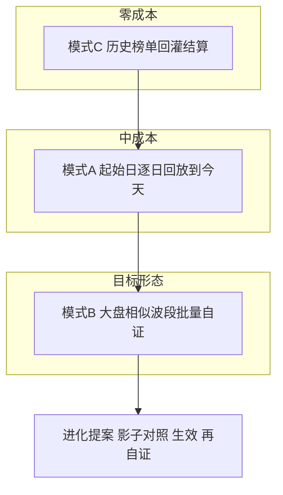
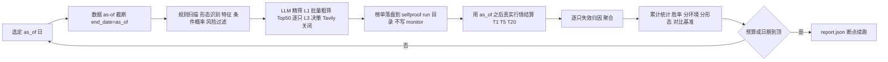
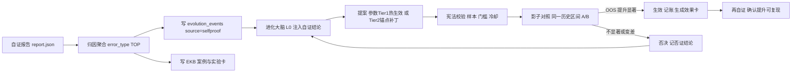

# 规划 25：自证测试 —— 用历史数据自证选股准确率 + 大盘相似波段进化

> 对齐：[`17-进化中心改造-次日自我验证闭环.md`](plans/17-进化中心改造-次日自我验证闭环.md)（次日验证）、
> [`11-进化Agent.md`](plans/11-进化Agent.md)（提案/影子/记账）、
> [`19-进化大脑控制回测-回测环节归因.md`](plans/19-进化大脑控制回测-回测环节归因.md)（回测控制）、
> [`21-进化大脑私有域知识库.md`](plans/21-进化大脑私有域知识库.md)（EKB 案例与实验卡）、
> [`23-回测增强与操盘手法知识库.md`](plans/23-回测增强与操盘手法知识库.md)（质量门/OOS 纪律）。
>
> 状态：**规划待评审**（本文档只描述方案，不含代码改动）
>
> 用户确认的默认口径：**默认走 LLM 档**（完全复刻每日推荐），但**必须**内置 token 计量、运行前费用预估、预算上限熔断。

---

## 一、用户想法（原文理解 + 我的优化）

### 1.1 用户原话拆解

| #   | 用户想法                                                 | 我的理解                                               | 优化点                                                                                    |
| --- | -------------------------------------------------------- | ------------------------------------------------------ | ----------------------------------------------------------------------------------------- |
| 1   | 今天选股、明后天才能验证，等太久                         | 反馈周期 = 1~5 个交易日，无法快速迭代                  | 用**历史回放**把"等待"变成"立刻"。核心是把每日推荐流水线变成**可指定 as-of 日期的重放器** |
| 2   | 用历史前一天选股，再用历史后几天看选对没有               | 用已有历史行情做"事后验证"，等于把系统放回过去重跑一遍 | 抽象为**三种自证模式**（见 §三），并强调"D+1 买入口径"（现有扣分点已修正）                |
| 3   | 每年按大盘走势挑选相似的其他年份，做全市场选股验证       | 当前大盘形态 → 检索历史相似波段 → 在相似区间上自证     | 新增**大盘相似波段检索**，并把结果一键转成自证任务列表                                    |
| 4   | 可以选择"多久以前"的历史数据，然后一路自证到至今         | 起始日 + 逐日/分批推进至最新交易日                     | 模式 A：**区间逐日回放**，支持步长、抽样、断点续跑                                        |
| 5   | 挑选相似年份、相似区间的全市场股票选股验证               | 相似区间 × 全市场                                      | 模式 B：相似波段批量自证，产出"同环境胜率"                                                |
| 6   | 前端左侧导航加一个"自证测试"                             | 新增一级导航 + 独立页面                                | `/selfproof` + `SelfProof.vue`，7 个功能区块                                              |
| 7   | 看看 DeepSeek 有没有查费用的 API，选不同方案大概花多少钱 | 费用可观测 + 可预估 + 可熔断                           | §四：余额 API + token 计量 + 价格表 + 预估器 + 熔断                                       |

### 1.2 一句话定义

> **自证测试 = 把"每日推荐"这台机器放回历史某一天重跑一遍，用当年的真实行情给它打分，把打分结果直接喂给进化大脑。**

关键差别（必须诚实标注）：这不是普通回测。回测是"用整段历史统计规律"，自证测试是"**用截至某日的历史重演整条决策流水线**（含 LLM 精筛）"，因此对**未来函数**与**固化产物前视**极度敏感（见 §五）。

---

## 二、现状评估：能直接复用什么、必须先补什么

### 2.1 可直接复用（省掉大块工作）

| 能力                           | 现有实现                                                                                                                | 复用方式                                                                |
| ------------------------------ | ----------------------------------------------------------------------------------------------------------------------- | ----------------------------------------------------------------------- |
| as-of 数据截断                 | [`prepare_stock_data()`](ai-quant-agent/backend/app/backtest/loader.py:212) 已支持 `start_date/end_date`                | 回放时传 `end_date = as_of`                                             |
| 特征侧无未来函数               | [`build_extra_map()`](ai-quant-agent/backend/app/backtest/extra_feature_loader.py:261) 严格 `trade_date/ann_date <= t0` | 直接复用（已踩过坑）                                                    |
| 环境三态判定                   | [`regime_of()`](ai-quant-agent/backend/app/backtest/regime_split.py:65) 只用 `<= date` 的指数数据                       | 直接复用；相似波段特征也基于同一面板                                    |
| 指数面板缓存                   | [`load_panel()`](ai-quant-agent/backend/app/backtest/regime_split.py:55)                                                | 直接复用，避免全表扫 `index_daily`                                      |
| 多周期结算口径                 | [`_calc_multi()`](ai-quant-agent/backend/app/agents/daily_verify.py:106) T+1/T+5/T+20、D+1 买入口径                     | 直接复用（**不要另写一套口径**，否则又出现口径分叉）                    |
| 失效归因                       | [`run_daily_verify()`](ai-quant-agent/backend/app/agents/daily_verify.py:101) 逐只 LLM 归因 + 聚合                      | 复用，但需支持"**自证模式**"（不写真实 `verify_kb` 主序列，写自证分区） |
| 逐只精筛/政策/新闻编排         | [`run_agent_refine()`](ai-quant-agent/backend/app/agents/__init__.py:122)                                               | **原样复用**，只加"回放上下文"与"预算钩子"                              |
| 无未来函数的 walk-forward 先例 | [`verify_walk_forward.py`](ai-quant-agent/backend/scripts/verify_walk_forward.py:1)、`data/walk_forward.json`           | 参考其口径与断言写法                                                    |

### 2.2 必须先补的 6 个缺口（按风险排序）

| #      | 缺口                     | 现状（证据）                                                                                                                                                                                                           | 风险                                                                          | 必须做法                                                                                                                                               |
| ------ | ------------------------ | ---------------------------------------------------------------------------------------------------------------------------------------------------------------------------------------------------------------------- | ----------------------------------------------------------------------------- | ------------------------------------------------------------------------------------------------------------------------------------------------------ |
| **G1** | 扫描内核没有真正的 as-of | [`run_daily_scan()`](ai-quant-agent/backend/app/backtest/daily_scan.py:207) 收了 `scan_date`，但循环里恒 `end_idx = len(df) - 1`                                                                                       | 🔴 致命：回放 2026-05-03 实际用的是今天的 K 线 = 用未来数据选股，结论全部作废 | 新增 `as_of` 语义：`df` 截断到 `<= as_of`，`end_idx` 指向 as_of 那一根；停牌基准 `latest_trade` 也改成 as_of                                           |
| **G2** | LLM 调用没有 token 计量  | [`deepseek_chat()`](ai-quant-agent/backend/app/agents/llm_client.py:55) 解析完 `content` 就丢弃响应体，`usage` 未采集                                                                                                  | 🔴 用户明确要求：无计量 = 无法预估价、无法熔断、无法对账                      | 采集 `usage`（含缓存命中/未命中拆分）→ 落 `llm_usage.jsonl`                                                                                            |
| **G3** | 回放会污染真实资产       | 扫描结束会调 [`record_hits()`](ai-quant-agent/backend/app/backtest/monitor.py:97)、[`record_agent_hits()`](ai-quant-agent/backend/app/backtest/monitor.py:134)、`record_decision_picks()`、榜单落盘 `daily_recommend/` | 🔴 历史回放若写进去，真实命中率/进化基线被污染，进化大脑会学错                | 引入 `persist=False` 沙箱开关 + 独立目录 `data/selfproof/`                                                                                             |
| **G4** | 固化产物含全样本前视     | `feature_normalizer.json`、`probability_table.json`、`condition_table.json`、ChromaDB 模式库、`form_leaderboard.json`、`entry_guidance.json`、`attribution_kb.json` 都是**整段历史训出来的**                           | 🟠 会让历史自证偏乐观                                                         | ① 报告显著标注"固化产物前视"徽标；② 对纯统计类产物（condition/probability）支持 **as-of 重建**；③ 模式库提供"时间切分重建"的可选开关（贵，Phase 后期） |
| **G5** | Tavily 与政策库会"穿越"  | 历史回放时 [`tavily_search()`](ai-quant-agent/backend/app/agents/llm_client.py:107) 返回的是**今天**的新闻；`policy_kb` 也未按 as-of 裁剪                                                                              | 🟠 静默失真：消息面/政策在最该严厉的地方帮倒忙                                | 回放默认 **Tavily 关闭 + 前端置灰并写明原因**；政策信号按 `发布日 <= as_of` 裁剪；报告标注"消息面未参与"                                               |
| **G6** | 无成本模型与预算闸门     | 全项目只有 `token_budget: 15000` 一个抽象字段（[`evolution_config.json`](ai-quant-agent/backend/data/evolution_config.json:19)），从未与真实 token/钱挂钩                                                              | 🟠 用户明确要求"大概多少费用"                                                 | 价格表 + 预估器 + 熔断器（§四）                                                                                                                        |

---

## 三、三种自证模式（由便宜到昂贵，可单独交付）



### 模式 C：历史榜单回灌结算（零 LLM 费用，建议最先做）

- **做什么**：对**已落盘**的历史榜单 `data/daily_recommend/daily_*.json`（以及 `_agent.json`）直接算 T+1/T+5/T+20 真实收益与胜率 → 立刻得到"当年真实推荐的准确率"。
- **价值**：
  1. 零成本拿到基线，**当天就能看到"我现在到底准不准"**；
  2. 作为模式 A/B 的**校准标尺**（重跑结果 vs 当年真实榜单结果的偏差 = 重放保真度）；
  3. 覆盖不到"当年没跑的日子"，但覆盖到的日子无需再花一分钱。
- **实现要点**：复用 [`_calc_multi()`](ai-quant-agent/backend/app/agents/daily_verify.py:106)；只读不写；输出 `data/selfproof/replay_existing/report.json`。

### 模式 A：起始日 → 一路自证到今天（核心）

- **输入**：
  - `start_date`（如 20260503）、`end_date`（默认最新交易日）
  - `step`：1 / 5 / 20 交易日（逐日最贵，抽样最省）
  - `universe`：全市场 / 随机抽样 N 只 / 自定义股票池文件（**默认全市场，但抽样是主要省钱旋钮**）
  - `llm_mode`：默认 **on**（用户口径），可关（纯规则档，零 API 费）
  - `budget_cny`：本次任务预算上限（必填，默认取 `selfproof_budget_default_cny`）
- **每个交易日做什么**：



- **产出**：
  - 胜率曲线（按交易日滚动，含置信区间）
  - 分层统计：按环境三态（强/震/弱）、按形态类型、按风险档、按相似度分位
  - 失败归因 TOP（复用 [`daily_verify`](ai-quant-agent/backend/app/agents/daily_verify.py:1) 的 `error_type` 体系）
  - 对照基准：全市场等权 T+5（[`benchmark_for_dates()`](ai-quant-agent/backend/app/backtest/benchmark.py:91)）、对照组（[`control_t5()`](ai-quant-agent/backend/app/backtest/control_sampler.py:59)）
  - **口径与护栏声明**（前视徽标、样本量、显著性、IS/OOS 切分，见 §五）

### 模式 B：大盘相似波段自证（用户最想要的"跨年份验证"）

- **步骤**：
  1. **当前窗口特征**：对"当前 N 日窗口"（默认 60 交易日）算：多窗口动量（5/20/60/120）、年化波动率、均线偏离度、分位数位置、量能变化率、涨跌天数比、最大回撤 → 归一化（z-score）。
  2. **历史窗口检索**：滑动同一窗口长度扫全部历史，算相似度（默认 **形态距离 = 标准化欧氏距离 + 相关系数加权**，可进化 `selfproof_similarity_metric`；DTW 作为可选实现）。**只用 `<= 当前日` 的数据**，不得用未来。
  3. **返回 Top-K（默认 5）相似区间**：起止日、相似度、该区间后续 20 日实际走势（**事后展示**，明确标注"这是已知答案"）。
  4. **一键自证**：把 K 个相似区间（含若干"当前还没走完"的错位对齐）批量投给模式 A，预算 = Σ 各段天数 × 单日预估。
  5. **同环境胜率对比**：相似环境下的胜率 vs 全样本胜率 → 直接回答"每年这种走势，我选股准不准"。
- **缓存**：`data/selfproof/regime_match.json`（按 as_of + 窗口长度缓存，避免重复算）。

---

## 四、DeepSeek 费用：能查到什么、怎么算、怎么熔断

### 4.1 事实澄清（重要，避免误解）

| 事项                       | 结论                             | 说明                                                                                                                                                                                              |
| -------------------------- | -------------------------------- | ------------------------------------------------------------------------------------------------------------------------------------------------------------------------------------------------- |
| 有没有"查询费用"的 API     | **有余额 API，没有按次计费 API** | `GET https://api.deepseek.com/user/balance`（`Authorization: Bearer <KEY>`）返回 `is_available` 与 `balance_infos[]`（`currency / total_balance / granted_balance / topped_up_balance`）          |
| 能否查"这次自证花了多少钱" | **不能直接查**                   | 官方无 per-request 账单接口；差异只能用**运行前后余额差**来自行对账（近似值，因为余额只有总额度不含明细）                                                                                         |
| 那钱怎么算                 | **token 用量 × 单价**            | `/chat/completions` 响应体 `usage` 含 `prompt_tokens / completion_tokens / total_tokens / prompt_cache_hit_tokens / prompt_cache_miss_tokens` —— 这是唯一的计费数据源，**现在被丢掉了，必须埋点** |
| 单价从哪来                 | 官方定价页，人工填入             | 放到 `data/llm_pricing.json`（可编辑 + 记 `as_of_date` + 来源备注），**绝不硬编码在代码里，也绝不让进化大脑自动改价**（价格是钱，标记 `immutable`）                                               |

> ⚠️ 本文档不写死具体单价：我没有联网核对官方最新价的能力，实施第一步就是查官方定价页并把当时价格填进价格表（含抓取日期）。任何"预估费用"都必须由**价格表 × 实测 token** 算出，而不是拍一个数。

### 4.2 计量与成本模型（新增模块 `app/agents/llm_metering.py`）

```
单次调用费用 =
    cache_hit_tokens  × price.input_cache_hit_per_m  / 1e6
  + cache_miss_tokens × price.input_cache_miss_per_m / 1e6
  + completion_tokens × price.output_per_m           / 1e6
```

- 调用点包装：`deepseek_chat()` 增加 `source` 参数（如 `selfproof/20260503/refine`），返回值不变，副作用落 `llm_usage.jsonl`（一行一次：时间、来源、模型、tokens、命中/未命中、单价版本、费用）。
- 汇总视图：按任务 `run_id` / 按天 / 按模块聚合 → 前端实时显示"本次已花 ¥x.xx"。
- 对账：任务开始 / 结束各调一次余额 API，记录差额，与 token 估算差 > 20% 时在报告里告警（说明价格表过期或计费口径变了）。

### 4.3 运行前费用预估器

```
预计调用次数  = 回放天数 × 单日调用次数模型
单日调用次数模型（可进化，用历史实测校准）：
    L1 批量粗筛  = Σ_行业 ceil(候选数 / BATCH_SIZE)        # 实测通常个位数
    L2 政策解读  = min(5, 行业数) × 子 Agent 数            # ≤5 行业
    L2 逐只精筛  = deep_top_n（默认 50，含规则保送）
    L3 统一决策  = 1
    自证归因     = min(失败数, MAX_ATTRIBUTE_FAILURES=20)
预计 token    = 调用次数 × 每调用平均 token（取 llm_usage.jsonl 近 30 天实测均值；冷启动用保守默认）
预计费用      = Σ tokens × 价格表单价  →  输出 低 / 中 / 高 三档
预计耗时      = 调用次数 × 平均单次延迟 + 扫描耗时（按历史扫描实测）
```

- **冷启动兜底**：没有实测数据时，用保守默认（并在 UI 显示"保守估计，首轮跑完自动校准"）。
- **UI 必须展示**：预计调用次数 / tokens / 费用区间 / 耗时 / **当前账户余额** / 是否超预算。
- **二次确认**：预估结果需用户点"确认开跑"才真正启动（防止误点烧钱）。

### 4.4 预算熔断（硬闸门）

- `data/llm_budget.json`：`{ "per_task_limit_cny", "per_day_limit_cny", "total_limit_cny", "spent": {...}, "ledger": [...] }`
- 三个闸门：**单任务上限 / 单日上限 / 累计上限**。
- 触发时机：**每次 LLM 调用前**检查累计费用；超限抛 `BudgetExceeded`。
- 超限行为：优雅停止（不是崩溃）→ 保存已完成交易日的全部结果（**断点续跑**）→ 写进化事件 `WARNING` → 前端红字提示"已因预算熔断停止，可追加预算后继续"。
- 断点续跑：`runs/{run_id}/state.json` 记录 `next_date / spent / stats`，续跑不重复花钱。

### 4.5 费用量级的定性判断（不给死数）

- 单价 × 调用量的关系：**天数**与**universe**是主旋钮，`deep_top_n` 是次旋钮。
- 参考量级（**示意，须以实测校准**）：单日 60~150 次调用，若平均 3k~6k 输入 / 1k 输出，则一天成本在**个位数人民币以内**；一个 240 交易日年度全市场自证，成本量级在**几十到几百元**之间。若把 `deep_top_n` 从 50 提到 100、或 universe 不变但上下文变长，成本可翻倍。
- 因此规划强制：**先跑 5~10 个交易日的"试跑"**，用实测反推全程预估，再决定是否全量跑。这也顺带完成价格表校准。

---

## 五、护栏（比功能更重要）：防自欺欺人

| 护栏                 | 规则                                                                                                                                                                                                     | 实现位置                                                                |
| -------------------- | -------------------------------------------------------------------------------------------------------------------------------------------------------------------------------------------------------- | ----------------------------------------------------------------------- |
| **无未来函数**       | 回放只用 `<= as_of` 的数据；对 `df` 截断 + 断言 `df.trade_date.max() <= as_of`                                                                                                                           | 回放内核 + `verify_selfproof_replay.py`                                 |
| **固化产物前视声明** | 报告强制带徽标与明细（哪些产物是全样本训的）                                                                                                                                                             | 报告生成                                                                |
| **消息面不参与**     | 回放默认关 Tavily，政策按 `发布日 <= as_of` 裁剪                                                                                                                                                         | 回放上下文开关                                                          |
| **IS / OOS 分离**    | 自证集与验收集必须分开：默认按时间切分（前 80% 自证、后 20% 验收），或相似波段按年份错开；**进化提案的生效判据只看 OOS**                                                                                 | `selfproof_is_ratio` + 进化宪法校验                                     |
| **样本量与显著性**   | 提案证据门槛沿用 [`proposal_evidence_min=30`](ai-quant-agent/backend/data/evolution_config.json:10)，影子期门槛沿用 `shadow_min_samples/shadow_min_gain_pp/shadow_p_value`；不达门槛只能"观察"不能"生效" | 复用进化守护                                                            |
| **同一区间 A/B**     | 进化前 vs 进化后，**必须**在**同一批历史区间、同一口径**上对照，禁止换区间换口径                                                                                                                         | 影子对照任务                                                            |
| **真实资产隔离**     | 回放不得写 `monitor_state.json` / `daily_recommend/` / `decision_records.json` / 主导 `verify_kb`                                                                                                        | 沙箱开关 + 断言脚本                                                     |
| **可回滚**           | 自证触发的参数/代码变更一律走既有 `self_improver` 备份+锚点+回滚链                                                                                                                                       | [`self_improver`](ai-quant-agent/backend/app/agents/self_improver.py:1) |

---

## 六、进化闭环：自证 → 提案 → 影子 → 生效 → 再自证



要点：

1. 自证的**唯一目标**沿用规划 17 的固结口径：提高每日推荐 T+1 上涨概率与 T+5 命中率（宪法不可自改）。
2. 自证结论注入 L0 摘要（[`evolution_summarizer`](ai-quant-agent/backend/app/agents/evolution_summarizer.py:1)）新增"自证块"：区间、样本数、胜率、相对基准 lift、TOP 归因、趋势（升/降）。
3. **否证也是资产**：自证不通过的提案结论写入 EKB 实验卡（避免重复试错），这条与规划 23 的否证纪律一致。

---

## 七、前端"自证测试"页

导航与路由改动：[`Layout.vue`](ai-quant-agent/frontend/src/components/Layout.vue:7) 的 `navItems` 增 `🧪 自证测试`；[`router/index.ts`](ai-quant-agent/frontend/src/router/index.ts:5) 增 `/selfproof`；新建 `frontend/src/views/SelfProof.vue`；[`api/index.ts`](ai-quant-agent/frontend/src/api/index.ts:1) 增自证 API。

| 区块         | 内容                                                                                                                                                                                  |
| ------------ | ------------------------------------------------------------------------------------------------------------------------------------------------------------------------------------- |
| 1 任务配置   | 模式切换（A 区间回放 / B 相似波段 / C 历史榜单回灌）、起止日、步长、universe（全市场/抽样 N/自定义池）、LLM 开关（默认开）、Tavily 开关（默认关且置灰 + 说明）、预算上限、IS/OOS 比例 |
| 2 预估与确认 | 点击"预估"→ 调用次数/tokens/费用区间/耗时/**账户余额**→ 勾选"确认开跑"（防误点）                                                                                                      |
| 3 运行监控   | 进度（第 n/N 日）、实时累计费用、余额、当前 as_of 日、可停止、断点续跑按钮；复用 WS 推送                                                                                              |
| 4 结果报告   | 胜率曲线（进化前/后双线）、分环境胜率、分形态胜率、TOP 失败归因、vs 基准 lift、样本量/显著性、**前视徽标与口径明细**                                                                  |
| 5 相似波段库 | 当前窗口 vs 历史 Top-K 区间并排缩略图 + 相似度 + 该区间胜率 + "用这些区间一键自证"                                                                                                    |
| 6 进化联动   | 自证结论 → "生成提案" → 影子对照结果（同区间 A/B）→ 生效/回滚 → 效果卡                                                                                                                |
| 7 历史任务   | run_id、区间、口径、实际费用、状态、报告链接、导出 JSON/CSV                                                                                                                           |

---

## 八、数据资产与新增可进化参数

### 8.1 新增数据文件

| 文件                                        | 内容                                                        |
| ------------------------------------------- | ----------------------------------------------------------- |
| `data/selfproof/runs.json`                  | 任务注册表（run_id、配置、状态、费用、进度）                |
| `data/selfproof/{run_id}/daily/{date}.json` | 回放每日榜单（**沙箱目录，不混入真实 `daily_recommend`**）  |
| `data/selfproof/{run_id}/verify.json`       | 每日结算（T+1/T+5/T+20、命中、失败明细）                    |
| `data/selfproof/{run_id}/report.json`       | 汇总报告（胜率/分层/归因/基准/口径声明）                    |
| `data/selfproof/{run_id}/state.json`        | 断点续跑状态（next_date、已花费）                           |
| `data/selfproof/regime_match.json`          | 相似波段缓存                                                |
| `data/llm_usage.jsonl`                      | 每次 LLM 调用明细（tokens/缓存/费用/来源）                  |
| `data/llm_pricing.json`                     | 价格表（人工维护，含 `as_of_date` 与来源备注，`immutable`） |
| `data/llm_budget.json`                      | 预算与累计台账（三闸门）                                    |

### 8.2 新增可进化参数（`evolution_config.json`）

| 参数                                  | 默认                 | 范围       | 能否进化         | 说明                                    |
| ------------------------------------- | -------------------- | ---------- | ---------------- | --------------------------------------- |
| `selfproof_default_step`              | 1                    | [1,20]     | ✅ Tier1 热生效  | 默认步长（交易日）                      |
| `selfproof_universe_sample`           | 0                    | [0,5000]   | ✅ Tier1         | 0 = 全市场；>0 = 抽样只数（主要省钱包） |
| `selfproof_deep_top_n`                | 50                   | [10,200]   | ✅ Tier1         | 回放时 L2 精筛只数                      |
| `selfproof_max_days`                  | 250                  | [1,2000]   | ✅ Tier1         | 单任务最大回放天数                      |
| `selfproof_budget_default_cny`        | 50                   | [1,1000]   | ✅ Tier1         | 默认单任务预算上限                      |
| `selfproof_regime_topk`               | 5                    | [1,20]     | ✅ Tier1         | 相似波段返回条数                        |
| `selfproof_similarity_metric`         | `zscore_euclid_corr` | 枚举       | ✅ Tier1         | 相似度口径                              |
| `regime_sim_window`                   | 60                   | [20,250]   | ✅ Tier1         | 相似度窗口长度                          |
| `selfproof_is_ratio`                  | 0.8                  | [0.5,0.95] | ⚠️ 护栏参数      | IS/OOS 切分比例（**改动需人工确认**）   |
| `price_input_cache_hit_per_m` 等 3 项 | 人工填               | —          | ❌ **immutable** | 单价是钱，禁止自动改价                  |

---

## 九、后端模块与接口清单

### 9.1 新增/改动模块

| 文件                             | 改动                                                                       |
| -------------------------------- | -------------------------------------------------------------------------- |
| `app/agents/llm_metering.py`     | **新增**：usage 采集、费用计算、价格表、三闸门熔断、汇总查询               |
| `app/agents/llm_client.py`       | 改：`deepseek_chat()` 采集 `usage` + 新增 `source` 参数                    |
| `app/backtest/selfproof.py`      | **新增**：回放内核（as-of 截断、沙箱落盘、逐日推进、断点续跑）             |
| `app/backtest/daily_scan.py`     | 改：支持 `as_of`（`end_idx` 与停牌基准）、`universe` 抽样、`persist=False` |
| `app/backtest/regime_match.py`   | **新增**：相似波段特征与检索                                               |
| `app/agents/selfproof_verify.py` | **新增**：回放结算 + 归因（复用 `daily_verify` 口径，写自证分区）          |
| `app/agents/selfproof_report.py` | **新增**：汇总报告 + 口径/前视声明 + IS/OOS 标注                           |
| `app/api/selfproof.py`           | **新增**：任务 CRUD/预估/启动/停止/续跑/报告/相似波段/费用与余额           |
| `app/api/system.py`              | 改：`/evolve/cost/*`（费用汇总、余额、预算设置）                           |
| `app/main.py`                    | 改：闲时自动自证任务（可选，夜间低峰）+ 预算检查                           |

### 9.2 API 草案

| 方法 | 路径                         | 用途                                                                                        |
| ---- | ---------------------------- | ------------------------------------------------------------------------------------------- |
| POST | `/selfproof/estimate`        | 运行前预估（调用次数/tokens/费用区间/耗时/余额）                                            |
| POST | `/selfproof/run`             | 启动（需带 `confirm=true` 与预算）                                                          |
| POST | `/selfproof/stop`            | 停止（协作式取消，参考 [`stop_scan()`](ai-quant-agent/backend/app/api/predictions.py:456)） |
| POST | `/selfproof/resume`          | 断点续跑                                                                                    |
| GET  | `/selfproof/status`          | 进度 + 实时费用 + 当前 as_of 日                                                             |
| GET  | `/selfproof/runs`            | 历史任务列表                                                                                |
| GET  | `/selfproof/report/{run_id}` | 报告                                                                                        |
| POST | `/selfproof/replay_existing` | 模式 C：历史榜单零成本回灌结算                                                              |
| GET  | `/selfproof/regime/match`    | 相似波段 Top-K                                                                              |
| POST | `/selfproof/regime/run`      | 用相似波段批量自证                                                                          |
| GET  | `/evolve/cost/summary`       | 费用汇总（按天/模块/任务）                                                                  |
| GET  | `/evolve/cost/balance`       | DeepSeek 余额（`/user/balance` 代理）                                                       |
| POST | `/evolve/cost/budget`        | 设置预算闸门                                                                                |

---

## 十、验证脚本（沿用项目惯例，每个改动都要可自证）

| 脚本                                    | 断言                                                                                                                                |
| --------------------------------------- | ----------------------------------------------------------------------------------------------------------------------------------- |
| `scripts/verify_selfproof_replay.py`    | ① 无未来函数：回放使用数据 `max(trade_date) <= as_of`；② 同一 as_of 重复跑结果稳定；③ 与窗口末端切片等价（截断后特征/扫描结果一致） |
| `scripts/verify_selfproof_isolation.py` | 回放不写 `monitor_state.json` / `daily_recommend/` / `decision_records.json` / 主导 `verify_kb`                                     |
| `scripts/verify_llm_metering.py`        | mock 带 `usage` 的响应 → 费用计算正确、`llm_usage.jsonl` 落盘、超预算抛 `BudgetExceeded`、熔断后可续跑                              |
| `scripts/verify_regime_match.py`        | 合成序列相似度排序正确；只用 `<= 当前` 窗口（无未来函数）                                                                           |
| `scripts/verify_selfproof_report.py`    | 报告字段完整（样本量、显著性、前视徽标、IS/OOS 标注、费用对账）                                                                     |

---

## 十一、实施顺序（Phase）

| Phase  | 内容                                                                                         | 可独立验收标志                                     |
| ------ | -------------------------------------------------------------------------------------------- | -------------------------------------------------- |
| **P0** | 口径与护栏冻结：无未来函数断言、沙箱隔离、前视徽标、IS/OOS 切分规则写进配置                  | `verify_selfproof_isolation` 通过                  |
| **P1** | 计费底座：`llm_metering` + 价格表 + 余额代理 + 三闸门熔断 + 预估器                           | `verify_llm_metering` 通过；前端能显示余额与预估价 |
| **P2** | 回放内核：`daily_scan` 支持 as_of/universe/persist=False；`selfproof.py` 逐日推进 + 断点续跑 | `verify_selfproof_replay` 通过                     |
| **P3** | 模式 C（零成本历史榜单回灌）→ 立刻看到真实历史准确率基线                                     | 报告可读，且与当年真实榜单一致                     |
| **P4** | 模式 A 完整：结算 + 归因 + 报告（含分层与基准对比）+ 试跑校准价格表                          | 5~10 日试跑产出报告与费用实测                      |
| **P5** | 模式 B：相似波段检索 + 一键批量自证                                                          | `verify_regime_match` 通过；UI 能一键批量          |
| **P6** | 前端"自证测试"页（7 区块 + WS 进度 + 预估确认）                                              | 页面端到端可用                                     |
| **P7** | 进化联动：自证结论入 L0 → 提案 → 同区间影子 A/B → 生效/回滚 → 效果卡                         | `verify_selfproof_report` 通过；一次真实进化闭环   |
| **P8** | 闲时自动自证 + 文档收口 + `plans/25` 状态更新                                                | 定时任务稳定，报告归档                             |

---

## 十二、待你拍板的小选项（不影响开工）

1. **模式 C 是否先做**：它零成本、当天出结果，建议最先做（P3 提前）。
2. **试跑规模**：建议先跑"最近 10 个交易日 + 全市场"校准价格表与单日耗时，再决定年度全量。
3. ~~**IS/OOS 切分**：默认前 80% 自证、后 20% 验收~~ → **已由 §十三 F4 推翻**，改为「年份 K-fold 滚动留出 + 冻结留出年份集合 + 与实盘反馈解耦」。
4. **自动生效**：自证触发的进化提案是否沿用现有 `approval_mode: "auto"`（过宪法+影子自动生效），还是自证类提案**一律人工确认**（更保守，更防过拟合）。

---

## 十三、自评审：本规划的 13 项缺陷与 8 项优化（第二轮修订）

> 本节是对 §一~§十二 的**批判性复盘**。分五类：A 逻辑语义（会让人信错结论）、B 方法论（会让进化学到错东西）、
> C 工程可行性（会让 P4 跑不完）、D 成本结构（会让"默认 LLM 档"变成不敢用）、E 一致性细节。
> 每条给出「影响 → 修订动作 → 归入 Phase」。**修订动作未落地前，本规划不得标记为"可实施完成"。**

### A. 逻辑与语义缺陷（最严重）

| #      | 缺陷                                           | 影响                                                                                                                                                                                                                                                                                                                                         | 修订动作                                                                                                                                                                                                                                | 归入 |
| ------ | ---------------------------------------------- | -------------------------------------------------------------------------------------------------------------------------------------------------------------------------------------------------------------------------------------------------------------------------------------------------------------------------------------------- | --------------------------------------------------------------------------------------------------------------------------------------------------------------------------------------------------------------------------------------- | ---- |
| **F1** | 「LLM 档 = 完全复刻每日推荐」是**误导表述**    | 回放用的是**今天的模型权重 + 今天的提示词 + 今天的知识库**，不是当年的系统。读者会误以为"这就是当年那套系统的成绩" → 结论性质被读错                                                                                                                                                                                                          | ① 全文把"完全复刻"改为"**用今天的系统重演当年数据**"；② 报告与 UI 强制显示 `model_name / prompt_version / knowledge_cutoff (= as_of)`；③ 指标改称「**重演口径胜率**」，**禁止**与"当年真实榜单胜率（模式 C）"混为一谈、禁止并列成一张表 | P0   |
| **F2** | 注入 prompt 的**知识类前视**未被单列为一等风险 | [`run_agent_refine()`](ai-quant-agent/backend/app/agents/__init__.py:122) 会注入 `reflect_kb / attribution_kb / condition_table / form_leaderboard / entry_guidance / EKB / policy_kb` 与 ChromaDB 模式库 —— 其中**含 as_of 之后才产生的知识**，这是**真正的未来函数**（比"模式库全样本"更严重）。§五 只泛泛写了"固化产物前视"，缺可执行清单 | 新增「**前视清单表**」：逐项列出 ① 是否可 as-of 过滤 ② 过滤字段（`ann_date/created_at/date`）③ 过滤不到时的处理（禁用该项 / 打徽标 / 报告显式声明"该项未过滤"）。**清单未完成前不得启动 P4 年度自证**                                   | P0   |
| **F3** | 复权基准未规定                                 | [`prepare_stock_data()`](ai-quant-agent/backend/app/backtest/loader.py:212) 的前复权以**全表最新** `adj_factor` 为基准 → 未来的除权会**改写 as_of 之前的价格序列**（形态/新高类绝对量判断会泄露未来信息）                                                                                                                                    | 钉死"回放复权基准 = **as_of 当日**"，并在 `verify_selfproof_replay.py` 断言"回放所用 adj 基准日期 == as_of"                                                                                                                             | P2   |

### B. 方法论缺陷（会让进化学到错东西）

| #      | 缺陷                                         | 影响                                                                                                                                                             | 修订动作                                                                                                                                                                                                                                                                                          | 归入 |
| ------ | -------------------------------------------- | ---------------------------------------------------------------------------------------------------------------------------------------------------------------- | ------------------------------------------------------------------------------------------------------------------------------------------------------------------------------------------------------------------------------------------------------------------------------------------------- | ---- |
| **F4** | IS/OOS 用"时间轴后 20%"是**结构性错误**      | 用户核心用法是"一路自证到今天" ⇒ OOS 恒等于最近 20%，且**与实盘反馈重叠**（实盘结果本身也进 `monitor`/`daily_verify`）→ 验收集被污染，"进化生效只看 OOS"形同虚设 | 改为「**年份 K-fold 滚动留出 + 冻结留出年份集合**」（如 OOS = {2019, 2022}，其余自证；每轮轮换并冻结，防区间复用）；并明确「**OOS 与实盘反馈解耦**：实盘只做监控存证，不进自证验收」                                                                                                              | P4   |
| **F5** | "同区间 A/B"缺**多重比较校正**与区间复用计数 | 反复用同一批区间迭代提案，必有某一版在这批区间上好看（p-hacking）                                                                                                | ① 同轮 K 个提案**一起过 BH-FDR**（复用 [`stats_correction.bh_fdr`](ai-quant-agent/backend/app/backtest/stats_correction.py:1)，参考 [`verify_rule_fdr.py`](ai-quant-agent/backend/scripts/verify_rule_fdr.py:1)）；② 记录"每个区间被使用次数"，超阈值**强制换区间或降权**；③ 否证结论入库（保留） | P7   |
| **F6** | 相似波段检索的**选择偏差与稳健性**未约束     | 只报 Top-K 相似区间的胜率 = 事后挑好看的；换窗口长度/换距离结论可能翻转                                                                                          | ① **禁止人工挑区间**（K 固定，Top-K 全跑）；② 必须与「**随机抽 K 段**」基线对比并报 lift；③ 相似度做**稳健性检验**（换窗口长度/换距离，结论是否稳定）；④ 只允许**整段距离**，禁止终点对齐（对齐会引入"事后选形状"）                                                                               | P5   |
| **F7** | **幸存者偏差**完全没提                       | [`load_stock_pool()`](ai-quant-agent/backend/app/backtest/loader.py:1) 用**今天的存续股票表** → 回放 2018 年自动排除已退市股 → 系统性乐观（最经典的坑）          | ① 用 `list_date/delist_date`（若数据具备）构造 as-of 股票池；② 不具备时**强制报告标注"股票池 = 当前存续，存在幸存者偏差"**，并做最低限度修正（剔除 as_of 之后上市的股票）；③ 报告给出"退市缺口"统计                                                                                               | P0.5 |
| **F8** | 主指标未与宪法对齐                           | 若拿"次日上涨率"当主指标，会被**市场 beta 主导**（大盘涨 20% ⇒ 胜率自然高），进化会朝"多推荐强势股"方向漂移                                                      | 固化：**主指标 = 超额（excess_vs_market）**，绝对胜率仅作辅 —— 直接继承 [`evolution_config.json`](ai-quant-agent/backend/data/evolution_config.json:4) 的 `main_metric.hit_definition = "excess_vs_market"`                                                                                       | P4   |

### C. 工程可行性缺陷（会让 P4 跑不完）

| #       | 缺陷                                         | 影响                                                                                                                                                                                            | 修订动作                                                                                                                                                                                                                                                                                                                                                                      | 归入 |
| ------- | -------------------------------------------- | ----------------------------------------------------------------------------------------------------------------------------------------------------------------------------------------------- | ----------------------------------------------------------------------------------------------------------------------------------------------------------------------------------------------------------------------------------------------------------------------------------------------------------------------------------------------------------------------------- | ---- |
| **F9**  | 逐日全市场重跑的**耗时被低估**，且缺并行设计 | 单日全市场扫描为**小时级** + LLM 10~20 分钟 ⇒ 一年 = **数百到上千小时，物理上跑不完**；而 [`_SCAN_LOCK`](ai-quant-agent/backend/app/backtest/daily_scan.py:79) 是进程内全局锁，直接复用会串行化 | ① 回放**不复用**全局 `_SCAN_LOCK`，改为独立 worker 池 + 只读快照；② **新增 P2.5：多进程并行 + 增量特征缓存**（as_of 逐日前移时只前进一根 K 线，长表复用）；③ 默认 universe 改为缩小采样，"全市场"作为显式选项；④ 给出"每天 X 分钟"的性能目标与非目标                                                                                                                          | P2.5 |
| **F10** | 缺「**数据可得性前置门**」                   | 若某些表只有近年数据，回放 2018 年将大面积 NaN → 结论无意义；且模式 B"跨年份验证"的前提直接崩塌                                                                                                 | 新增 **P0.5：as-of 数据完备性门** —— 按表统计 `min(trade_date/ann_date)`，输出「**最早可自证日期**」；早于该日期的任务直接拒绝或标"降级自证（缺哪些特征）"。复用 [`verify_data_gate_calendar.py`](ai-quant-agent/backend/scripts/verify_data_gate_calendar.py:1) / [`data_validator.py`](ai-quant-agent/backend/app/backtest/data_validator.py:1) / `early_data_quality.json` | P0.5 |
| **F11** | 模式 C 被写成"立刻可用"过于乐观              | 若 `daily_recommend/` 只有几个月历史，基线样本不足                                                                                                                                              | 明确"模式 C 覆盖范围 = 已有落盘榜单 ∪ `monitor_state.hits` 已回填记录"，**先出覆盖度报告**再给结论                                                                                                                                                                                                                                                                            | P3   |

### D. 成本结构缺陷（会让"默认 LLM 档"变成不敢用）

| #       | 缺陷                                             | 影响                                                              | 修订动作                                                                                                                                                                                                                                                                   | 归入 |
| ------- | ------------------------------------------------ | ----------------------------------------------------------------- | -------------------------------------------------------------------------------------------------------------------------------------------------------------------------------------------------------------------------------------------------------------------------- | ---- |
| **F12** | 缺**降本杠杆**，成本模型假设"每天固定烧同样的钱" | 你会因价格劝退，或被迫降级成规则档（丢掉 LLM 复演的意义）         | 三招写入规划并让预估器**分策略输出费用**：① **规则档预热**（先用零成本规则档跑全区间，只对规则档选出的候选集跑 LLM 档）；② **结果缓存**（按 `(as_of, params_hash, universe_hash)` 缓存 LLM 结果，进化后只重跑受影响参数）；③ **两阶段**（先 10 天 × 5 组参数，再决定全量） | P1.5 |
| **F13** | 预估器**缺自我校验闭环**                         | 只有余额对账（差额还含其它任务消耗）→ 预估可能长期偏 3 倍而无人知 | 每次任务结束写 `estimate_vs_actual`（预估中值 vs 实际计价），累计偏差**自动校准** `calls_per_day` 模型系数（价格表仍**人工**、不可进化）                                                                                                                                   | P1.5 |

### E. 一致性与细节

| #   | 问题                                        | 修订动作                                                                                                                                                          |
| --- | ------------------------------------------- | ----------------------------------------------------------------------------------------------------------------------------------------------------------------- |
| E1  | 旧 `token_budget: 15000` 与新预算表语义冲突 | 明确**废弃/映射规则**（旧字段只读兼容，新预算以 `llm_budget.json` 为准），并在 `evolution_config.json` 标注 deprecated                                            |
| E2  | 价格表可能悄悄过期                          | 价格表 `as_of_date` 超 N 天 → UI 黄条提醒 + 对账偏差自动告警                                                                                                      |
| E3  | `report.json` schema 未冻结 → P4/P7 会返工  | **先冻结 schema**（含 `forward_look_flags / knowledge_cutoff / data_gate / survivorship_warning / is_oos_split / fdr / usage / regime_context`），P7 只依赖该契约 |
| E4  | "确认开跑"只有勾选框，防不住大额误点        | 二次确认按**金额分级**：小钱直跑；超阈值要求**输入确认文本**                                                                                                      |

### 优化项（O1~O8，直接进 backlog）

| #   | 优化                                                  | 收益                                                   |
| --- | ----------------------------------------------------- | ------------------------------------------------------ |
| O1  | 「前视清单表」（F2 的落地物，作为 P0 交付）           | 把"抽象护栏"变成"逐项可核对"，这是本规划最关键的一份表 |
| O2  | 新增 Phase **P0.5 数据门与幸存者偏差门**（前置于 P2） | 先知道"能自证到多早、偏差多大"，再谈跨年份相似波段     |
| O3  | 新增 Phase **P2.5 并行与增量缓存**                    | 让 P4 的年度自证从"不可行"变成"可行"                   |
| O4  | IS/OOS 改**年份 K-fold**（F4）                        | 验收与实盘解耦，防污染                                 |
| O5  | **BH-FDR + 区间复用计数 + 随机基线**（F5/F6）         | 把自证从"自欺"变成"可证伪"                             |
| O6  | **降本三招** + 预估器分策略报价（F12）                | 让"LLM 档"从"贵得不敢用"变成"可控"                     |
| O7  | **冻结 `report.json` schema** 作为 P4→P7 契约（E3）   | 少一轮返工                                             |
| O8  | **`estimate_vs_actual` 闭环校准**（F13）              | 预估越用越准；并倒逼价格表维护                         |

### 修订后的 Phase 顺序（覆盖 §十一）

| Phase    | 内容                                                                                              | 验收                                                |
| -------- | ------------------------------------------------------------------------------------------------- | --------------------------------------------------- |
| P0       | 护栏冻结 + **前视清单表** + 术语修正（重演≠复刻）+ 主指标=超额                                    | 清单表逐项有结论；`verify_selfproof_isolation` 通过 |
| **P0.5** | **数据可得性门 + 幸存者偏差检查** → 输出「最早可自证日期」                                        | 报告给出最早可自证日 + 退市缺口 + 偏差声明          |
| P1       | 计费底座（已完成）                                                                                | `verify_llm_metering` 通过                          |
| **P1.5** | 降本三招 + 预估分策略报价 + `estimate_vs_actual` 闭环 + 价格过期提醒 + 旧 `token_budget` 废弃映射 | 预估器输出三档策略费用；偏差记录入库                |
| P2       | 回放内核（as_of / 复权基准=as_of / universe / persist=False）+ 契约冻结                           | `verify_selfproof_replay` 通过                      |
| **P2.5** | 并行 worker 池 + 增量特征缓存                                                                     | 单日回放耗时达标（给出实测）                        |
| P3       | 模式 C（含**覆盖度报告**）                                                                        | 覆盖度 + 基线报告可读                               |
| P4       | 模式 A 完整（主指标=超额、年份 K-fold、分层、基准与随机对比）                                     | 试跑报告 + 费用实测 + IS/OOS 合规                   |
| P5       | 模式 B（K 固定、随机基线、稳健性检验）                                                            | `verify_regime_match` 通过                          |
| P6       | API + 前端（含分策略报价、金额分级二次确认）                                                      | 页面端到端可用                                      |
| P7       | 进化联动（**BH-FDR** + 区间复用计数 + 同区间 A/B）                                                | 一次真实进化闭环 + FDR 通过                         |
| P8       | 闲时自动自证 + 收口                                                                               | 定时稳定 + 报告归档                                 |

---

## 十四、第三轮修订：DeepSeek 真实 API 实测（2026-09-22）

**上一版 §4.1 说"我没有联网核对官方最新价的能力"是错的** —— 本机有网，用 `curl` 直接实抓官方定价页 / `/models` / `/user/balance` 即可。以下全部是实抓结果，不是推测。

### 14.1 真实单价（元 / 百万 token，空闲 / 高峰）

| 模型（官方 id）                           | 输入·缓存命中 | 输入·缓存未命中 | 输出      |
| ----------------------------------------- | ------------- | --------------- | --------- |
| `deepseek-flash`（DeepSeek-V4.1-Flash）   | 0.02 / 0.04   | 1 / 2           | 4 / 8     |
| `deepseek-v4-pro`（DeepSeek-V4-Pro-0813） | 0.15 / 0.30   | 4.5 / 9         | 13.5 / 27 |

- **峰谷规则**：北京时间**周一至周五 09:00-12:00、14:00-18:00 为高峰**；其余时段（含午休 12:00-14:00、夜间、周末、中国法定节假日全天）为空闲，**空闲价 = 高峰价的一半**。
- `/models` 只列出 `deepseek-flash` 与 `deepseek-v4-pro`；**`deepseek-chat` 是别名**（实测请求它，响应体返回 `"model":"deepseek-flash"`）。
- 账户余额实测：**¥10.43**（`topped_up`，无赠送额度）。

### 14.2 F14 计量漏计费（**已修**）

按**请求的** model 名查价格表 → 别名查不到键 → 费用被记成 `None`（静默漏计费）。
修法：改用**响应体 `model`** 计费，同时保留 `model_requested` 便于排查别名路由。

### 14.3 F15 思考模式成本陷阱（**已修**）

`deepseek-flash` / `deepseek-v4-pro` **官方默认开启思考模式**。实测同一 prompt：

| 请求名           | 响应 model       | prompt_tokens | reasoning_tokens | 备注                |
| ---------------- | ---------------- | ------------- | ---------------- | ------------------- |
| `deepseek-chat`  | `deepseek-flash` | 5             | 0                | 走非思考（更便宜）  |
| `deepseek-flash` | `deepseek-flash` | 31            | 5                | 走思考，prompt 变长 |

`reasoning_tokens` 计入 `completion_tokens`，**按输出价计费**（输出单价是输入未命中价的 4 倍）。

**官方权威定义（实抓 `/zh-cn/guides/thinking_mode`）**：

| 能力     | 控制参数（OpenAI 格式）                      |
| -------- | -------------------------------------------- |
| 模式开关 | `{"thinking": {"type": "enabled/disabled"}}` |
| 强度控制 | `{"reasoning_effort": "low/high/max"}`       |

- **思考模式默认打开，且 effort 默认 `high`** → 不显式写 `thinking` 就等于每调用都在烧输出价。
- **思考模式下 `temperature` / `presence_penalty` / `frequency_penalty` 不生效**（传了不报错但被忽略）；
  `top_p` 仅在思考模式生效（有效范围 0.95–1.0，低于按 0.95 处理），非思考模式恒为 1。
- 思维链通过 `reasoning_content` 返回，与 `content` 同级。

**修法与附带收益**：

1. [`deepseek_chat()`](ai-quant-agent/backend/app/agents/llm_client.py:71) **始终显式写入** `thinking.type`，默认 `disabled`；
   开启时才带 `reasoning_effort`，并且**开启时不传 temperature**（避免"以为设了 0.2、其实被忽略"）。
2. 开关走配置 [`settings.deepseek_thinking`](ai-quant-agent/backend/app/core/config.py:45)（默认 `False`），
   `.env` 里 `DEEPSEEK_THINKING=true` 可整体打开，`DEEPSEEK_REASONING_EFFORT` 调强度。
3. 计量明细里记录 `thinking_requested` 与 `reasoning_content_present`，费用异常时可解释。
4. **附带发现**：修之前，全项目 Agent 传的 `temperature=0.2` 在思考模式下一直是**失效**的 ——
   即抽取类任务的实际随机性并不受控。修好后（默认关思考）`temperature` 才真正生效。

### 14.4 F16 峰谷定价 = 省钱 50%（**已修一半**）

已修：价格表升级 v2（峰谷两套价 + 别名表 + 时段窗口），预估器**同时给高峰/空闲两套报价**，头条金额取**高峰（保守上限，不低估）**。
**口径修正（用户 2026-09-22 明确要求）**：什么时候跑、跑多久，**由用户自己控制**；系统**不做自动排期、不做高峰提示**。系统只负责两件事：① 按**实际时段如实计价**；② 在运行前报价里同时给出高峰/空闲两个数字（`cost_by_period`），供用户自己权衡。⇒ 原"默认排到空闲时段 / 高峰强提示"优化项**已取消**。

### 14.5 F17 预算闸门"假安全"（**已修**）

原默认闸门 50 / 30 / 300 元**远大于**真实余额 10.43 元 → 会出现"没触熔断但余额已烧穿"。
已对齐为 5 / 3 / 10 元；待办：**余额感知**（预估金额 > 余额则禁跑并提示）。

### 14.6 真实方案报价（假设：输入 4000 / 输出 800 token、缓存命中率 0、未开思考模式）

| 方案                             | LLM 调用次数 | 空闲时段 | 高峰时段 | 预计耗时 |
| -------------------------------- | ------------ | -------- | -------- | -------- |
| 全市场 · 1 天试跑                | 82           | ¥0.59    | ¥1.18    | 0.2 h    |
| 全市场 · 10 天                   | 820          | ¥5.90    | ¥11.81   | 1.8 h    |
| 全市场 · 1 年（240 交易日）      | 19,680       | ¥141.70  | ¥283.39  | 43.7 h   |
| 抽样（候选 40 / 精筛 12）· 10 天 | 400          | ¥2.88    | ¥5.76    | 0.9 h    |
| 抽样（候选 40 / 精筛 12）· 1 年  | 9,600        | ¥69.12   | ¥138.24  | 21.3 h   |

- **余额约束（硬）**：全市场约可跑 **18 天**（高峰 9 天）；抽样约可跑 **36 天**（高峰 18 天）。
- 这些数用的是**保守默认 token**，**未含**思考模式膨胀与政策/新闻/知识库长上下文 → 真实值可能偏高数倍。首轮试跑后预估器会自动改用实测均值（F13 闭环）。

### 14.7 对实施路线的直接影响

1. **模式 C（零成本回灌）优先级再升**：先把"历史真实准确率"拿到手，再决定这 ¥10 要不要花、怎么花。
2. **"年度全市场自证"在当前余额下不可行**（¥141.70）。可行路线只能是 **抽样 universe + 空闲时段 + 规则档预热 + LLM 结果缓存**（F12 三招）组合，把量级压到可测范围。
3. **F15（思考模式）必须先落地**，否则 14.6 的所有数字都有可能被数倍放大。

---

## 十五、P4 试跑放大实测（2026-09-22）：P2.5 从"可选优化"升级为"必须做"

脚本：[`scripts/selfproof_scale_trial.py`](ai-quant-agent/backend/scripts/selfproof_scale_trial.py)（两点标定 → 线性外推）

### 15.1 时间成本（实测，规则档、`persist=False`、start=20190102、10 天）

| 抽样只数 | 墙钟   | 说明           |
| -------- | ------ | -------------- |
| 10 只    | 29.3 s | 含每天固定开销 |
| 40 只    | 53.4 s | 同上           |

两点解线性模型 `t(u) = intercept + slope·u`：

- **斜率 = 80.2 ms / 只 / 天**（这是真正可外推的量）
- **截距 = 2.13 s / 天**（指数/基准/日历/规则加载等与抽样只数无关的固定开销）

外推（单线程、规则档）：

| 场景                        | 估算耗时        |
| --------------------------- | --------------- |
| 全市场（5567 只）· 1 天     | ≈ 6.1 分钟      |
| 全市场 · 10 天              | ≈ 1.0 小时      |
| **全市场 · 1 年（250 天）** | **≈ 31.1 小时** |

### 15.2 产出成本（**比时间更致命的一条**）

| 配置               | 推荐条数 |
| ------------------ | -------- |
| 抽样 40 只 × 10 天 | **0 条** |

对照 P3 覆盖度：历史榜单是**全市场扫描**跑的，日均约 6 条 → 每只股票每天的"出票率"只有 **≈0.13%**。

所以：

- 40 只 × 10 天 = 400 只·天 → 期望 0.52 条，**实测 0 条属于正常波动，不是 bug**（Poisson P(0)≈59%）。
- **推论（重要）**：抽几十只做自证**根本拿不到样本**，结论必然是"样本量不足"。
  自证的有效配置只能是 **全市场（或 ≥1000 只大样本）**；想省时间要靠**步长降采样**（每 5/10 个交易日取 1 天），而不是砍抽样只数。

### 15.3 由此确定的 P2.5 目标与验收

1. **必须并行化**：把 31.1 小时压到"一晚可完成"量级（如 8 并发 → ≈4 小时）。
2. **必须保持确定性**：并行结果与串行**逐日完全一致**（抽样种子固定、按日独立、顺序落盘）。
3. **默认配置修正**：`selfproof_universe_sample` 保持 0（=全市场，因为抽样没有产出），
   但"全市场 × 整年"必须走 **并行 + `step>1` 降采样**，前端在 P6 必须**显式警告预计耗时**。
4. 线性外推有两处乐观偏差：(a) 未接特征缓存，真实斜率可能更陡；(b) 未计新闻/语料 I/O 抖动。
   P2.5 落地后要用同一脚本**复测**并把新数字回填本节。

---

## 十六、P2.5 并行化实测：**未达标**，以及根因（2026-09-22）

脚本：[`scripts/verify_selfproof_parallel.py`](ai-quant-agent/backend/scripts/verify_selfproof_parallel.py)
（同一区间、同一 seed、同一 universe，只改并行度）

### 16.1 两组实测数字

| 方案                 | 6 天 × 40 只            | 结论                                     |
| -------------------- | ----------------------- | ---------------------------------------- |
| 串行（workers=1）    | 74.0 s                  | 基线                                     |
| **线程池 workers=4** | **>13 分钟未跑完 1 天** | ❌ 灾难：CPU 365% 但吞吐崩塌（GIL 互踩） |
| 多进程 workers=3     | 81.1 s（0.91×）         | ❌ 未达标：比串行还慢                    |

**确定性 ✅**：两种模式下**逐日 `top_picks` 完全一致**（6/6 天、17 条推荐、同序同分值）→ 并行不会污染自证结论。

### 16.2 根因（不是"没调好参数"，是共享状态争锁）

1. [`daily_scan.py`](ai-quant-agent/backend/app/backtest/daily_scan.py:43) 在**模块级**持有
   [`VectorStore`](ai-quant-agent/backend/app/backtest/vector_store.py:1)（ChromaDB）；
   [`mirror_cache.py`](ai-quant-agent/backend/app/backtest/mirror_cache.py:152) 用**全局 sqlite 连接**
   （`check_same_thread=False`）+ 30s timeout。
2. 线程场景：Chroma 全局连接 + 锁 + GIL → 互相等待；**4 线程慢一个数量级**。
3. 进程场景：每个子进程各开一份 Chroma/sqlite 去读同一批文件 → **并读争锁**，
   吃掉并行收益；再叠加每进程 **5.3 s** 冷启动（import 成本实测）。
4. 机器本身不是瓶颈（12 核 / 16 GB）。

### 16.3 因此的工程决定（比"继续调并行"更诚实）

1. **默认并行度 = 1（串行）**：`selfproof_workers` 默认值改为 1 并标注"实验性"。
   未达标的能力不许默认开启 —— 否则用户"开了并行反而更慢"。
2. **验证脚本的门禁改成"默认必须串行"**（而不是"并行必须更快"）：
   把没达标的东西写成硬门禁，只会逼人去改断言，而不是改代码。
3. **LLM 档一律强制串行**（预算熔断要逐日精确，`resolve_workers` 里硬保证）。
4. **并行度的确定性契约要保住**（已做到），这样后续换实现（快照 Chroma / 单遍扫描）时，
   结论不会变。

### 16.4 修复路线（按性价比排序，进 backlog）

1. **每 worker 独立 Chroma 快照**（只读副本目录）→ 直接消掉争锁；工程量小，预期恢复 2~3×。
2. **`step` 降采样**（最便宜，立刻可用）：一年 250 天 → step=5 取 50 个 as_of 点，
   时间直接降 5 倍，且**统计上仍然够用**（P3 实测日均约 6 条 → 50 天 ≈300 条样本）。
3. **增量特征缓存（一天只前进一根 K 线）**：真正的数量级优化，但要改
   `feature_extractor` 的主流程，风险高、收益大，放最后。
4. **修正 §15.1 的乐观口径**：§15.1 的 80 ms/只/天 来自 **2019 年**区间；
   在 **2026 年**区间实测是 **≈0.31 s/只/天**（4 倍），
   即全市场一年单线程 **≈99 小时**（而非 31 小时）。
   结论不变（更必须省），但**外推数字必须以近期区间为准**。
